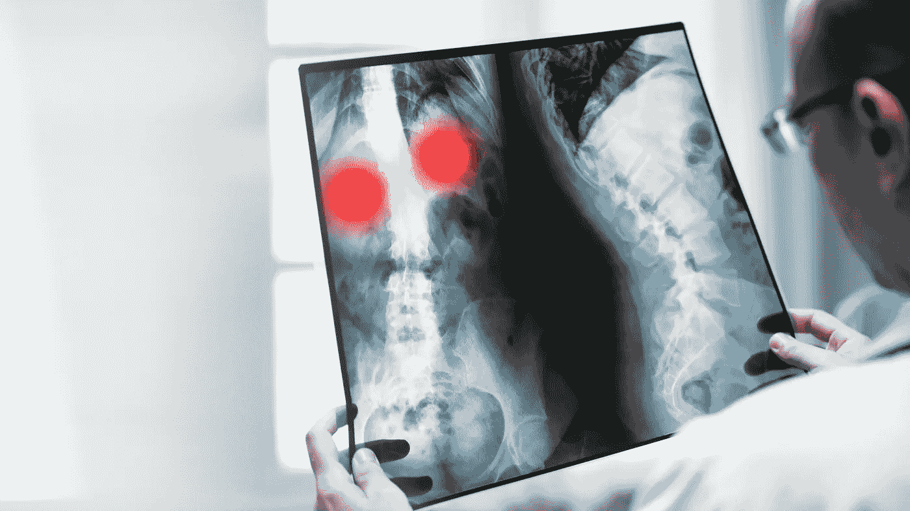

# 人工智能将如何影响放射学？5 种最可能的情况

> 原文：<https://medium.com/mlearning-ai/how-will-ai-impact-radiology-5-most-possible-scenarios-fe31015a8762?source=collection_archive---------4----------------------->

The US Bureau of Labor Statistics forecasts that the number of radiology and MRI technicians will grow by 7% in 2019–2029 (Image credit > bit.ly/3ElySTV)

**2016 年，神经网络专家 Geoffrey Hinton 教授表示，我们应该停止培训放射科医生，因为在未来五年内，算法在评估医学图像方面将比人更好。现在是 2021 年，对放射科医生的需求正在增长，但现在说辛顿错了还为时过早。**

杰弗里·埃佛勒斯·辛顿没有凭空扯出他的想法。他是认知心理学家和计算机科学家，以人工神经网络方面的工作而闻名；他在谷歌和多伦多大学工作。然而，这位著名的科学家没有考虑三个因素:复杂的医疗保健生态系统，卫生服务的需求/供应不平衡以及医生的工作特点。

美国劳工统计局预测，2019-2029 年，放射和核磁共振技术人员的数量将增长 7%。根据美国放射学院的报告，目前有三分之一的放射学家在工作中使用人工智能算法。FDA 已经批准了 80 种放射算法——其中大约一半用于实践。

辛顿没有考虑到对放射科医生的需求正在增长，这是由筛查项目的增加和老龄化社会造成的。根据最新数据，NHS 估计放射科医生的短缺量约为 30%，这相当于约 1800 名员工的短缺。尽管有这些统计数据，辛顿的论文并不一定是错误的。如果人工智能继续以目前的速度发展，机器的精度将超过人们评估医学图像的技能。与其他方案类似，这一方案仍然摆在桌面上。

**场景一。人工智能将取代医生(如上所述)**

**场景二。互惠效应**。由于担心人工智能，放射学将变得不那么受欢迎，放射科医生的需求和供应之间的差距将会增加。

在发达国家，放射科医生的数量正在增加，但他们在就业市场上的可用性非常有限，类似于医生的普遍可用性。从历史上看，由于暴露在 X 射线下，医学成像是最危险的工作之一。尽管技术进步，放射科医生仍然每天与电离辐射、红外线、紫外线(UV)和电磁辐射打交道。而且这个职业在人气统计中排名比较靠后。目前，学生们更渴望选择专业，如家庭医学、精神病学、神经病学、儿科或心脏病学。学生仔细规划他们的职业生涯，考虑就业前景。对于学生来说，放射学是人工智能算法将最快普及的医学领域的新闻可能是一个重要的论点。

2020 年底，英国放射学研究所发表了一项题为《放射学中的人工智能:是否影响医学生对放射学作为未来职业的偏好》的研究。它的发现让研究人员感到惊讶。

在 476 名受访者中，只有 34 人认为放射学是他们的首选专业，26 人认为是他们的第二选择，65 人认为是他们的第三选择。此外，31%的受访者同意 AI 将在他们的有生之年取代放射科医生，而 44.8%的人同意 AI 将减少未来所需的放射科医生数量。甚至当谈到放射学是首选的受访者时，58.8%的人担心人工智能对放射学的不确定影响。对人工智能可能在未来取代放射科医生的恐惧对医学生考虑的放射学作为一种未来职业道路产生了负面影响。

**场景 3。加速效果**。**放射学正成为技术进步最快的领域之一，这是对新一代医生的激励。**

这篇论文是由一位放射学家提出的，他是我的一个朋友。作为一名刚进入就业市场并对技术创新感兴趣的年轻医生，他期待现代化的工作条件，并希望在日常实践中使用数字健康工具。没有其他领域可以提供这样的视角，例如，基于人工智能的操作系统。放射学在 FDA 批准的医学算法统计中排名第一。排在第二位的是心脏病学。对于在数字时代成长起来的一代医生来说，这种观点会变得越来越重要吗？

**场景 4。采用效果**。**随着算法在放射学中的不断普及，放射科医生的能力和工作质量将会提高。**

这是最受欢迎的观点，同时也是医疗保健数字化转型双方——技术和医学世界——之间毫无争议的妥协。这也是一个运作良好的模式。例如，具有 AI 元素的 PACS 系统自动识别令人担忧的病变，并预先选择和预先评估图像。对于放射科医生来说，这是一双额外的眼睛，使他们能够确保没有任何细节被忽略。

在新冠肺炎疫情的头几个月，快速开发的算法能够根据肺部病变的模式选择冠状病毒患者，这大大加快了超负荷医疗机构的诊断速度。当人工智能变得比放射科医生更准确时，放射科医生将受益——他们将不再需要做管理和重复的手动工作，这些工作包括逐个像素地分析图像。人工智能将提高诊断的精确度和患者的安全性。

**场景 5。否认效果**。**人工智能越来越多地出现在工作中，并不意味着它被适应了。医生不信任算法做出的决定，忽视他们的意见。**

为了成为一名放射科医师，通常需要 13 年的时间。人工智能系统应该比医生更好吗？所以对接受 AI 的抵触是可以理解的。尽管可以假设随着懂数字技术的医生进入就业市场和数字转型的进展，许多偏见将会减弱，但和谐人机合作的场景仍然过于乐观。新的挑战已经出现。医生将不得不与 IT 系统进行更密切的合作，新的问题将会出现，如人工智能伦理，任务共享和医疗错误的责任。除此之外，数字化进展如此之快，以至于医生在紧张的一天工作中没有时间熟悉新功能——即使他们改善了工作流程，使工作变得更容易。因此，我们的技术能力和适应能力之间的差距越来越大。

*最初发布于:*[*https://ictandhealth . com/news/can-technology-still-save-Indias-collapsing-health-system/*](https://ictandhealth.com/news/the-impact-of-ai-on-the-future-of-radiology-4-scenarios/)