# 初学者的图像分类

> 原文：<https://medium.com/mlearning-ai/image-classification-for-beginner-a6de7a69bc78?source=collection_archive---------0----------------------->


source: [https://www.freepik.com/vectors/computer](https://www.freepik.com/vectors/computer')

计算机视觉是人工智能(AI)的一个领域，它使计算机和系统能够从数字图像、视频和其他视觉输入中获取有意义的信息，并根据这些信息采取行动或提出建议。(来源:[https://www.ibm.com/](https://www.ibm.com/))

机器学习就像一个从输入中提取信息的计算机大脑。机器学习模型的输入越多，它就越准确(就像我们教孩子一样)。

图像分类是计算机视觉中最重要的应用之一。当使用机器学习进行图像分类任务时，计算机可以自动对输入图像进行分类。图像分类的例子是将 x 射线标记为癌症与否，以及对手写数字进行分类。

在本文中，您将了解如何使用 **Python** 和 **Keras** 库来执行图像分类。这将是一个简单的指南，可以在以后添加更多的高级功能。

# 📔步骤摘要

1.  读取数据集
2.  数据探索
3.  数据预处理
4.  创建模型
5.  训练模特
6.  模型评估

# 💽资料组

示例数据集是**大米图像**。土耳其通常种植五种不同的水稻品种:Arborio、Basmati、Ipsala、Jasmine 和 Karacadag。有 75000 张图片；每个品种 15000 元。

[](https://www.kaggle.com/datasets/muratkokludataset/rice-image-dataset) [## 水稻图像数据集

### 五个不同的水稻图像数据集。Arborio，Basmati，Ipsala，Jasmine，Karacadag

www.kaggle.com](https://www.kaggle.com/datasets/muratkokludataset/rice-image-dataset) 

# 步骤 1:读取数据集

图像分类任务数据集通常以图像文件的形式存在于多个文件夹中，每个文件夹包含来自 1 个类别的图像。

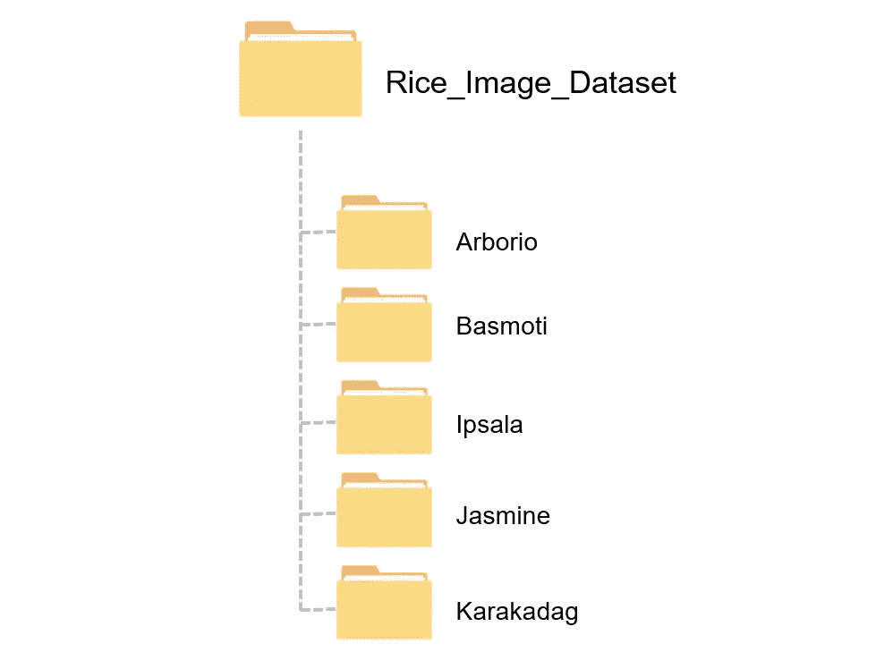

The folder structure of the rice image example

**1。定义主文件夹位置**

```
img_path = "C:/Project/Rice_Classification/Rice_Image_Dataset/"
```

⚠️别忘了在路径的末尾加上/

**2。列出图像的所有类别/种类/标签**

```
rice_label = ['Arborio','Basmati','Ipsala','Jasmine','Karacadag']
```

我们将使用该列表遍历所有子文件夹。确保标签名称与子文件夹名称相同。

**3。创建图像路径的数据帧，并标记**

```
import pandas as pd
import osimg_list = []
label_list = []
for label in rice_label:
    for img_file in os.listdir(img_path+label):
        img_list.append(img_path+label+'/'+img_file)
        label_list.append(label)

df = pd.DataFrame({'img':img_list, 'label':label_list})
```

**代码解释**

*   img_list:图像文件位置
    label_list:每张图像的标签
*   遍历所有子文件夹(img_path+label)
*   找到每个子文件夹中的所有图像文件，并将文件位置添加到 img_list 中
*   然后根据子文件夹名称添加标签
*   从 img_list 和 label_list 列创建数据帧

```
df.head()
```

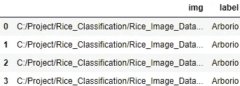

我们会得到这样的数据帧。

# 步骤 2:数据探索

**1。统计每个大米类别的图像数量**

```
df['label'].value_counts()
```

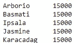

每个类别有 15，000 张图片。好吧！

**2。显示样本图像**

```
import matplotlib.pyplot as pltfig, ax = plt.subplots(ncols=len(rice_label), figsize=(20,4))
fig.suptitle('Rice Category')random_num = 12for i,label in enumerate(rice_label):
    ax[i].set_title(label)
    ax[i].imshow(plt.imread(df[df['label']==label]['img'].iloc[random_num]))
```

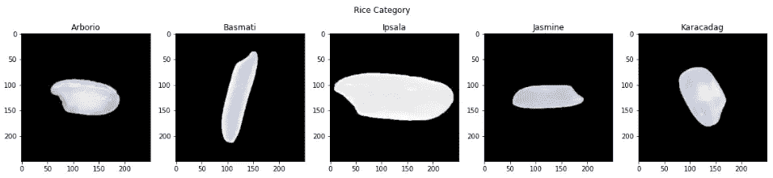

results after running code

使用 matplotlib 显示样本图像(你可以只打开文件夹中的图像文件，但这种方法更酷。开玩笑的。用 matplotlib 显示图像可以适配成图像增强后的图解图像，建议学习用 matplotlib 显示图像。

**代码解释**

*   创建一个子情节，其列数等于类别数
*   random_num 用于随机选择要显示的图像。您可以更改此变量来更改显示的图像。
*   遍历 rice_label 以显示每个 rice 标签的 1 个图像

[plt.imread](https://www.geeksforgeeks.org/matplotlib-pyplot-imread-in-python/) 用于将图像从文件读入数组

imshow 用于使用图像数组作为输入来打印图像

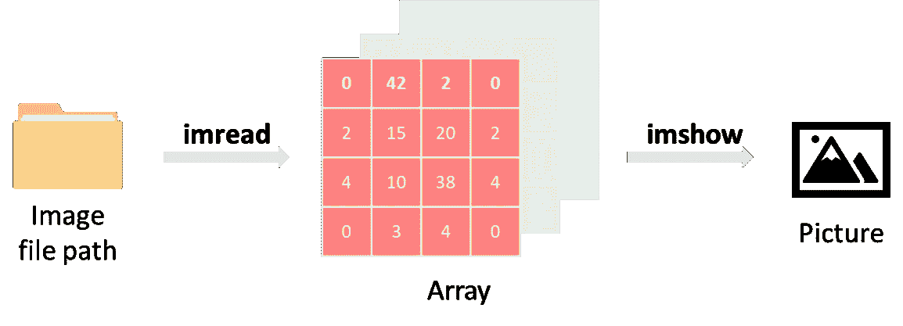

⚠️如果你使用 OpenCV 读取图像，图像颜色可能是错误的，因为 OpenCV 使用 BGR 作为图像的默认颜色顺序，而 matplotlib 使用 RGB。当你在 matplotlib 中显示用 OpenCv 加载的图像时，通道将从后向前。(点击可以阅读更多

**3。了解图像形状**

图像形状在计算机视觉编程中至关重要，因为深度学习模型将被定义为所需的图像大小。在将图像输入到模型中之前，我们必须调整图像的大小以匹配所需的大小。

```
plt.imread(df['img'][0]).shape
```

。shape 与图像数组一起使用来了解图像大小。

结果是(250，250，3)。

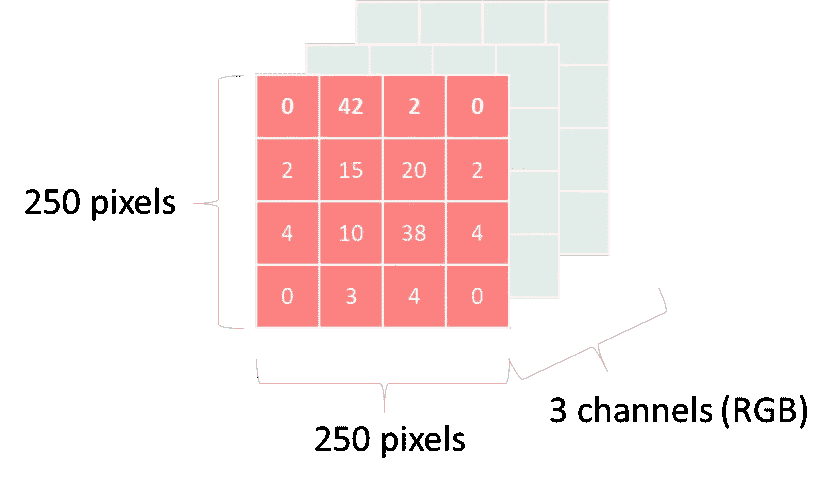

# 步骤 3:数据预处理

**1。编码标签**

深度学习模型需要预测结果是一个数字，因此在模型训练之前，标签必须从分类值编码(更改)为数值。

```
# Create a dataframe for mapping label
df_labels = {
    'Arborio' : 0,
    'Basmati' : 1,
    'Ipsala' : 2,
    'Jasmine' : 3,
    'Karacadag': 4
}# Encode
df['encode_label'] = df['label'].map(df_labels)
df.head()
```

**代码解释**

*   创建一个字典 df_labels，其中键是大米类别，值是订单号。
*   使用。映射到用 df_labels 编码数据帧列“label”
*   df 将有一个新的列 encode_label，它是标签列的编码数。

**2。准备模型训练数据集**

**输入(X):** 图像

```
import cv2X = []
for img in df['img']:
    img = cv2.imread(str(img))
    # img = augment_function(img)
    img = cv2.resize(img, (96, 96))
    img = img/255
    X.append(img)
```

在输入图像用于模型训练之前，必须将其转换为模型的特定大小的数组，并缩放为 0 到 1 之间的值。

您可以创建一个增强功能来调整图像，如改变对比度和亮度，并将该功能应用于此步骤。

**输出(y):** 每个图像的编码标签

```
y = df['encode_label']
```

**3。培训/验证/测试分割**

```
from sklearn.model_selection import train_test_splitX_train, X_test_val, y_train, y_test_val = train_test_split(X, y)
X_test, X_val, y_test, y_val = train_test_split(X_test_val, y_test_val)
```

培训 80%，模型调整验证 4%，测试集 16%

# 步骤 4:创建一个模型

**1。使用 VGG16 作为基本型号**

VGG16 是著名的卷积神经网络(CNN)架构，由卡伦·西蒙扬和安德鲁·齐泽曼于 2014 年发明。

我不是从零开始训练一个深度学习模型，而是使用迁移学习的方法，以一个预先训练好的模型(VGG16)为起点，添加一些层来匹配我们的任务。

首先，导入 VGG16 模型，将输入形状设置为(96，96，3)。

```
from keras.applications.vgg16 import VGG16 base_model = VGG16(input_shape=(96,96,3), include_top=False, weights='imagenet')

base_model.summary()
```

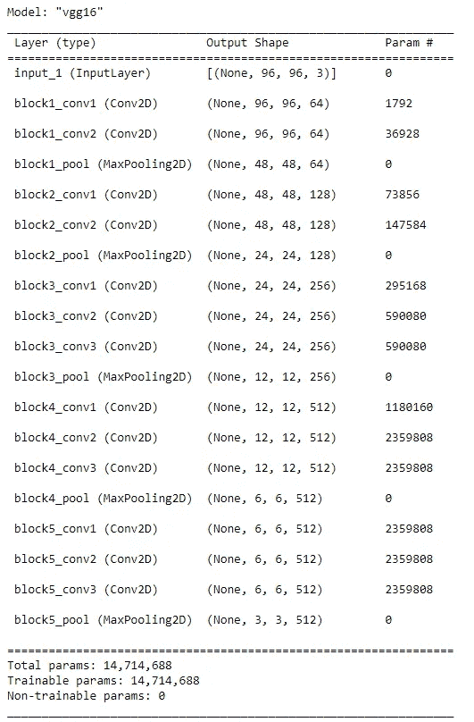

VGG16 model summary

然后，冻结 VGG16 模型参数，只允许调整最后一层的参数，以减少计算工作量。

```
for layer in base_model.layers:
    layer.trainable = Falsebase_model.layers[-2].trainable = True
base_model.layers[-3].trainable = True
base_model.layers[-4].trainable = True
```

**2。给模型添加图层**

现在是时候为我们的任务向基础模型添加自定义层了。

```
from tensorflow.keras.models import *
from tensorflow.keras.layers import *model = Sequential()
model.add(Input(shape=(96,96,3)))
model.add(base_model)
model.add(Flatten())
model.add(Dropout(0.2))
model.add(Dense(256, activation='relu'))
model.add(Dropout(0.2))
model.add(Dense(len(rice_label), activation='softmax'))model.summary()
```

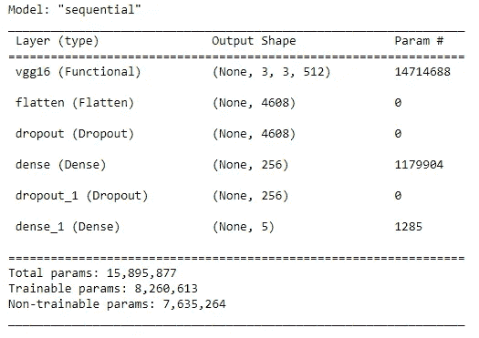

Model summary

在型号总结中可以看到，VGG16 是起点。然后，添加图层展平、缺失和密集。

在这篇文章中，我不会深入讨论每一层的细节。你必须关注的重要层是最后一个致密层。该层将产生图像分类的结果。它被设置为输出形状等于 len(rice_label ),在本例中为 5，因此结果将是 5 个 rice 类别的概率，softmax 函数将汇总概率最高的类别。

# 第五步:训练一个模型

让我们训练模型！！

```
model.compile(
  optimizer="adam",
  loss='sparse_categorical_crossentropy',
  metrics=['acc'])history = model.fit(X_train, y_train, epochs=5, validation_data=(X_val, y_val))
```

这一步可能需要很长时间。

你会看到每个纪元的准确性。

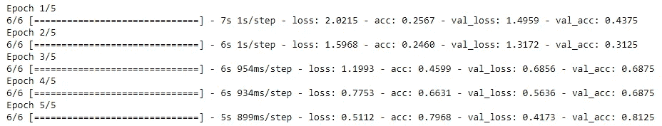

**注意:**为了更快的模型训练，我只使用每个类别的 5000 张图像进行训练，所以精度没有那么高。

# 第六步:模型评估

**1。用测试装置**测试模型

```
model.evaluate(X_test,y_test)
```

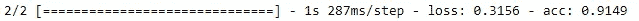

准确率为 91.49%(如果使用全部 75，000 张图像，准确率可高达 99%)

**2。可视化模型**

每个历元的绘图精度。您可能会从更高的历元看到更高的精度(模型更好)。

```
plt.plot(history.history['acc'], marker='o')
plt.plot(history.history['val_acc'], marker='o')
plt.title('model accuracy')
plt.ylabel('accuracy')
plt.xlabel('epoch')
plt.legend(['train', 'val'], loc='lower right')
plt.show()
```

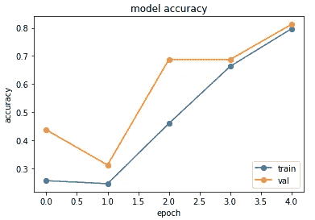

model accuracy plot

每个历元的图损失。你可能会看到一个较高时期的较低损失。

```
plt.plot(history.history['loss'], marker='o')
plt.plot(history.history['val_loss'], marker='o')
plt.title('model loss')
plt.ylabel('loss')
plt.xlabel('epoch')
plt.legend(['train', 'val'], loc='upper right')
plt.show()
```

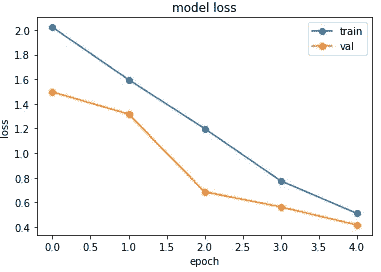

model loss plot

通过绘制这两个图，可以更容易地决定应该使用多少个历元来训练模型，因为更多的历元意味着更多的计算时间。

# 结论

在本文中，您将学习如何使用 Python 和 Keras 库执行影像分类任务。从读取数据集、数据探索和数据预处理开始。然后，创建并训练一个模型，并评估该模型。

感谢您的阅读。如果你喜欢这些内容，请关注我，获取更多数据科学相关文章。如果有什么推荐，随时告诉我。

[](/mlearning-ai/mlearning-ai-submission-suggestions-b51e2b130bfb) [## Mlearning.ai 提交建议

### 如何成为 Mlearning.ai 上的作家

medium.com](/mlearning-ai/mlearning-ai-submission-suggestions-b51e2b130bfb)