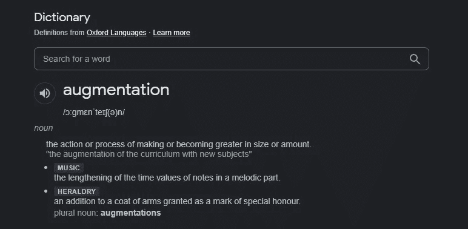

# 图像数据增强—计算机视觉、深度学习

> 原文：<https://medium.com/mlearning-ai/image-data-augmentation-computer-vision-deep-learning-2b794b97542?source=collection_archive---------3----------------------->

根据字典的解释，增加是在尺寸或数量上变得更大的动作或过程。



因此，在训练大型神经网络时，拥有足够的数据来训练网络是非常重要的。否则，您的模型可能训练不足(欠拟合)或训练过度(过拟合)。

**增强:**

增强技术以两种方式执行。
1。离线增强
2。在线增强

**在线增强:** *当数据集太大时执行，当应用增强时可能会使您的内存爆炸。
*这是一个批量增强。在这里，我们在将图像输入模型之前，对其进行动态扩充。
*这样我们可以利用 GPU 并避免内存限制

**离线增强:
*** 这是我们在谈论增加数据集时首先想到的。我们只需应用转换并在本地扩展数据集。
*适用于小型数据集，其中内存不会成为限制。

**技术:** 基于您的用例，您可以为您的数据集选择使用什么增强技术。 **例 1:识别车祸** 这里，应用旋转和翻转图像是有意义的。我们可能需要增加这些场景来扩大事故数据。
**例子 2:数天上的星星**
在这里，旋转图像毫无意义，因为你不是在训练你的模型之外的任何东西。致力于亮度和对比度来增加数据是有意义的。

所以，根据你的模型，选择最适合你模型的。
下面列举几个技巧:
1。复制或重复
2。改变亮度或对比度
3。裁剪、缩放
4。添加噪声或锐化图像
5。翻转或旋转图像
6。平移(沿 X 或 Y 轴移动)

一些代码片段，以加快您的扩增过程中的旋转离线旋转。

```
import cv2
import os
import numpy as npimage = cv2.imread('oneimagefromdirectory.jpg')# If all of your images are of same size, then you don't have to calculate h,w,center for every image. Select one image from your directory and calculate h,w,center and reuse(h, w) = image.shape[:2]
center = (w / 2, h / 2)
angle = 45 # choose your angle 0 - 360
scale = 1
M = cv2.getRotationMatrix2D(center, angle, scale)direc = 'Original directory path with images'
newdirec = 'New directory augmented(rotaion 45 degrees)images 'isExist = os.path.exists(newdirec)
if not isExist:
  os.makedirs(newdirec) # Create a new directory because it does not exist 
  print("The new directory is created!")

directory = os.fsencode(direc)
for file in os.listdir(directory):
    filename = os.fsdecode(file)
    im = cv2.imread(direc+filename)
    rotated = cv2.warpAffine(im, M, (w, h))#cv2.imshow('original Image', image)
    cv2.imwrite(newdirec+filename, rotated)
    #cv2.waitKey(0)
    #cv2.destroyAllWindows()
```

快乐充实💚

参考:[https://nano nets . com/blog/data-augmentation-how-to-use-deep-learning-when-you-have-limited-data-part-2/](https://nanonets.com/blog/data-augmentation-how-to-use-deep-learning-when-you-have-limited-data-part-2/)

[](/mlearning-ai/mlearning-ai-submission-suggestions-b51e2b130bfb) [## Mlearning.ai 提交建议

### 如何成为 Mlearning.ai 上的作家

medium.com](/mlearning-ai/mlearning-ai-submission-suggestions-b51e2b130bfb)