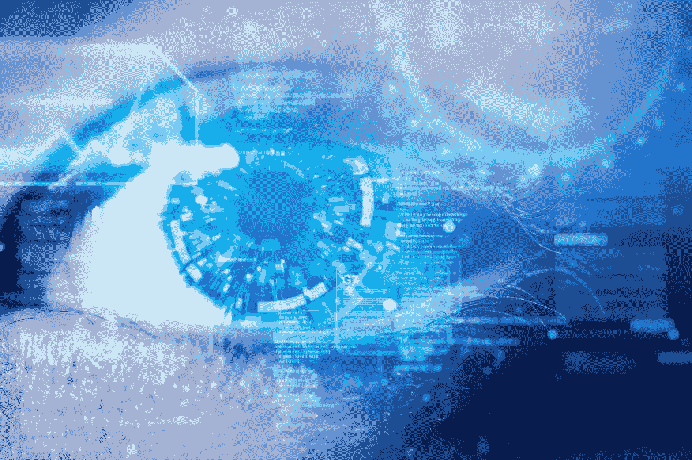
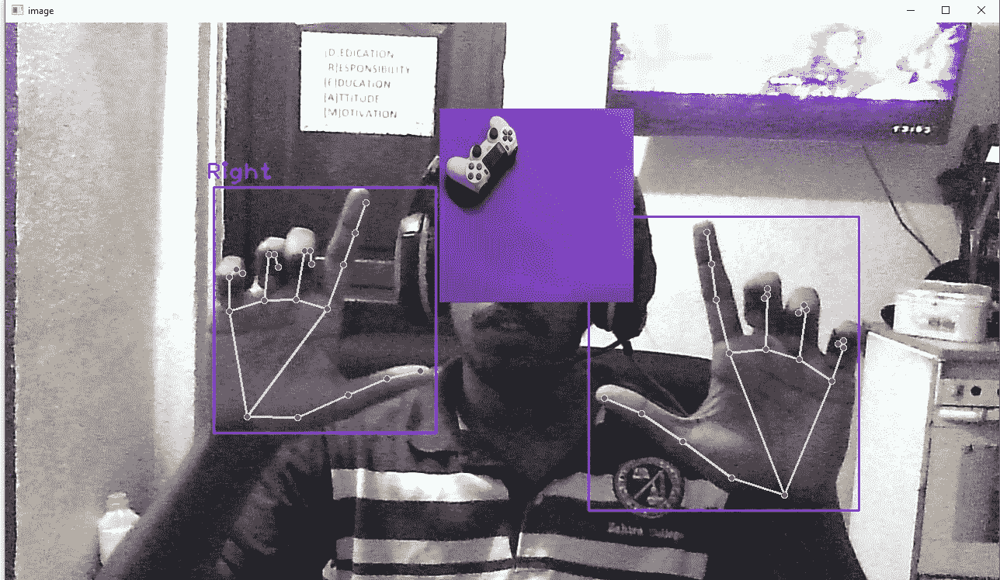
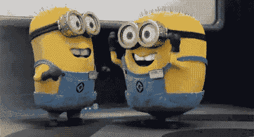

# 使用 OpenCv 和 Python 的计算机视觉图像缩放

> 原文：<https://medium.com/mlearning-ai/image-zoom-using-computer-vision-using-opencv-and-python-1eeaee53eeb8?source=collection_archive---------0----------------------->



在这里，我们将学习如何使用 python 创建一个虚拟缩放来缩放图像并将其放置在不同的位置。为此，我们将在这个编码示例中使用开放的 cv 和 cvzone

# 什么是计算机视觉？

术语计算机视觉(CV)在人工智能(AI)和深度学习(DL)应用中经常使用和听到。这个术语本质上意味着赋予计算机像我们人类一样看待世界的能力。这些数据然后被转换成计算机可读的语言，以帮助决策过程。人工智能这一分支的主要目标是教会机器从像素中收集信息。

# OpenCV 是什么？

OpenCV(开源计算机视觉库)是一个用于计算机视觉和机器学习的开源软件库。OpenCV 的创建是为了给计算机视觉应用提供一个共享的基础设施，并加速机器感知在消费产品中的应用。

视频的每一帧都必须被提取、分割并添加到图像中。OpenCV video capture 用于加载网络摄像头视频并提取每一帧。一般来说，这个过程会导致延迟，但是轻量级模型和最少的预处理能够提供不错的帧速率。

# 让我们看看它是怎么做的


[https://tenor.com/view/excited-girl-happy-yay-ready-lets-do-this-gif-14423147](https://tenor.com/view/excited-girl-happy-yay-ready-lets-do-this-gif-14423147)

首先，我们需要安装 OpenCV

```
#conda
conda install -c conda-forge opencv#pip
pip install opencv-python
```

接下来安装 [cvzone](https://github.com/cvzone/cvzone)

```
pip install cvzone
```

接下来安装[媒体管道](https://google.github.io/mediapipe/getting_started/python.html)

```
pip install mediapipe
```

现在让我们开始编码

在 python 项目的 main.py 或/中导入以下模型

```
import cv2
from cvzone.HandTrackingModule import HandDetector
```

初始化以下变量

```
capture = cv2.VideoCapture(0)
capture.set(3,1280)
capture.set(4,720)#**giving the confidence and the hand count**
detector_hand = HandDetector(detectionCon=0.7)
initialDistance = None
image_scale = 0
cx,cy = 300,500
```

然后做一个 while true 循环读取视频 capure 来工作

```
while True:
   ** #scucess is true img is the video image**
    success,img = capture.read()
   ** # print(success)
    #hand is a the array of points**
    hands,img = detector_hand.findHands(img)
    image1 = cv2.imread('gamer.jpg')
    if (len(hands) == 2):

   **     # print("Both hands on screen!!!")
        # plan ur gesture which you want to use i use the thumb and index finger
        # hand[0] == right hand & hand[1] == left hand**
        print(detector_hand.fingersUp(hands[1]) , detector_hand.fingersUp(hands[0]))
        if(detector_hand.fingersUp(hands[1])==[1,1,0,0,0] and detector_hand.fingersUp(hands[0])==[1,1,0,0,0]):
           ** # print("correct action of hand")
            #now lets find the distance from the hand**
            lmList0 = hands[0]['lmList']
            lmList1 = hands[1]['lmList']

         **   #get the length using tip of finger**

            if (initialDistance == None):

                length, info, img = detector_hand.findDistance(lmList0[8], lmList1[8], img)
               ** # print(length)**
                initialDistance = length
            length, info, img = detector_hand.findDistance(lmList0[8], lmList1[8], img)

          **# decrese the sensitivity by making a int
            image_scale = int((length - initialDistance) // 2)
            # print(image_scale)

            #find the center point of the distance
            #which is loacted in info -> findDistance** 
            cx,cy = info[4:]

    else:
        **#we make the distance to 0 when hands are taken away from screen**
        initialDistance = None

    try:
        **#store the image in a variable**
        image1 = cv2.imread('gamer.jpg')
 **#get the height and width of the given image 250*250**
        h1,w1,_=image1.shape

        new_height, new_width = ((h1+image_scale)//2)*2, ((w1+image_scale) //2)*2

        image1 =cv2.resize(image1, (new_width,new_height))

     **   #slizing the image and overlaying it shit a image by 10  should increase both the same value
        #keep the image in the center of the width
        #cx == height**
        img[cy-new_height//2:cy+new_height//2, cx-new_width//2:cx+new_width//2] = image1
        cv2.imshow("image",img)
        key = cv2.waitKey(1)
        if (key == ord('c')):
            break

    except:
        pass
```



下面将附上 Github 代码链接

[](https://github.com/baasithshiyam/virtual-image-zoom) [## GitHub-baasithshiyam/虚拟图像缩放

### 在 GitHub 上创建一个帐户，为 baasithshiyam/虚拟图像缩放开发做出贡献。

github.com](https://github.com/baasithshiyam/virtual-image-zoom) 

我们实现了手部检测和缩放技术。在这个 opencv 项目中，我们学习了如何找到手指向上的操作，屏蔽图像，以及其他图像处理

[视频演示](https://youtu.be/yg3DL4ZGKjE)

完成的



[http://lovesthor.tumblr.com/post/56331551134/me-when-someone-i-dont-know-likes-or-reblogs](http://lovesthor.tumblr.com/post/56331551134/me-when-someone-i-dont-know-likes-or-reblogs)

希望这个教程对你有帮助。如果我们遗漏了什么，请通过评论让我们知道。😇

❤️❤️❤️❤️❤️❤️❤️Thanks 代表 reading❤️❤️❤️❤️❤️❤️❤️❤️