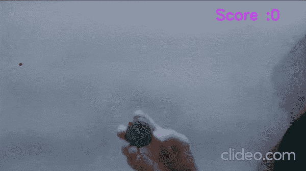
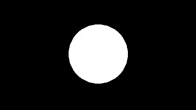

# 使用 OpenCV 的 Python 不朽的蛇游戏——带源代码——有趣的项目

> 原文：<https://medium.com/mlearning-ai/immortal-snake-game-in-python-using-opencv-with-source-code-fun-project-1bf45c1f69cf?source=collection_archive---------4----------------------->

到目前为止，我已经在数据科学的几乎每个领域做了大量的项目，从 ML、DL、计算机视觉到 NLP，但是这个用 Python 编写的**不朽的贪吃蛇游戏**仍然是我*最喜欢的项目之一*，因为它的简单性和用户交互。在看了大约 100 行代码的结果后，你会感到非常惊讶。

https://machinelearningprojects.net/snake-game-in-python/点击此处阅读全文及源代码

点击此处查看视频—[https://youtu.be/g3brEQ_1QsI](https://youtu.be/g3brEQ_1QsI)



# 让我们开始吧…

## 用 python 写的不死蛇游戏代码…

```
import cv2
import imutils
from collections import deque
import numpy as np
import time

score = 0
max_score=20
list_capacity = 0
max_lc =20
l = []
flag=0
apple_x = None
apple_y = None
center = None

# distance function
def dist(pt1,pt2):
    return np.sqrt((pt1[0]-pt2[0])**2 + (pt1[1]-pt2[1])**2)
cap = cv2.VideoCapture(0)

# Snake game in Python
while 1:

    ret,frame = cap.read()
    img = imutils.resize(frame.copy(),width=600)
    img = cv2.GaussianBlur(img,(11,11),0)          
    img = cv2.cvtColor(img,cv2.COLOR_BGR2HSV)     

    if apple_x is None or apple_y is None:

        # assigning random coefficients for apple coordinates
        apple_x = np.random.randint(30,frame.shape[0]-30) 
        apple_y = np.random.randint(100,350)       

    cv2.circle(frame,(apple_x,apple_y),3,(0,0,255),-1)

    # change this range acc to your need 
    greenLower = (29, 86, 18)
    greenUpper = (93, 255, 255)

    # masking out the green color  
    mask = cv2.inRange(img,greenLower,greenUpper)
    mask = cv2.erode(mask,None,iterations=2)
    mask = cv2.dilate(mask,None,iterations=2)

    # find contours
    cnts = cv2.findContours(mask,cv2.RETR_EXTERNAL,cv2.CHAIN_APPROX_SIMPLE)
    cnts = imutils.grab_contours(cnts)

    if len(cnts)>0:
        ball_cont = max(cnts,key=cv2.contourArea)
        (x,y),radius = cv2.minEnclosingCircle(ball_cont) # find the minimum enclosing circle about the found contour 

        M = cv2.moments(ball_cont)
        center = (int(M['m10']/M['m00']),int(M['m01']/M['m00']))

        if radius>10:
            cv2.circle(frame,center,2,(0,0,255),3)

            if len(l)>list_capacity:
                l = l[1:]

            if prev_c and (dist(prev_c,center) >3.5):
                l.append(center)

            apple = (apple_x,apple_y)
            if dist(apple,center)<5:
                score+=1
                if score==max_score:
                    flag=1
                list_capacity+=1
                apple_x = None
                apple_y = None

    for i in range(1,len(l)):
        if l[i-1] is None or l[i] is None:
            continue
        r,g,b = np.random.randint(0,255,3)

        cv2.line(frame,l[i],l[i-1],(int(r),int(g),int(b)), thickness = int(len(l)/max_lc+2)+2)    

    cv2.putText(frame,'Score :'+str(score),(450,100),cv2.FONT_HERSHEY_SIMPLEX,1,(255,0,203),2)
    if flag==1:
        cv2.putText(frame,'YOU WIN !!',(100,250),cv2.FONT_HERSHEY_SIMPLEX,3,(255,255,0),3)

    cv2.imshow('live feed',frame)
    cv2.imshow('mask',mask)
    prev_c = center

    if cv2.waitKey(1)==27:
        break

cv2.destroyAllWindows()
cap.release()

# This was the code for snake game in Python
```

*   第 1–5 行—导入所需的库。
*   第 7–14 行——初始化一些我们将进一步用到的常量。
*   第 17–19 行—只声明了一个距离函数，该函数将简单地计算两点(x1，y1)和(x2，y2)之间的距离。
*   第 20 行—声明 [VideoCapture](https://docs.opencv.org/3.4/d8/dfe/classcv_1_1VideoCapture.html) 对象来访问网络摄像头。
*   **让我们启动 infinit 循环来玩 Python 中的贪吃蛇游戏……**
*   第 25 行—从网络摄像头读取图像。
*   第 26 行—将图像的宽度调整为 600，imutils 库将保持纵横比。
*   第 27 行——模糊图像以去除噪声。
*   第 28 行——将 BGR 图像转换为 HSV 模式，因为我们将在后面的步骤中制作遮罩，这在 HSV 模式下效果最好。
*   第 30 行——只是检查它是否是循环的开始，因为在开始时只有 apple_x 和 apple_y 都是 None。在这里，苹果是蛇吃的红点以获得分数。
*   第 33–34 行——将整数随机分配给 apple_x 和 apple_y，这两个整数将一起给出苹果的坐标。
*   第 36 行——画一个圆，或者我们可以说在框架上放一个点/苹果。半径为 3 个像素的圆看起来像一个点。
*   第 39–40 行—设置绿色的范围。这是一个非常敏感的步骤，因为选择错误的范围会完全破坏游戏的运行。这个范围被调整为绿色瓶盖，我在下面的视频中使用。根据物体的颜色进行调整。
*   第 43 行——这将创建遮罩。它将检查图像的每个像素，并检查该像素的颜色是否在范围内(上面指定的范围)。如果在范围内，将其标记为白色像素，否则将其标记为黑色像素。
*   第 44–45 行我们正在[腐蚀和扩张](https://machinelearningprojects.net/how-to-perform-morphological-operations-like-erosion-dilation-and-gradient-in-opencv/)图像，以消除任何噪声(如果有的话),从而增强 Python 中贪吃蛇游戏的响应。
*   第 48–49 行——我们只是从遮罩中检测轮廓。因为我们的瓶盖是圆的，所以我们的面具也是黑底白字。所以它会选择这个白色轮廓。



*   第 52 行——我们正在检查是否发现了任何轮廓。
*   第 53 行—选择面积最大的等值线，因为在许多情况下，小的噪声等值线也会被拾取。
*   第 54 行——计算轮廓的[最小外接圆](https://docs.opencv.org/3.4/dd/d49/tutorial_py_contour_features.html)。
*   第 56–57 行——计算轮廓的[矩](https://docs.opencv.org/3.4/dd/d49/tutorial_py_contour_features.html),并找到轮廓的质心。这个质心将与瓶盖的中心相同。
*   第 59 行——如果我们发现的最大轮廓的半径大于 10，那么我们确定这是瓶盖。
*   第 60 行—在中心(你可以看到瓶子的中心)画一个半径为 2 的圆(看起来像一个点)。
*   第 62–63 行—就这么做:)，做了一些调整。
*   第 68–70 行—我们只是检查我们的蛇嘴(瓶子中心)和苹果之间的距离是否小于 5 个像素，将其标记为被吃掉，并增加分数。
*   第 71–72 行—如果分数达到 20，设置 flag=1，这将在屏幕上显示“您赢了”。
*   第 73–75 行—增加列表容量并将 apple_x 和 apple_y 重置为无。
*   第 77–82 行—构建蛇。列表 l 将包含我们的蛇经过的所有最后 n 个点，并在它们之间画一条看起来像蛇的线。第 80 行只是给每一行分配一个随机的颜色。
*   第 85 行——把乐谱放在画框上。
*   第 86–87 行—如果 flag=1 表示您已经达到 20 分，打印“您赢了”。
*   第 89–90 行—显示主图像。
*   第 93–94 行—如果用户按下 ESC 键，则破解代码。

## 最终结果…

让我们玩游戏吧…


如果对 Python 中的贪吃蛇游戏有任何疑问，请通过电子邮件或 LinkedIn 联系我。

**如需进一步的代码解释和源代码，请访问此处**—[https://machinelearningprojects.net/snake-game-in-python/](https://machinelearningprojects.net/snake-game-in-python/)

*这就是我写给这个博客的全部内容，感谢你的阅读，我希望你在阅读完这篇文章后，能有所收获，直到下一次👋…*

***看我以前的帖子:*** [***如何在 PYTHON 中使用 KMEANS 聚类找到一幅图像中最主要的颜色***](https://machinelearningprojects.net/how-to-find-the-most-dominant-colors-in-an-image-in-opencv/)

**查看我的其他** [**机器学习项目**](https://machinelearningprojects.net/machine-learning-projects/)**[**深度学习项目**](https://machinelearningprojects.net/deep-learning-projects/)**[**计算机视觉项目**](https://machinelearningprojects.net/opencv-projects/)**[**NLP 项目**](https://machinelearningprojects.net/nlp-projects/)**[**烧瓶项目**](https://machinelearningprojects.net/flask-projects/) **at**********

****[](/mlearning-ai/mlearning-ai-submission-suggestions-b51e2b130bfb) [## Mlearning.ai 提交建议

### 如何成为 Mlearning.ai 上的作家

medium.com](/mlearning-ai/mlearning-ai-submission-suggestions-b51e2b130bfb)****