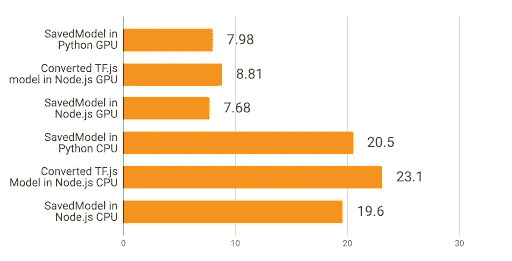
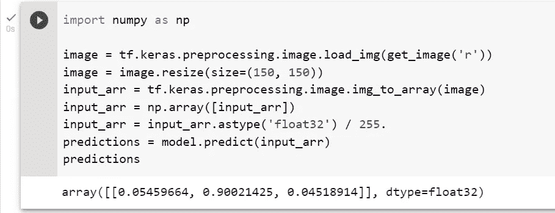
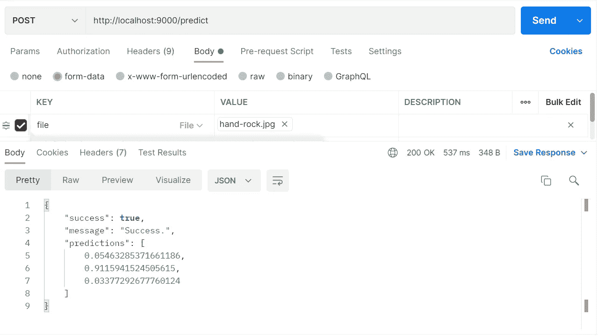
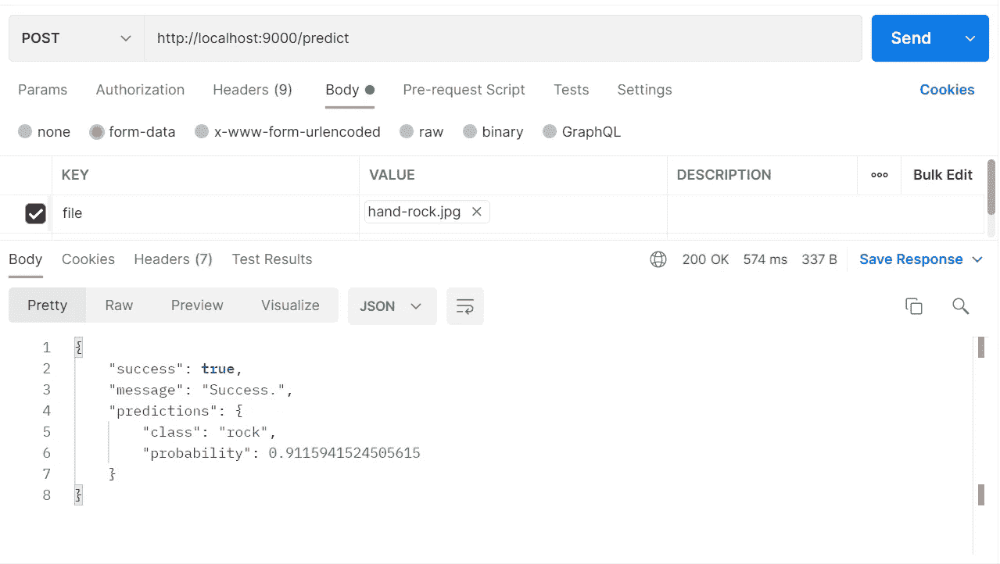

# 使用 TensorFlow + ExpressJS 构建简单的图像识别后端服务

> 原文：<https://medium.com/mlearning-ai/implementing-image-recognition-model-to-backend-service-with-tensorflow-expressjs-dde828b3ccda?source=collection_archive---------3----------------------->

将 Python 中内置的 TensorFlow 模型应用到 Node 的分步指南。Js(快递)后端。


Photo by [Boitumelo Phetla](https://unsplash.com/@writecodenow?utm_source=medium&utm_medium=referral) on [Unsplash](https://unsplash.com?utm_source=medium&utm_medium=referral)

# 介绍

在当前时代，我们可以找到许多平台、网站和应用程序实现机器学习来增强他们的业务流程和体验。TensorFlow 是一个众所周知的开源框架，广泛用于开发机器学习模型。它还可以集成到多种语言的平台上，如 Python、JavaScript、Java、C++等。

另一方面，表达。Js 是一个基于 JavaScript 的框架，广泛用于构建后端服务。即使 Tensorflow 可以用 Tensorflow 在 JavaScript 上构建。Js，Python 似乎有更多的实用程序和方便的工具和特性来构建一个 ML 模型，比如 NumPy，Pandas，以及其他一些可以帮助 ML 开发者在构建模型时进行研究和实验的东西。那么，**有没有可能用 Tensorflow(在 Python 中)构建的 ML 模型实现到 express** 中的后端服务？答案绝对是肯定的。

TensorFlow 提供了各种各样的格式来显示您希望如何保存 ML 模型，TensorFlow.js 可以利用基本的 SavedModel 格式，这种格式可以通过执行`model.save('folder_name_of_saved_model')`生成包含几个`.pb`文件的文件夹来轻松获得；或者您可以在将模型保存为 TensorFlow.js 格式后将其转换为包含 JSON 文件和几个`.bin`文件的文件夹。

然而，关于 TensorFlow 博客的这篇文章，我们可以看到，与使用转换的 TensorFlow.js 模型相比，直接应用 SavedModel 的服务在预测方面获得了更好(更快)的推理时间，而不管使用的是哪个版本的`tfjs-node`(CPU 和 GPU)。下图显示了性能对比。



Performance Benchmark of the saved model formats (from TensorFlow Blog).

因此，我们将在本文中使用 SavedModel。

# 准备材料

在这篇文章中，我在[这个链接](https://github.com/ddhira123/tensorflow_with_expressjs/tree/main/SavedModel)准备了石头剪刀布手势分类器的 SavedModel。该模型将为每个类别生成概率数组，格式如下:

```
[[paper_prob, rock_prob, scissors_prob]]
```

这是来自 Laurence Moroney 的 RPS 数据集的岩石标志图像，用于 SavedModel 的示例测试。


Sample Test Image (Source: [Laurence Moroney’s Dataset](https://laurencemoroney.com/datasets.html))



Prediction of Sample Image

在执行后续步骤之前，请确保您的设备中已经安装了 NodeJS 和 NPM，并准备好获取所需的包。您可以通过在您的终端或 powershell 或命令提示符或另一个 shell 中运行`npm -v`和`node -v`来检查它们是否准备好了(在这之后我将简单地称之为“shell”)。如果你没有安装 Node 及其附加功能(node-gyp)，如果你使用 Windows，你可能需要通过接受附加安装从 GUI 重新安装 Node LTS，或者阅读[this stack overflow thread](https://stackoverflow.com/questions/45801457/node-js-python-not-found-exception-due-to-node-sass-and-node-gyp)。

首先，我们需要创建一个 express.js 应用。在您的 shell 中运行这一行来创建我们的 Express 后端服务的模板。这个命令将创建一个名为`imageRecogAPI`的 express.js 应用程序，使用 Pug 作为[模板引擎](https://expressjs.com/en/guide/using-template-engines.html)，并创建一个包含我们后端服务源代码的同名文件夹。

```
npx express-generator --view=pug imageRecogAPI
```

然后，在您的 shell 上运行下面代码块中的这个命令，为这个项目安装整个依赖项。标志`--legacy-peer-deps`只是为了预防包之间的依赖冲突，以防任何包有下面列出的其他包，但版本较旧。如果您想查看安装进度(以防安装卡住)，您也可以在`--legacy-peer-deps`标志后添加标志`--verbose`。

```
npm install @tensorflow/tfjs-node cookie-parser cors multer debug get-image-data jimp morgan express pug --save --legacy-peer-deps
```

如果你在安装时遇到错误，你可以运行下面的脚本，或者如果你在安装时卡住了，点击`Ctrl` + `C`，然后运行下面的脚本。之后，重新运行上面的命令`npm install`。如果您实际上是在代理后面工作，那么您可以通过这篇文章来解决这个问题。

```
npm cache clear --force
```

[](/@d_dhana/working-with-npm-behind-network-proxy-444ced82a3) [## 在网络代理背后与 NPM 合作

### 介绍

medium.com](/@d_dhana/working-with-npm-behind-network-proxy-444ced82a3) 

安装包完成后，将 SavedModel 文件夹移动或复制到这个 express 项目的文件夹中。因此，在完成上述所有工作后，您的项目结构应该类似如下:

```
imageRecogAPI/
├── node_modules/
├── bin/
│   └── www
├── public/
│   ├── images/
│   ├── javascripts/
│   └── stylesheets/
├── routes/
│   ├── index.js
│   └── users.js
├── views/
│   ├── error.pug
│   ├── index.pug
│   └── layout.pug
├── SavedModel/
│   ├── variables/
│   ├── keras_metadata.pb
│   └── saved_model.pb
├── app.js
├── package.json
└── package-lock.json
```

# 服务的发展

## 设置 app.js 和路线

让我们开始发展。我们已经在项目结构中看到的最重要的东西是`app.js`。不做任何修改，您应该已经得到了这个模板:

如果您希望更改应用程序的端口，您可以在您的`app.js`中的`module.export`上方添加这些行。根据下面的代码，默认端口将是`9000`。您可以简单地更改那里的值或添加一个`.env`文件，然后编写`PORT=9000`(如果您想让服务在端口 9000 上运行)。

```
const PORT = process.env.PORT || 9000;
app.listen(PORT);
console.log(`Running server at http://localhost:${PORT}`);
```

然后使用命令`npm run start`运行应用程序，然后打开浏览器，然后转到`[http://localhost:9000](http://localhost:9000)`，您将看到默认的快速欢迎页面。

之后，我们检查 app.js 中的路由，已经有 2 个路由器(`/`和`/users`)。您也可以尝试访问`[http://localhost:9000/users](http://localhost:9000/users)`。如果你读了上面的内容，你就会明白路线是如何定义和使用的。然后，将下面的粗体代码行添加到您的`app.js`中。

```
var indexRouter = require('./routes/index');
var usersRouter = require('./routes/users'); 
**var predictionRouter = require('./routes/predict');**...app.use('/', indexRouter);
app.use('/users', usersRouter);
**app.use('/predict', predictionRouter);**
```

因此，我们将通过在目录`routes/`中创建一个新文件`predict.js`来创建我们自己的路由，并将下面的代码复制到其中。

下面是对上面代码的解释:

1.  首先，我们导入所需的包，即`express`和`multer`。至于`controller`，我们将稍后创建一个，因为它是用于利用 ML 模型进行图像识别的主要过程。
2.  然后，我们声明您希望使用的文件名。该文件名必须与您将在控制器中使用的文件名相同。
3.  之后，我们设置了多磁盘存储和文件检查器/过滤器来处理上传的图像。记住，在目的地，我们将上传的图像设置为从项目根目录保存到文件夹`images/`中。
4.  最后，我们设置了一个具有前缀`/predict`的内部路由器`/`。将 multer 放在那里，检查文件类型以及文件是否存在，因为它应该是`multipart/form-data`请求中的必填字段。然后，如果请求符合要求，就将它们全部传递给控制器。

## 构建控制器

处理完路由之后，我们需要创建控制器来处理图像识别过程。首先，从项目根目录创建名为`controllers`的文件夹，然后创建名为`PredictController.js`的文件。之后，把这一整块复制进去。

这些是上面代码的解释:

1.  首先，我们导入所有的包(一如既往)。
2.  我们只是把整个过程，一次全部导出。
3.  在导出的函数中，有两个主要的函数:`loadModel()`和`image()`，下面将进行说明。

函数`loadModel()`执行这些步骤:

1.  用`await tf.node.loadSavedModel()`加载保存的模型
2.  用`await model.predict().data()`进行预测并得到结果
3.  将预测结果转换为数组，然后作为响应发送。

函数`image()`执行这些步骤:

1.  读取上传的待预测图像。
2.  将图像转换为张量，以便可以通过模型进行预测。
3.  由于模型是为了读取形状为`(None, 150, 150, 3)`的图像而构建的，我们需要通过`resizeNearestNeighbor()`将图像大小调整为 150 x 150，并通过`expandDims()`添加一个维度，将这个张量调整为该形状。因为图像已经是 RGB 格式，所以我们不需要担心形状中的`3`。
4.  之后，我们通过将图像张量划分为 255 来归一化它们。
5.  然后我们调用`loadModel()`并在预测完成后删除图像文件。

然后，转到您的 shell，运行`npm run start`。尝试你的邮差新鲜服务。在键列中选择下拉菜单`File`。如果你从一开始就正确地做了所有的步骤，你应该能得到这个。



The Finished API.

但是，您可以用自己的风格来增强预测的回报。例如，如果您只想得到概率最高的类名和概率，您可以使用下面的技巧。一开始，我们知道预测数组的值将按照`[paper, rock, scissors]`的方式排列。通过对数组使用 Javascript 本地方法，我们可以很容易地获得它。

回头看一下`PredictionController`，我们有这样一行:

```
predictions = Array.from(predictions);
```

我们可以把它改成

```
predictions = Array.from(predictions)
                   // Construct
                .map((prob, idx) => {
                  var classes = ['paper', 'rock', 'scissors'];
                  return {class: classes[idx], probability: prob};
                })
                   // Sort Descending, Get the highest one                
                .sort((a, b) => b.probability - a.probability)[0];
```

然后，我们完成这个。



Enhanced Response.

在我忘记之前，这整个代码也可以在 github 库中找到，因为我把链接放在了本文的最后。

# 结论

我们终于赶上了这篇文章的结尾。由于 TensorFlow 开发了许多跨各种平台和语言的集成，因此在任何地方应用机器学习模型都变得更加容易，包括 NodeJs 和 Express。希望本文能帮助您理解如何用 Express 构建图像识别 API。

[](https://github.com/ddhira123/tensorflow_with_expressjs) [## GitHub-DD hira 123/tensor flow _ with _ express js:这是关于 Medium 中文章的报告

### 此时您不能执行该操作。您已使用另一个标签页或窗口登录。您已在另一个选项卡中注销，或者…

github.com](https://github.com/ddhira123/tensorflow_with_expressjs) 

# 关于作者

Dhana 目前在一家印度尼西亚银行担任软件工程师，致力于通过创建或增强服务来优化业务流程。

除了软件工程，Dhana 喜欢学习和分享机器学习，并自 2021 年以来一直被认证为 TensorFlow 开发者。最后，请在[媒体](/@d_dhana)和 [LinkedIn](https://www.linkedin.com/in/dhanadhira) 伸出达那。

[](/mlearning-ai/mlearning-ai-submission-suggestions-b51e2b130bfb) [## Mlearning.ai 提交建议

### 如何成为 Mlearning.ai 上的作家

medium.com](/mlearning-ai/mlearning-ai-submission-suggestions-b51e2b130bfb) 

🔵 [**成为作家**](/mlearning-ai/mlearning-ai-submission-suggestions-b51e2b130bfb)