# 智能投资组合构建:股票方向预测

> 原文：<https://medium.com/mlearning-ai/intelligent-portfolio-construction-prediction-of-stock-direction-e1c71f4a725a?source=collection_archive---------0----------------------->

在网上搜索关于金融领域机器学习模型的有趣内容时，我看到了一篇提交给伦敦帝国理工学院数学和金融硕士的论文。这被命名为智能投资组合构建:机器学习支持均值-方差优化，我发现它非常酷。特别是，我喜欢第二部分，在那里学生使用随机森林模型来预测股票方向。我决定尝试用 Python 复制他的步骤(这里是 [GitHub 库](https://github.com/RiccardoHub/Intelligent-Portfolio-Construction-Prediction-of-Stock-Direction))。

在这篇文章中，我将展示我是如何实现并扩展论文中提出的想法的([链接此处](https://www.imperial.ac.uk/media/imperial-college/faculty-of-natural-sciences/department-of-mathematics/math-finance/Ghali_Tadlaoui_01427211.pdf))。

使用随机森林预测股票方向的任务列表如下:

1.  输入数据
2.  数据加工
3.  特征推导
4.  随机森林分类器

# 输入数据

该项目所需的数据是 OHLC 和 8 只股票的成交量，即苹果、亚马逊、花旗集团、CVS Health、3M、星巴克、嘉信理财公司和埃克森美孚。样本时间跨度为 2000 年 6 月 1 日—2016 年 4 月 25 日，用于训练和测试模型，2016 年 4 月 25 日—2021 年 7 月 26 日，用于验证。

```
import yfinance as yf

tickers = ['AAPL', 'AMZN', 'C', 'CVS', 'MMM', 'SBUX', 'SCHW', 'XOM']
start = '2000-06-02'
end = '2016-04-26'

AdjClose = yf.download(tickers, start=start, end=end)['Adj Close']
Volume = yf.download(tickers, start=start, end=end)['Volume']
High = yf.download(tickers, start=start, end=end)['High']
Low = yf.download(tickers, start=start, end=end)['Low']
Close = yf.download(tickers, start=start, end=end)['Close']
```

# 数据加工

金融数据通常非常嘈杂，这意味着一段数据携带了一些实际上并不有用的信息。解决这个问题的一个方法是数据平滑，这是一种试图抑制短期可变性，同时保持长期趋势可见的方法。本文使用的方法是指数平滑法，它使用一个常数𝛼.将 t+1 时的平滑调整后的收盘值确定为 t+1 时的观测值和 t 时的平滑数据之间的加权平均值

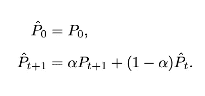

论文中使用的𝛼常数为 0.20。

对于这个项目，我决定不使用任何预制函数来提高我的编程技能。因此，这些代码远不是最高效或最优雅的。然而，如果你能提供一个更有效/优雅的代码，请这样做！

```
def exponential_smoothing(df, alpha):
    DF = df.copy().reset_index(drop=True) 
    DF.loc[1] = (DF.loc[1]*alpha)+(DF.loc[0]*(1-alpha))

    for i in range(2, len(DF)-1):
        DF[i] = (DF[i]*alpha)+(DF[i-1]*(1-alpha))

    return DF

# Apply the function to all tickers
E = {}
for n in AdjClose.columns:
    E[f'{n}']= exponential_smoothing(AdjClose[n], 0.2)
```

结果如图 1 所示。正如我们在左侧看到的，很难注意到整个数据集的任何差异。然而，通过放大一点，我们可以看到指数平滑的效果。

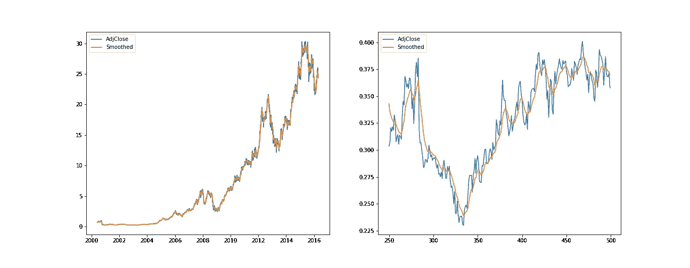

Figure 1: Exponential Smoothing on AAPL

# 特征推导

下一步是创建将在随机森林分类器中用作解释变量的指标。

第一个指标叫做 On Balance Volume，这是一个技术性的交易动量指标，用成交量来预测股价的变化。

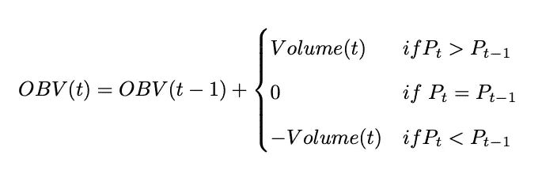

```
def OBV(df_price, df_volume):
    OBV_df = pd.DataFrame(index=range(len(df_volume.index)), columns=['OBV'])
    OBV_df.iloc[0] = 0

    for i in range(1, len(df_price)):
        if df_price[i] > df_price[i-1]:
            OBV_df.loc[i] = (OBV_df.loc[i-1] + df_volume[i])
        elif df_price[i] < df_price[i-1]:
            OBV_df.loc[i] = (OBV_df.loc[i-1] - df_volume[i])
        else:
            OBV_df.loc[i] = (OBV_df.loc[i-1] + 0)

    OBV_df.index = df_volume.index
    return OBV_df

# Apply the function to all tickers
O = {}
for n in AdjClose.columns:
    O[f'{n}']= OBV(E[n], Volume[n])
```

图 2 显示了正常化的 OBV 和平滑调整后的 AAPL 收盘价。我们稍后会发现，OBV 是模型中信息量最少的特征。


Figure 2: OBV and Smoothed AdjClose (AAPL)

第二个指标是随机振荡器%K，它将平滑价格与给定时间段 K 内的高低价格范围进行比较。它用于生成超买和超卖交易信号，利用 0-100 的有界值范围。

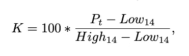

```
def stochastic_oscillator(close, df_low, df_high, K):
    low = df_low.rolling(K).min().reset_index(drop=True)
    high = df_high.rolling(K).max().reset_index(drop=True)

    stoch_oscillator = pd.DataFrame()
    stoch_oscillator['Oscillator'] = 100*((close - low)/(high - low))

    return stoch_oscillator

# Apply the function to all tickers
S = {}
for n in AdjClose.columns:
    S[f'{n}']= stochastic_oscillator(close=E[n], df_low=E[n], df_high=E[n], K=14)
```

第三个也是最后一个指标是移动平均线收敛背离。这导致了两个特征。第一个是 MACD，定义为 12 期均线和 26 期均线之差。第二个是 MACD 的信号，也就是 MACD 的 9 期均线。

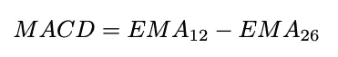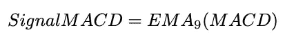

```
def MACD(data):
    MA_Fast = data.ewm(span=12,min_periods=12).mean()
    MA_Slow = data.ewm(span=26,min_periods=26).mean()
    MACD = MA_Fast - MA_Slow
    Signal = MACD.ewm(span=9,min_periods=9).mean()

    return pd.DataFrame(index=['MACD', 'Signal'], data [MACD,Signal]).T

# Apply the function to all tickers
M = {}
for n in AdjClose.columns:
    M[f'{n}'] = MACD(data=E[n])z
```

最后，我将所有变量连接在一个字典中。

```
dict_data = {}
for n in AdjClose.columns:
    dict_data[f'{n}'] = (pd.concat([E[n], 
                                    O[n].reset_index(drop=True), 
                                    S[n], 
                                    M[n]],
                                   axis=1)).set_index(O[n].index)
```

# 随机森林分类器

本文训练了一个随机森林分类器来预测股票方向。后者由一个二进制变量表示，如果股票价格在 m 期后下跌，取值为-1；如果股票价格上涨，取值为 1。如果你想了解更多关于随机森林的知识，可以看看我的另一篇文章。

简而言之，随机森林是如图 3 所示的决策树的集合。树中的每个分裂都是为了优化一个使杂质最小化的标准，也就是说，它试图找到使模型尽可能明显地决定数据应该对应于特定类别的阈值。随机森林分类器由任意数量的树组成，这些树进行预测，获得更多投票的类被选为最终预测。

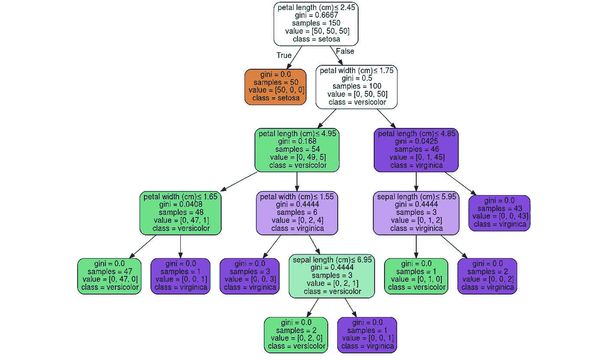

Figure 3: Decision Tree Example

在训练模型之前，应该使用以下逻辑将平滑价格转换为分类变量。

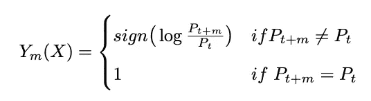

```
def finalise_data(DF, column, n):
    df = copy.deepcopy(DF)
    df[column][column] = np.sign(np.log(df[column][column]/df[column][column].shift(n-1)))

    return df[column]
```

现在，创建模型的一切都准备好了。这是使用 Scikit-learn 训练、测试和验证的。该模型拟合了从 2000 年 1 月 6 日到 2016 年 4 月 25 日的数据，其中 80%用于训练，20%用于测试。2021 年 7 月 26 日之前的剩余数据用于验证。用于评估预测的指标是准确度、精确度、召回率和 f1_score。

```
def RFClassifier(DF, column, n, validation=False, validation_DF=None, feature_importance=False):
    data = finalise_data(DF=DF, column=column, n=n)
    data.dropna(axis=0, inplace=True)

    X = data[['OBV', 'Oscillator', 'MACD', 'Signal']]
    y = data[column]

    X_train, X_test, y_train, y_test = train_test_split(X, y, test_size=0.2)
    model = RandomForestClassifier(n_estimators=100)
    model.fit(X_train,y_train)
    prediction= model.predict(X_test)

    Accuracy = metrics.accuracy_score(y_test, prediction)
    Precision = metrics.average_precision_score(y_test, prediction)
    Recall = metrics.recall_score(y_test, prediction)
    F1_score = metrics.f1_score(y_test, prediction)

    if validation ==  True:
        validation_data = finalise_data(DF=validation_DF, column=column, n=n)
        validation_data.dropna(axis=0, inplace=True)

        X_validation = validation_data[['OBV', 'Oscillator', 'MACD', 'Signal']]
        y_validation = validation_data[column]
        validation_prediction = model.predict(X_validation)

        Accuracy_validation = metrics.accuracy_score(y_validation, validation_prediction)
        Precision_validation = metrics.average_precision_score(y_validation, validation_prediction)
        Recall_validation = metrics.recall_score(y_validation, validation_prediction)
        F1_score_validation = metrics.f1_score(y_validation, validation_prediction)

        return n, column,Accuracy_validation, Precision_validation, Recall_validation, F1_score_validation

    elif feature_importance == True:
        return pd.Series(model.feature_importances_,(X).columns)

    else:
        return n, column, Accuracy, Precision, Recall, F1_score
```

该模型预测每个股票未来 2 到 30 天的走势。

验证集的总体结果如下:

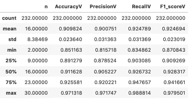

Figure 4: Validation Set Statistics

我们可以看到，所有报价机的平均准确率为 0.90。查看每个 n 的结果，我们可以观察到预测线性提高，直到 n=11，然后在由 n=[11，12，13，14]组成的最佳表现区域波动，然后急剧下降到平均值约为 0.90 的值。

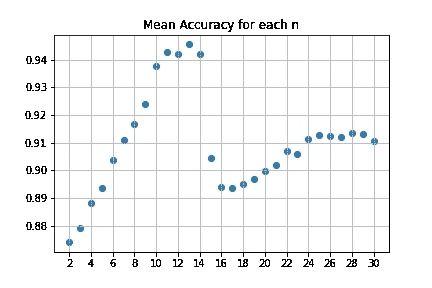

Figure 5: Accuracy

此外，调查变量的重要性表明，他们的解释能力随 n 变化。

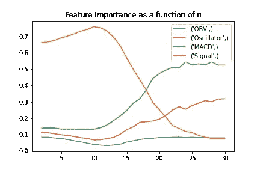

Figure 6: Feature Importances

在 n = 18 之前，随机振荡器是最有帮助的变量，在 n = 18 之后，它不断下降，最终成为最不具解释力的变量。相反，在短期内，MACD 和 OBV 的预测能力大致相当，然而，它逐渐成为最有用的变量。MACD 信号遵循具有较低幅度的类似路径。

# 结论

这篇文章展示了训练、测试和验证一个随机森林模型的步骤，该模型用于预测 8 只股票的走向。所获得的结果是令人满意的，验证集的预测的平均准确度为 90%。此外，该模型在预测未来 13 天的方向时达到了最高的精确度。