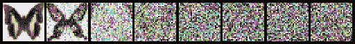

# 扩散模型介绍

> 原文：<https://medium.com/mlearning-ai/introduction-to-diffusion-models-86afe13a4c50?source=collection_archive---------2----------------------->

最近[拥抱脸](https://medium.com/u/b1574f0c6c5e?source=post_page-----86afe13a4c50--------------------------------)推出了一门关于扩散模型的课程。这个博客旨在介绍扩散模型的基础知识，它们是如何工作的？还有**扩散库！🤗**


Photo by [Marc Schulte](https://unsplash.com/ja/@marc_schulte?utm_source=medium&utm_medium=referral) on [Unsplash](https://unsplash.com?utm_source=medium&utm_medium=referral)

## 扩散模型有哪些？

它们是生成模型的类型。它们生成一组不同的输出，这些输出类似于训练数据，但不是完全相同的副本。为了使扩散模型起作用，训练是反复进行的。在添加随机噪声和模型估计的情况下，我们如何从小噪声到完全去噪的图像。

## 扩散模型的培训程序:

1.  加载数据
2.  添加噪声(不同数量)
3.  输入有噪声的版本
4.  优化模型降噪的效果。
5.  根据上述信息更新模型权重。

## 用扩散模型生成新图像:

我们从完全随机的输入更新开始，每次都基于模型预测进行少量更新。

## 梦幻小屋

稳定扩散模型是一个文本条件模型。它让我们创造出自己的变体，拥有额外的特定面孔、物体或风格。

## 拥抱面 API 扩散器

1.  **管道**:高级类
2.  **型号**:架构
3.  **调度器**:在推理过程中从噪声中生成图像，以及为训练生成有噪声的图像。

**DDPM(去噪扩散概率模型)调度器:** ddpm 是噪声调度器，它将噪声图像馈送给模型，在推理期间，我们迭代地使用模型预测来去除噪声。调度程序帮助我们处理这个过程。



adding noise to butterfly images.

## 定义模型

我们可以将该模型定义为 UNET 架构的变体(如下图所示)


该模型具有当前层的几个块，这些块将图像大小减半，之后我们再次上采样以增加图像大小。

定义模型后，我们可以将模型训练为常规 pytorch 训练循环

## 训练循环+给图像添加噪声

```
# Set the noise scheduler
noise_scheduler = DDPMScheduler(
    num_train_timesteps=1000, beta_schedule="squaredcos_cap_v2"
)

# Training loop
optimizer = torch.optim.AdamW(model.parameters(), lr=4e-4)

losses = []

for epoch in range(30):
    for step, batch in enumerate(train_dataloader):
        clean_images = batch["images"].to(device)
        # Sample noise to add to the images
        noise = torch.randn(clean_images.shape).to(clean_images.device)
        bs = clean_images.shape[0]

        # Sample a random timestep for each image
        timesteps = torch.randint(
            0, noise_scheduler.num_train_timesteps, (bs,), device=clean_images.device
        ).long()

        # Add noise to the clean images according to the noise magnitude at each timestep
        noisy_images = noise_scheduler.add_noise(clean_images, noise, timesteps)

        # Get the model prediction
        noise_pred = model(noisy_images, timesteps, return_dict=False)[0]

        # Calculate the loss
        loss = F.mse_loss(noise_pred, noise)
        loss.backward(loss)
        losses.append(loss.item())

        # Update the model parameters with the optimizer
        optimizer.step()
        optimizer.zero_grad()

    if (epoch + 1) % 5 == 0:
        loss_last_epoch = sum(losses[-len(train_dataloader) :]) / len(train_dataloader)
        print(f"Epoch:{epoch+1}, loss: {loss_last_epoch}")
```

经过 50 个时期的训练模型，可以生成与训练数据相似的图像。

示例:


## 笔记本链接

[](https://colab.research.google.com/github/huggingface/diffusion-models-class/blob/main/unit1/01_introduction_to_diffusers.ipynb) [## 谷歌联合实验室

### 编辑描述

colab.research.google.com](https://colab.research.google.com/github/huggingface/diffusion-models-class/blob/main/unit1/01_introduction_to_diffusers.ipynb) 

## 链接到课程 GitHub

[](https://github.com/huggingface/diffusion-models-class/tree/main/unit1) [## 主结合面处的扩散模型-等级/单元 1/扩散模型-等级

### 欢迎来到拥抱脸扩散模型课程的第一单元！在这一单元，你将学习如何扩散的基本知识…

github.com](https://github.com/huggingface/diffusion-models-class/tree/main/unit1) 

## 参考

[](https://arxiv.org/abs/2006.11239) [## 去噪扩散概率模型

### 我们提出了高质量的图像合成结果使用扩散概率模型，一类潜在变量模型…

arxiv.org](https://arxiv.org/abs/2006.11239) [](/mlearning-ai/mlearning-ai-submission-suggestions-b51e2b130bfb) [## Mlearning.ai 提交建议

### 如何成为 Mlearning.ai 上的作家

medium.com](/mlearning-ai/mlearning-ai-submission-suggestions-b51e2b130bfb)