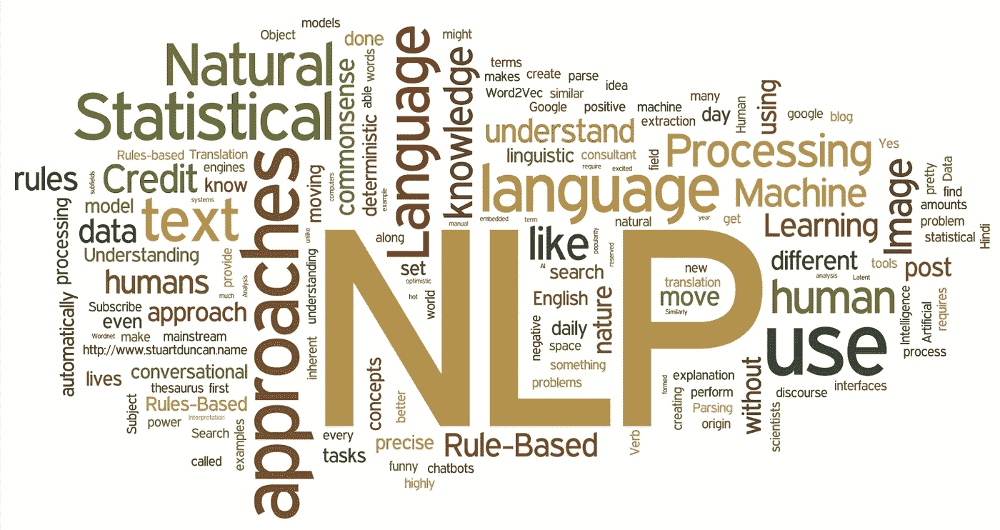

# 自然语言处理导论

> 原文：<https://medium.com/mlearning-ai/introduction-to-natural-language-processing-3c7b18312980?source=collection_archive---------3----------------------->

在这篇文章中，我将尝试分享自然语言处理的基础知识，它的用途，以及文本挖掘和自然语言处理。我打算在另一篇文章中提到自然语言处理中的文本预处理。令人愉快的读物。

Resource: [https://aliz.ai/natural-language-processing-a-short-introduction-to-get-you-started/](https://aliz.ai/natural-language-processing-a-short-introduction-to-get-you-started/)

## 什么是自然语言处理？

在我自己定义自然语言处理之前，让我们看看它在几个来源中是如何定义的。

> 自然语言处理，简称 NLP，广义上定义为软件对自然语言的自动操作，如语音和文本。

在另一个定义中，它被定义如下；

> 自然语言处理是人工智能(AI)的一种形式，它赋予计算机阅读、理解和解释人类语言的能力。它帮助计算机测量情绪，并确定人类语言的哪些部分是重要的。

自然语言处理是计算机可以像人类一样阅读、理解和解释人类语言的方式。通过对自然语言处理的文本进行操作，它可以用于许多不同的领域。在我谈论自然语言处理的使用领域之前，让我补充一下。人类的语言非常复杂和困难。在自然语言处理领域，有许多不同的算法和方法来检查这种复杂而困难的语言，对其进行统计研究和分析。让我们来看看自然语言处理在日常生活中的应用。

Resource: [https://miro.medium.com/max/1600/1*HpKh-MGZIq-GyRAiqEUnSw.png](https://miro.medium.com/max/1600/1*HpKh-MGZIq-GyRAiqEUnSw.png)

自然语言处理的使用领域

*   情感分析
*   聊天机器人和虚拟助手
*   文本分类
*   语言翻译
*   文本摘要
*   自动更正
*   语音识别
*   文本挖掘

事实上，在当今的技术中，我们经常会遇到自然语言处理。也许我们中的许多人都使用涉及密集自然语言处理的应用程序或设备。举个简短的例子，例如，可能已经对你在购物网站上的正面或负面评论进行了情感分析研究。再比如你之前用过翻译 app。这里也使用了自然语言处理。语音识别是最后一个例子。语音识别技术使用自然语言处理将口语转换成机器可读的形式。除了这些，我还想在这篇博文中谈谈文本挖掘在自然语言处理中的应用。今天，文本挖掘是自然语言处理的常见用途之一。

## 文本挖掘和自然语言处理

我们可以列出在文本挖掘中可以使用的自然语言处理阶段，如下所示:

*   大写和小写转换
*   删除标点符号
*   删除号码
*   删除停用词
*   删除低频词

在讨论它们的应用之前，让我来谈谈我们为什么要应用它们。Python 是区分大小写的，所以我们将应用一个转换。假设我们有 3 条记录:“JEAN”、“jean”和“Jean”。其实三个都是一样的。但是 ***Python*** 假设这三者是不同的。如果我们将数据标准化，我们必须要么全是大的，要么全是小的，我们将完成更一致的研究。

然后，因为我们自然语言处理的主要目标是揭示有意义和有逻辑的东西，所以我们需要删除文本中没有意义的东西。这就是为什么我们要删除文本中的标点符号、数字和停用词。让我们在几个使用 NLTK 库的 Python 应用程序上展示这些。

## 大写和小写转换

首先，让我们加载文本，以便我们可以在 Python 中转换大写字母。

你在这里看到的文字，每一行都代表一个故事，但现在行与行之间并没有分开。我们先把每个故事分开。

那么让我们把它定义为一个对象。

接下来，让我们导入熊猫库。然后我们将把这个对象转换成 DataFrame。但是首先，我们需要做一些调整。

从上面可以看出，这个列表的第一个元素由一个空单元格组成。让我们解决这个问题。

现在我们可以转换成数据帧。

现在让我们来看看如何转换大写字母。这里，我更喜欢在处理它之前将源数据帧复制到另一个数据帧。我这样做是因为我不想丢失我最初创建的 DataFrame 结构。

我们将在这里使用一些函数。第一个是“应用”函数，我们将使用该函数，以便将该函数应用于所有数据帧元素。有关应用功能的更多信息，您可以查看此[链接](https://pandas.pydata.org/pandas-docs/stable/reference/api/pandas.DataFrame.apply.html)。

然后，我们将在 for 循环中使用“Split”函数。另一方面，split 函数将文本中的单词分开，它将其视为默认单词。如果愿意，您还可以指定不同的分隔符进行“拆分”。

我们将使用的另一个函数是“Lower”函数。使用“Lower”函数，我们将把所有单词转换成小写。我在这里选择将其转换为小写字母，但是如果您愿意，也可以将其转换为大写字母。如果将其转换为大写，可能会遇到一些问题，具体取决于您使用的母语。

于是乎，这里我们开始自己用 lambda 写一个函数。在函数中，文本中的每个单词代表 x。文本由“Split”函数根据句子之间的空格进行分隔。然后这个单词的所有字母都转换成小写字母。数据帧中每个元素中出现的单词也用“Join”函数重新组合，其间留有空格。

## 删除标点符号

我们来看看删除标点符号。删除标点符号时，我们将使用正则表达式。我将用它作为一个模板，我不会在这里进入细节。好奇想详细考察的可以看看这个[链接](https://docs.python.org/3/howto/regex.html)。

正如这里可以看到的，我们简单地清除了标点符号。

## 删除号码

删除数字时，我们将再次使用正则表达式模式。因此，让我们编写一个函数，演示如何快速删除，而不涉及太多的细节。

## 删除停用词

先说什么是停用词。停用词是每种语言中本身没有意义的词。我们可以自己在列表中定义它们。这里，我将使用 NLTK 库导入英语的停用词。但是在进行所有这些操作之前，让我们将文本转换回 DataFrame。

然后，让我们下载 NLTK 库和停用词。

然后让我们把停用词定义为一个对象。

然后，让我们编写删除停用词的函数。

我们在这里做的是，如果我们遇到的单词“sw”不包含在包含停用词的对象中，则将其合并并继续。但如果是，我们说跳过这个词。

## 删除低频词

首先，让我们将对象转换回 DataFrame。

为了能够删除低频单词，我们需要数据帧中单词的频率。我们按如下方式做这件事。

在这里，我们看到出现频率最高的单词排在最上面。假设在这项研究中，我们想从底部删除 3 个低频词。让我们用一个列表来定义这个。

然后，我们用函数删除这里的 3 个字。

结果，您应该看到输出如下所示。

如果您将最后的输出与文本的原始版本进行比较，您会注意到我们完成了一个相当干净的过程。

最后，让我总结一下我在这篇文章中谈到的内容。首先，我们有一个不必要的字符和数字损坏的文本。首先，我们将所有文本转换成小写字母，以消除大小写混淆。后来，我们清除了标点符号。此外，这些数字没有任何意义。所以我们也清洗了它们。后来，我们从课文中清除了没有意义的词。然后，我们从文本中删除了出现频率最低的 3 个单词。最后，我们得到了一个没有噪音的文本。

## 资源

1.  [https://monkey learn . com/blog/自然语言处理应用/](https://monkeylearn.com/blog/natural-language-processing-applications/)
2.  [https://www . text metrics . com/what-is-natural-language-processing-NLP](https://www.textmetrics.com/what-is-natural-language-processing-nlp)
3.  [https://machine learning mastery . com/natural-language-processing/](https://machinelearningmastery.com/natural-language-processing/)