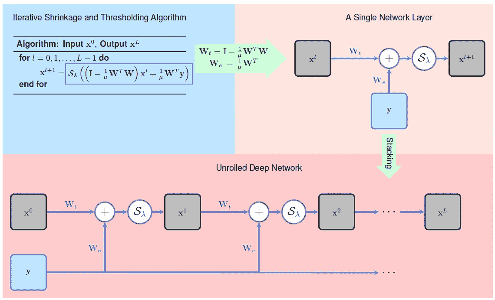
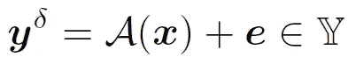
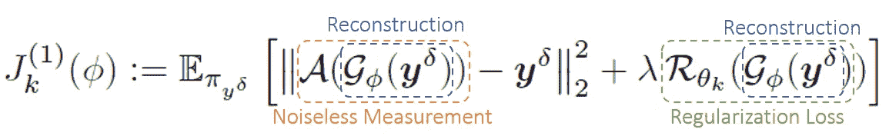

# 具有展开的对立正则化的反问题

> 原文：<https://medium.com/mlearning-ai/inverse-problems-with-unrolled-adversarial-regularization-85d8abc13f76?source=collection_archive---------3----------------------->

## 算法展开的端到端重建符合计算机视觉的数据驱动正则化

Photo by [Tyler Casey](https://unsplash.com/@tylercaseyprod?utm_source=unsplash&utm_medium=referral&utm_content=creditCopyText) on [Unsplash](https://unsplash.com/s/photos/blur?utm_source=unsplash&utm_medium=referral&utm_content=creditCopyText)

逆问题普遍存在于成像应用中，其中人们试图从其不完整和有噪声的测量中恢复未知的模型参数。例如，这可以应用于照片去噪，以提取更高质量的信息。本帖中讨论的方法，展开对抗正则化(UAR)，旨在解决这个问题。在深入 UAR 之前，我们还介绍了算法展开，这是 UAR 的一个基本构件。

# 算法展开

算法展开的动机是找到传统**迭代算法**和数据驱动深度**神经网络**之间的联系。基本思想是将算法中的每次迭代**建模为网络中的一层**，由此迭代算法可以建模为连接在一起的多个层。因此，穿过网络相当于执行迭代算法有限次。因此，算法参数将自然地由网络参数表示，并且被训练的网络可以被解释为参数优化的算法，有效地克服了大多数常规神经网络中缺乏可解释性的问题。****

****

**Figure 1: A high-level overview of algorithm unrolling: given an iterative algorithm (left), a corresponding deep network (right) can be generated by cascading its iterations h. The iteration step h (left) is executed a number of times, resulting in the network layers h1, h2, … (right). Each iteration h depends on a set of algorithm parameters, which are transferred into the corresponding set of network parameters. Instead of determining these parameters through cross-validation or analytical derivations, we learn them from training datasets through end-to-end training. In this way, the resulting network could achieve better performance than the original iterative algorithm. In addition, the network layers naturally inherit interpretability from the iteration procedure. The learnable parameters are colored in blue. (Cited from the original paper)**

## **学习迭代收缩和阈值算法**

**图 2 显示了算法展开思想的**示例**应用。传统的稀疏编码算法，迭代收缩和阈值算法(ISTA)，被展开并由深度神经网络表示。注意，展开算法通过不在迭代(即层)之间共享权重来修改原始方法，因此它被称为学习的 ISTA，或 LISTA。**

****

**Figure 2: Illustration of LISTA: one iteration of ISTA executes a linear and then a non-linear operation and thus can be recast into a network layer; by stacking the layers together a deep network is formed. The network is subsequently trained using paired inputs and outputs by back-propagation to optimize the parameters. µ is a constant parameter that controls the step size of each iteration. The trained network, dubbed LISTA, is computationally more efficient compared with the original ISTA. The trainable parameters in the network are colored in blue. (Cited from the original paper)**

# **展开的对抗性正则化**

**UAR 考虑的逆问题可以用等式 1 来概括，其中正向算子`A`在没有噪声的情况下模拟测量过程，而`e`表示测量噪声。我们的目标是找到一个能够将测量值`y`转换成潜在信息`x`的估计器。这里面临的独特挑战是，在研究数据集中，`y`和`x`通常不会成对出现**。****

****

**Equation 1: Formulation of the inverse problem.**

**在这种情况下，由于训练样本与标签的不匹配，许多判别方法都无法应用。因此，笔者在生成模型文献中借鉴了直觉生成对抗网络(GAN)。更具体地说，UAR 由一个从测量值`y`中重建潜在信息`x`的**重建**网络(生成器)和一个区分重建图像和地面事实的**正则化**网络(鉴别器)组成。**

****

**Equation 2: Objective function for the reconstruction network. It consists of a reconstruction term, where the reconstructed image is compared with the input, and a regularization term, estimated by the regularization network on the reconstruction.**

**重建网络的训练目标如等式 2 所示。期望算子中的第一项对应于重建损失，计算为重建图像和输入图像之间的距离。第二项是给定重建图像的正则化损失。为了产生更好的重建，这两项都需要最小化。注意，这个目标根本没有利用地面真实，所以它可以仅用输入图像来训练。**

****

**Equation 3: Objective function for the regularization network. The two terms have different signs because we would like the regularizer to be able to distinguish ground truth from reconstruction.**

**正则化网络负责区分重建和地面实况，因此如等式 3 所示，它最大化重建图像的损失值，同时最小化地面实况的损失值。**

**尽管该框架在用于重建和正则化网络的架构中是通用的，但在[3]中使用了展开的生成器和正常的深度网络，因此在名称 UAR 中是“展开的”。此外，作者在[3]中为 UAR 提供了严谨的理论结果，我们认为非常值得一读。**

# **结论**

**我们回顾了图像处理中逆问题的展开对抗正则化。它从 GANs 中汲取直觉，优雅地解决了不成对训练样本的问题(在某种程度上缺失数据)，并超越了该领域中最先进的方法。**

** [## GitHub-Subhadip-1/unrolling _ meets _ data _ driven _ regulation:包含 python 脚本，用于…

### 包含 python 脚本，用于学习迭代展开重建以及数据驱动的…

github.com](https://github.com/Subhadip-1/unrolling_meets_data_driven_regularization)** 

**[1]蒙加、维沙尔、李跃龙和约尼娜·c·埃尔达。"算法展开:用于信号和图像处理的可解释的、有效的深度学习." *IEEE 信号处理杂志*38.2(2021):18–44。**

**[2]格雷戈尔，凯罗尔和扬·勒昆。"学习稀疏编码的快速近似."*第 27 届国际机器学习会议论文集*。2010.**

**[3] Mukherjee，Subhadip，等人，“端到端重建满足逆问题的数据驱动正则化。”*神经信息处理系统进展* 34 (2021)。**

** [## Mlearning.ai 提交建议

### 如何成为 Mlearning.ai 上的作家

medium.com](/mlearning-ai/mlearning-ai-submission-suggestions-b51e2b130bfb) 

🔵 [**成为作家**](/mlearning-ai/mlearning-ai-submission-suggestions-b51e2b130bfb)**