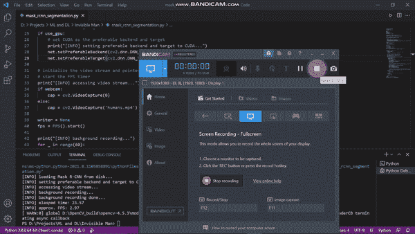
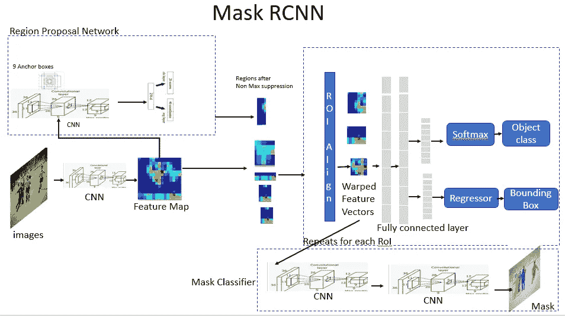

# 隐形人使用面具-RCNN-带源代码-趣味项目

> 原文：<https://medium.com/mlearning-ai/invisible-man-using-mask-rcnn-with-source-code-fun-project-956815e61a44?source=collection_archive---------5----------------------->

所以在今天的博客中，我们将看到我们如何使用掩模 R-CNN 来执行人体分割。这是一个非常先进的项目，许多事情正在发生引擎盖下。所以没有任何进一步的原因。

**点击此处阅读带源代码的整篇文章—**[https://machine learning projects . net/invisible-man-using-mask-rcnn/](https://machinelearningprojects.net/invisible-man-using-mask-rcnn/)



# 让我们开始吧…

## 代码为人类分割使用掩模-RCNN…

```
from imutils.video import FPS
import numpy as np
import matplotlib.pyplot as plt
import cv2
import os

webcam = 1
expected_confidence = 0.3
threshold = 0.1
show_output = 1
save_output = 1
kernel = np.ones((5,5),np.uint8)
writer = None
fps = FPS().start()

weightsPath = "mask-rcnn-coco/frozen_inference_graph.pb"
configPath = "mask-rcnn-coco/mask_rcnn_inception_v2_coco_2018_01_28.pbtxt"

print("[INFO] loading Mask R-CNN from disk...")
net = cv2.dnn.readNetFromTensorflow(weightsPath, configPath)

if use_gpu:
    # set CUDA as the preferable backend and target
    print("[INFO] setting preferable backend and target to CUDA...")
    net.setPreferableBackend(cv2.dnn.DNN_BACKEND_CUDA)
    net.setPreferableTarget(cv2.dnn.DNN_TARGET_CUDA)

print("[INFO] accessing video stream...")
cap = cv2.VideoCapture(0)

print("[INFO] background recording...")
for _ in range(60):
    _,bg = cap.read()
print("[INFO] background recording done...")

fourcc = cv2.VideoWriter_fourcc(*"MJPG")
writer = cv2.VideoWriter('output.avi', fourcc, 20,(bg.shape[1], bg.shape[0]), True)

while True:
    grabbed, frame = cap.read()
    cv2.imshow('org',frame)
    if not grabbed:
        break

    blob = cv2.dnn.blobFromImage(frame, swapRB=True, crop=False)
    net.setInput(blob)
    (boxes, masks) = net.forward(["detection_out_final","detection_masks"])
    for i in range(0, boxes.shape[2]):
        classID = int(boxes[0, 0, i, 1])
        if classID!=0:continue
        confidence = boxes[0, 0, i, 2]

        if confidence > expected_confidence:
            (H, W) = frame.shape[:2]
            box = boxes[0, 0, i, 3:7] * np.array([W, H, W, H])
            (startX, startY, endX, endY) = box.astype("int")
            boxW = endX - startX
            boxH = endY - startY
            mask = masks[i, classID]
            mask = cv2.resize(mask, (boxW, boxH),interpolation=cv2.INTER_CUBIC)
            mask = (mask > threshold)
            bwmask = np.array(mask,dtype=np.uint8) * 255
            bwmask = np.reshape(bwmask,mask.shape)
            bwmask = cv2.dilate(bwmask,kernel,iterations=1)

            frame[startY:endY, startX:endX][np.where(bwmask==255)] = bg[startY:endY, startX:endX][np.where(bwmask==255)]

    if show_output:
        cv2.imshow("Frame", frame)

        if cv2.waitKey(1) ==27:
            break

    if save_output:
        writer.write(frame)

    fps.update()

fps.stop()
print("[INFO] elasped time: {:.2f}".format(fps.elapsed()))
print("[INFO] approx. FPS: {:.2f}".format(fps.fps()))
```

*   第 1–5 行—导入 Mask-RCNN 所需的库。
*   第 7–14 行—声明一些常量。
*   第 16–20 行—加载屏蔽 RCNN 网络。



*   第 22–26 行—如果您想使用 GPU，请将后端和目标设置为 CUDA。
*   第 28–29 行—从实时流中读取帧。
*   第 31–34 行—记录背景。
*   第 36–37 行—使用 [cv2。VideoWriter()](https://docs.opencv.org/3.4/dd/d9e/classcv_1_1VideoWriter.html#ad59c61d8881ba2b2da22cff5487465b5) 以视频格式保存输出。
*   第 39–43 行—启动 while 循环，并开始从网络摄像头抓取帧。如果网络摄像头没有反馈任何信息，请中断。
*   第 45–47 行——使用 [cv2.dnn.blobFromImage()](https://docs.opencv.org/4.5.2/d6/d0f/group__dnn.html#ga29f34df9376379a603acd8df581ac8d7) 从图像中创建一个斑点，然后该斑点被设置为网络的输入，它流经网络，我们得到作为边界框和遮罩的输出。
*   第 48–66 行—遍历所有输出，并对掩膜进行一些预处理以进一步增强它。现在，在这个蒙版中，无论哪里的像素是白色的，都用背景像素替换原始图像中的像素(第 66 行)。
*   第 68–72 行—显示当有人按 ESC 键时的输出和中断。
*   第 74–75 行—以视频形式保存输出。
*   第 77 行—更新 fps。
*   第 79–81 行—打印 fps。

## 最终结果…


*PS —我知道结果并不完美，但这些结果也是不可思议的。*

***注意——如果您的系统中没有 GPU，请不要尝试运行它，因为它将永远运行，因为使用了 Mask-RCNN。即使在 GPU 上，它也很难达到 5-8 fps。***

如果对使用 Mask-RCNN 进行人体分割有任何疑问，请通过电子邮件或 LinkedIn 联系我。你也可以在下面评论任何问题。

***探索更多机器学习、深度学习、计算机视觉、NLP、Flask 项目访问我的博客—*** [***机器学习项目***](https://machinelearningprojects.net/)

**如需进一步的代码解释和源代码，请访问此处** —

[](https://machinelearningprojects.net/invisible-man-using-mask-rcnn/) [## 隐形人使用面具-RCNN -附源代码-趣味工程- 2021 -机器学习项目

### 因此，在今天的博客中，我们将看到我们如何使用掩模 R-CNN 来执行人体分割。这是一个非常…

machinelearningprojects.net](https://machinelearningprojects.net/invisible-man-using-mask-rcnn/) 

*所以这就是这篇博客的全部内容，感谢你的阅读，我希望你在阅读完这篇文章后，能有所收获，直到下一次👋…*

***看我以前的帖子:***[***NEUR***](https://machinelearningprojects.net/sudoku-solver/)[***AL 风格转移***](https://machinelearningprojects.net/neural-style-transfer/)

[](/mlearning-ai/mlearning-ai-submission-suggestions-b51e2b130bfb) [## Mlearning.ai 提交建议

### 如何成为 Mlearning.ai 上的作家

medium.com](/mlearning-ai/mlearning-ai-submission-suggestions-b51e2b130bfb)