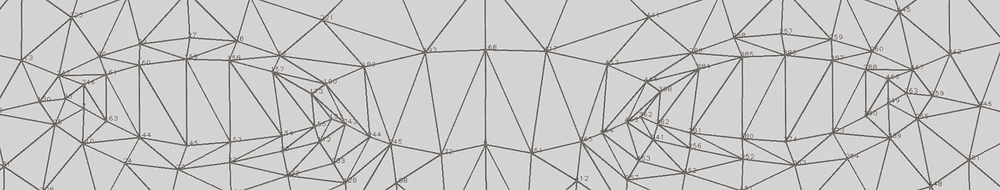
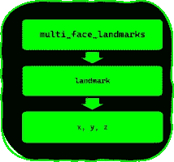
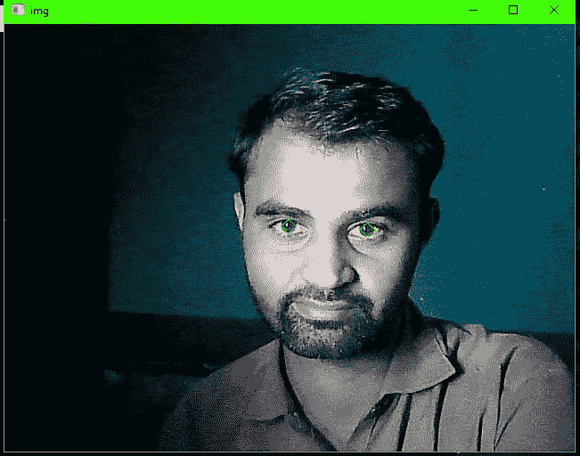
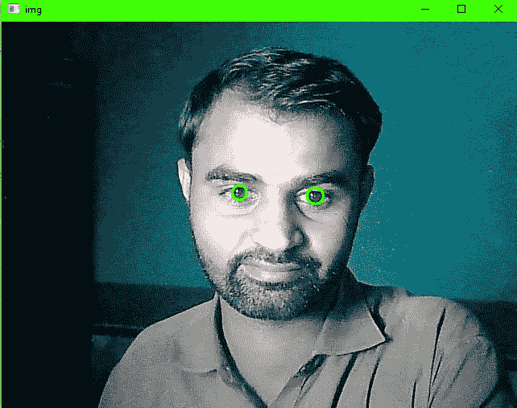
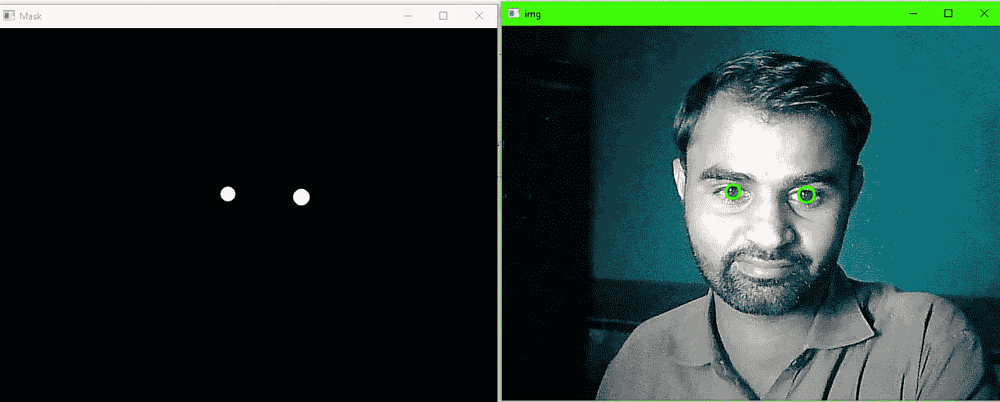

# 虹膜分割媒体管道 Python

> 原文：<https://medium.com/mlearning-ai/iris-segmentation-mediapipe-python-a4deb711aae3?source=collection_archive---------1----------------------->

Demo Video

> 让我们看看虹膜分割，嗯，这不是一个分割，老实说，你只能从 Mediapipe 获得虹膜的四个标志，但我们也可以将这些标志转化为分割。

## 代码库:

你会在 [Github 库](https://github.com/Asadullah-Dal17/iris-Segmentation-mediapipe-python)上找到所有的源代码，这里我会解释一些代码片段。

## 要求:

你需要 python，安装在你的机器上，另一个要求是 OpenCV 和 NumPy，但是它们和 Mediapipe 打包在一起，当你通过 PIP(python 包管理器)安装时，这是一个要求，所以不需要手动安装。

## 装置

如果您已经安装了 Mediapipe 及其低于(0.8.9.1)的版本，请升级到最新版本

```
pip install --upgrade mediapipe 
```

## 面部标志

Mediapipe 提供了 478 个面部标志，你可以找到更多关于**面部网格**的细节，这里我们只关注虹膜标志，因为我们要在 NumPy 数组中存储所有标志，所以你可以访问它们，绕过索引列表。以下是使用[面部网格点的地图](https://github.com/google/mediapipe/blob/master/mediapipe/modules/face_geometry/data/canonical_face_model_uv_visualization.png)提取的虹膜标志列表

```
LEFT_IRIS = [474,475, 476, 477]
RIGHT_IRIS = [469, 470, 471, 472]
```

**对于眼睛(指数)**

```
# Left eye indices list
LEFT_EYE =[ 362, 382, 381, 380, 374, 373, 390, 249, 263, 466, 388, 387, 386, 385,384, 398 ]# Right eye indices list
RIGHT_EYE=[ 33, 7, 163, 144, 145, 153, 154, 155, 133, 173, 157, 158, 159, 160, 161 , 246 ]
```



Eyes Landmarks

# 编码部分

模块导入

```
import mediapipe as mp
import cv2 as cv 
import numpy as npmp_face_mesh = mp.solution.face_mesh
```

## 模式配置

***最大面数*** :检测到的面数

*****min _ detection _ confidence***:(0.0，1)人脸检测模型的最小检测置信度。**

*****min _ tracking _ confidence***:(0.0，1)地标追踪的最小置信度，用于地标追踪器模型。**

**加载人脸网格模型。**

```
with mp_face_mesh.FaceMesh(
    max_num_faces=1,
    refine_landmarks=True,
    min_detection_confidence=0.6,
    min_tracking_confidence=0.6
) as face_mesh:
```

**因为我们要实时运行，所以我将图像称为帧，这将是有意义的，在这里，首先需要使用 OpenCV 中的函数将相机帧翻转为镜像图像，因为 Mediapipe 需要 RGB 颜色格式，但 OpenCV 使用 BGR 尼特来改变颜色，在这里， *cvtColor* 函数。**

```
frame = cv.flip(frame, 1)
rgb_frame = cv.cvtColor(frame, cv.COLOR_BGR2RGB)
```

**当 RGB 帧由*人脸网格模型*处理时，它将返回 478 个标志，每个检测到的人脸，每个标志都有 x、y 和 z 值，每个都有一个值在 **0 到 1** 之间，换句话说就是归一化值，然后我们需要乘以相应的缩放比例来获得帧中的像素坐标，**

**对于***【X】***，缩放比例是宽度，*【Y】*是图像的高度，对于*与 X，宽度相同***

```
*results = face_mesh.process(rgb_frame)#getting width and height or frame
img_h, img_w = frame.shape[:2]*
```

*****遍历地标*****

***当我们处理 RGB 帧时，我们将获得每个检测到的人脸及其界标，因此我们从结果变量中访问界标，我们必须存储它们，就像***results . multi _ face _ landmarks***这里我们有所有的人脸界标，您可以循环通过它们，因为我已经检测到一个人脸，所以我将在这里提供索引***results . multi _ face _ landmarks[0]，*** ，其格式如下***

```
*landmark {
  x: 0.6233813166618347
  y: 0.7154796719551086
  z: -0.0638529509305954
}*
```

***现在你将得到要面对的地标，只需调用*results . multi _ face _ landmarks[0]****。地标*** 它要对***【x，y，z】***的值进行归一化如果打印出 ***类型*** 你会得到***

```
*<class 'google.protobuf.pyext._message.RepeatedCompositeContainer'>*
```

***当你循环通过***results . multi _ face _ landmarks[0]时。地标*** 每个地标你都会得到 x，y，z。***

```
*[print(p.x, p.y, p.z )for p in results.multi_face_landmarks[0].landmark]*
```

***但是你仍然有规格化的值，所以你需要用适当的缩放比例乘以每个值，你将得到像素坐标，***【x * img _ w，y*img_h，z * img _ w】***，但是这里，我们只需要 x 和 y，我将使用 NumPy 的乘法函数来实现，不要忘记，将它们转换成整数，因为 OpenCV 接受像素坐标作为 int。这是一个简单的一行程序，它为我们完成了工作，end end 我已经将所有的界标存储在了 NumPy 数组中( ***mesh_points*** )，所以绕过索引列表可以更容易地访问***

```
*mesh_points=np.array([np.multiply([p.x, p.y], [img_w, img_h]).astype(int) for p in results.multi_face_landmarks[0].landmark])*
```

******

***graph***

***现在我们可以使用 OpenCV 函数绘制**虹膜**地标，折线，我们已经有了虹膜的索引列表，使用它们来获得虹膜坐标，***

```
*cv.polylines(frame, [mesh_points[LEFT_IRIS]], True, (0,255,0), 1, cv.LINE_AA)cv.polylines(frame, [mesh_points[RIGHT_IRIS]], True, (0,255,0), 1, cv.LINE_AA)*
```

***它看起来就像这样。***

******

***Irises Landmarks***

***但是我们可以把这些正方形变成圆形，因为它们的函数 OpenCV 提供了基于给定点的封闭圆。命名为***mineclosingcircle***其中返回的，圆心(x，y)和半径的圆，⚠返回值都是浮点型的，我们必须把它们转换成 int。***

```
*(l_cx, l_cy), l_radius = cv.minEnclosingCircle(mesh_points[LEFT_IRIS])(r_cx, r_cy), r_radius = cv.minEnclosingCircle(mesh_points[RIGHT_IRIS])# turn center points into np array 
center_left = np.array([l_cx, l_cy], dtype=np.int32)
center_right = np.array([r_cx, r_cy], dtype=np.int32)*
```

***最后根据***mineclosingcircle***函数的返回值绘制圆，通过 ***circle*** 函数根据圆心(x，y)和半径绘制圆图像***

```
*cv.circle(frame, center_left, int(l_radius), (255,0,255), 2, cv.LINE_AA)
cv.circle(frame, center_right, int(r_radius), (255,0,255), 2, cv.LINE_AA)*
```

******

***Circles draw on Iris***

***最后得到分割蒙版，这很简单，你只需使用 NumPy 的 zeroes 函数创建一个空蒙版(图像),具有与框架相同的尺寸，你可以在蒙版上画一个白色的圆圈，你就有了分割蒙版。***

***使用图像尺寸宽度和框架高度创建遮罩。***

```
*mask = np.zeros((img_h, img_w), dtype=np.uint8)*
```

***在面具上画白色圆圈***

```
*cv.circle(mask, center_left, int(l_radius), (255,255,255), -1, cv.LINE_AA)cv.circle(mask, center_right, int(r_radius), (255,255,255), -1, cv.LINE_AA)* 
```

******

***results with segmented mask***

***因为你有一个虹膜遮罩，你可以用任何颜色的虹膜图像替换它们，以创建不同的 Instagram 过滤器，或眼控光标(指针)🖱.***

***我在 youtube 上有一个完整的视频教程，如果你愿意，你也可以去看看，参考链接***

***由于我是一个写作新手，很明显你会发现错误，如果你发现了，请让我知道，我将很乐意修复它们，非常感谢。***

***下面是视频教程:***

# ***参考***

***[](https://github.com/Asadullah-Dal17/iris-Segmentation-mediapipe-python) [## GitHub-Asadullah-dal 17/iris-Segmentation-media pipe-python

### 此时您不能执行该操作。您已使用另一个标签页或窗口登录。您已在另一个选项卡中注销，或者…

github.com](https://github.com/Asadullah-Dal17/iris-Segmentation-mediapipe-python) [](https://google.github.io/mediapipe/solutions/face_mesh.html) [## 面网格

### MediaPipe 面部网格是一个面部几何解决方案，可以实时估计 468 个 3D 面部标志，即使在移动…

google.github.io](https://google.github.io/mediapipe/solutions/face_mesh.html) [](/mlearning-ai/mlearning-ai-submission-suggestions-b51e2b130bfb) [## Mlearning.ai 提交建议

### 如何成为 Mlearning.ai 上的作家

medium.com](/mlearning-ai/mlearning-ai-submission-suggestions-b51e2b130bfb)***