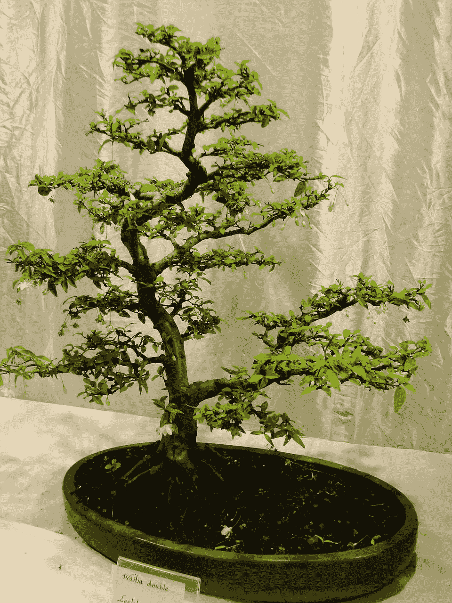

# 一个白手起家的决策树比 sklearn 的现成版本好吗？

> 原文：<https://medium.com/mlearning-ai/is-a-made-from-scratch-decision-tree-better-than-sklearns-off-the-shelf-version-4ebf3499835c?source=collection_archive---------3----------------------->

在最近的一个视频中，我比较了一个从零开始制作的逻辑回归模型和 sklearn 的逻辑回归模型，这篇博文可以在这里查看:-[https://medium . com/mlearning-ai/a-comparison-of-made-from-scratch-and-off-the-shelf-logistic-regression-models-a 75 e 21 E4 b 521](/mlearning-ai/a-comparison-of-made-from-scratch-and-off-the-shelf-logistic-regression-models-a75e21e4b521)