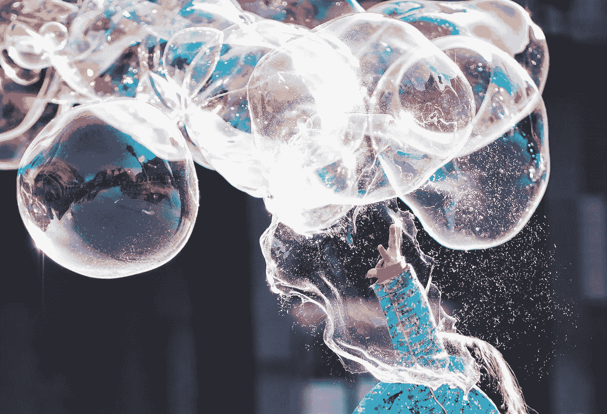

# AI 艺术真的是艺术吗？

> 原文：<https://medium.com/mlearning-ai/is-ai-art-really-art-a363073d62d0?source=collection_archive---------2----------------------->

## 通过玩耍创造

🟣要成为会员，使用此链接: [**获得全媒体权限**](https://evartology.medium.com/membership)

Photo by [Alexander Dummer](https://unsplash.com/@4dgraphic?utm_source=unsplash&utm_medium=referral&utm_content=creditCopyText) on [Unsplash](https://unsplash.com/s/photos/creativity-play?utm_source=unsplash&utm_medium=referral&utm_content=creditCopyText)

数字技术的兴起赋予了艺术是什么以及如何体验艺术全新的含义。曾经被认为是富人的奢侈品，今天已经成为大众可以获得的东西，他们正在参与塑造它。