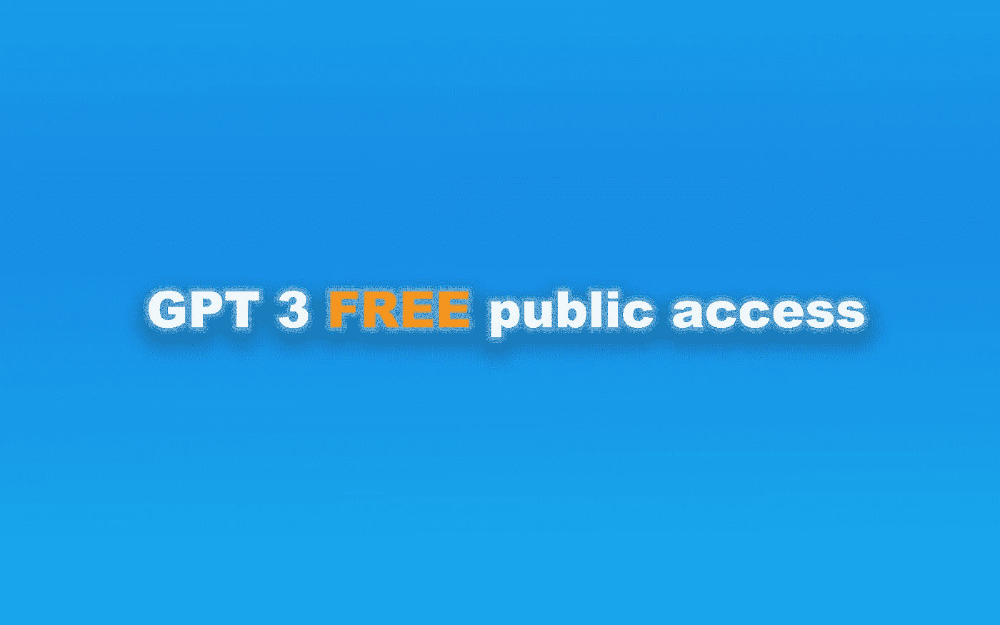

# 是🔵免费的 GPT 3？

> 原文：<https://medium.com/mlearning-ai/is-gpt-3-for-free-7ec8c2d904b6?source=collection_archive---------0----------------------->

## 艾艺术

## 你需要了解的人工智能工具

🟠 [**获得全媒体访问权**](https://datasculptor.medium.com/membership)

GPT-3 access without the wait **LINK in the article**

我人生的第一目标是看到更多的 [AI 艺人](/mlearning-ai/can-ai-replace-artists-378d466f69b8)。艺术、社会和人工智能紧密交织在一起，[人工智能艺术家](/mlearning-ai/can-ai-replace-artists-378d466f69b8)对艺术和教育有很多话要说。而所有[媒介](/mlearning-ai/the-codex-is-the-message-ae14f22bd2af)的艺术家都能从机器学习艺术中受益并学到很多。