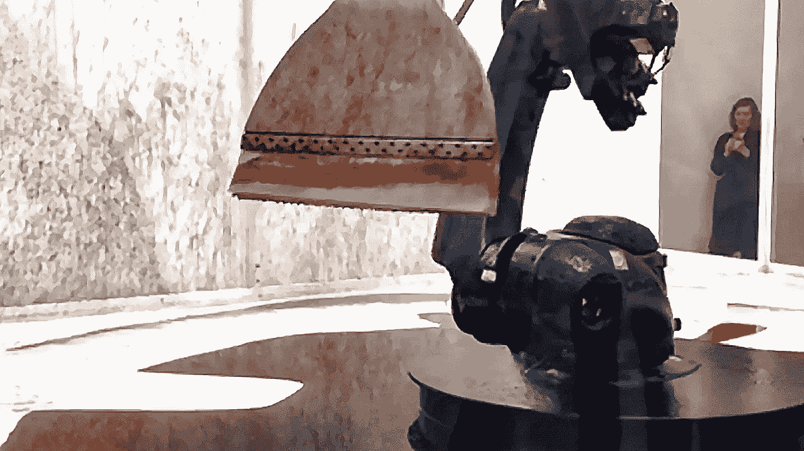

# 🔵2022 年 1 月

> 原文：<https://medium.com/mlearning-ai/january-2022-f1836671f923?source=collection_archive---------6----------------------->

## ML 这么好

## 不要害怕学习！

[Everyone Can Create](/data-driven-fiction/everyone-can-create-8270ecf1f379)

“这个任务对我来说太重要了，我不允许你破坏它”

我不是 AI，但我会尽力。
对了，你要看一下 [**这篇文章**](/mlearning-ai/why-data-requires-your-care-3f633f64e966) 关于为什么 AI 对于艺术设计来说是不完美的。[为什么数据需要您的关注](/mlearning-ai/why-data-requires-your-care-3f633f64e966)