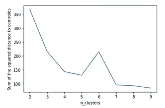
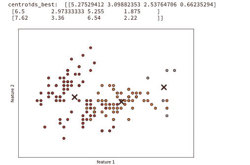
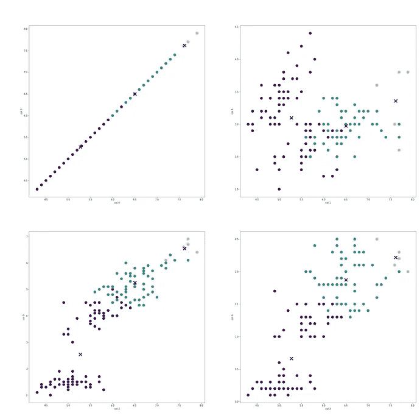
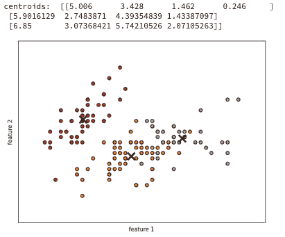
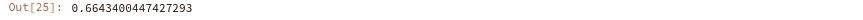

# K-means！

> 原文：<https://medium.com/mlearning-ai/k-means-a03f78eff470?source=collection_archive---------5----------------------->

K-means 是最强大的无监督方法之一。它速度快，可以处理大的 X 矩阵，并且是可靠的。它用于许多应用，如 SMOTE(综合填充数据)、图像压缩、查找特征分类的标签等等。当我第一次了解 K-means 时，我很兴奋，同时也很好奇它为什么这么有用。我甚至尝试编写自己的无监督方法，看看我是否能比 K-means 做得更好，但 K-means 通常表现更好，因为它始终能够在特征空间中找到逻辑聚类。

下面是手工编码的 K-means 算法，真正理解它的工作原理。

# 加载数据

# 子功能

# 确定聚类数(K=？)

肘方法(到质心的平方距离之和与聚类数(K))的比值

我们可以看到曲线在 3 或 4 左右开始变得有点平坦，因此 3 或 4 个聚类可能是该数据集的最佳选择。让我们试试 3 个集群！

# 使用最佳聚类来绘制特征空间

在 kmeans byhand 版本中，我们使用 4 个主要步骤:1 .通过从 X，2 中随机选择值来初始化聚类质心。计算每行 X 到每个质心的距离的平方和:计算标签 y 和成本，3。重新计算质心，4。运行步骤 1 到 3，直到质心不变，5。对选定的迭代次数运行步骤 1 到 4，只保存成本最低的质心和 y 值。步骤 5 是上面的函数 kmeans_full，它的目的是帮助找到尽可能好的聚类质心。

# 所有 2D 特征空间的更详细的绘图

这仅显示了与其他三列一起绘制的第一列。如果运行该函数，它将绘制每个列相对于其他列的特征。

我们可以看到我们的手工 kmeans 和 sci-kit learn 是相似的。rand 值接近 1 表示每个特征样本的聚类分配是相似的。

练习愉快！👋

# 参考

[https://developers . Google . com/machine-learning/clustering/algorithm/优缺点](https://developers.google.com/machine-learning/clustering/algorithm/advantages-disadvantages)

 [## 无监督学习，推荐器，强化学习

### 在机器学习专业化的第三个课程中，您将:*使用无监督学习技术…

www.coursera.org](https://www.coursera.org/learn/unsupervised-learning-recommenders-reinforcement-learning)  [## Mlearning.ai 提交建议

### 如何成为 Mlearning.ai 上的作家

medium.com](/mlearning-ai/mlearning-ai-submission-suggestions-b51e2b130bfb)