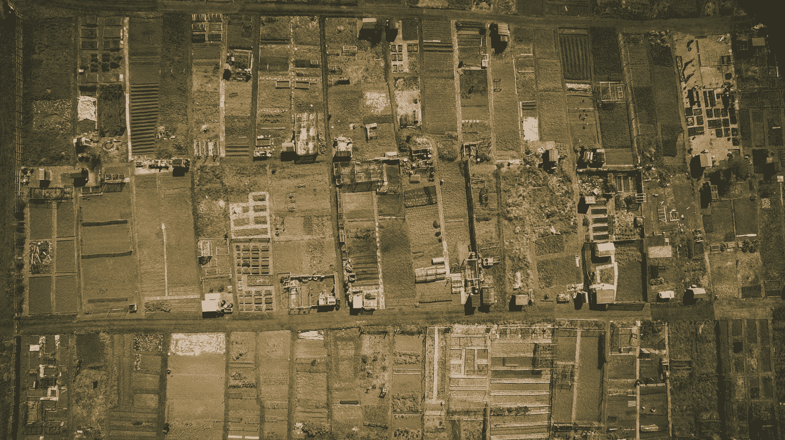
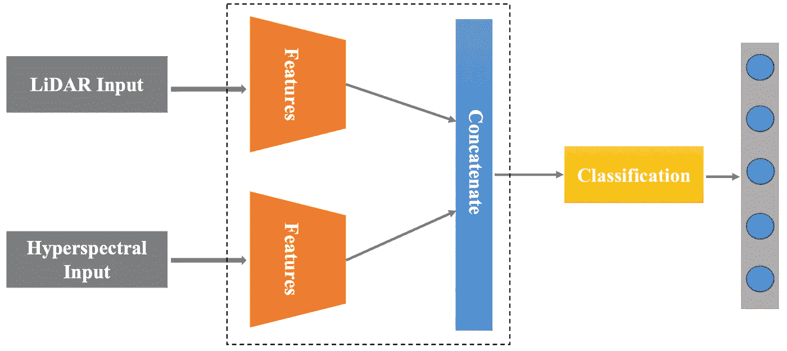
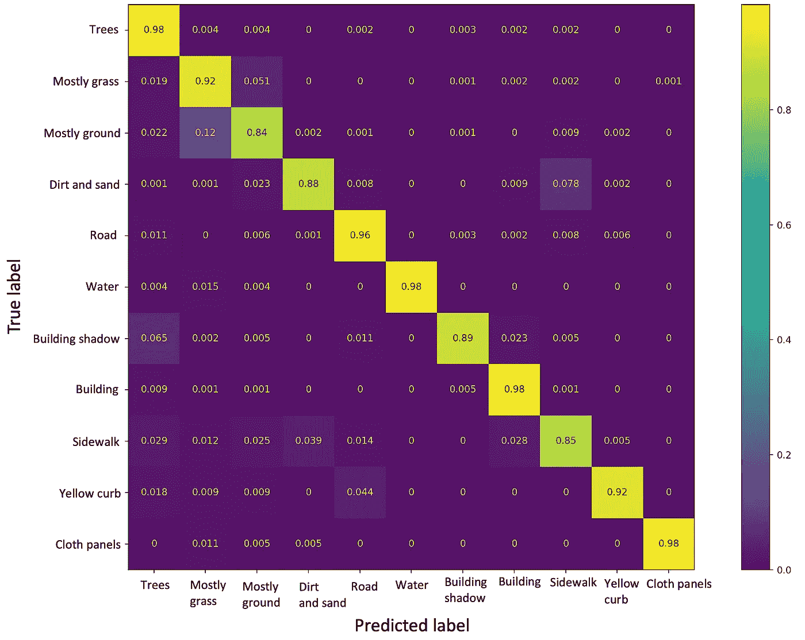

# 基于激光雷达和高光谱数据融合的土地覆盖分类

> 原文：<https://medium.com/mlearning-ai/landcover-classification-using-lidar-and-hyperspectral-data-fusion-895fd0703d1b?source=collection_archive---------3----------------------->

学习使用高光谱和激光雷达数据的融合来执行稳健的土地覆盖分类。

Photo by [Dan Roizer](https://unsplash.com/es/@danroizer?utm_source=unsplash&utm_medium=referral&utm_content=creditCopyText) on [Unsplash](https://unsplash.com/photos/ETAKnrWhbCs?utm_source=unsplash&utm_medium=referral&utm_content=creditCopyText)

# 介绍

本文是土地覆盖分类系列的第 3 部分。在第一部分中，我们学习了使用来自激光雷达的[单像素](/mlearning-ai/a-quick-guide-to-lidar-part-2-cd2dcd2e60fd)进行土地覆盖分类。在第二部分中，我们学习了使用来自激光雷达的像素周围的 [NxN 邻域进行分类。](/mlearning-ai/a-quick-guide-to-lidar-part-3-7871ed6c3f2c)

在本文中，我们将使用高光谱图像(HSI)和激光雷达数据的融合来提高分类性能。每个传感器或模态从感兴趣的区域捕获一些独特的信息。因此，合并来自多个传感器的信息将提供对感兴趣区域的洞察。例如，如果我们合并来自文本和语音的数据，我们可以执行更好的情感分析。仅仅依靠文本情态会导致不正确的结果，因为一个句子可以用于不同的情感/情绪。同样，融合来自激光雷达和 HSI 的信息可以导致更准确的土地覆盖分类。因此，在本文中，我们将逐步学习使用深度神经网络来执行这两种模态的融合。

# 数据

我们在这次演示中使用了 [MUUFL Gulfport](https://github.com/GatorSense/MUUFLGulfport) 数据集。数据在一个*中。mat* 文件。我们可以读一下*。使用 S *cipy* 库的 python 中的 mat* 文件。HSI 数据中有 64 个光谱带。HSI 数据的形状为(325 x 220 x 64)。激光雷达数据包含高度和强度。激光雷达数据的形状为(325 x 220 x 2)。

HSI 数据的光谱分辨率为 10 纳米，空间分辨率为 0.5 米 x 1 米。HSI 的波长范围为 0.375 微米–1.05 微米。激光雷达的空间分辨率为 0.6 米 x 0.7 米，波长为 1.06 微米

# 履行

## 步骤 1:导入库

## 步骤 2:读取文件并提取激光雷达和 HSI 数据和地面实况

*。mat* 文件包含几个 MATLAB struct 字段名。名为' *hsi'* 的字段包含地面实况、激光雷达数据等。在第 9-10 行，我们提取了高光谱数据。在第 16 行，我们提取了激光雷达数据。在第 20 行，我们得到了地面真相。

## 步骤 3:查找激光雷达数据中每个像素周围的 NxN 邻域

对于激光雷达数据，我们在一个像素周围取一个 11x11 的邻域。我们这样做是为了更好地理解目标像素周围的地形。在这个 11×11 的小块中，高度的标准偏差可以判断表面是不平的还是平坦的。我们可以使用这些信息来区分像树和道路这样的类。由于树叶的原因，树木的高度标准偏差会更高。相比之下，道路和人行道将具有较低的标准偏差。

## 步骤 4:修改地面实况和 HSI 数据

地面真相包含标签- *1，1，2，…，和 11* 。 *'-1'* 为未标注数据。我们需要标签 *1，2，…，和 11* 。现在，我们需要从 0 到 10 对标签进行编码。一个简单的方法是从基本事实标签中减去 *1* 。

HSI 数据的形状为(325 x 220 x 64)。我们还拉平了恒指数据。现在，形状是(325*220 x 64)。

## 步骤 5:将数据分成训练测试

我们将数据分为训练/测试。稍后，我们将执行蒙特卡罗实验，并最终报告平均准确度。为此，我们需要在每个实验中随机训练和测试样本。

将训练和测试数据保存到一个. npz 文件中，这样，如果我们多次运行代码，就可以轻松地加载相同的数据。

## 步骤 6:标签的一次性编码以及训练和测试数据的标准化

现在，我们一次性加热目标标签。使用最小/最大缩放在 0 和 1 之间缩放数据。激光雷达的每个通道都单独缩放。HSI 数据已经存在于 0 和 1 之间。

## 步骤 7:为分类定义一个 CNN 模型

对于我们的 CNN 模型，我们有两个输入。一个是激光雷达数据，另一个是 HSI 数据。首先，我们添加卷积层来提取每个模态的潜在特征。然后，两种模态的卷积特征被连接以生成融合的表示。现在，这个融合的表示被作为输入传递给分类神经网络。分类器使用 softmax 激活将每个样本分类为不同的类别。使用“分类交叉熵”损失和“Adam”优化器来训练该模型。

Fusion Model (Image by Author)

## 步骤 8:训练模型，根据测试数据进行预测，并报告准确性

模型训练 40 个历元，批量设置为 128。

我们已经对相同网络架构的 *7* 次迭代进行了蒙特卡罗实验。每次我们随机抽取一组训练和测试样本。我们实现了平均准确率 *93.18% 1.3* 。最佳精度的混淆矩阵如下所示。在[最后一部分](/mlearning-ai/a-quick-guide-to-lidar-part-3-7871ed6c3f2c)中，我们仅使用激光雷达数据对土地覆盖进行分类，并获得了*87.65%±3.08 的精度。*所以，使用融合后，准确率显著提高。

Confusion matrix (Image by Author)

> 完整的代码在这里给出[。](https://github.com/namratadutt/LiDAR-and-Hyperspectral-Fusion-classification)

# 结论

在这一部分中，我们学习了通过融合 HSI 和 LiDAR 数据对土地覆盖分类。在激光雷达中，NxN 邻域可以更好地反映感兴趣区域内的高度和强度变化。HSI 数据提供了每种材料的独特特征，有助于我们轻松分类。然而，它在某些情况下无法区分，比如草和树，因为它们有相似的特征。但是，如果我们借助激光雷达等其他设备，它可以为我们提供目标区域/类别的高度。使用激光雷达，我们可以更好地区分草和树，因为高度不同。我们观察了多模态融合如何比单一模态场景产生更高的准确性。

> 感谢阅读！我希望它是有用的。
> 
> 如果你有任何问题或者你想合作一个基于深度学习的项目，请告诉我。
> 
> 加油鳄鱼队！*🐊*

# 参考

页（page 的缩写）Gader，a .扎雷亚，r .克洛斯，J. Aitken，G. Tuell，“MUUFL Gulfport 超光谱和激光雷达机载数据集”，佛罗里达大学，盖恩斯维尔，佛罗里达州，技术。REP . REP-2013–570，2013 年 10 月。

X.杜和，“技术报告:MUUFL Gulfport 数据集的场景标签地面真值图”，佛罗里达大学，盖恩斯维尔，佛罗里达州，技术。代表 20170417，2017 年 4 月。

 [## GitHub-gator sense/muuflgulport:MUUFL gulf port 超光谱和激光雷达数据:该数据集…

### MUUFL Gulfport 超光谱和激光雷达数据:该数据集包括 HSI 和激光雷达数据，评分代码，照片…

github.com](https://github.com/GatorSense/MUUFLGulfport)  [## Mlearning.ai 提交建议

### 如何成为 Mlearning.ai 上的作家

medium.com](/mlearning-ai/mlearning-ai-submission-suggestions-b51e2b130bfb)