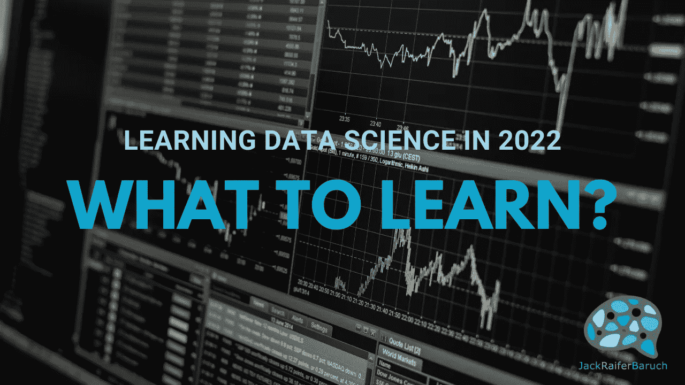

# 2022 年学习数据科学第一部分:学什么？

> 原文：<https://medium.com/mlearning-ai/learning-data-science-in-2022-part-1-what-to-learn-4edbc5113cce?source=collection_archive---------0----------------------->

现在是 2022 年，我们仍处于全球疫情之中，世界上还有无数其他问题，从供应链到全球变暖，而[数据科学](https://en.wikipedia.org/wiki/Data_science)仍然是几乎每个行业最热门和最受关注的职业之一。

不仅如此，从[数据工程](https://en.wikipedia.org/wiki/Information_engineering)，到[数据分析](https://en.wikipedia.org/wiki/Data_analysis)，以及像[数据故事](https://www.forbes.com/sites/brentdykes/2016/03/31/data-storytelling-the-essential-data-science-skill-everyone-needs/?sh=7706c91852ad)这样的新角色，在数据领域的其他角色也日益突出。

这意味着，人们对开始从事数据职业的兴趣从未如此之高，而且这种兴趣是基于已知的供求模式，学习机会也是如此。

当开始踏上数据科学之路时，面对如此多的资源，不知道从哪里开始会非常令人畏缩，不仅有许多学科需要学习，如数学、编程、计算机科学和商业，而且有数百种可能的学习方法，从正式的大学设置到 YouTube 的无限资源。

在这一系列文章中，我们将从一般意义上探讨如果我必须从头开始，我会研究什么，最重要的是，关于任何预算可用的不同资源的一些提示。

先说学什么吧，

**学什么？**

首先，让我们列出成为数据科学从业者需要发展的主题和技能，其中一些是必须的，其他只是我个人的建议:

**1。编程(必须):**

你需要知道如何编程。虽然可以在电子表格(如 excel)中进行数据科学研究，但事实是，您可以处理的数据集的大小和可以运行的算法都将受到严重限制，并且必须永远等待建模完成。此外，你需要选择学习哪种或哪些语言。 [Python](https://en.wikipedia.org/wiki/Python_(programming_language)) 应该是你的核心选择，因为它是业内使用最广泛的语言，也是最容易学习的语言之一。 [SQL](https://en.wikipedia.org/wiki/SQL) ，虽然不是真正的编程语言，但也在列表中名列前茅，因为今天大多数数据都驻留在结构化数据库中，你将需要 SQL 来获得你需要的数据。

你也可以从 [R](https://en.wikipedia.org/wiki/R_(programming_language)) 开始，这对于统计计算非常有用，但是如果你只懂 R 不懂 Python，那么你的工作选择就会受到限制。数据科学领域的其他语言也在崛起，比如 Julia 和 Go，但目前只有少数公司需要这些语言。

我的建议是学习 Python 和 SQL，然后你可以学习其他语言。

额外的一点建议，学习如何用 python 构建完整的程序，不要只停留在“数据科学的 Python”轨道上。理解软件是如何构建的将使你成为一名更好的数据科学家。

**2。数学:统计&概率(必选):**

数学是数据世界的内在组成部分，毕竟，它是将数学公式应用于数据。这就是我们如何建立分析模型。你至少应该对统计学有很高的理解水平，既有[描述性](https://en.wikipedia.org/wiki/Descriptive_statistics)和[推论性](https://en.wikipedia.org/wiki/Statistical_inference)，也有[概率论](https://en.wikipedia.org/wiki/Probability_theory)。

一个令人难以置信地被忽视的部分是[假设检验](https://en.wikipedia.org/wiki/Statistical_hypothesis_testing)。数据科学就是用数据做科学，学习如何做好科学，换句话说，提出假设并对其进行测试，是它的核心部分。

如果你还想了解机器学习，进入深度学习，或者走数据科学研究员的道路，你将需要更多的数学知识(见下文)。

**3。基础数据可视化(必须):**

能够交流你的发现是数据科学中的一项重要技能。这意味着创造良好的视觉效果，尽可能容易理解你在做什么。虽然有很多工具可以做到这一点，比如 Python 中的 [Matplotlib](https://en.wikipedia.org/wiki/Matplotlib) 和 [Seaborn](https://seaborn.pydata.org/) ，R 中的 [Tidyverse](https://en.wikipedia.org/wiki/Tidyverse) ，Power BI ， [Tableu](https://en.wikipedia.org/wiki/Tableau_Software) ，甚至 [Excel](https://en.wikipedia.org/wiki/Microsoft_Excel) ，但最重要的部分是要知道有什么可用的，并学习如何有效地可视化交流您的工作。

如果你想走数据故事讲述者的道路，你也应该学习更多关于可视化设计和高级数据可视化的知识。

**4。机器学习(必须):**

虽然对许多人来说[机器学习](https://en.wikipedia.org/wiki/Machine_learning)是数据科学的一个专业，但事实是大多数都是关于预测分析，换句话说，建立预测模型，机器学习是更适合这项任务的一套工具。这里有很多要学的，从[线性](https://en.wikipedia.org/wiki/Linear_regression)和[逻辑回归](https://en.wikipedia.org/wiki/Logistic_regression)、[决策树](https://en.wikipedia.org/wiki/Decision_tree)、[随机森林](https://en.wikipedia.org/wiki/Random_forest)、[支持向量机](https://en.wikipedia.org/wiki/Support-vector_machine)，这只是对[监督机器学习](https://en.wikipedia.org/wiki/Supervised_learning)的皮毛。然后你还有[聚类](https://en.wikipedia.org/wiki/Cluster_analysis)、[主成分分析](https://en.wikipedia.org/wiki/Principal_component_analysis)、[降维](https://en.wikipedia.org/wiki/Dimensionality_reduction)以及更多关于[无监督](https://en.wikipedia.org/wiki/Unsupervised_learning)方面的事情。

在这里，有线性代数和微积分的背景会帮助你更好地理解工作。尽量不要只是走过场，只是学习编码模型，但要确保你理解代码背后发生了什么。

**5。商业分析(强烈推荐):**

这一点在所有包含“领域知识”的捆绑包中容易被忽视和忽略。尽管如此，商业分析领域是巨大的，并且已经非常成熟。这意味着商业领袖和 C 级高管都精通通常的商业指标，以及它们被展示和用于决策的方式。了解这一点会让你在与高管沟通时占得先机，并帮助你更好地推销你的项目想法。

如果你想成为一名数据分析师，这些技能是必须的。

6。线性代数与微积分(强烈推荐):

如果你真的想了解机器学习，更想进入深度学习，背后的数学会非常有用，尤其是[线性代数](https://en.wikipedia.org/wiki/Linear_algebra)和[微积分](https://en.wikipedia.org/wiki/Calculus)。没有它，你可能会过得很好，即使没有对数学的深刻理解，你也可以创建伟大的模型，但是花时间在它上面将会非常有价值，并且会让你以一种更有意义的方式理解你的工作。以我的经验来看，这也能带来更好的整体工作。

如果你想成为一名数据科学研究者，这是必须的。

**7。计算机科学基础(推荐)**

由于你将大量使用计算机和大规模数据集，至少了解一些计算机科学知识和计算机如何工作的基本概念将帮助你更好地理解正在发生的事情。

**8。视觉设计—高级可视化(对某些人推荐):**

再次强调，沟通在数据科学中非常重要。如果你有可视化的诀窍，或者你想走数据故事讲述者的道路，那么能够创建吸引人的设计和高端可视化将是一项必要的技能。

**9。数据理解—领域知识(最终将成为必备知识):**

虽然我没有遇到过数据理解课程，但除了你将在统计和概率中学到的东西之外，这是一项需要培养的重要技能。能够提出正确的问题，比如:数据从哪里来？它是如何收集的？怎么用？更多，会让你成为更好的数据科学家。

另一方面，当你进入一个组织时，领域知识将是至关重要的，因为了解你工作的行业将有助于你发现更好的见解和设计更好的项目。尽管如此，这可能会在正确的时间到来，除非你已经有了特定行业的背景，否则现在不必太担心。这最后一个，可能是最重要的。

**10。学习(必须用大写字母):**

我相信数据科学是现在和未来的第一个新职业之一，这意味着它结合了许多不同的技能。此外，这是一个充满许多未知和快速发展的新学科。一旦你进入其中，你会不断发现新的工具、编程包、用例、算法、模型、应用程序，这就像是一个永无止境的新事物流，你觉得你必须马上学习才能保持领先。

深呼吸，慢下来，不要焦虑。你会有时间去学习，随着时间的推移，学习会变得更加精简和优化。现在，一次只专注于一件事，你会成功的。

现在，说了这么多，你需要培养对学习的热爱以及不断学习的技能和习惯。这不仅是数据科学家的一项伟大技能，也是所有人的一项技能，无论你走的是什么职业道路。

现在我们有了它，虽然我能想到许多其他有用的东西，这绝不是一个详尽的列表，但它是我几年前开始学习时就想拥有的指南。

如果你想了解更多，下面是我在 YouTube 上的视频，讲述了更多关于学习的内容:

[下一次:关于如何学习的第 2 部分将充满了任何预算的学习数据科学的资源(这也意味着免费)。](/mlearning-ai/learning-data-science-in-2022-part-2-how-to-learn-eda02c341a39)

请随时在 [Twitter](https://twitter.com/JackRaifer) 或 [LinkedIn](https://www.linkedin.com/in/jackraifer) 上与我联系，如果您有任何问题，请给我留言。也可以看看我的 YouTube 频道，如果你喜欢这篇文章，就在这里关注我。

杰克·雷弗·巴鲁克
数据科学家

邮箱:[jackraiferbaruch@gmail.com](mailto:jackraiferbaruch@gmail.com)
领英:[https://www.linkedin.com/in/jackraifer](https://www.linkedin.com/in/jackraifer)
推特:[https://twitter.com/JackRaifer](https://twitter.com/JackRaifer)
中:[https://jackraiferbaruch.medium.com](https://jackraiferbaruch.medium.com)
YouTube:[https://www.youtube.com/channel/UC87srlfQBy6AcglQAvlHr3A](https://www.youtube.com/channel/UC87srlfQBy6AcglQAvlHr3A)

 [## Mlearning.ai 提交建议

### 如何成为 Mlearning.ai 上的作家

medium.com](/mlearning-ai/mlearning-ai-submission-suggestions-b51e2b130bfb)