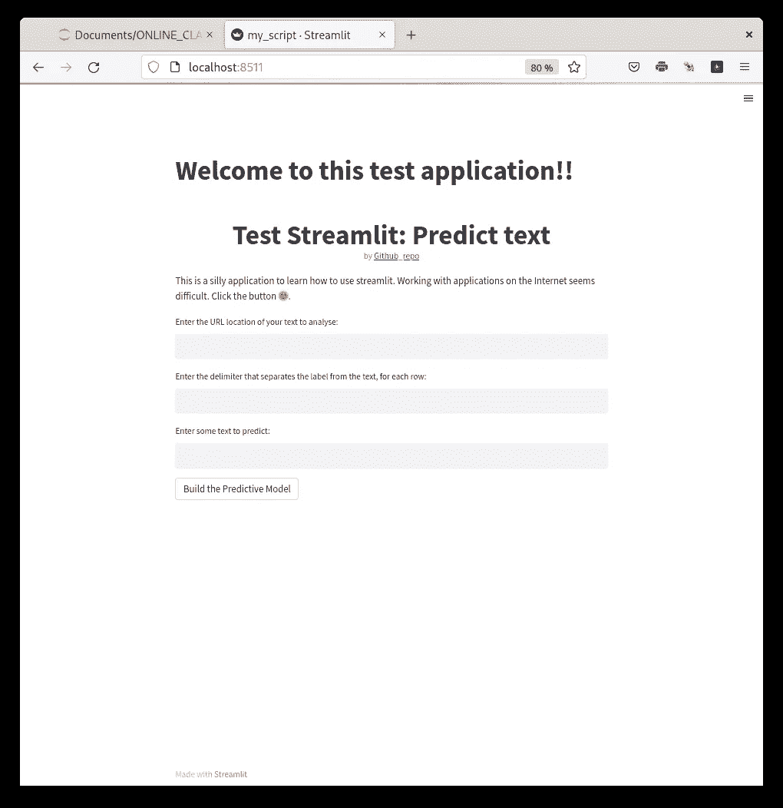
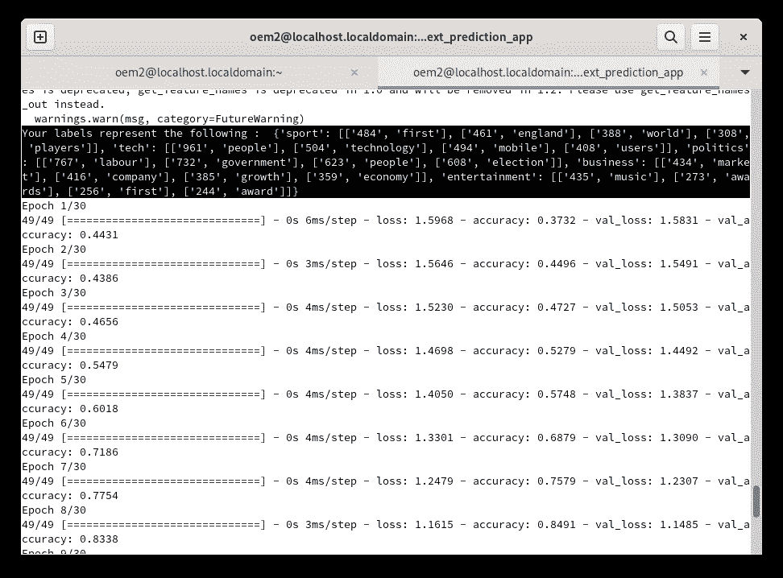
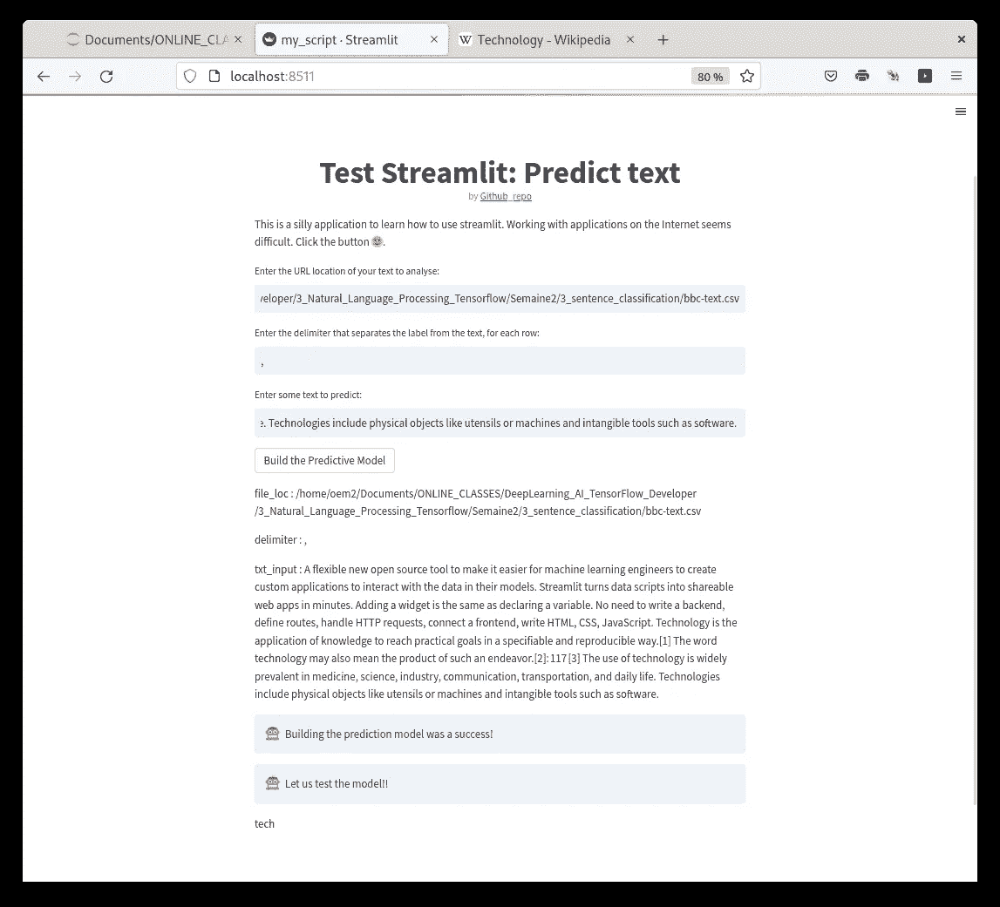

# 了解如何使用 Streamlit 制作应用

> 原文：<https://medium.com/mlearning-ai/learning-how-to-make-apps-with-streamlit-3e46ba710c3?source=collection_archive---------1----------------------->

几个月来，我在 Meduim 上看到一些博客帖子，谈论用 Streamlit 制作应用程序。Streamlit (import streamlit as st)是一个 python 包，它允许将 python 脚本视为 web 应用程序。Streamlit 还有一个可以链接到 Github 的云平台([https://streamlit.io/](https://streamlit.io/))。如果你没有服务器来托管网站，你可以在 https://streamlit.io/的[服务器上试用你的应用。你只需在 https://streamlit.io/](https://streamlit.io/)[上创建一个账户，并将你的 Github 库链接到 streamlit 账户，你放在链接的 Github 库中的任何 python 文件都会作为应用程序加载。最后，为了快速学习语法，他们提供了许多例子，并且他们有 30 天的简化挑战](https://streamlit.io/)[https://blog.streamlit.io/30-days-of-streamlit/](https://blog.streamlit.io/30-days-of-streamlit/)。

我用 Coursera deep learning AI tensor flow 开发者类[https://github.com/j622amilah/streamlit_apps](https://github.com/j622amilah/streamlit_apps)的代码做了一个文本预测类。该应用程序使用标记化进行监督文本分类，以预测文本内容；您可以在 github 资源库随意查看代码。我试着在 https://streamlit.io/的服务器上运行这个应用，但是不幸的是他们没有 tensorflow 包。因此，我在自己的电脑上运行了这个应用程序。

# 在本地启动 python 脚本

安装好 streamlit 之后，我打开了一个终端窗口，输入‘streamlit run my _ script . py’。以下窗口在我的浏览器中打开:

我使用 Coursera deep learning AI tensor flow 开发者类的给定文本和 Kaggle 的文本数据集测试了这款应用；这里我展示了 Coursera 文本。该文本有 5 个标签类别:体育，科技，政治，商业和娱乐。

由于这篇文章是关于 Streamlit 的，让我们从 Streamlit 网站复制粘贴文本，看看它是否会预测“技术”类别。

以上截图为总 app。在复制粘贴精简网站文本和维基百科的技术定义后，该应用程序预测文本谈论的是“技术”。

像这样的应用程序界面是浓缩和呈现代码的好方法！练习愉快！👋🤖

 [## Mlearning.ai 提交建议

### 如何成为 Mlearning.ai 上的作家

medium.com](/mlearning-ai/mlearning-ai-submission-suggestions-b51e2b130bfb)