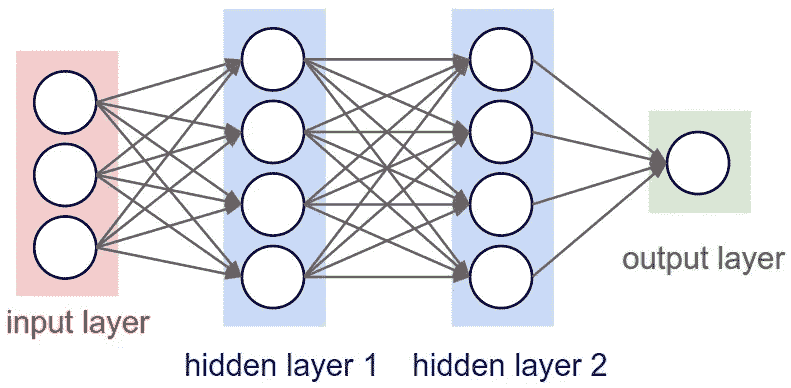

# 神经网络的学习过程

> 原文：<https://medium.com/mlearning-ai/learning-process-of-neural-networks-654c0c1f80f8?source=collection_archive---------11----------------------->

Photo by [Kier In Sight](https://unsplash.com/@kierinsight?utm_source=medium&utm_medium=referral)

**目录**

1.  正向传播
2.  反向传播
3.  结构
4.  层

## 预测阶段

神经网络有不同的阶段。在这个例子中，我演示了如何使用一个简单的神经网络*来解决异或*(一个逻辑运算，当且仅当它的参数不同时才成立)*。*我用两种不同的方法:*训练* & *运行*。在*训练*中，我使用前向传播和反向传播。我们将减少这些术语的复杂性来理解这种方法。

假设我们有一个球，我们要把它扔向球门。在正向传播中，应该首先预测这些指标:

1.  球需要飞多远？
2.  背后要投入多少精力？
3.  球的路径

诸如此类。

## 测量阶段

从这些步骤中得出答案的过程称为正向传播*(预测)*。现在我们可以理解我们离实际目标有多远了。此外，估计预测目标和实际目标之间的差异被称为反向传播*(测量)*，反向传播的第二阶段是学习。最终，我们再次扔球，球扔得太远了，我们测量差异并再次做出*预测*。这个序列描述了神经网络的学习过程。

## 运行我们的网络

在运行我们的网络时，我们不再需要衡量我们离目标有多远。因为我们已经知道了区别，所以不需要反向传播。在整个训练过程中，神经网络都在测量这种差异，这种差异被称为误差。我们可以通过在 *log* 函数中传递 *error* 参数并指定 *logPeriod* 来查看错误。

虽然可能会有很多错误，但 Net 最终会加速其学习能力，直到错误率开始下降到非常低的数字，直到训练完成。一旦训练完成，就没有必要继续训练，我们可以向前传播。

# 结构

神经网络的编程结构由接收输入作为参数并产生输出的函数组成。

神经网络从随机数开始，影响输出的一切最初都是一串随机值，因为从数学上讲，这是一种从知识开始的有效方法。事实上，随着时间的推移，我们可以重塑随机数据，以存储神经网络内部正在发生的事情。听起来可能很奇怪，每个神经元实际上都是 Math.random()。神经网络的下一个重要结构行为是激活函数。

## 激活功能

A 激活函数专门用于神经网络，将输入信号转换成输出信号，该输出信号又作为输入被馈送到堆栈中的下一层。在神经网络中，我们估计输入及其互连权重的乘积之和，最后对其应用激活函数，以获得相应层的输出，并将其作为下一层的输入。激活函数在反向传播中使用它们的导数来测量。

# 层

Nodes represent neurons, stacks represent layers

层是一个通用术语，适用于在神经网络中特定深度一起工作的“节点”的集合。

**输入层**包含原始数据(将每个变量视为一个“节点”)。

在神经网络中，**隐藏层**是*黑魔法*发生的地方。每一层都试图通过最小化误差/成本函数来了解数据的不同方面。理解这些图层最直观的方法就是在 [*的背景下进行图像识别*](https://en.wikipedia.org/wiki/Pattern_recognition) 比如人脸。例如，第一层可以学习边缘检测，第二层可以检测眼睛，第三层可以检测鼻子，等等。虽然这个例子不一定代表程序结构，但其思想是将问题分解成不同抽象层次可以拼凑起来的特征，就像我们自己的大脑工作一样(因此得名“神经网络”)。

**输出层**是最简单的，通常由分类问题的单个输出组成。尽管它是单个“节点”,但它仍被视为神经网络中的*层*,因为它可以拥有多个节点。

 [## Mlearning.ai 提交建议

### 如何成为 Mlearning.ai 上的作家

medium.com](/mlearning-ai/mlearning-ai-submission-suggestions-b51e2b130bfb)