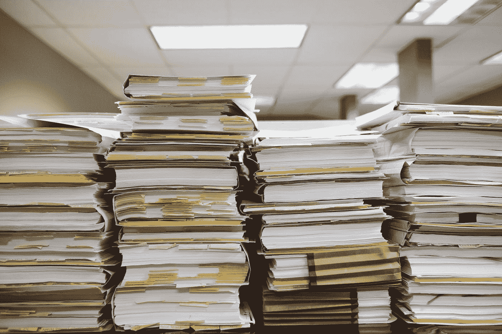

# 掌握自然语言处理(NLP)的学习途径

> 原文：<https://medium.com/mlearning-ai/learning-track-to-master-natural-language-processing-nlp-4149060ee6cf?source=collection_archive---------2----------------------->

我将尝试回答我通常会遇到的那些常见问题:在 NLP 中从哪里开始？在开始找工作之前，我应该了解 NLP 的哪些技术？今天的 NLP 市场需要什么？

Photo by [Wesley Tingey](https://unsplash.com/@wesleyphotography?utm_source=medium&utm_medium=referral) on [Unsplash](https://unsplash.com?utm_source=medium&utm_medium=referral)

# 介绍

自然语言处理 NLP 的任务是分析和理解文本，并从中提取优美的见解。