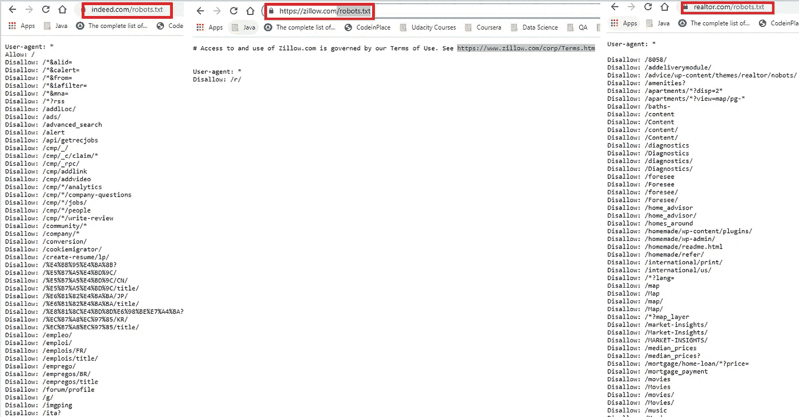

# 为我的回归 ML 项目从动态站点收集数据时学到的经验教训

> 原文：<https://medium.com/mlearning-ai/lessons-learned-while-scraping-data-from-dynamic-sites-for-my-regression-ml-project-c7f52e5ef7ea?source=collection_archive---------4----------------------->


Photo Credit: Shutter Stock

希望这篇文章是关于分享我的经验，关于我用“两行代码”抓取一个网站赚了多少钱，或者“我如何创建一个爬虫来运行它几年”。但我的目标是从**Indeed.com**收集工资数据，或者从**Zillow.com**收集房地产数据，但不幸的是，由于动态 HTML 内容，我无法成功收集数据，或者从 **Youtube** 或**Medium.com**上获得的任何教程都是有用的。

我追求 Zillow 的动机是为了给我的数据添加更多的“特征”,因为他们有学校评级信息。由于搜集到的数据将被用来创建一个讨论学校评级和房价之间关系的线性回归算法，Zillow 更有意义。

Zillow 方面的另一个发展是，他们大约在一年前放弃了他们的免费 API。现在它是通过另一个平台提供的，你需要被邀请到这个平台。

因为这已经成为我想要克服的一个挑战，我必须找到一种方法从网站上提取至少一些数据。在这种情况下，我使用了 **Apify** ，它使用后端的**木偶师**来抓取您想要抓取的页面。你可以查看[这个视频](https://www.youtube.com/watch?v=i2Dy9fDqbRk)了解详细的使用信息。

**警告**:我意识到的一个共同点是，Youtube 上的大多数教程(如果不是全部的话)都已经超过一年了，所以当你查看它们的时候，它们页面的动态内容可能已经在这些网站上被改变了。此外，他们主要是解决静态网站，表格，等创造内容，所以他们大多数只是点击诱饵这一点。

# 议程

1.  网络抓取与网络爬行
2.  你能做什么？
3.  "/robots.txt "的事情

我写这篇文章的目的不是教你如何抓取网页，而是在一些最常用的工具中，帮助你克服一些你可能会遇到的陷阱。

# 1.网络抓取与网络爬行

本质上，我们想做网络抓取，但因为我以前有过这种困惑，所以我想谈谈不同之处。根据维基百科的说法，

> **网页抓取**、**网页抓取**或**网页数据提取**是用于从网站中提取数据的数据抓取。网络抓取软件可以使用超文本传输协议或网络浏览器直接访问万维网。虽然 web 抓取可以由软件用户手动完成，但该术语通常指的是使用 bot 或 web crawler 实现的自动化过程。这是一种复制形式，从网络上收集并复制特定的数据。

它也包含了一些网络爬行的元素。但是网络爬行通常是指搜索引擎所做的事情。它更多的是索引，而不是显示网页的全部内容。

# **2。你能做什么？**

通过使用应用最多的三个库 *BeautifulSoup，Requests 和硒*。

通过使用 *BeautifulSoup* 库；

```
from urllib.request import urlopen
from bs4 import BeautifulSoupurl = ''
html = urlopen(url)
bs = BeautifulSoup(html, 'html.parser')

for child in bs.find('table',{'id':'giftList'}).children:
    print(child)
```

作为一个自然的 Selenium 用户，我对该工具的第一印象是，因为我觉得不需要它。但是随着我开始在更多的项目中使用它，并将其与 Selenium 结合，我意识到它可以产生一些美好的东西。

通过使用*请求*；

```
import requests
from pandas.io.json import json_normalize

url = 'url you want to scrape'
jsonData = requests.get(url).json()

table = json_normalize(jsonData['data'])
```

你可以点击查看请求文档[。它确实返回 JSON 格式，你只需要从那里开始。](https://docs.python-requests.org/en/latest/)

或者使用 Selenium WebDriver

```
from selenium import webdriver
from selenium.webdriver.common.by import By
from selenium.webdriver.support.ui import WebDriverWait
from selenium.webdriver.support import expected_conditions as EC
import time
import json

driver=webdriver.Chrome(executable_path='./chromedriver.exe')
driver.get(url)
rating=WebDriverWait(driver, 10).until(
        EC.presence_of_all_elements_located((By.XPATH, 'your xpath locator'))
    )
```

Selenium WebDriver 是一个自动化工具，通过使用 CSS 选择器、Xpath、Id、Name 等定位器来定位网站 DOM，从而帮助您自动化浏览器的移动。它是自动化测试人员中常用的工具，编写的测试可能不可靠，因为如果 DOM 中有任何变化，工具就不可能找到某个项目。上面是一些样板代码，你可以用来开始你的旅程。此外，通过使用 CroPath Chrome 扩展，您可以通过查找相对和绝对 Xpaths 来轻松定位元素。

该工具的另一个问题是它处理 AJAX 调用。AJAX = **A** 同步**J**avaScript**A**nd**X**ML。你可以在这里获得更多关于它的信息，但总而言之，它是

> AJAX 允许通过在后台与 web 服务器交换数据来异步更新网页。这意味着可以更新网页的一部分，而不需要重新加载整个页面。

这也是测试自动化工程师的噩梦。因为 Selenium(不像 Cypress)在浏览器上工作，它对 AJAX 调用没有任何控制。这里的 [**等待**](https://www.selenium.dev/documentation/webdriver/waits/) 前来救援。等待只是让用户显式或隐式地等待，直到预期的元素加载。

示例代码:

```
from selenium.webdriver.support.ui import WebDriverWait

driver.navigate("file:///race_condition.html")
el = WebDriverWait(driver).until(lambda d: d.find_element_by_tag_name("p"))
assert el.text == "Hello from JavaScript!"
```

在忘记提及之前，我还被 Zillow 和 Realtor 禁止使用 Selenium，所以请确保您将 ***sleep()*** 方法添加到您的调用中。或者更好的选择是使用代理。却被告知代理是为了安全[漏洞 而开放的。这里有一个代码示例，用于检查代理是否工作，然后您可以使用它使您的代码在站点上运行。](https://www.itbriefcase.net/4-vulnerabilities-of-a-proxy-server)

```
# Import the required Modules
import requests# Create a pool of proxies
proxies = {
 '[http://'](http://114.121.248.251:8080'),
 '[http://'](http://222.85.190.32:8090'),
 '[http://'](http://47.107.128.69:888'),

}url = '['](https://ipecho.net/plain')# Iterate the proxies and check if it is working.
for proxy in proxies:
 try:
  page = requests.get(
  url, proxies={"http": proxy, "https": proxy})# Prints Proxy server IP address if proxy is alive.
  print("Status OK, Output:", page.text)except OSError as e:# Proxy returns Connection error
  print(e)
```

# 3."/robots.txt "的事情🤔



Screenshot credit to the article writer

当你在网站 URL 后添加“/robots.txt”时，它会告诉你什么是允许的，什么是不允许的。从我尝试抓取的三个网站可以看出，他们倾向于不允许抓取任何内容？！

## 结论

如果你需要处理房地产数据，我建议你去看看其他的房地产网站，比如世纪 21 或 realtor.com。你可能会有更好的运气。在刮**Indeed.com**方面，我诚实的反馈是不要尝试。Indeed.com 是一个非常混乱的地方，大多数工作甚至没有工资信息或范围共享。但是如果你想浏览 Craigslist 这样的网站，你可以在这里找到一个我在[做过的小例子](https://github.com/METIS-DATA-SCIENCE-PROJECTS/webscraping-projects/blob/main/Philadelphia-Area-Craigslist-2-br-Apt-Scraping.ipynb)。也请注意网站的网页抓取规则。

感谢阅读！

[](/mlearning-ai/mlearning-ai-submission-suggestions-b51e2b130bfb) [## Mlearning.ai 提交建议

### 如何成为 Mlearning.ai 上的作家

medium.com](/mlearning-ai/mlearning-ai-submission-suggestions-b51e2b130bfb)