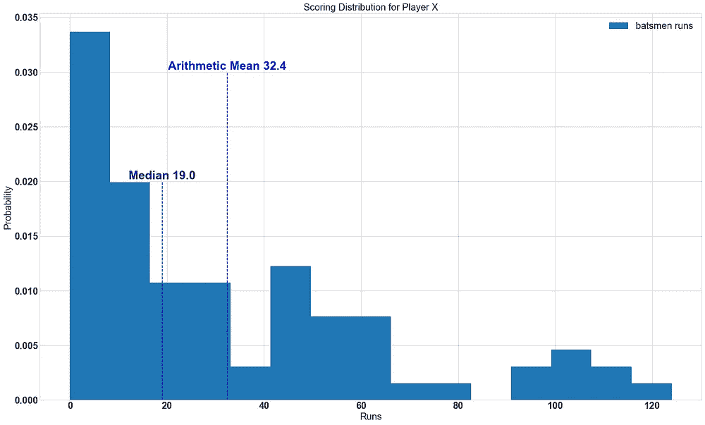
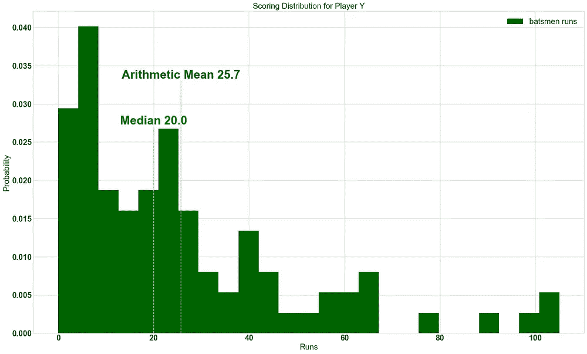
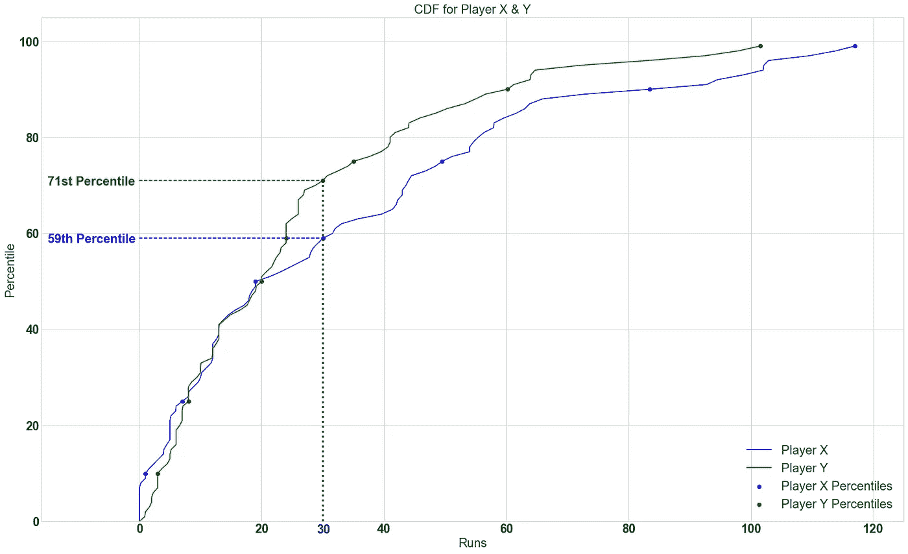
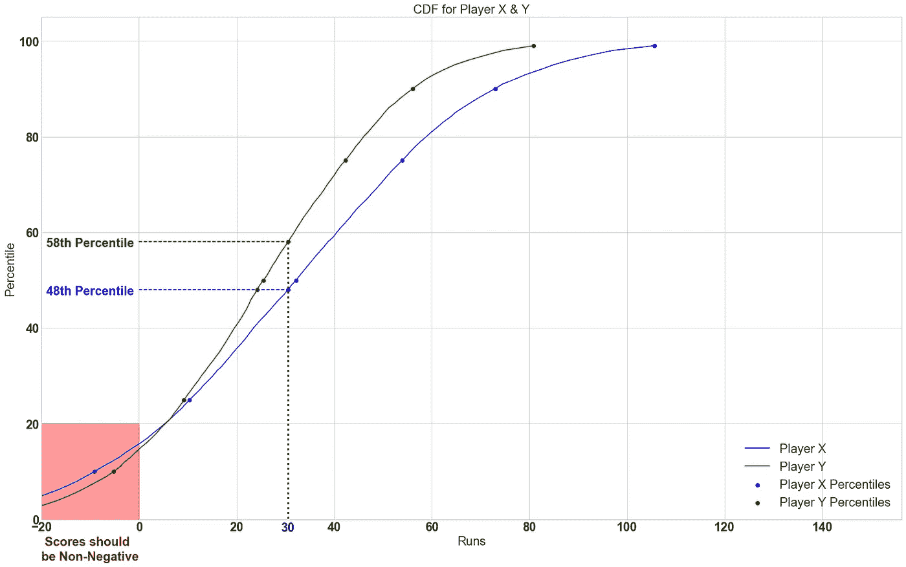
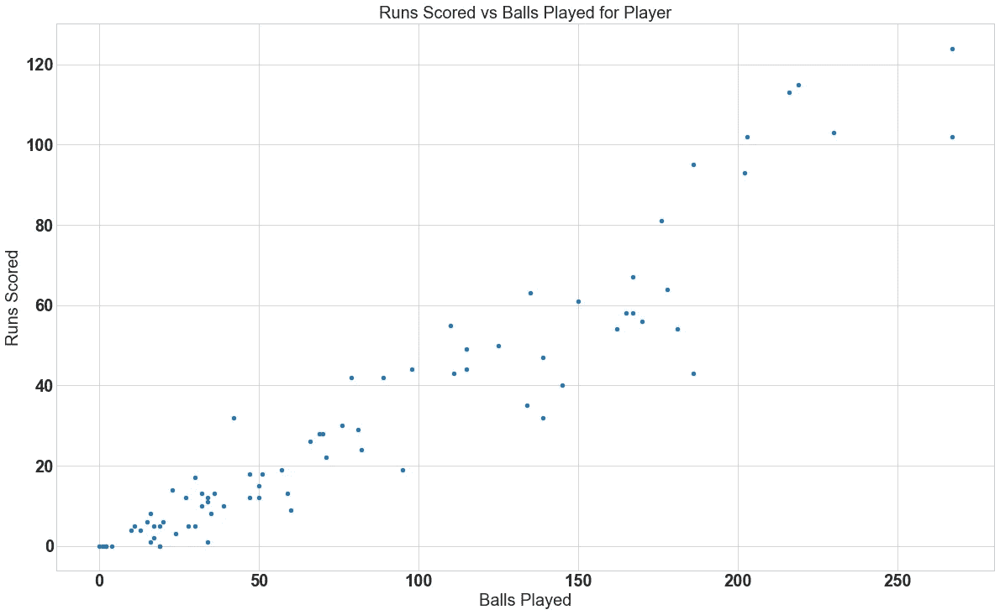
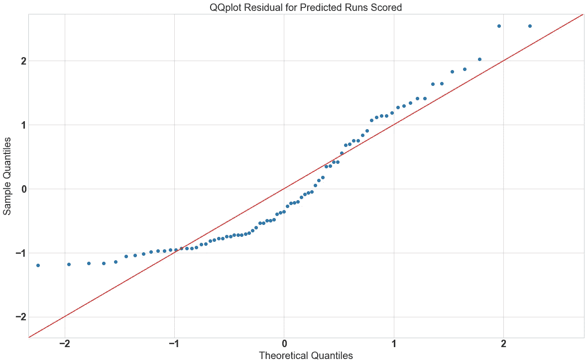
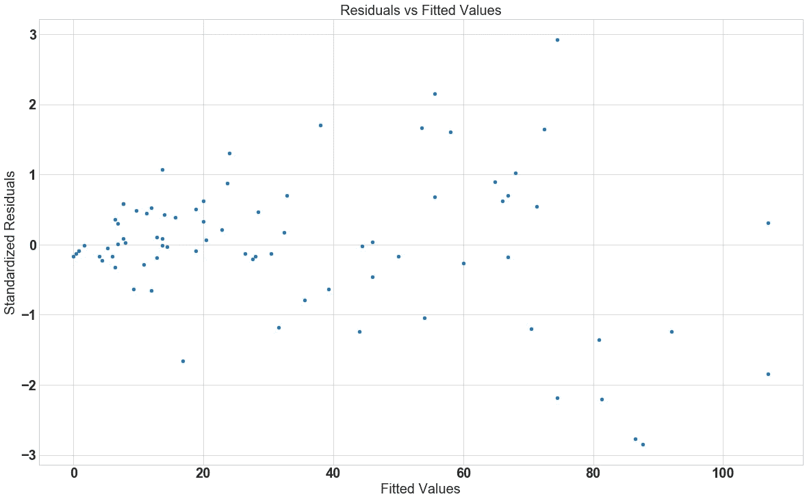

# 谎言，弥天大谎，数据科学？

> 原文：<https://medium.com/mlearning-ai/lies-big-lies-and-data-science-6147e81fb9fc?source=collection_archive---------0----------------------->

我敢肯定，围绕数据科学、机器学习和人工智能的所有宣传，已经给你留下了数据不会出错的印象。构建这些模型的人是知道自己在做什么的奇才。数据科学家是来革新每个行业的，如果你有数据，你有问题他们会想出解决方案。

没有什么能比真相更进一步。事实上，数据科学比将数据插入模型并获得结果更微妙。如果你是半个聪明人，你可以想出一种方法来得到或“撒谎”得到你想要的结果。如果你不是精通机器学习或统计学的人，这篇文章肯定会启发你弄清楚你是否被“骗”了。

以下是你可能被愚弄的常见方式。为这篇文章所做的研究来自 Darrel Huff 的一本书，名为“如何用统计数据撒谎”，以及其他各种资源，如谷歌首席决策科学家 Cassie Kozyrkov 的 youtube 系列“与机器学习交朋友”。最后，它包含了一些我自己被“欺骗”的经历。

# 我高于“平均水平”

人们经常会看到平均值形式的统计数据。例如，在新闻中，你会听到平均价格、收入或降雨量等。

你有没有想过平均值是如何计算出来的，或者更准确地说，是指哪个“平均值”？我们大多数人都认为这个人说的是算术平均数。简单地将所有测量值相加，然后除以测量值的数量。

当然还有其他“平均值”，如取最中间的值(中值)、最频繁的值(众数)、乘法“平均值”，即几何平均值等。

你可能想知道这有什么关系？为了解释为什么这很重要，我们来看一个例子。让我们假设你是一名板球教练，试图在比赛中做出一个至关重要的决定。您的团队目前正在追赶，需要 30 分才能获胜。你只剩下一个三柱门，你需要派出你的最后一个击球手。你有两个选择，谁派出球员 X 或球员 y。这是一个重要的决定，因为它可能会使或打破你的球队赢得系列赛的机会。你如何评价该派哪个球员出场？

幸运的是，你的团队管理层雇佣了一名数据科学家来帮助你解决这些难题。你向他们寻求帮助，他们说让我们检查一下这些球员的得分分布(一种有趣的说法，让我们看看每个球员在一系列得分中得分的可能性)。他们将每个球员的得分分布可视化。

***注*** *:我知道在板球比赛中，评估球员时要考虑太多的变量，但在这个例子中，让我们假设其他一切都是不变的，唯一的区别因素是每个球员得分的得分。*

Scoring Distributions of Player X & Y , with Probability of each outcome on the y-axis and the runs on the x-axis

在这种情况下你能决定派哪个球员出场吗？看算术平均值，你可以说玩家 X 更好，因为他/她有更高的平均值 **37.4 分**对抗玩家 Y 的 **25.7 分**。但是如果你看看中值分数，你可以看到玩家 Y 的分数在 50%的时间里高于 **20 次运行**，低于 **20 次运行** 50%，这高于玩家 X 的中值 **19 次运行**。(也许玩家 Y 有更高的概率获得 30 分，玩家 X 的更高均值是由于离群值)。

令人困惑不是吗？正确的答案需要更多的分析——参见下一部分关于分布的内容，找出谁应该发出——但直觉上，中位数在这种情况下提供了更好的指标，但仅此可能还不够。

# 其实“正常”吗？

继续板球的例子，你作为板球教练试图解决的问题等同于问哪个球员有更高的概率得分至少 30 分。在数学符号上相当于问 P(玩家 X 分数≥ 30)和 P(玩家 Y 分数≥ 30)哪个多。

当试图解决此类不等式时，我们查看**累积密度函数(CDF)。** (CDF 是一个函数的别称，它告诉我们一个随机变量 **X** (即玩家得分)小于一个值 **c** (在我们的例子中是 30 次)的概率是多少)。如果你在生活中遇到过百分位数，你就会了解到 CDF 的概念。例如，第 99 百分位对应于 X 的值，其中 CDF(X) =0.99 &中值是 CDF 为 0.5 或第 50 百分位的值。

如果你觉得这些术语令人困惑，不要担心，你需要知道的是，我们需要看看每个球员得分的百分位数，以及哪个球员在较低的百分位数超过 30 分，就有更高的概率获得至少 30 分。

CDF showing Probability of scoring less then X runs.

如你所见，在这个问题上，球员 X 在第 59 百分位得了 30 分或更少，这意味着至少得 30 分的概率为 41%。这高于玩家 Y 得分至少 30 次的概率 29%(第 71 百分位转化为玩家 Y 得分少于 30 次的时间的 71%，为了得到得分多于 30 次的概率，我们需要减去 1)。请注意，答案一点也不明显，仅仅使用“平均值”是无法找到答案的。

仔细观察 CDF，你会发现它是如何参差不齐的，两位球员几乎是并驾齐驱，直到中间线。之后玩家 X 开始更积极地得分。重点是要表明，普遍发生的现象可以有各种不同的分布。

概率分布有各种形状和大小；当进行推论或建模时，它们非常重要。**一种常见的“撒谎”方式是根据错误的分布推断信息**。在学校和大多数统计学入门课上，人们被教导要假设正态分布。正态分布之所以无处不在，是因为统计学中一个非常重要的结果叫做“**中心极限定理”。**

*“该定理指出，如果你从任何具有有限方差的分布中抽取足够大的独立样本，并对它们进行平均，那么样本均值将是正态分布的”。*

注意这个定义是如何掩盖了许多要点的，比如什么是“独立样本”以及“足够大的样本”在实践中意味着什么？我们的样本量需要是 10，100，1000，还是 100 万？此外，我们的数据的基本分布有可能具有无限的方差吗？

答案是，这取决于你从哪个分布中采样，以及如何采样。有一个关于你的分布有多“正常”的概念；这可以通过[Kolmogorov–Smirnov 检验](https://en.wikipedia.org/wiki/Kolmogorov%E2%80%93Smirnov_test#Kolmogorov%E2%80%93Smirnov_statistic)来测量正态性。是的，有一些例子说明方差可能是无穷大，例如，有人认为每日股票收益的分布实际上是无穷大。不幸的是，这些主题超出了本文的范围，但是您应该查看一下。

需要记住的重要一点是，你不能仅仅因为中心极限定理就假设正态分布，你需要先进行类似[Kolmogorov–Smirnov 测试](https://en.wikipedia.org/wiki/Kolmogorov%E2%80%93Smirnov_test#Kolmogorov%E2%80%93Smirnov_statistic)这样的统计测试，看看假设是否成立，然后再尝试做出推论。在上面的板球例子中，如果你的“数据科学家”继续假设每个球员的分数来自正态分布，并查看 CDF，他们可能会产生类似这样的结果。

CDF of Player X & Y’s scores assuming a Normal distribution

红色区域表示球员得分为负的区域，这毫无意义！虽然，对于我们最初的问题陈述——哪个球员更有可能得到 30 分或更多——正常近似值给出了正确的结果；然而，它对这些结果的概率给出了错误的估计，声称潜在的分布“可能”不正态。

为什么使用正态分布，如果它给出错误的结果？嗯，正态分布是一个模型，它给出了一些非常有用的假设。然而，就像任何模型一样，它是“错误的”,它的有用性是基于它运行的假设。这让我们想到了我的下一个观点，即模型，无论是简单的概率分布还是高度复杂的神经网络，都是在一组非常严格的假设下工作的，任何优秀的数据科学家都必须了解这些假设是什么，它们如何运作，以及它们何时以及如何被违反。

# 所有模型都是“错误的”

有人说“所有的模型都是错的，但有些模型是有用的。”换句话说，任何模型充其量只是一个有用的虚构——从来没有，也永远不会有一个精确的正态分布或精确的线性关系。然而，通过娱乐这类小说并把它们作为近似值，已经取得了巨大的进步。—乔治·博克斯

上面引用的统计学家乔治·博克斯的话完美地总结了我想传达的观点。我已经阐述了使用正态分布的一些问题，现在让我们看看模型是如何“错误”的，不理解它们是如何或为什么错误会产生各种各样的“谎言”。

由于不可能列出所有算法并告诉如何正确应用每一种算法，所以让我们只看一种算法，并分析它的错误应用如何导致错误的结果。普通最小二乘线性回归是用于预测连续结果的最基本和最普遍的应用方法之一。

## 线性回归的假设(OLS):-

1.  线性:*因变量 y &自变量 x 线性相关(x 的指数为 1)*
2.  残差正态:*残差平方和:sum(y(实际)- y(预测))正态分布，可以使用*[*Kolmogorov–Smirnov 检验*](https://en.wikipedia.org/wiki/Kolmogorov%E2%80%93Smirnov_test#Kolmogorov%E2%80%93Smirnov_statistic) *来判断这是否成立*
3.  独立性&无多重共线性:*x 个变量都不相互依赖，自变量之间的相关性应该为零或很小*
4.  同方差:*误差或残差对于 x 的所有值都具有相同的方差。*
5.  没有异常值或审查:*应该没有或只有很少的点会使 y 产生偏差，例如，远高于 y 平均值的巨大值或审查为零(y-当你回归的不能是负数时很常见-像板球比分)*

The score vs ball plot of a Player

看上面的图表，你能看出 Y(球员得分)和 X(打球数)之间的关系是线性的还是像 X 这样的高次多项式函数更合适吗？你怎么会知道？一种方法是尝试不同的数学函数，然后使用一个成本函数来确定哪一个是最适合的。然而，答案还是不明显，线性关系对大多数值来说是足够的，但是当玩家没有得分时，在低端会非常失败。玩家的分数在零下**被审查**——不可能得到负分数。

由于上述零值和异常值的存在，线性回归无法给出合理的答案。一种解决方案是使用“Tobit”模型，它将二元分类器与回归模型结合起来。二元分类器预测玩家是否会出局。如果分类器预测不出，那么对剩余部分运行线性回归以获得更准确的拟合。

QQplot for linear regression model, Players scores against balls played

要查看残差是否具有正态分布，您可以使用分位数-分位数图(QQ 图)。x 轴是分位数的理论分布，如果数据具有完美的正态分布，y 轴值是我们模型的残差。45 度红线是一个基准，如果所有点都在这条线上，那么残差是完全正常的。与直线的偏差是样本残差有多远的指标。

在这种情况下，残差不是正态分布的，因为大多数点都远离红线，这表明如果您想用模型进行任何统计推断，即假设检验，您不应该使用线性回归。相反，构建一个广义线性模型(GLM ),更好地拟合残差分布。线性回归和其他线性模型如逻辑回归都是 GLMs 的例子，它们有自己的一套假设。一种更简单的思考方式是从蛋糕的角度。如果线性回归是巧克力软糖蛋糕，那么 GLMs 就是所有可能蛋糕的集合。

Residual vs Fitted Values Plot

用通俗的英语来说就是 y 的方差分布不随 x 的值而变化，给定 x 的 y 的方差在 x 为 20 或 x 为 100 时是相同的。上图显示了我们模型的残差与我们模型的拟合值或预测值的对比。随着拟合值的增加(在这种情况下，x 增加，因为 x 和 y 之间的正关系)，残差变得更加分散。这意味着对于 x 的所有值，Y 的方差可能不遵循相同的分布。因此 batsmen runs (Y)是异方差的而不是同方差的，这意味着您不能对 x 和 Y 之间的关系进行统计推断。

***重要提示:*** *异方差、多重共线性和残差正态性都是问题，如果你想利用你回归的估计值进行统计推断。这往往比简单的预测更有见地！在这个具体的例子中，x 的估计系数将告诉我们，玩家每打一个附加球，可以获得多少附加分数。*

我希望这篇文章能让你理解数据科学是多么的复杂，而不仅仅是简单的插入和插入，而不考虑分析背后隐含的假设。

 [## Mlearning.ai 提交建议

### 如何成为 Mlearning.ai 上的作家

medium.com](/mlearning-ai/mlearning-ai-submission-suggestions-b51e2b130bfb)