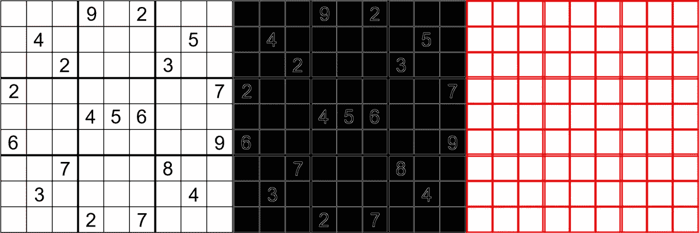

# 直线检测:计算机视觉 VS 深度神经网络

> 原文：<https://medium.com/mlearning-ai/line-detection-computer-vision-vs-deep-neural-network-27c6b40a14c8?source=collection_archive---------2----------------------->

## 使用简单 CV 算法与复杂神经网络的直线检测分析以及何时使用何种方法的结论

直线检测有许多应用:例如估计图像的透视或创建矢量化图像，边缘检测等等。在这篇文章中，我不谈论应用，但我展示了如何使用两种算法，我们将比较它们，并得出结论，当我们想使用女巫的。



An example of classical canny+hough transform line detection

## 使用 CV 进行直线检测

使用 [opencv-python](https://pypi.org/project/opencv-python/) (我们可以获得关于这个[链接](https://docs.opencv.org/3.4/d9/db0/tutorial_hough_lines.html)的更多信息)，使用 [canny](https://en.wikipedia.org/wiki/Canny_edge_detector) 检测和概率[霍夫变换](https://en.wikipedia.org/wiki/Hough_transform)的基本思想，读取图像和获得线条的简单方法如下:

```
import cv2 as cvrc = cv.imread(cv.samples.findFile(path), cv.IMREAD_GRAYSCALE)
dst = cv.Canny(src, 50, 200, None, 3)
linesP = cv.HoughLinesP(dst, 1, np.pi / 180, 50, None, 50, 10)
```

colab 笔记本完整演示可从[这里](https://colab.research.google.com/drive/1x8Q9dJWsCm4IkJEDjbV7FfEO9nrzEP8m?usp=sharing)获得。

## 神经方法

有许多神经方法，例如一些使用 hough 变换，如用于语义线检测的深度 Hough 变换，也有 web 演示。


Example of [Deep Hough Transform](https://github.com/Hanqer/deep-hough-transform)

但是我们也有其他方法，如 [LETR(线段检测)](https://github.com/mlpc-ucsd/LETR)使用线框数据集来寻找更多可以描述 3D 对象的线( [web 演示](https://huggingface.co/spaces/z-uo/LETR)


Example of [LETR](https://github.com/mlpc-ucsd/LETR) (with resnet50 and 256*256 image scaling, it is possible to obtain better results with resnet 101 and more image resolution, use the [web demo](https://huggingface.co/spaces/z-uo/LETR) to test more)

第一种方法找到覆盖所有图像的无限多条线，因此它可以用于找到更好的透视线，例如自动操作 [fSpy](https://fspy.io/) (关于 fSpy 使用的应用示例，请参见[开源架构渲染](https://z-uo.medium.com/open-source-architecture-rendering-eb302f6b5f0e))。第二个是寻找元素边界的片段，可以用来创建一个 3D 模型，在很短的时间内对图像进行纹理处理，并通过使用一个延长的法线贴图(例如使用 [XTConsistency](https://github.com/EPFL-VILAB/XTConsistency) 一些视觉效果[这里](https://epfl-vilab.github.io/project_website_template/))我们使用低多边形网格得到一个很好的 3D 房间模型。

## 结论

如果我们需要解决简单的任务，如检测桌子或数独或网球场的线条，在特定的光线条件下不会有太大变化，计算机视觉方法就是你的解决方案:简单，可控，不需要太多的计算能力。

但是对于更多可变的任务，如寻找真实世界图像的透视，神经模型可以表现得更好，并且可以接收更一般化的图像。

深度学习以更一般化的方式解决问题，这很好，但如果你有一个简单的问题，就简单地解决它[吻](https://www.interaction-design.org/literature/topics/keep-it-simple-stupid)！

请注意，我上面展示的所有内容都是开源的，所以请使用它并做出贡献！

[](/mlearning-ai/mlearning-ai-submission-suggestions-b51e2b130bfb) [## Mlearning.ai 提交建议

### 如何成为 Mlearning.ai 上的作家

medium.com](/mlearning-ai/mlearning-ai-submission-suggestions-b51e2b130bfb)