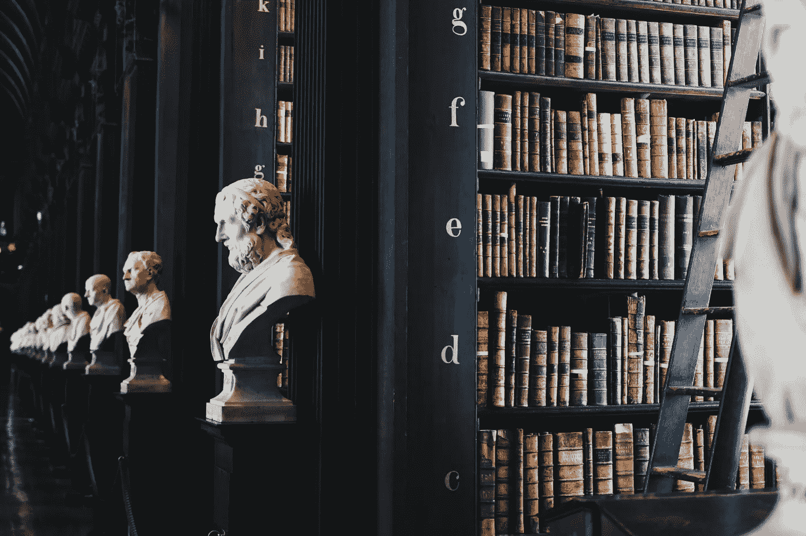

# 与人工智能一起生活|第 1 部分

> 原文：<https://medium.com/mlearning-ai/living-with-artificial-intelligence-part-1-371182e9935d?source=collection_archive---------6----------------------->

## BBC 里斯讲座，2021

我又回来了，带来了另一篇有趣的博文。今天，我们将探讨在 2021 年的 [*BBC Reith 讲座*](https://www.bbc.co.uk/programmes/b00729d9) 中解开的 [*斯图尔特·罗素*](https://en.wikipedia.org/wiki/Stuart_J._Russell) 的观点。首先，请允许我适当地介绍一下里斯讲座，主讲人不是别人，正是斯图亚特·j·罗素。

**Source**: Author

> 里斯讲座于 1948 年由英国广播公司创办，以纪念该公司首任总干事约翰·里斯爵士(后来的勋爵)对公共广播事业做出的历史性贡献。

**Source**: [https://www.turing.ac.uk/news/living-ai-alan-turing-institute-hosts-prestigious-bbc-radio-4-reith-lecture-stuart-russell](https://www.turing.ac.uk/news/living-ai-alan-turing-institute-hosts-prestigious-bbc-radio-4-reith-lecture-stuart-russell)

> 英国计算机科学家斯图尔特·乔纳森·拉塞尔(Stuart Jonathan Russell)因其对人工智能(AI)的贡献而闻名，他是加州大学伯克利分校的计算机科学教授，也是加州大学旧金山分校的神经外科兼职教授。

在读完介绍之后，我很确定你们中的一些人已经兴奋到可以去探索这个系列讲座了。如果你是他们中的一员，那么这是最适合你的博客，因为，在开始任何事情之前，没有什么比一个漂亮的小介绍更好的了。但是如果你来自另一个团队，那么我必须告诉你，这个博客对你来说也是完美的。如果你听说过 AI，那么你一定想知道这个系列已经回答的问题，至少在你的一生中有一次。所以，没有任何进一步的麻烦，让我们开始吧！

# 人类历史上最大的事件

Photo by [Giammarco](https://unsplash.com/@giamboscaro?utm_source=unsplash&utm_medium=referral&utm_content=creditCopyText) on [Unsplash](https://unsplash.com/s/photos/history?utm_source=unsplash&utm_medium=referral&utm_content=creditCopyText)

2021 年的第一场里斯讲座在伦敦大英图书馆艾伦图灵研究所举行。在这个讲座中，斯图尔特探索了人工智能的未来，并问道:我们如何才能正确处理与它的关系？他反思了人工智能的诞生，将我们对它的思考追溯到亚里士多德。他概述了人工智能的定义，它的成功和失败，以及它对未来构成的风险。参考电影和流行文化中人工智能系统的表现，罗素教授检查了我们的恐惧是否有充分的根据。他解释了是什么引导了他；前瑞思讲师斯蒂芬·霍金教授旁若无人地说“成功将是人类历史上最大的事件，也可能是人类历史上的最后事件！”。斯图尔特问这种风险是如何产生的，是否可以避免，让人类和人工智能成功共存。

## 第一次 Reith 讲座的关键见解

*   机器没有智商。这是一些评论者常犯的错误，即机器智商会在某个时间点超过人类智商。一个微不足道的例子是 [*谷歌搜索引擎*](https://en.wikipedia.org/wiki/Google_Search) 如何记住一切，但仍然不能从纸袋中计划出它的路。
*   图灵 1950 年的论文《 [*计算机械与智能*](https://doi.org/10.1093/mind/LIX.236.433) 》是 AI 的敲门砖之一，其中介绍了 AI 的很多核心思想，包括机器学习(ML)。这篇论文还提出了我们现在称之为图灵测试的思想实验，它推翻了对机器智能可能性的几个标准反对意见。
*   斯图尔特阐述了“人工智能中的成功”的含义。他指出，机器的智能一直被定义为“机器的智能程度可以预期他们的行动可以实现他们的目标”，他解释说，与人类不同，机器没有自己的目标，相反，人类给他们目标来实现，以及如何在这种模式下运行，人工智能在过去的七十年中实现了许多突破。
*   随着人工智能进入现实世界，它与弗朗西斯·培根在 1609 年发表的《古人的智慧》中的*观察发生了碰撞，“机械艺术可以转向任何一个方向，也可以用于治疗和伤害”。人工智能的“伤害”包括种族和性别偏见、虚假信息、深度造假和网络犯罪。*
*   *人工智能的目标是并且一直是通用人工智能，也就是说，机器可以快速学习完成人类可以完成的所有任务。毫无疑问，通用人工智能系统将在许多重要方面远远超过人类的能力，但与此同时，我们距离实现通用人工智能还有很长的路要走。仍然需要一些概念上的突破，而这些很难预测。*
*   *他对艾伦·图灵的警告给出了一个似乎合理的解决方案，即如何确保通用人工智能(比人类强大得多的实体)永远不会拥有对我们的权力。*
*   *让人工智能变得更好的真正问题是人类为机器指定的目标。当我们开始走出实验室，进入现实世界时，我们发现我们无法完全正确地指定这些目标。司徒雷登用歌德的 [*迈达斯国王*](https://en.wikipedia.org/wiki/Midas) 和 [*魔法师的徒弟*](https://en.wikipedia.org/wiki/The_Sorcerer%27s_Apprentice) 的例子支持了这个说法。*
*   *Stuart 在第一堂课的结尾说，如果让 AI 变得越来越好会让问题变得越来越糟，那么我们就错了。我们认为我们想要实现我们给他们的目标的机器，但实际上我们想要别的东西。*

# *人工智能在战争中的未来角色*

**

*Photo by [James Gibson](https://unsplash.com/@jg_media_production?utm_source=unsplash&utm_medium=referral&utm_content=creditCopyText) on [Unsplash](https://unsplash.com/s/photos/robots?utm_source=unsplash&utm_medium=referral&utm_content=creditCopyText)*

*2021 年第二届里斯讲座 在英国辉煌的惠特沃斯大厅曼彻斯特大学*举行。在这个讲座中，斯图尔特警告发展自主武器系统的危险；主张建立全球控制体系。他提出了一个非常重要的问题，即“未来的战争将完全由机器来打，还是只有当一方的实际损失，无论是军事损失还是平民损失，变得不可接受时，才会投降？”。他接着研究了主要大国开发这些类型武器的动机，创造决定杀死人类的算法的道德性，以及国际社会在与这些问题作斗争时可能的前进方向。**

## **第二次 Reith 讲座的关键见解**

*   **Stuart 讲述了他在 2013 年 2 月在 20ᵗʰ的经历，当时他收到了一封来自人权观察组织的电子邮件，信中要求他支持一项禁止“杀手机器人”的新活动。这封信提出了玩玩具枪的儿童被机器人杀手意外瞄准的可能性。在这一点上，斯图尔特提出了他的观点，即我们可以从计算机科学家的职业行为准则开始，例如，“不要设计可以决定杀死人类的算法”，但我们也需要更清晰的论据来说服人们加入。**
*   **第二讲的目标是解释那些“更清晰的论点”以及它们是如何演变的。讲座没有涉及人工智能在军事应用中的所有用途。事实上，Stuart 阐明了一些用途，例如更好地探测突然袭击，实际上可能是有益的。这篇演讲不是关于国防研究的一般道德。最后，这个讲座不考虑由人类遥控的无人机(因为美国在这个问题上非常敏感)。**
*   **讲座的主题是致命的自主武器系统， [*联合国*](https://www.un.org/en/) 将其定义为“在没有人类监督的情况下定位、选择和攻击人类目标的武器”。**
*   **我们大多数人现在都在想象一个横冲直撞的 [*终结者*](https://en.wikipedia.org/wiki/The_Terminator) 机器人，斯图亚特强调了那张照片中的谬误。首先，有一个不合理的事实，终结者发射了大量未击中目标的子弹。其次，画面让人以为自主武器是科幻，其实不是，相反，我们现在就可以买到。第三，画面让人以为问题出在 [*天网*](https://en.wikipedia.org/wiki/Skynet_(Terminator)) (控制终结者的全球软件系统)，但天网从来不是问题。**
*   **根据 Stuart 的说法，关注意外目标是一个错误，但在 2013 年，这是首要关注的问题，因此导致了 2014 年在日内瓦举行的《特定常规武器公约》第一次讨论。Stuart 继续补充道，2015 年，他作为一名人工智能专家被邀请参加在日内瓦*举行的 CCW 会议，在会上他有 3 项工作要做:清理自主性的混乱，评估自主性武器的技术可行性，并尽可能评估利弊。***
*   ***在讲座中，斯图尔特列举了许多例子，这些例子得出结论说，在 2015 年，自主武器的所有组件技术都已经存在，因此，自主武器在技术上是可行的。根据斯图尔特的说法，人工智能系统的唯一优势是它们在识别合法目标方面比人类更好，但谈到缺点，网络渗透和敌对行动的意外升级是严重的问题。***
*   ***人工智能将使一个致命的单位比坦克，或攻击直升机，甚至携带枪支的士兵更小，更便宜，更灵活。***
*   ***2017 年，土耳其一家政府所有的制造商宣布了 Kargu 无人机，宣传其具有“杀伤人员自主打击”的能力，具有“在图像和人脸识别上选择的目标”。根据联合国的说法，尽管有严格的武器禁运，卡尔古在 2020 年的利比亚冲突中被使用。***
*   ***2019 年，在 COVID 之前，一小组专家在波士顿的一所房子里会面，经过深思熟虑，他们达成了一个解决方案，即一项要求最低重量和爆炸有效载荷的禁令，以排除小型杀伤人员武器。这不仅会消除作为大规模杀伤性武器的蜂群，而且在当时还会允许主要大国保留他们的大玩具:潜艇、坦克、战斗机等等。***
*   ***斯图尔特在第二次演讲结束时对外交官和他们的政治导师说:“有 80 亿人想知道为什么你不能给他们一些保护，使他们免受机器人的追捕和杀害。如果技术问题太复杂，你的孩子大概能解释清楚”。***

> ***瑞思 2021 系列讲座由 4 个讲座组成。为了避免博客太长，我把博客分成了两部分。你可以点击查看这篇两部分博客的第二部分。***

# ***参考***

*** [## 与人工智能一起生活|第 2 部分

### BBC 里斯讲座，2021

elemento.medium.com](https://elemento.medium.com/living-with-artificial-intelligence-part-2-4ec1f601780f)  [## BBC 广播 4 台-里斯讲座，斯图尔特罗素-与人工智能生活-集…

### 斯图尔特·拉塞尔全集-与人工智能一起生活

www.bbc.co.uk](https://www.bbc.co.uk/programmes/m001216k/episodes/guide)  [## I .-计算机器和智能

### 我建议考虑这样一个问题，“机器能思考吗？”这应该从定义…的含义开始

doi.org](https://doi.org/10.1093/mind/LIX.236.433)  [## 《特定常规武器公约》

### 《禁止或限制使用某些可被认为是……

www.un.org](https://www.un.org/disarmament/the-convention-on-certain-conventional-weapons/)  [## STM - KARGU -旋翼攻击无人机巡逻弹药系统

### 旋翼攻击无人机能力|能力*昼夜任务能力*最小限度的精确打击…

www.stm.com.tr](https://www.stm.com.tr/en/kargu-autonomous-tactical-multi-rotor-attack-uav) 

# 关于我的一点点👋

如果你没有兴趣认识作者，或者你已经认识我，你可以安全地跳过这一节。我保证这里没有隐藏的宝藏😆。

我是一个人工智能爱好者。如果你喜欢这个博客，请把你的手放在一起👏如果你想阅读更多基于人工智能的博客 *#StayTuned。*

 [## Mlearning.ai 提交建议

### 如何成为 Mlearning.ai 上的作家

medium.com](/mlearning-ai/mlearning-ai-submission-suggestions-b51e2b130bfb) 

🔵 [**成为作家**](/mlearning-ai/mlearning-ai-submission-suggestions-b51e2b130bfb)***