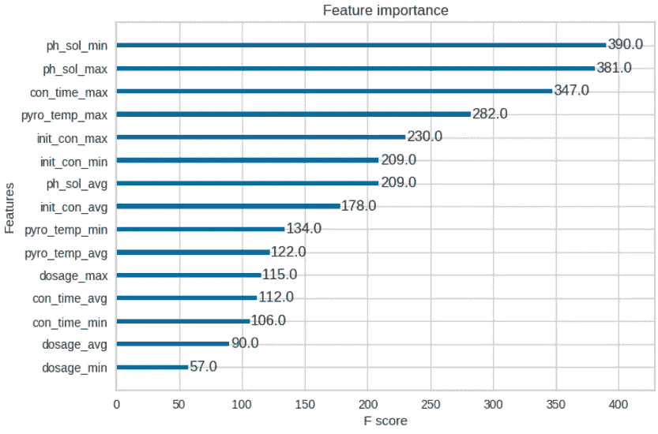
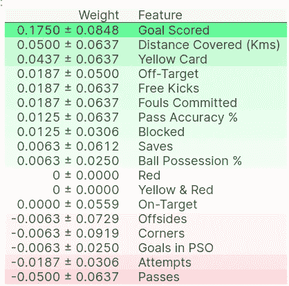

# 机器学习可解释性排列重要性

> 原文：<https://medium.com/mlearning-ai/machine-learning-explainability-permutation-importance-7a9a69bf5943?source=collection_archive---------1----------------------->



Feature importance plot

# 特征重要性

了解模型中最重要的特性可以帮助我们理解它是如何工作的。**排列重要性**是衡量特征重要性的一种方式。这种方法的工作原理是**随机打乱单个特征，然后测量对模型预测的影响**。这是一项非常有用的技术，可用于了解哪些要素对于特定预测最为重要，以及每个要素对模型预测的一般影响。

# 与其他方法相比，为什么使用排列重要性

*   计算速度很快
*   被广泛使用和理解
*   与特征重要性度量的性质一致

# 排列重要性

它是在模型拟合后计算出来的。如果我们随机打乱验证数据的单个列，让目标列和所有其他列保持不变，这会如何影响现在打乱的数据中预测的准确性？

## 计算排列重要性的步骤

1.  找个训练有素的模特。
2.  对单个列中的值进行排序，并使用生成的数据集进行预测。使用这些预测和真实目标值来计算损失函数因洗牌而遭受的损失。这种性能下降衡量的是你刚刚打乱的变量的重要性。
3.  将数据恢复到原始顺序(取消步骤 2 中的无序播放)对数据集中的下一列重复步骤 2，直到计算出每一列的重要性。

```
import eli5
from eli5.sklearn import PermutationImportance
perm = PermutationImportance(my_model, random_state=1).fit(val_X, val_y)
eli5.show_weights(perm, feature_names = val_X.columns.tolist())
```



show_weights by eli5

顶部的值是最重要的特性，底部的值是最不重要的特性。当我们看到特征重要性为负值时，可能会发生这样的情况:对混洗数据的预测比真实数据更准确。当特征无关紧要，但随机机会导致对混洗数据的预测更准确时，会出现这种情况。

## 其他资源和参考

[](https://www.kaggle.com/code/somesh88/exercise-permutation-importance?scriptVersionId=115166681) [## 练习:排列的重要性

### 使用 Kaggle 笔记本探索和运行机器学习代码|使用来自多个数据源的数据

www.kaggle.com](https://www.kaggle.com/code/somesh88/exercise-permutation-importance?scriptVersionId=115166681) 

> 感谢你阅读我的博客！🤗关注我了解更多内容，别忘了在评论里问好。收到读者来信总是令人鼓舞的。祝您愉快！🤗

[](/mlearning-ai/mlearning-ai-submission-suggestions-b51e2b130bfb) [## Mlearning.ai 提交建议

### 如何成为 Mlearning.ai 上的作家

medium.com](/mlearning-ai/mlearning-ai-submission-suggestions-b51e2b130bfb)