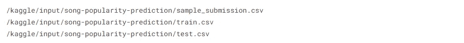
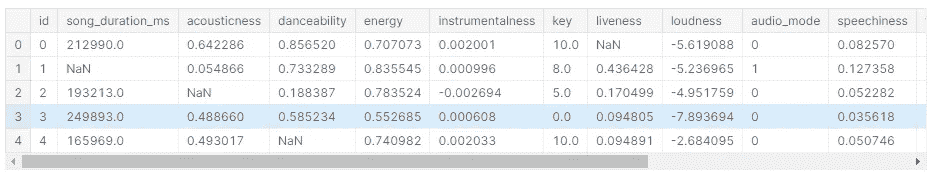
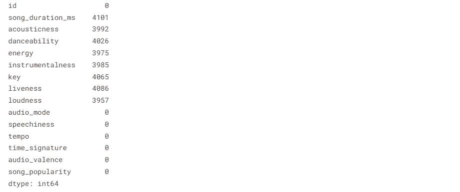
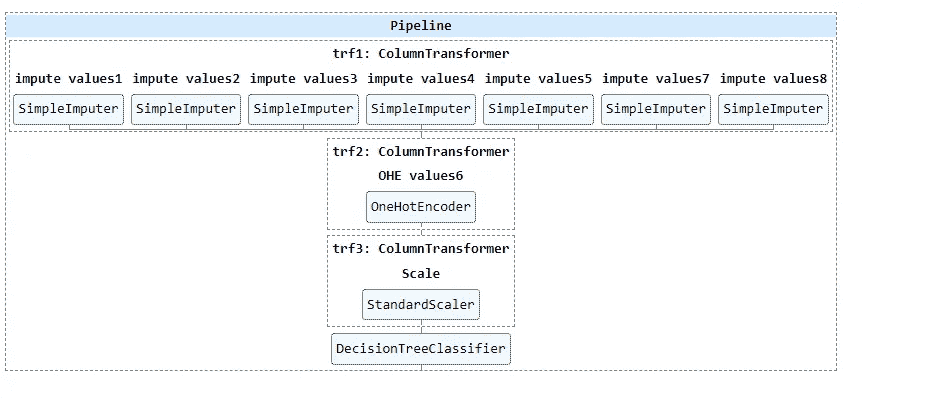

# 机器学习管道 Explained✨💡！！

> 原文：<https://medium.com/mlearning-ai/machine-learning-pipelines-explained-ef1094fec9b3?source=collection_archive---------4----------------------->

本博客将向你解释在机器学习问题中实现流水线的简单方法。


> 因此，首先我们将从导入所有用于数据操作和数据可视化的基本库开始，我们将导入歌曲流行度预测的 **Kaggle 数据集**。

```
import numpy as np *# linear algebra*
import pandas as pd *# data processing, CSV file I/O (e.g. pd.read_csv)* import seaborn as sns #data visualization library
import matplotlib.pyplot as plt #data visualization libraryimport warnings # ignoring warnings
warnings.filterwarnings('ignore')

import os
for dirname, _, filenames **in** os.walk('/kaggle/input'):
    for filename **in** filenames:
        print(os.path.join(dirname, filename))Output:
```



> 然后我们将使用 **pandas.read_csv()** 函数从训练集和测试集读取数据并提交样本。

```
train=pd.read_csv("/kaggle/input/song-popularity-prediction/train.csv")
test=pd.read_csv("/kaggle/input/song-popularity-prediction/test.csv")
submission=pd.read_csv("/kaggle/input/song-popularity-prediction/sample_submission.csv")
```

> 读取数据集后，我们将通过查看数据集中前五行和所有列来浏览数据集。

```
train.head()
Output:
```



> 然后，我们将查看数据集的每一列中是否有任何空值，因为大多数 ML 算法都不能处理空值，所以空值需要通过某些值进行估算，所以我们有 8 列需要估算空值。

```
train.isna().sum()
Output:
```



> 我们将看到数据集的形状，因为该数据集包含 **28000** 行和 **14** 列。

```
x_train.shape
Output: ( 28000,14 )
```

> 因此，在获得一些数据后，我们将使用 sklearn 模块中的训练和测试分割数据为训练数据(70%数据)和验证数据(30%数据)。

```
from sklearn.model_selection import train_test_split
x_train,x_test,y_train,y_test=train_test_split(train.drop("song_popularity",axis=1),train["song_popularity"],test_size=0.3,random_state=0)
```

> 我们正在导入 sklearn 模块，用于编码数值和分类值，缩放整个数据集的值，并使用决策树算法。

```
from sklearn.impute import SimpleImputer # imputing numeric values
from sklearn.preprocessing import OneHotEncoder # imputing catogerical values
from sklearn.preprocessing import StandardScaler # scaling values
from sklearn.tree import DecisionTreeClassifier # Tree algorithm
```

> 我们正在从 sklearn 模块中导入列转换器和管道来转换值，并为我们的整个 ML 流程创建一个管道，以避免数据泄漏，并在没有重复的情况下制作生产就绪代码，如果我们有任何需要预测的新点可以直接输入管道。

```
from sklearn.compose import ColumnTransformer #to transform column
from sklearn.pipeline import Pipeline,make_pipeline # to make pipeine
```

> 我们使用默认策略输入所有空值列，即使用列转换器，这使得读取和使用所有输入步骤成为一个列转换器对象 **trf1** 。

```
trf1=ColumnTransformer([
    ("impute values1",SimpleImputer(),[1]),
    ("impute values2",SimpleImputer(),[2]),
    ("impute values3",SimpleImputer(),[3]),
    ("impute values4",SimpleImputer(),[4]),
    ("impute values5",SimpleImputer(),[5]),
    ("impute values7",SimpleImputer(),[7]),
    ("impute values8",SimpleImputer(),[8])],remainder="passthrough")
```

> 我们使用 column transformer 通过一个热编码输入所有分类值列，这使得读取和使用所有输入步骤成为一个列转换器对象 **trf2** 。

```
trf2=ColumnTransformer([
    ("OHE values6",OneHotEncoder(sparse=False,handle_unknown="ignore"),[6])]
    ,remainder="passthrough")
```

> 我们使用列转换器通过标准缩放器对象缩放所有列，这使得读取和使用所有输入步骤成为一个列转换器对象 **trf3** 。

```
trf3=ColumnTransformer([
    ("Scale",StandardScaler(),slice(0,19))])
```

> 我们使用决策树分类器，因为这是一个分类问题，我们使用列转换器，这使得读取和使用所有步骤成为一个列转换器对象变得容易，如 **trf4** 。

```
trf4=DecisionTreeClassifier()
```

> 这里，我们将所有列转换器制作成一个名为 pipe 的管道，顺序从 1 到 4，这样，所有步骤都将一个接一个地传递到每个列转换器，我们在每个列转换器上执行一个特征工程步骤。

```
pipe=Pipeline([
    ('trf1',trf1),
    ('trf2',trf2),
    ('trf3',trf3),
    ('trf4',trf4),
])
```

> 这里我们用 sklearn 模块中的 set_config 模块显示我们的管道，当我们调用 fit 函数时，管道就显示在这里。

```
from sklearn import set_config
set_config(display="diagram")
```

> 在这里，我们通过管道对象拟合数据，使用 x_train 和 y_train 进行所有特征工程和模型拟合步骤。
> 
> 输出非常直观地显示所有特征工程和模型拟合步骤，以了解整个管道。

```
pipe.fit(x_train,y_train)
Output:
```



> 我们使用管道对象预测验证，并将它们存储在 y_pred 中。

```
y_pred=pipe.predict(x_test)
```

> 我们正在导入 **ROC AUC 得分**指标，因为这是一个分类问题，需要将各个类别分开。

```
from sklearn.metrics import roc_auc_score 
roc_auc_score(y_test,y_pred)Output: 0.5
```

> 我们将模型的预测提交到提交文件，这里我们没有得到好的 **ROC AUC 分数，**这个博客的目标是教导使用管道和列转换器解决 ML 问题。

```
pred=pipe.predict(test)
test['song_popularity'] = pred
submission = test[['id', 'song_popularity']]
submission.to_csv('submission.csv', index=False)
```

如果你想看 Kaggle 笔记本的全部代码，请点击这里的链接。

感谢阅读！

关注我了解更多关于 DS 和 ML 的内容。

[](/mlearning-ai/mlearning-ai-submission-suggestions-b51e2b130bfb) [## Mlearning.ai 提交建议

### 如何成为 Mlearning.ai 上的作家

medium.com](/mlearning-ai/mlearning-ai-submission-suggestions-b51e2b130bfb)