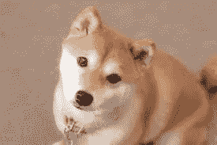
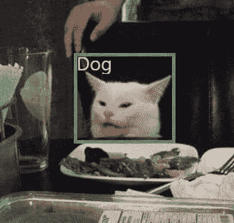
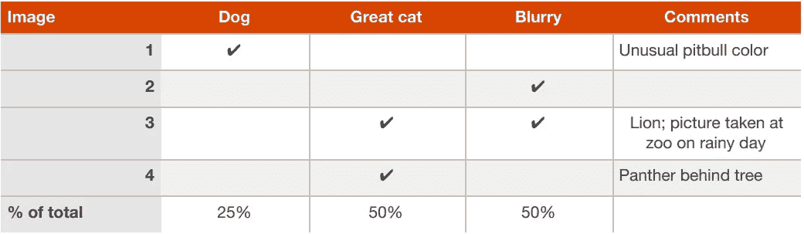
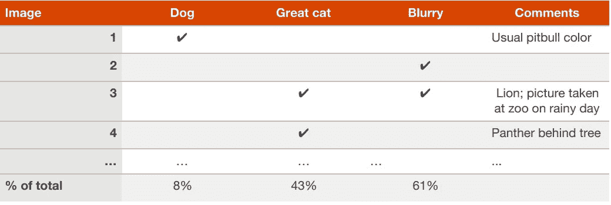

# 机器学习策略第 4 部分:基本错误分析

> 原文：<https://medium.com/mlearning-ai/machine-learning-strategies-part-04-basic-error-analysis-7a38cf0154b1?source=collection_archive---------4----------------------->

在上一个故事中，我讨论了拥有单一数字评估指标的重要性。在这个故事中，我将通过解释错误分析来进一步讨论机器学习的方法。此外，我将讨论为什么错误分析在开发机器学习应用程序中是至关重要的。

**快速构建你的第一个系统，然后迭代**

假设您正在构建一个猫狗检测应用程序，您的团队有许多想法，例如:

*   获得大量的训练数据，例如，在各种环境中猫、狗和未知事物(摄像机看不到清晰的动物)的图像。
*   尝试具有更多隐藏层和隐藏单元的更大的神经网络
*   添加正则化，如 L2 正则化或辍学
*   添加数据扩充选项，如几何变换、照明变化、添加噪声、使图片模糊等等。
*   从预先训练的神经网络架构开始，如 VGG16、AlexNet、EfficentNet、ResNet，或者其他一些用于图像理解的先进架构，或者您可以使用对象检测模型。

如果您不是机器专家，或者即使您是，在没有开始开发应用程序的情况下，确定什么最适合您仍然不是一件容易的事情。因此，不要一开始就试图设计和构建一个完美的应用程序。相反，快速开始并设计基本系统——也许在一周左右。尽管你的基本系统离最好的还差得很远，但你现在已经有了一些线索，可以尝试哪些有前途的方向。

**错误分析:看开发集样本评估思路**

Figure 01: Cat-like dog [1]

错误分析是指检查开发集中被算法错误分类的错误分类样本，以便您可以诊断错误的根本原因。这可能有助于选择有前途的方向在未来尝试。例如，如果你建立了一个猫狗分类应用程序，你的算法会对一些看起来像猫的狗的图像进行错误分类。不要试图结合第三方工具来最小化您的错误或其他想法，下面是您可以尝试节省时间的方法:

*   从算法错误分类的 dev 集合中抽取样本，换句话说，就是系统出错的 dev 集合中的例子。
*   手动查看这些示例，并计算其中有多少部分是狗、模糊、大型猫等等。

如果你发现 50%的错误分类的例子是狗，那么你很有信心提出的方法会有更大的影响。它可以提高你的算法性能，例如，如果性能(准确率)以前是 90%，现在将接近 95%，误差将减少 50%。现在，您可以将类似猫的狗的图像添加到您的训练集中，以提高性能。

相比之下，如果你发现少于 5%的错误分类的例子是狗，那么添加更多的狗的图像可能没有帮助，因为狗的图像的错误部分很小。总之，你必须检查在错误分析中占主导地位的是什么，然后努力去做。

手动检查 dev 集中的图像不会浪费您太多的时间，如果您花一分钟检查一个图像，那么检查 100 个示例可能需要一个小时。这两个小时可以让你省去几个月的努力。

**在错误分析期间并行评估多个想法**

Fig 02: misclassification of cat [2]

您的团队有几个改进猫狗检测的想法，例如:

*   提高狗图像的性能
*   提高猫图像的性能
*   模糊的图像导致了错误，因此添加更多模糊的猫和狗的图像可能会有所帮助
*   …

您可以通过为 100 个开发集示例(在本例中)创建一个包含多列和多行的电子表格来有效地评估错误。为了说明这一点，让我们看看下图中一个由 4 个例子组成的小型 dev 集。

Figure: 03 error analysis on a small dev set [3]

在上表中，您可以看到图像 3 同时选中了“大猫”和“模糊”栏。此外，一个图像可能选中了多个列，因此总百分比加起来可能不是 100%。

实际上，您可能会通过手动检查错误来探索不同的错误类别，您可以将此类别添加到电子表格中。错误分析是一个迭代的过程，所以如果你一开始没有任何错误类别，也不用担心。您可能会看到不同的图像有不同的错误原因，然后您可以将它们添加到您的电子表格列中。

假设您对 100 个开发集示例进行了错误分析，您最终得到了下表。

Figure 04: Error analysis on 100 examples in the dev set. [3]

你现在知道致力于解决狗的部分错误可能会消除高达 8%的错误，因此它并不比伟大的猫和模糊的图像更大。你应该开始处理与模糊图像和大猫相关的错误，这将消除你的大部分错误。如果您有资源和多人并行工作，那么您的一些团队可以解决模糊图片错误，而您的一些团队成员可以消除重大的 cat 错误等等。

*感谢阅读文章，请订阅更多人工智能、机器学习和机器人相关的故事。*

**参考文献:**

[1].[https://www . womans day . com/life/pet-care/g 30859743/dogs-that-is-like-cats/](https://www.womansday.com/life/pet-care/g30859743/dogs-that-are-like-cats/)

[2].[https://www.reddit.com/r/machinelearningmemes/](https://www.reddit.com/r/machinelearningmemes/)

[3].[https://www . goodreads . com/en/book/show/30741739-机器学习-向往](https://www.goodreads.com/en/book/show/30741739-machine-learning-yearning)

 [## Mlearning.ai 提交建议

### 如何成为 Mlearning.ai 上的作家

medium.com](/mlearning-ai/mlearning-ai-submission-suggestions-b51e2b130bfb)