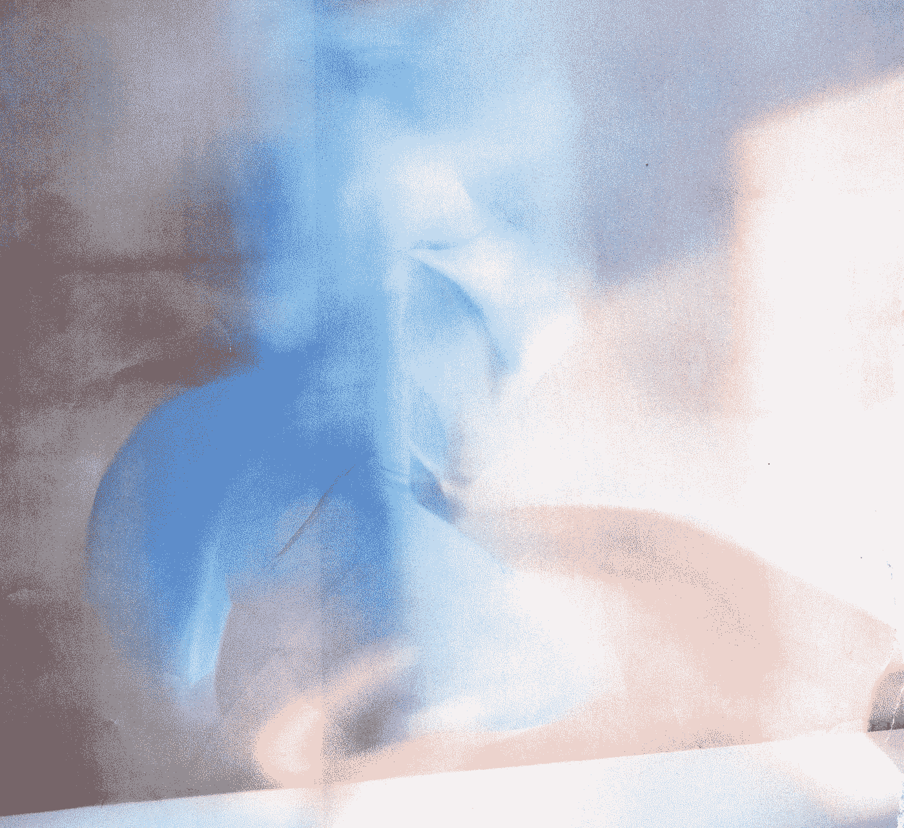
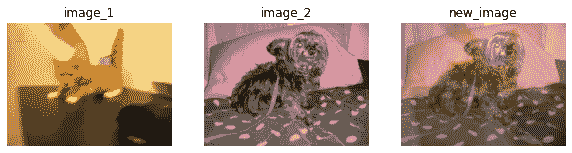
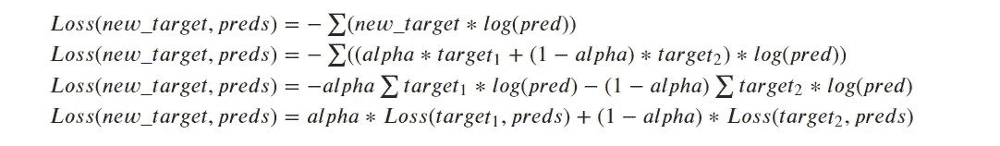
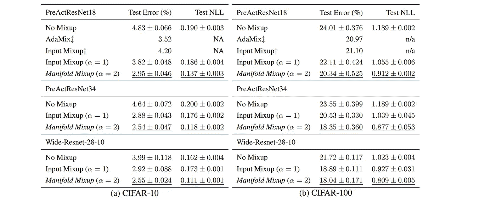

# 流形混合:通过插入隐藏状态学习更好的表示

> 原文：<https://medium.com/mlearning-ai/manifold-mixup-learning-better-representations-by-interpolating-hidden-states-8a2c949d5b5b?source=collection_archive---------6----------------------->



Photo by [Matt Moloney](https://unsplash.com/@mattmoloney?utm_source=medium&utm_medium=referral) on [Unsplash](https://unsplash.com?utm_source=medium&utm_medium=referral)

流形混合早在 2019 年就在[这篇](https://arxiv.org/abs/1806.05236)论文中介绍过，与之前发表的论文`[mixup: Beyond Empirical Risk Minimization](https://arxiv.org/abs/1710.09412)`类似。我们可以把`Mixup`看作流形混搭的一个特例。

# 混合(或输入混合)

混合可以通过以下公式实现:

```
new_image = alpha * image_1 + (1-alpha) * image_2
new_target = alpha * target_1 + (1-alpha) * target_2
```

我们正在混合两个图像(`image_1`和`image_2`)来创建一个新的图像。我们相应地更新目标值。

`alpha`值是从贝塔分布中取样的，并且在范围`[0,1]`内。

下面是一个与`alpha=0.4`混淆的例子。



Mixup example

这里`image_1`的目标是`[1,0]`，`image_2`的目标是`[0,1]`。因此，最终目标将是`[0.4, 0.6]`。

## 履行

*   跟随本笔记本一起[执行。](https://github.com/souvik3333/medium_blogs/blob/main/transforms/manifold_mixup.ipynb)
*   我们可以在训练时使用下面的代码来实现它。

```
def mixup_data(x, y, alpha=1.0):
    '''Returns mixed inputs, targets, and lambda
    Parameters
    ----------
    x: input data
    y: target
    alpha: value of alpha and beta in beta distribution 
    '''
    if alpha > 0:
        lam = np.random.beta(alpha, alpha)
    else:
        lam = 1batch_size = x.size()[0]
    index = torch.randperm(batch_size) # shuffle indexmixed_x = lam * x + (1 - lam) * x[index, :] # mixup between original image order and shuffled image order
    y_a, y_b = y, y[index] # return target of both images order

    return mixed_x, y_a, y_b, lam
```

*   我们返回`y_a`和`y_b`而不是`y_mix (alpha * y_a + (1-alpha)*y_b)`原因是因为我们在损失函数中进行混合标签操作，这样我们就不必改变损失函数。
*   下面是在混乱中损失的代码。

```
def mixup_criterion(criterion, pred, y_a, y_b, lam):
    """ Updated loss for mixup.
    Args:
    -----
    criterion: loss function to use, example: crossentropy loss
    preds: predictions from network
    y_a: original labels
    y_b: labels of the shuffled batch
    lam: alpha used for mixup
    """
    return lam * criterion(pred, y_a) + (1 - lam) * criterion(pred, y_b)
```

*   所以，如果我们取两幅图像(`image_1`和`image_2`)和它们的目标(`target_1`和`target_2`)。将有一个新的图像`new_image = alpha * image_1 + (1-alpha) * image_2`和一个新的目标`new_target = alpha * target_1 + (1-alpha) * target_2`。
*   让我们假设我们通过模型传递`new_image`，并在 softmax 之后得到`preds`结果向量。那么损失如下:



Loss with Mixup augmentation

*   我们使用了最后一个等式来计算损失，而不是上图中的第一个。
*   类似于损耗，我们计算输入混合批次的准确度如下:

```
def mixup_accuracy(metric, preds, y_a, y_b, lam):
    """
    Updated metric calculation:
    Args:
    -----
    metric: metric to use, example: accuracy
    preds: predictions from network
    y_a: original labels
    y_b: labels of the shuffled batch
    lam: alpha used for mixup
    """return lam * metric(preds, y_a) + (1 - lam) * metric(preds, y_b)
```

让我们用它来训练一个分类器。

*   创建一个支持混搭和传统训练的闪电模型:

```
class Model(pl.LightningModule):
    """
    Lightning model
    """
    def __init__(self, model_name, num_classes, lr = 0.001, max_iter=20, mix_up=False, alpha=1):
        """Model trainer class
        Parameters
        ----------
        model_name: Name of the timm model
        num_classes: number of classes in the dataset
        lr: learning rate
        max_iter: maximum iterations
        mix_up: use mixup augmentation or not
        alpha: alpha for beta distribution in mixup
        """
        super().__init__()
        # setup the model
        self.num_classes = num_classes
        self.model = timm.create_model(model_name=model_name, pretrained=True, num_classes=num_classes)
        # setup accuracy metric
        self.metric = torchmetrics.functional.accuracy
        # setup cross entropy loss function 
        self.loss = torch.nn.CrossEntropyLoss()
        self.lr = lr
        self.max_iter = max_iter
        self.mix_up = mix_up
        self.alpha = alphadef forward(self, x):
        return self.model(x)

    def shared_step(self, batch, batch_idx, is_train=False):
        x, y = batch
        if is_train and self.mix_up: # if mixup is true and train
            # prepare the mixup date
            x, y_a, y_b, lam = mixup_data(x, y, self.alpha)
            x, y_a, y_b = map(Variable, (x, y_a, y_b))
            # pass the new data through model
            logits = self(x)
            # calculate loss
            loss = mixup_criterion(self.loss, logits, y_a, y_b, lam)
            # calculate accuracy
            preds = torch.argmax(logits, dim=1)
            acc = mixup_accuracy(self.metric, preds, y_a, y_b, lam)
        else: # if mixup is false or validation
            # no change in data, we padd the batch data as is
            # pass the data through model
            logits = self(x)
            # calculate loss
            loss = self.loss(logits, y)
            # calculate accuracy
            preds = torch.argmax(logits, dim=1)
            acc = self.metric(preds, y)

        return loss, acc

    def training_step(self, batch, batch_idx):
        loss, acc = self.shared_step(batch, batch_idx, is_train=True)
        self.log('train_loss', loss, on_step=True, on_epoch=True, logger=True, prog_bar=True)
        self.log('train_acc', acc, on_epoch=True, logger=True, prog_bar=True)

        return loss

    def validation_step(self, batch, batch_idx):
        loss, acc = self.shared_step(batch, batch_idx, is_train=False)
        self.log('val_loss', loss, on_step=True, on_epoch=True, logger=True, prog_bar=True)
        self.log('val_acc', acc, on_epoch=True, logger=True, prog_bar=True)

        return loss

    def configure_optimizers(self):
        optim = torch.optim.Adam(self.model.parameters(), lr=self.lr)
        scheduler = torch.optim.lr_scheduler.CosineAnnealingLR(optimizer=optim, T_max=self.max_iter)

        return [optim], [scheduler]
```

**注意**:在 mixup 等式中提到的 alpha 和 lightning model 论证中提到的 alpha(姑且称之为`arg_alpha`)可能会混淆。这两个不一样。我们通过从`(-arg_alpha, arg_alpha)`之间的 beta 分布中选择一个随机值来获得 mixup 方程的 alpha。我们正在用`mixup_data`函数做这件事。

关于上面的 lightning 模型，有几点需要注意:

*   基于`mixup`是否启用，我们改变`shared_step`中的数据处理、度量和损失函数。
*   我们只在训练步骤中做`mixup`，为了验证，我们做正常处理。

我们将使用 CIFAR-10 数据集、数据加载器和转换，如下所示:

```
# standard image transform for classifier
transform = transforms.Compose(
    [transforms.Resize(224),
     transforms.ToTensor(),
     transforms.Normalize((0.5, 0.5, 0.5), (0.5, 0.5, 0.5))])
# batch size, reduce if cuda out of memory (should work fine in colab with gpu)
batch_size = 128
# get cifar-10 train set
trainset_full = torchvision.datasets.CIFAR10(root='./data', train=True,
                                        download=True, transform=transform)
# split train-full set 
# used trainset have 20000
trainset, trainset_remains = torch.utils.data.random_split(trainset_full, [20000, len(trainset_full)-20000])
# create train dataloader
trainloader = torch.utils.data.DataLoader(trainset, batch_size=batch_size,
                                          shuffle=True, num_workers=2)
# val dataloader
testset = torchvision.datasets.CIFAR10(root='./data', train=False,
                                       download=True, transform=transform)
testloader = torch.utils.data.DataLoader(testset, batch_size=batch_size,
                                         shuffle=False, num_workers=2)
# classes in cifar 10
classes = ('plane', 'car', 'bird', 'cat',
           'deer', 'dog', 'frog', 'horse', 'ship', 'truck') 
```

定义教练和检查点回叫。我们可以通过使用`Model`中的`mix_up`参数进行有无混淆的训练

```
model = Model(model_name="resnet18", num_classes=len(classes), lr = 0.001, max_iter=20, mix_up=False)
checkpoint_callback = ModelCheckpoint(
    monitor='val_loss',
    dirpath='./checkpoints',
    filename='resnet_18_org-{epoch:02d}-{val_loss:.2f}-{val_acc:.2f}'
)
trainer = Trainer(
    deterministic=True, 
    logger=True, 
    callbacks=[checkpoint_callback], 
    gpus=[0], # change it based on gpu or cpu availability
    max_epochs=5)
```

训练分类器:

```
trainer.fit(model=model, train_dataloaders=trainloader, val_dataloaders=testloader)
```

# 流形混合

*   流形混合进一步将混合思想扩展到隐藏层和输入层。我们可以定义流形混合如下。

```
new_input = alpha * input_1 + (1-alpha) * input_2
new_target = alpha * target_1 + (1-alpha) * target_2
```

请注意，我们已经将`image_1`更改为`input_1`、`image_2`更改为`input_2`并将`new_image`更改为`new_input`。这里，当我们说输入时，它可以在任何深层神经网络层输入。当该层是第一层时，则`input`将是`image`。

*   我们随机选择这一层。
*   我们拍摄两张图像，并通过神经网络传递它们，直到我们到达那一层。
*   我们取出中间特征表示(`image_1`的`input_1`和`image_2`的`input_2`)。
*   我们使用上面提到的等式将它们混合起来，以获得新的表示(`new_input`、`new_target`)。
*   对于具有混合数据的其余层，我们继续在网络中向前传递。
*   混合数据的输出用于计算损耗和梯度。

## 履行

*   我们将创建一个修改过的`resnet18`模型，它支持流形混合。
*   首先让我们看看 timm 库提供的基本 resnet18 模型。

```
model = timm.create_model(model_name=model_name, pretrained=pretrained, num_classes=classes)
```

*   我们需要选择一些图层来进行混音。resnet18 架构有 4 层，类型为`nn.Sequential`。因此，我们将在此基础上拆分模型。

```
def _model_setup(model):
        model_list = []
        count=0
        d = [] # start and end index of the layer blocks
        start_index = 0
        for index, layer in enumerate(model.children()): # check all the layers of the model
            count+=1
            if isinstance(layer, nn.Sequential): # if it is nn.Sequential then update the list d with start and end index
                d.append((start_index, count-1)) 
                start_index = count-1

        d.append((start_index, len(list(model.children())))) # append any remaining layers
        module_blocks = [ 
                nn.Sequential(*list(model.children())[index[0]: index[1]]) for index in d
        ] # insert each module blocks into a list, blocks are created based on the start and end index of each block

        return nn.ModuleList(module_blocks) # return the list as ModuleList
```

*   我们将创建一个中间转发函数，它将开始和结束索引与输入一起接受。它将只通过起始和结束索引内的模型块传递输入。

```
def _forward(self, x, i=0, j=None):
    assert i>=0 # make sure start index is >=0
    assert j is None or j<=len(self.model_list)-1 # max end index is num of blocks - 1
    assert j is None or i<=j # start index is < the end index
    if j is None: # if j is None pass till the end block
        j = len(self.model_list) for model_layer in self.model_list[i:j]:
        x = model_layer(x) return x
```

*   现在我们将创建转发函数。

```
def forward(self, x, mixup=False):
    index = None
    lam = None
    if mixup:
        k = np.random.randint(0, self.num_model) # select a random intermediate layer to mixup the o/p
        batch_size = x.size()[0]
        index = torch.randperm(batch_size) # shuffle index
        lam = np.random.beta(self.alpha, self.alpha) # select alpha randomly 
        if hasattr(self, "log"): # logging
            self.log("k", k, on_step=True, on_epoch=False, logger=True, prog_bar=True)
            self.log("lam", lam, on_step=True, on_epoch=False, logger=True, prog_bar=True)
        op_int = lam * self._forward(x, i=0, j=k) + (1 - lam) * self._forward(x[index, :], i=0, j=k) # mixup the op of k the layer
        op = self._forward(op_int, i=k, j=None) # pass the mixup remaining layers
    else: # if not mixup pass through all model blocks
        op = self._forward(x, i=0, j=None) return op, index, lam # return model output, shuffle order, lambda 
```

*   所以如果我们把所有的部分组合在一起，我们的`resnet18`模型将会是

*   训练时我们可以使用`Resnet18MM`跟随方式

因此，用于流形混合的闪电训练器可以如下实现

```
class ModelMM(pl.LightningModule):
    """
    Lightning model
    """
    def __init__(self, mixup_model, num_classes, lr = 0.001, max_iter=20, mix_up=False, alpha=1):
        """Model trainer class for manifold mixup
        Parameters
        ----------
        mixup_model: mixup model
        num_classes: number of classes in the dataset
        lr: learning rate
        max_iter: maximum iterations
        mix_up: use mixup augmentation or not
        alpha: alpha for beta distribution in mixup
        """
        super().__init__()
        # setup the model
        self.num_classes = num_classes
        self.model = mixup_model
        # setup accuracy metric
        self.metric = torchmetrics.functional.accuracy
        # setup cross entropy loss function 
        self.loss = torch.nn.CrossEntropyLoss()
        self.lr = lr
        self.max_iter = max_iter
        self.mix_up = mix_up
        self.alpha = alphadef forward(self, x, mixup=False):
        return self.model(x, mixup)

    def shared_step(self, batch, batch_idx, is_train=False):
        x, y = batch
        if is_train and self.mix_up:
            logits, index, lam = self(x, True)
            y_a, y_b = y, y[index]# # x, y_a, y_b, lam = mixup_data(x, y, self.alpha)
            # # x, y_a, y_b = map(Variable, (x, y_a, y_b))
            # logits = self(x)
            loss = mixup_criterion(self.loss, logits, y_a, y_b, lam)
            preds = torch.argmax(logits, dim=1)
            acc = mixup_accuracy(self.metric, preds, y_a, y_b, lam)
        else:
            logits, _, _ = self(x, False)
            loss = self.loss(logits, y)
            preds = torch.argmax(logits, dim=1)
            acc = self.metric(preds, y)

        return loss, acc

    def training_step(self, batch, batch_idx):
        loss, acc = self.shared_step(batch, batch_idx, is_train=True)
        self.log('train_loss', loss, on_step=True, on_epoch=True, logger=True, prog_bar=True)
        self.log('train_acc', acc, on_epoch=True, logger=True, prog_bar=True)

        return loss

    def validation_step(self, batch, batch_idx):
        loss, acc = self.shared_step(batch, batch_idx, is_train=False)
        self.log('val_loss', loss, on_step=True, on_epoch=True, logger=True, prog_bar=True)
        self.log('val_acc', acc, on_epoch=True, logger=True, prog_bar=True)

        return loss

    def configure_optimizers(self):
        optim = torch.optim.Adam(self.model.parameters(), lr=self.lr)
        scheduler = torch.optim.lr_scheduler.CosineAnnealingLR(optimizer=optim, T_max=self.max_iter)

        return [optim], [scheduler]
```

*   对于流形混合，我们可以使用相同的数据集、数据加载器和转换。

# 结果

下表显示了在 CIFAR-10 和 CIFAR-100 数据集上混合(输入混合)和流形混合的结果。五次重复的标准偏差。



Performance of Mixup augmentations from the paper

流形混合改进了多层神经网络的隐藏表示和决策边界。这解决了分布变化、异常值和对立例子等问题。

我个人喜欢使用这种增强，因为它有助于创建健壮的模型。希望这对您有所帮助。喜欢就拍拍文章，喜欢就关注我。过得愉快😃。

资源:

*   实施笔记本:[这里](https://github.com/souvik3333/medium_blogs/blob/main/transforms/manifold_mixup.ipynb)

[](/mlearning-ai/mlearning-ai-submission-suggestions-b51e2b130bfb) [## Mlearning.ai 提交建议

### 如何成为 Mlearning.ai 上的作家

medium.com](/mlearning-ai/mlearning-ai-submission-suggestions-b51e2b130bfb)