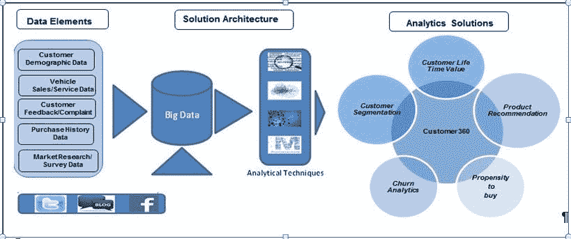
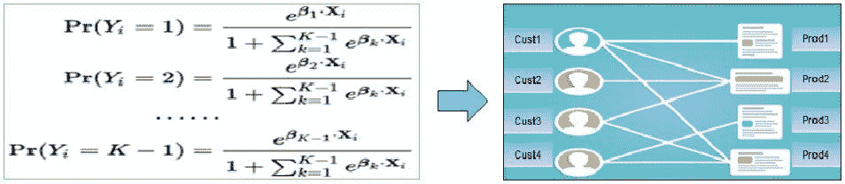
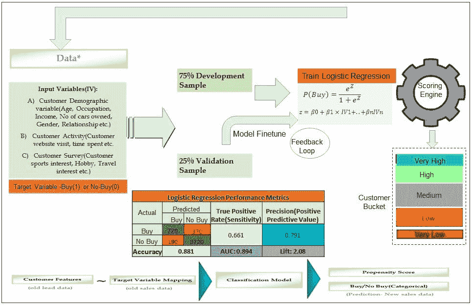
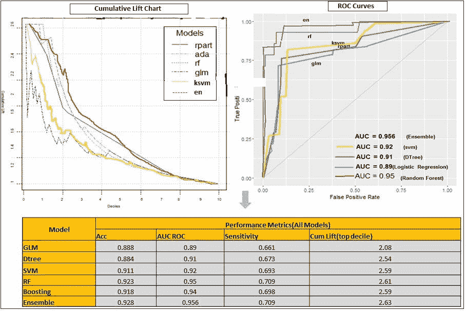
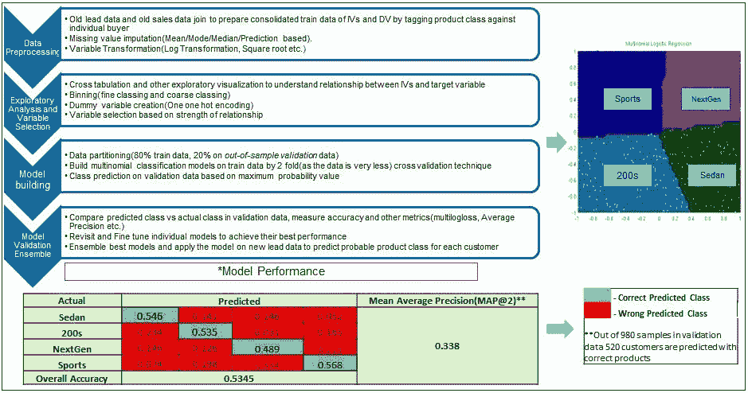
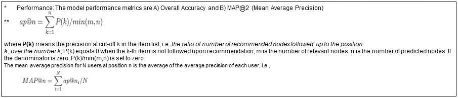
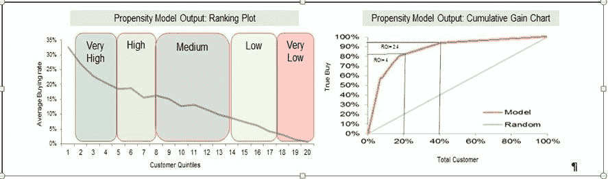
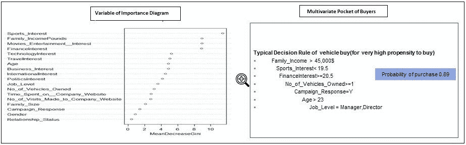
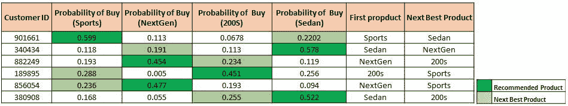
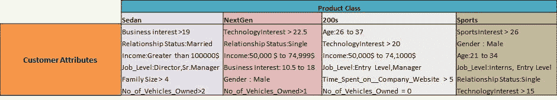

# 通过高级分析最大限度地提高销售线索转化率和营销效率——汽车行业背景

> 原文：<https://medium.com/mlearning-ai/maximizing-lead-conversion-and-marketing-effectiveness-through-advanced-analytics-an-automobile-172a92ddd966?source=collection_archive---------1----------------------->

如今，组织面临的一个主要挑战是利用各种接触点在正确的时间对正确的客户做出反应并接触他们，以改善客户体验并建立客户忠诚度。能够为促销活动确定正确的目标细分市场和正确的解决方案是每个行业的共同业务目标，如制造业、电信业、BFSI、零售业等。

车辆制造商和服务提供商正努力为每一个车辆家族/车辆类型(SUV、轿车、MUV 等)确定合适的客户组合。)类型和影响客户购买最佳车辆的因素(销售驱动因素)，以优化产品/服务组合和活动设计。由大数据和尖端机器学习技术掌舵的高级分析使组织能够比以往任何时候都更好地了解客户，从而找到以下业务问题的答案:

1)谁是具有高购买倾向的目标客户，以便更好地转化，使促销/活动有效

2)有效且有影响力的营销活动的驱动因素是什么？

3)特定客户群的正确产品组合是什么？

随着新“大数据”时代的发展，组织中充斥着大量有用的数据，以结构化、非结构化和半结构化的*形式，在各个接触点收集，以便全方位了解客户。使用这种客户接触点数据，可以构建定制的高级分析解决方案，为营销和 CRM 职能的整个生态系统带来价值。*

图 1:营销和 CRM 价值链分析解决方案的广度

随着分析的成熟度和复杂性的增加，组织能够通过准确识别促销活动的正确目标细分市场、正确的渠道组合来设计正确的客户获取、保留和关系策略，从而在正确的时间以正确的价位获得正确的产品/服务。由数据驱动的洞察力和预测模型支持的营销职能效率的提高，帮助组织以更少的资源(降低成本、人力等)实现更多的收入(美元)/销售额(数量)增长。

案例研究简介

客户:在北美和欧洲占据主导地位的大型汽车巨头。

业务需求:基于以下可用的数据元素，营销和营销活动关系团队喜欢确定并瞄准合适的客户(最有可能)提供合适的产品，以促进销售并提高营销活动的有效性(降低平均客户获取成本)。

1)旧线索数据:包括询问车辆的客户的客户详情、人口统计和个人兴趣详情。

2)旧销售数据:-包括购买车辆的客户(从旧销售线索数据转换而来的销售线索)、购买车辆的详细信息和功能列表

3)新潜在客户数据:由询问车辆及其人口统计和个人兴趣的新客户(尚未做出决定的新潜在客户)组成。

衍生分析问题和解决方案框架:

1)购买倾向模型:通过计算新线索的*购买概率*分数，为不同分数区间设计定制的活动策略，优化线索转化。典型二元分类技术(逻辑回归、SVM、决策树等。)是这里广为接受的方法。

*模型方程:*

*Y=(截距)+ (* IV1) + ( * IV2) + ( * IV3) +……。+ ( * IVn)*

*购买概率= exp(Y) / (1 + exp (Y))*

2)产品推荐系统:这是一个经典的多项分类问题，建立多类模型(多项逻辑回归、CHAID、随机福里斯特等)。)为每个类别建立概率分数，并选择具有最大概率值的类别。也可以使用其他推荐方法(协同过滤、基于内容的过滤等)。

图 2:多项式分类模型和产品推荐系统

解决方法:

购买倾向预测模型:-。这是一个经典的二进制分类模型，使用旧的销售线索数据功能，并将购买标志(如果有购买，则为 1 或 0)映射到旧销售数据中的旧客户。在总共 20000 个销售线索中，我们有 4300 个客户购买了我们的产品(事件发生率-21.5%)。使用以下分类技术，并且最终模型是所有模型的平均集合模型，以增加准确性并减少方差(过拟合)。然后，该模型应用于新的销售线索数据，以计算每个新客户的购买可能性得分和类别预测(购买或不购买)。

1)逻辑回归

2)基于树的模型

3) SVM

4)随机福里斯特

5)自适应增压

(我将在另一篇文章中讨论单独的模型构建技术。)

图 3:购买倾向模型框架

模型性能:我们有四个模型拟合优度的性能标准，A) AUC ROC(受试者操作曲线下面积)，B)累积提升/增益(累积准确度分布)，C)总体准确度(总正确分类/总病例数)，D)灵敏度(真阳性/实际阳性)。尽管不详尽，以下是关于*样本外验证*数据(5000 个客户)的一些模型性能结果。

图 4:模型性能比较—指标、累积提升图和 AUC-ROC

从 lift 和 ROC 中可以清楚地看到，几乎所有的模型都很好地完成了区分(排序)潜在买家和非买家的工作。几乎所有模型在最高十分位数(总人口的 10%)中的累积提升分数都超过 2.5，这意味着在该分数范围内，给定评分模型比随机模型好 2.5 倍。

产品推荐系统:从旧的销售数据样本中，我们发现共有 430 辆车购买了以下四个类别。利用这些历史数据，利用其他客户人口统计和兴趣特征，我们建立了多项式分类模型来预测新线索的可能类别

1)体育

2)下一代

3)200 个

4)轿车

已经建立了以下四种类型的模型，最终概率得分是这些模型的平均集合，以提高预测的准确性并减少方差。

1)多项逻辑回归

2) CHAID

3)随机森林

4)梯度推进(GBM)

图 5:多项式分类模型构建和性能度量

可操作的见解和商业价值创造:从倾向模型输出中，我们的客户获得一些重要的可操作的见解，以采取纠正措施，微调他们的活动策略，更加关注客户，最大限度地提高购买汽车的可能性。此外，提前确定购买倾向较低的潜在客户也是推出定制促销的机会(奖励积分、降价等。)对于这个细分市场来说转化率最大化。

图 6:倾向模型洞察

从上面的排名图中，企业可以清楚地了解每个客户群的购买倾向。从累积收益图中，营销团队可以就营销活动的目标客户制定策略，以最大化营销活动的投资回报率。从累积收益图中，我们可以看到，只瞄准总销售线索的前 20%，销售团队就可以实现总销售量的 80%以上，达到 400%的相当高的投资回报率。如果想获得 95%的总购买者，它必须根据倾向得分，专注于前 40%的线索，以实现 240%的投资回报率。

现在，很自然地要问，所有这些模型和见解的财务影响是什么，才能决定该解决方案的价值。以下是使用一些简化假设对财务收益的说明性计算。，尽管在实际业务中，这种方法可能稍微复杂一些。

如果我们的合作伙伴每月有 50000 个销售线索(询盘)和平均沟通成本(电话、邮件、直接拜访等)。)是$2/，那么在没有倾向模型的情况下，客户关系团队必须将转换概率为 0.22 的所有线索作为目标。因此，这里的营销成本约为 100000 美元。11000(0.22 × 50000)销售额。现在，使用这种仅针对前 20%(10000)、前 40%(20000)和前 45%(22500)潜在客户的倾向模型，可以实现 8800 辆(80%的真实购买)、10450 辆(95%的真实购买)和 10945 辆(99.5%的真实购买)的汽车销售。虽然最后两个数字非常接近第一种情况下的真实总销售额，但在营销预算方面却节省了每月 60000 美元(30000 × 2)和 55000 美元(27500 × 2)。这种营销预算的减少可以用于发起定制的活动来增加转化率。现在，营销团队必须优化截止倾向得分，以瞄准更多/更少的客户，从而在营销预算的减少和销售数字的增加之间进行权衡。

此外，这些模型将有助于营销 SBU 了解不同独立变量(客户特征和活动)与汽车销售率之间的关系(线性/非线性),进而洞察销售驱动因素或区分潜在买家和非买家的重要特征。了解这些驱动因素和确切的关系后，客户团队可以针对不同的客户群制定不同的活动策略，并为买家确定特征组合(决策规则)。

图 7:倾向模型洞察——销售和购买决策规则的驱动因素

多项式分类算法帮助促销团队建立了自动推荐系统，为每位客户推荐合适的车辆。

图 8:自动化产品推荐系统

此外，它还能洞察每个产品类别的关键购买者特征(行为属性)，以便促销团队能够更好地了解各自的目标受众。

图 9:产品客户属性矩阵

未来之路:案例研究展示了如何使用高级分析框架，利用内部可用数据(客户数据库、售前和销售数据等)为营销人员解决一个非常常见的业务问题。)和市场调研数据(问卷和调查数据)。今天，随着大数据技术的发展和万亿字节数据的爆炸，有可能使用其他数据源，特别是利用社交媒体空间，如脸书、Twitter 等。必须获得客户的实时信息。

有无数的机会来集成这些非结构化数据元素，并执行最新的技术，如高级文本挖掘，NLP 等。了解个别客户对产品/服务的看法，以便做出更明智的决策。这将使竞选策略更加有效和精确。