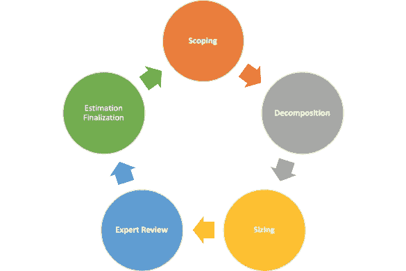

# ML——估计或预测

> 原文：<https://medium.com/mlearning-ai/ml-estimation-or-prediction-9b22fdc364c8?source=collection_archive---------10----------------------->

啊！估计！作为一名软件工程师，如果你没有为手头的任务提供工作量评估，那么这个旅程就永远不会结束。它可以是对现有产品的一个小的改进，也可以是通过添加一个新特性或一组新特性的方式进行的中等规模的改进。有效构建软件的旅程始于工作量估算以及为提供这些估算所付出的努力！！！

感谢你对我的第一篇文章的支持，让我来到这里写这篇文章。

估计，我觉得是艺术和科学的结合(数据科学？？)利用你在工作领域的知识和经验。

Estimation

自从我开始研究机器学习以来，我一直将估计视为一种预测形式，同时感到惊讶和悲伤。可悲的是，因为我在这么多年的估算后最近才意识到这一点，并对 ML 还没有被提议用作估算工具感到惊讶！

正如我们所知，ML 需要大量的历史数据来达到良好的预测模型并保持良好的准确性。当谈到软件项目的工作量估算时，过去的经验很重要，可以获取的数据量应该基于这些经验和这些估算的有效性。这确实是一个艰难的旅程，因为大部分估算工作都是基于估算者的经验，因此在数量和质量上可能会有所不同。秘诀和努力在于捕捉这些经验，并将它们转换成数据，以支持未来的评估。

由于“使用 ML 进行预测的评估”的想法最近才出现，所以我试图将可用于预测工作的属性放在一起。考虑到软件开发的性质，估计会根据要开发的组件而有所不同。添加数据库表与编写使用底层数据的数据库访问层相比，需要考虑不同的属性。UI 和业务对象有自己的考虑和复杂性，控制着实现它们的努力。

因此，我觉得为每个领域建立不同的评估模型(数据库等)将是有益的，也是正确的方法，因为每个领域的评估驱动因素各不相同。收集这些数据将是我使用 ML 实现工作量估算的下一步。

估计的准确性(这是什么概念！！)将依赖于通过改变属性对模型的多次尝试，直到我得到一个满意的集合。我肯定已经准备好了第一个属性——“直觉”(这种感觉的强度)，其余的将基于数据。我觉得“助推模型”最适合这种方法……让我想想。

很快，我希望回来发布我的第一次试验的所有细节。鼓励你也朝这个方向思考，并提供你在实现这个目标方面的宝贵见解，或者分享你的经验(通过评论),如果你已经深入研究了使用 ML 进行工作估算的这个领域。

感谢阅读！

 [## Mlearning.ai 提交建议

### 如何成为 Mlearning.ai 上的作家

medium.com](/mlearning-ai/mlearning-ai-submission-suggestions-b51e2b130bfb)