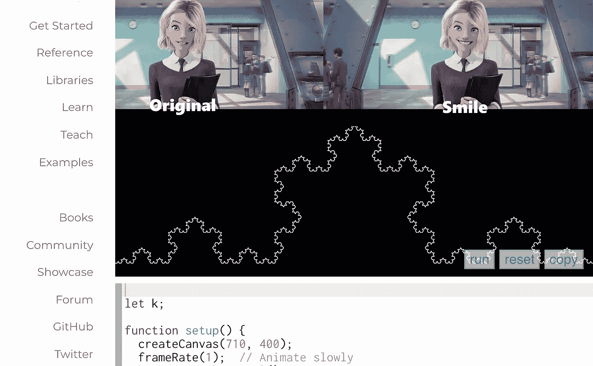

# 2022 年 2 月

> 原文：<https://medium.com/mlearning-ai/ml-february-2022-9aa306003930?source=collection_archive---------8----------------------->

## [在 Python 中什么时候为什么要用](/mlearning-ai/mlearning-ai-submission-suggestions-b51e2b130bfb) `[:=](/mlearning-ai/mlearning-ai-submission-suggestions-b51e2b130bfb)` [胜过](/mlearning-ai/mlearning-ai-submission-suggestions-b51e2b130bfb)`[=](/mlearning-ai/mlearning-ai-submission-suggestions-b51e2b130bfb)`

## [游戏人生](/mlearning-ai/how-can-we-tell-stories-with-code-e5be9b05c1ee)

一定要在这里 [**订阅**](https://datasculptor.medium.com/membership) 🔵永远不要错过另一篇关于人工智能艺术的文章

[a collaboration of art and science](https://mlearning.substack.com/p/a-collaboration-of-art-and-science?r=z7zu8&utm_campaign=post&utm_medium=web)

生命的游戏是生物出生、进化和死亡的数学模型。这种模拟有助于理解物种如何组织食物网和能量网。游戏…