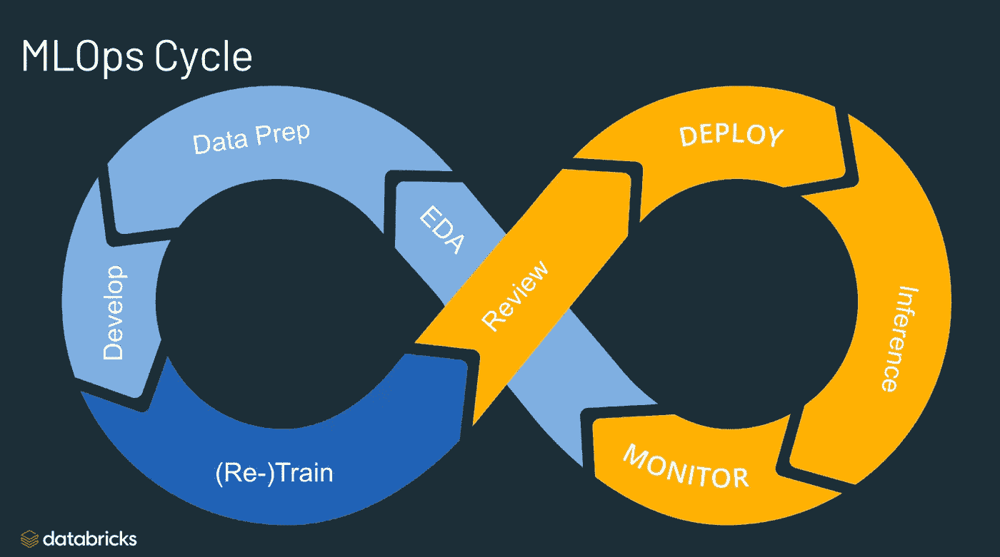
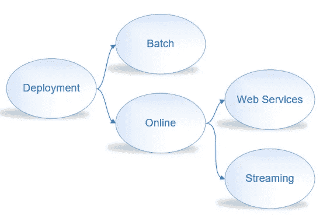
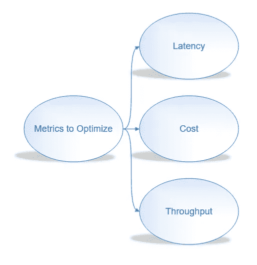

# 模型服务介绍

> 原文：<https://medium.com/mlearning-ai/mlops-model-serving-introduction-ee7e2fb9b9ab?source=collection_archive---------0----------------------->

source: [databricks](https://databricks.com/)

简而言之，MLOps 与 DevOps 没有太大的不同，它包含了许多在现实世界中部署模型的技术。对每个人来说显而易见的是，在开发一个模型之后，您需要在现实世界中为各种用例部署它。这篇文章简要介绍了作为 ML/DL 工程师、数据科学家等完成 ML/DL 旅程所需要了解的关键要素。

source: [unsplash](https://unsplash.com/photos/RzTyjvyWk6Y) by Pat Whelen

这是我们作为数据科学家经常面对的一般程序。

1.  数据预处理
2.  找到与我们的数据一致的模型
3.  编码–提议/开发模型
4.  培训/测试—微调
5.  部署

*   从程序中，我们可以看到三个组成部分(**推理过程**)是至关重要的:1 .输入数据 2。翻译(用于执行)3。模特
*   没有部署的模型在现实世界中是没有用的
*   部署可以是手机上的应用程序或系统中的软件等。
*   不需要服务基础设施，你可以使用 [Colab](https://colab.research.google.com/)

# 模特服务:

*   部署我们提出的模型有两种类型:1 .第二批。在线的

> ***批量推断(静态学习)***

*   在**批量干涉**中最常见的方式是，我们 ***训练*** 模型和 ***预测*离线**
*   当我们以**批量方式**部署时，该模型将保持不变，直到我们决定重新训练该模型。再训练的决定是因为遇到大量真实数据(**模型衰减**)
*   该预测基于以前使用的历史数据。
*   这种方式适用于那些没有顺序或者不会随时间变化的数据。

> ***【在线推理(动态学习)】***

*   该模型在接收新数据如流数据等时被重新训练。
*   这种类型的学习主要用于那些随时间变化的数据，如语音、传感器等。
*   由于适应新事件或行为的能力，这种方式对于实时预测(按需预测)是很好的。

## 在线推理的优化

我们应该考虑三个重要指标:

> ***1。潜伏期***

*   **延迟**是从 ***用户请求*** 直到收到 ***应答*** 的时间。
*   换句话说，*发送* *请求*，*操作推断*，*接收* *响应*的过程
*   延迟是获得客户满意度的关键要求

> ***2。成本***

*   目的是使成本 ***最小*** 尽可能多。

对此，我们可以使用 ***不同的基础架构***:*CPU*/*GPU*/*缓存*

> ***3。吞吐量***

*   指 ***的*号*成功请求*** 送达*个单位时间*
*   在某些情况下，我们更看重吞吐量而不是延迟(*特别是对于* ***繁重的任务*** *比如视频的模型等等。*)

> 简而言之，我们的目标是最小化延迟，同时最大化吞吐量
> 
> 然而，这大大增加了成本。所以，我们应该在这三者之间找到一个平衡点。

有些任务我们可以 ***增加吞吐量******减少延迟*** 关于 ***开销*** : **1** 。*使用 GPU 共享* **2** 。*多模式上菜等。* **3** 。*优化模型。*

这些是在服务器上托管模型的 MLOps 的基本概念，也是您在决策阶段需要考虑的标准。

我让这篇文章足够短，以避免任何时间浪费或过于详细。这就足够了解一个介绍了。反正我会多写一些关于 MLOps 的文章来深入搞清楚。

> 希望你觉得我的文章有用；如果是真的，我推荐你在**媒体**上**关注**我，因为我要写更多关于 **MLOps** 和可能**动手**的文章。

> 如果还有什么事可以**直接联系**我**通过 [***推特***](https://twitter.com/reza__yazdanfar)****或者*[***LinkedIn******。😉***](http://www.linkedin.com/in/rezayazdanfar)*

* [## Mlearning.ai 提交建议

### 如何成为 Mlearning.ai 上的作家

medium.com](/mlearning-ai/mlearning-ai-submission-suggestions-b51e2b130bfb)*