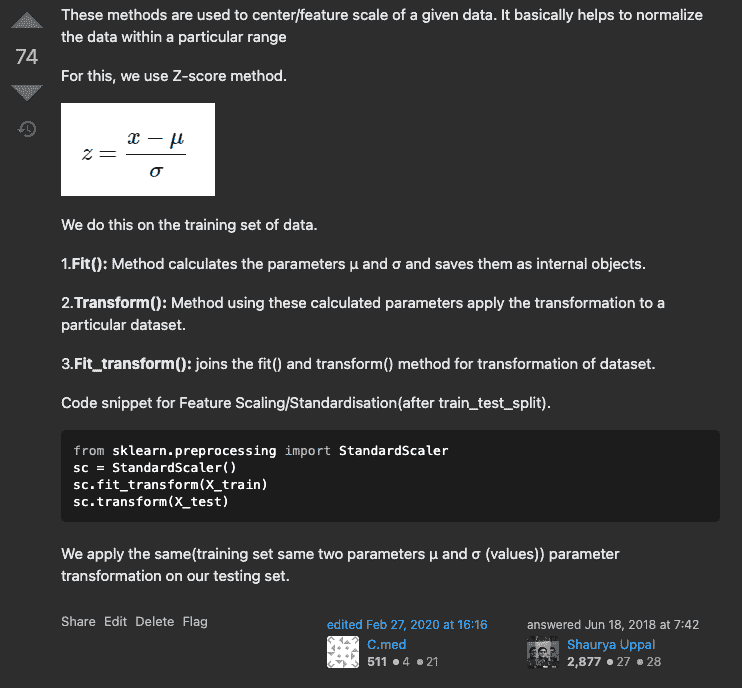

# 沃尔夫先生再次愚弄数据科学团队——数据泄露骗局🐺

> 原文：<https://medium.com/mlearning-ai/mr-wolf-fools-the-data-science-team-again-data-leakage-scam-cebecb1c5704?source=collection_archive---------3----------------------->


Mr. Wolf

> 狼先生早前 [*p-hacked 了一个 AB 测试实验*](https://www.linkedin.com/pulse/mr-wolf-p-hacked-fooled-team-management-learn-ab-testing-uppal/) *现在又回来了另一个恶作剧——数据泄露。*

这些年来，我看到和目睹了一些狼先生(专家数据科学家——虚拟人物)的恶行。之前他是 [p-hacking](https://www.linkedin.com/pulse/mr-wolf-p-hacked-fooled-team-management-learn-ab-testing-uppal/) 现在他又想出了一个忽悠团队的招数。为了阻止狼先生，我用我写作的力量揭露并揭发了他所有的恶行。

# 沃尔夫先生做错了什么？

Wolf 先生创建了一个数据科学模型，该模型由于数据泄露而表现过度。对数据的粗心处理会破坏您的数据科学模型。沃尔夫分享的指标看起来非常吸引人，但在生产中，这种模式崩溃了。

# 沃尔夫先生在研究什么？

Wolf 先生正在研究一个点击率预测模型，他使用了一些特征，比如平均会话时间、用户平均点击量等等。但是在取平均值时，他也包括了训练数据周期，这导致了数据泄漏。

> *举例说明:如果您想预测 X 天的点击率，您只知道推断到 X-1 天(不是当前日期)的平均点击率，但在训练模型时，您包括了 X 天的平均点击率输入，这导致了数据泄漏。*

训练模型后，Wolf 先生分享了测试数据指标:AUC-ROC 超过 0.8，这好得令人难以置信。


Celebration

> 狼先生欢喜庆祝！！！🎊 🎉


这种快乐并没有持续很久，沃尔夫先生的模型在生产中破产了，表现很差。后来，post 审查并彻底检查了 Wolf 先生的代码库，发现了数据泄露问题，并向他指出了这一点。我为他感到难过，因为他之前很开心——这让我想起了一句名言。😂

在执行数据科学任务时，维护数据卫生至关重要。缺乏对数据卫生的巨大威胁的认识:数据泄漏；即使是经验丰富的数据科学家也可能会不知不觉地陷入这种困境。

> *数据泄露是使用训练数据以外的信息训练模型时出现的现象。它本质上违反了训练数据的独立性，并允许它被来自外部来源的信息所改变。*

简单来说，当训练过程中使用的数据包含有关模型试图预测的信息时，就会发生数据泄漏。训练数据需要完全独立于测试数据。测试集中的值应该与训练集中的值无关。

如果您在这种情况下未能识别数据泄漏，您可能会被骗以为您的模型是健壮的，只是在部署后发现它完全不可靠，就像 Wolf 先生的情况一样。

因此，确保在处理数据时不会无意中导致任何数据泄漏是非常重要的。


> *奖金:另一个经典的数据泄露案例，我经历过的是 StandardScaler 的错误实现。*

错误的方法:

```
from sklearn.preprocessing import StandardScaler
sc = StandardScaler()
sc.fit_transform(X)
X_train, X_test, y_train, y_test = train_test_split( X, y, test_size=0.33)
```

正确方法:

```
from sklearn.preprocessing import StandardScaler
X_train, X_test, y_train, y_test = train_test_split( X, y, test_size=0.33)
sc = StandardScaler()
sc.fit_transform(X_train)
sc.transform(X_test)
```

要了解 fit_transform()，transform()和 fit()的区别:参考我的 StackOverFlow 回答(下面加的图片)。



## 我希望你学到了新东西。如果你喜欢，请订阅，点击👍或者❤️，并与他人分享。敬请期待下一期！

如果你觉得这篇文章有用，请在 [LinkedIn](https://www.linkedin.com/in/shaurya-uppal/) 上联系、关注或支持我。要了解更多关于我的信息，请访问:[这里](https://linktr.ee/shauryauppal)

与我联系(一对一对话):[屏蔽我的日历](https://topmate.io/shaurya)咨询/建议。

[](/mlearning-ai/mlearning-ai-submission-suggestions-b51e2b130bfb) [## Mlearning.ai 提交建议

### 如何成为 Mlearning.ai 上的作家

medium.com](/mlearning-ai/mlearning-ai-submission-suggestions-b51e2b130bfb)