# MTCars

> 原文：<https://medium.com/mlearning-ai/mtcars-f68f02c29a2?source=collection_archive---------3----------------------->

## 贝叶斯方法

到目前为止，我已经做了几个[贝叶斯方法](/mlearning-ai/mixed-models-of-chicks-weight-a41413c99b51)的帖子，我不会停止，直到我推出几个[别人](/@marc.jacobs012/good-old-iris-93358b8ecdbd)。这样做的原因是因为我想让你从编程的角度熟悉贝叶斯分析。R 有一些很棒的工具通过贝叶斯定理建模，和大多数东西一样，你可以通过至少四种不同的方式建模。

今天，我将在 MTCars 数据集上使用贝叶斯分析，这是 r 中的标准数据集。这很好，所以你可以很容易地重新创建我的代码，我将在底部发布。这样做的原因是因为我想让你从图形的角度看我做了什么，看输出并阅读下面的文本。我在这篇文章中展示的并不是我将在最后展示的全部多余代码，而仅仅是足够得到一点线索。然后，通过探索和尝试运行贝叶斯分析可用的众多选项，自己动手，希望永远不要忘记主要方面，如先验、似然、后验和[条件概率](https://blog.devgenius.io/marginal-vs-conditional-probabilities-visualizations-and-models-in-r-e7288ad26cb9)。

好吧，那我们开始吧。数据集对你来说应该有些熟悉，如果不熟悉，它不是潘多拉的盒子。

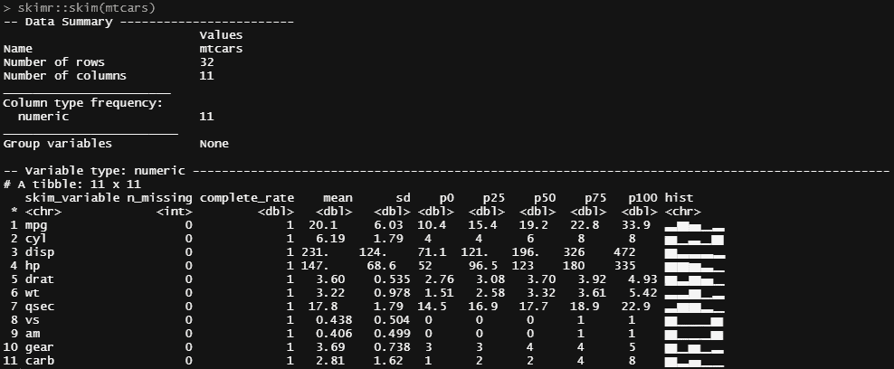

The **skimr** package is great for getting that first glimpse of the data.

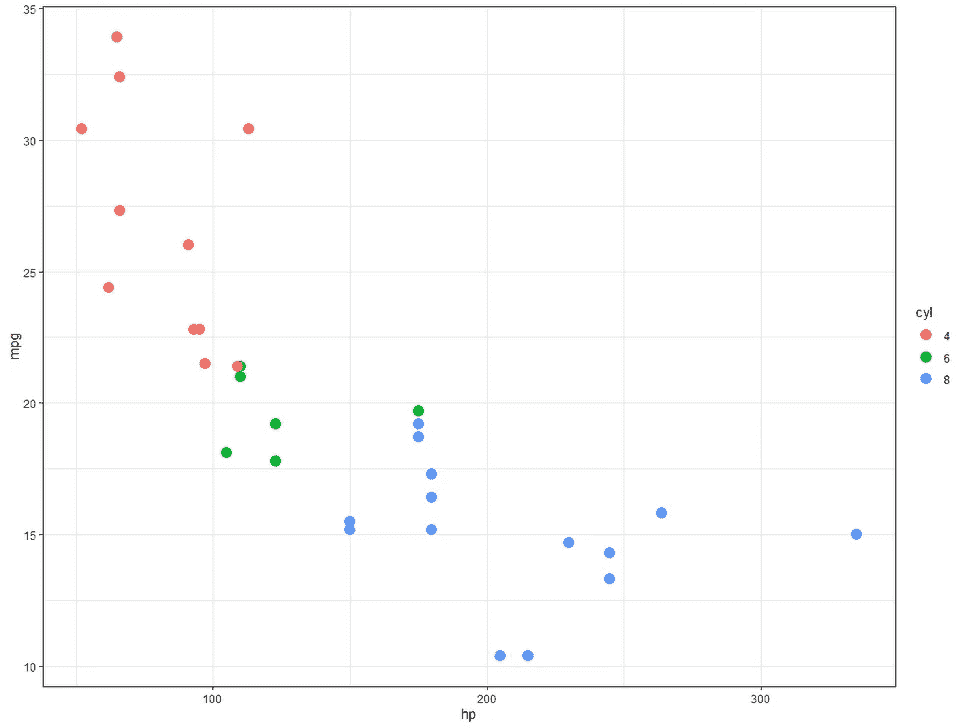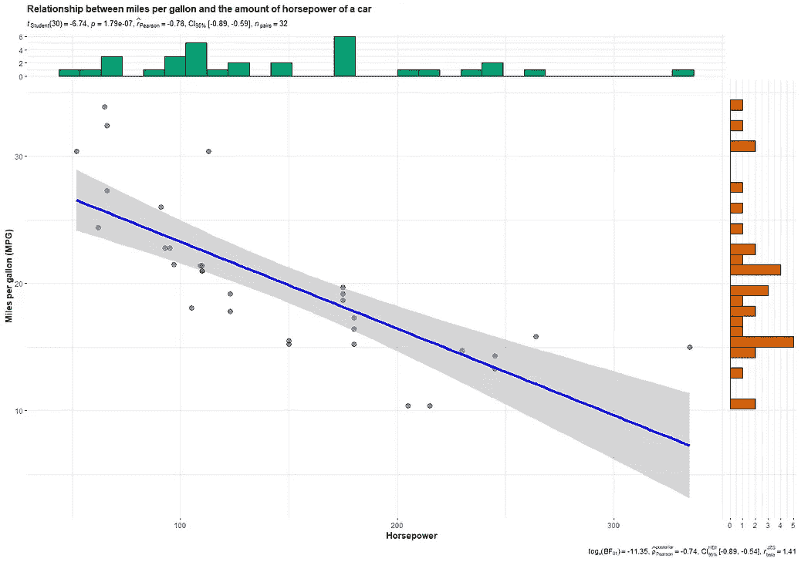

Then of to using **ggplot** and the **ggstatsplot** packages for getting clear, and not so clear graphics. There is such a thing as overkill and the latter plot is definitly showcasing it.

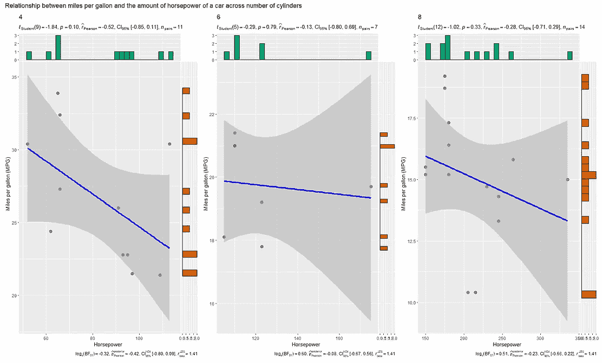

To the left another overkill plot and to the right a nice clean correlation plot which can come in handy.

贝叶斯分析最重要的部分——先验。先验是你到目前为止所拥有的知识，这些知识应该解释一些事情。这不是含糊的，它应该意味着别的什么，为什么我们要做这个分析呢？

但是，首先，没有任何前科。我们将让 **brms** 包决定，谁不想( *flat* )或者从几乎是自我实现预言的数据中得到它们。

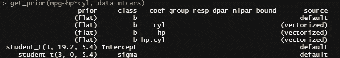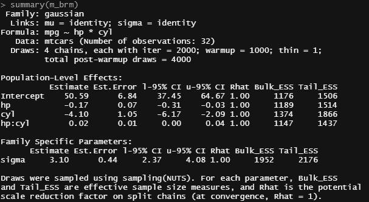

And, here we go. This is maximum likelihood, since without priors the posterior estimates from the model account whatever is inside the data — which amounts to maximum likelihood.

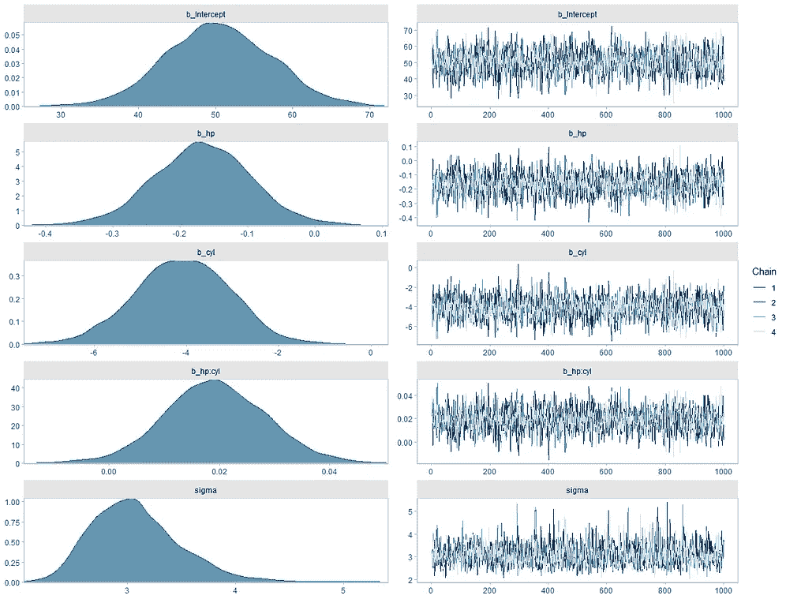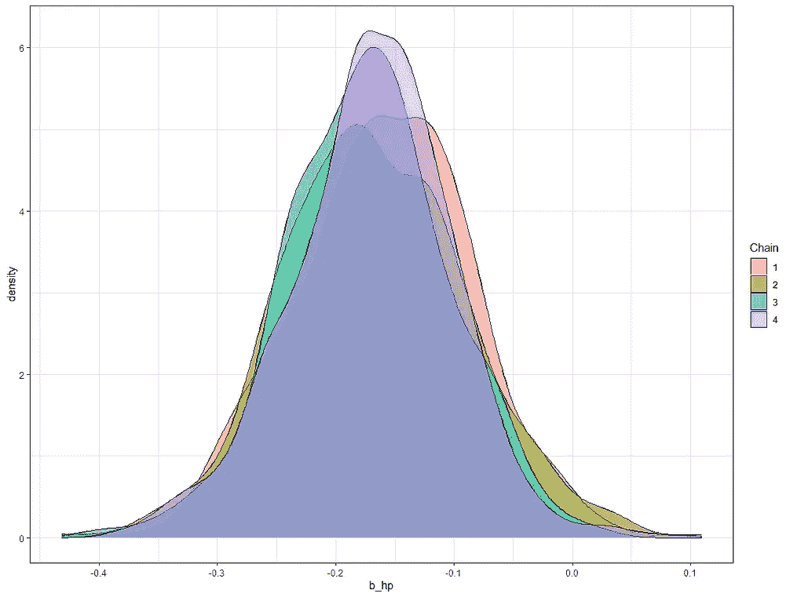

Chains of course look good, since no integration between prior and likelihood was necessary. To the right, the distribution of the **hp** variable for all four chains. They do not have to be the same but should be, to some extent, overlapping.

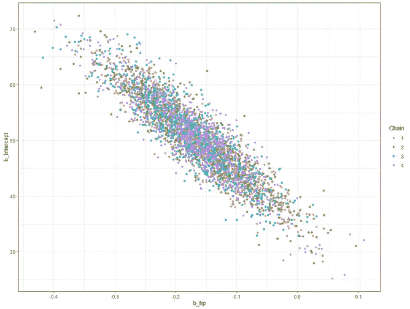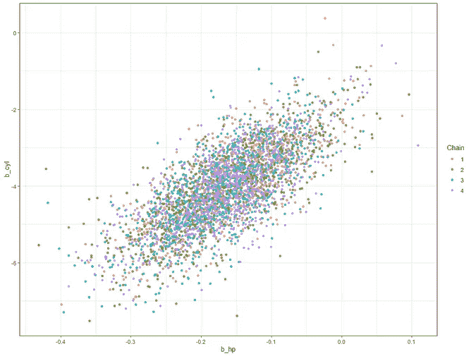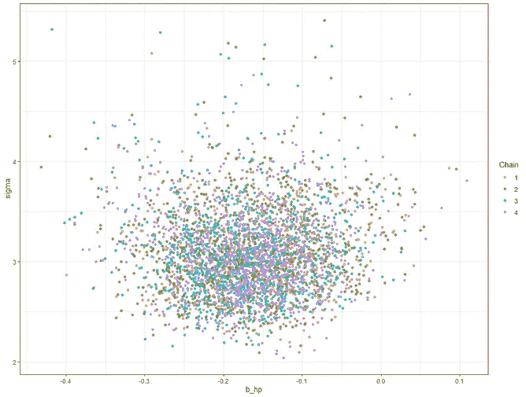

The relationship between the variables(intercept, **hp**, and **cyl**), as can be seen coming from the different sampling chains. As already mentioned, the chains should be overlapping, but may deviate. They should not deviate much, as you would not expect drivers doing completely different laps when racing on a race track. At a certain moment, it should al coincide. The plot to the left shows the assumption of the gaussian model which is that the residual variance has not relationship with any of the parameters, which it does not. Here, the variance is unrelated to **hp**.

这很有趣，但一点也不有趣。是时候使用信息丰富的先验知识了，也就是说，我将陈述我目前在这个问题上的知识，并选择以最佳方式模拟这些知识的分布和超参数。

方差估计的分布是最有趣的，因为它们左边有一个自然的零边界。方差可以是无限的，但有一个向下的极限，即零。不允许负方差，所以如果我们使用正态分布，我们会允许它变成负值，这会妨碍抽样程序。因此，我将使用伽玛分布。而且我想它不会太紧，但肯定也不会无限。

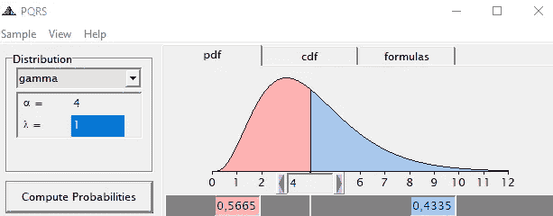

The PQRS tool is a great tool for quickly looking at several distributions, and calculating their mean and variance.

对于其余的，我期望在 **mpg** 和 **cyl** 之间有更强的关系，然后是 **hp** ，但是我更确定关于 **hp** 。 **cyl** 和 **hp** 之间有交互作用，但不过分。我有一个信息丰富的**截距**，当然还有残差方差的标准差的*伽马分布*，在 [**brms**](https://cran.r-project.org/web/packages/brms/index.html) 中标记为**西格玛**。

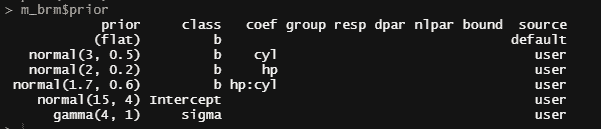

The priors I used.

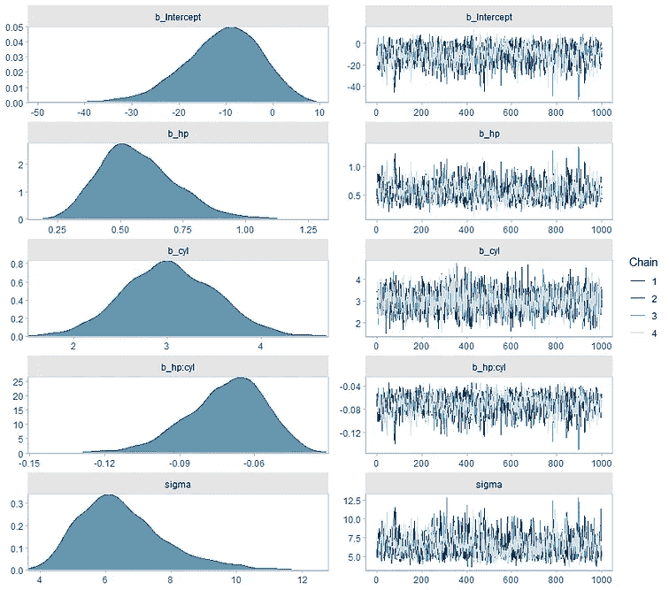

The model and the chains.

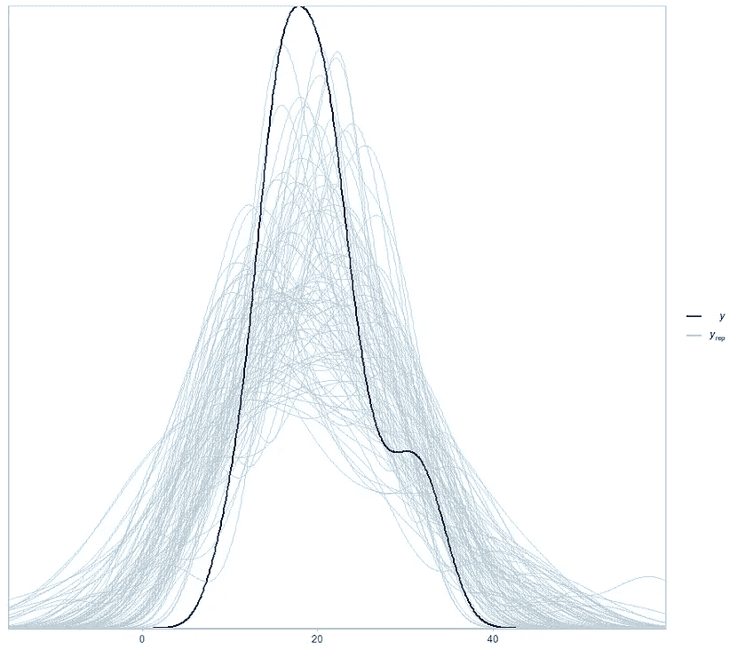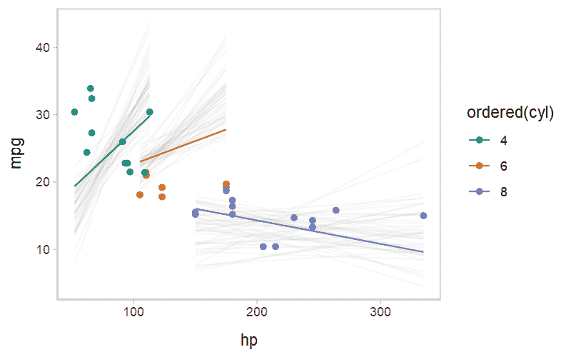

The posterior sampling for the response to the left and to the right an neat animation of the posterior draws from the model I made on top of the latest data I used. The animation clearly shows that posterior draws are extremely important to assess and dig deeper into your model. For instance, the spread of the draws tell you something about how (un)sure the model is, and the distance between the posterior draws and the likelihood shows you how influential the prior was. There is nothing wrong with that, but it does go to show that modeling is science, and science means using both the knowledge you had up until the point of the newest data, and the point thereafter. IT DOES NOT HAVE TO COINCIDE. Many people still do not get that and are frightened by models that deviate from the latest data-points. Me? I love it!

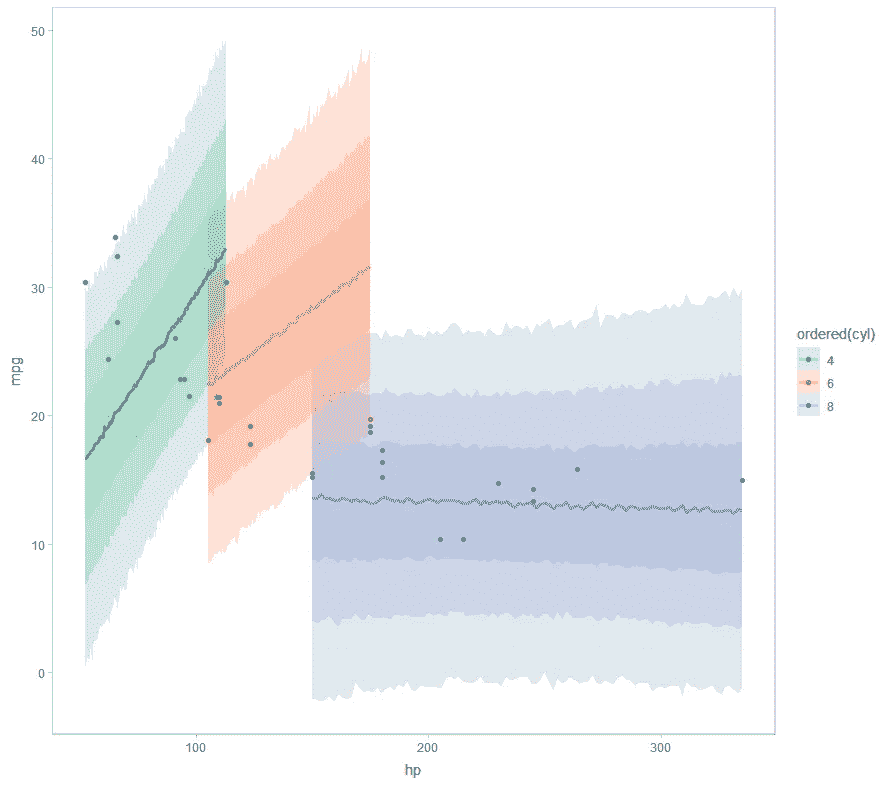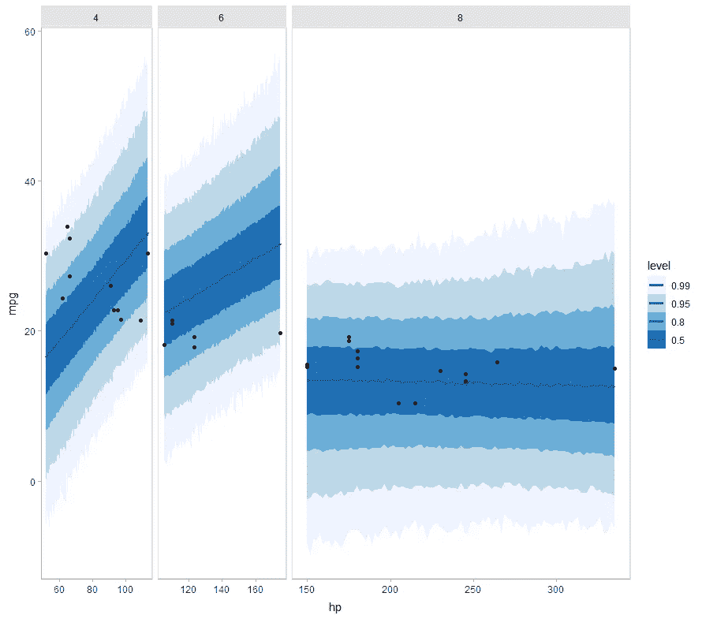

And the predictions shows very clearly and nicely. Prediction intervals are something quite different then the confidence or credible intervals you get from the parameters.

好的，所以不要拘泥于高斯分布，这是经常发生的，让我们也用贝叶斯分析来估计一个分类变量。对于此示例，我们将使用圆柱体，在此数据集中可以是四个、六个或八个。在这个例子中，我将建立一个模型，该模型将预测或显示发动机具有四个、六个或八个气缸的概率。我不确定这样的实验有什么科学价值，但不管怎样，我们还是做吧。仅仅因为我们可以(仅仅因为我们可以而分析数据已经经常发生)。至少你可以看到它会是什么样子。

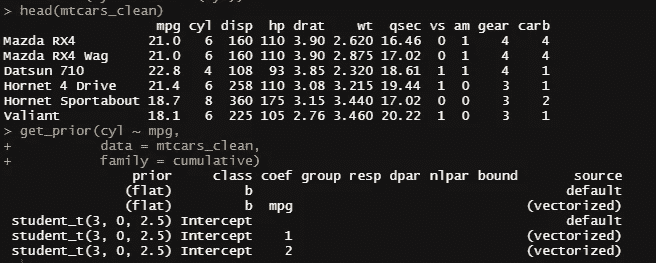

The data, and the priors coming from the likelihood.

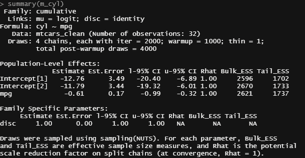

The Bayesian model which is NOT a Bayesian model.

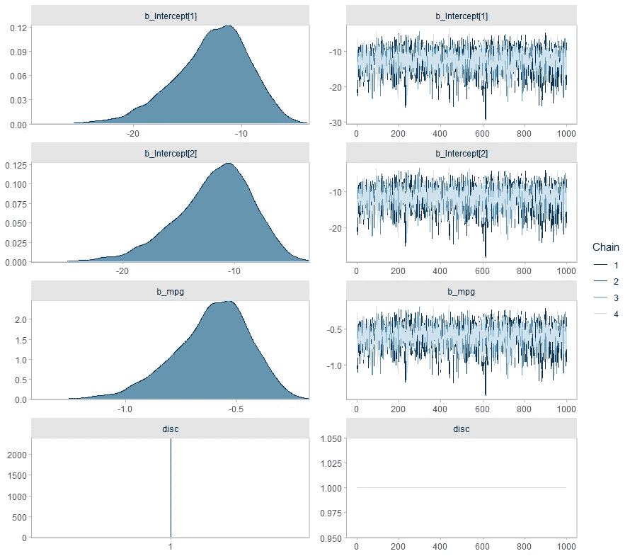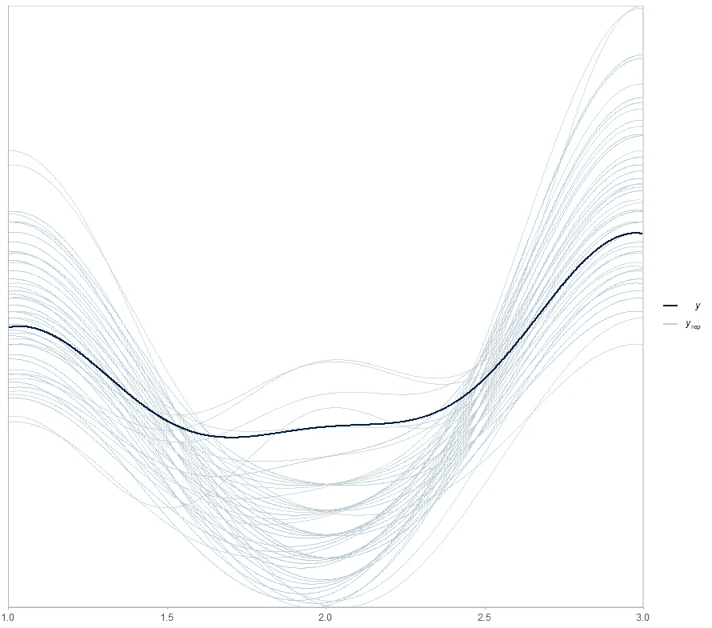

The sampling space to the left, and the probability distribution to the right. What you see to the right is the probability, and actually the frequency, of cars with four (1), six (2) and eight (3) cylinders. The six and eight cylinders connect to intercept[1] and intercept[2]. That is because I analyze the data in an [ordinal way,](https://pub.towardsai.net/analyzing-ordinal-data-in-sas-fe9d9d35a449) using a cumulative [link function](https://pub.towardsai.net/generalized-linear-mixed-models-in-sas-distributions-link-functions-scales-overdisperion-and-4b1c767bb89a).

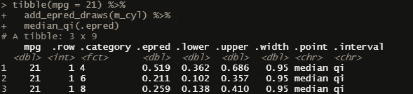

The predictions coming from the model make more sense.

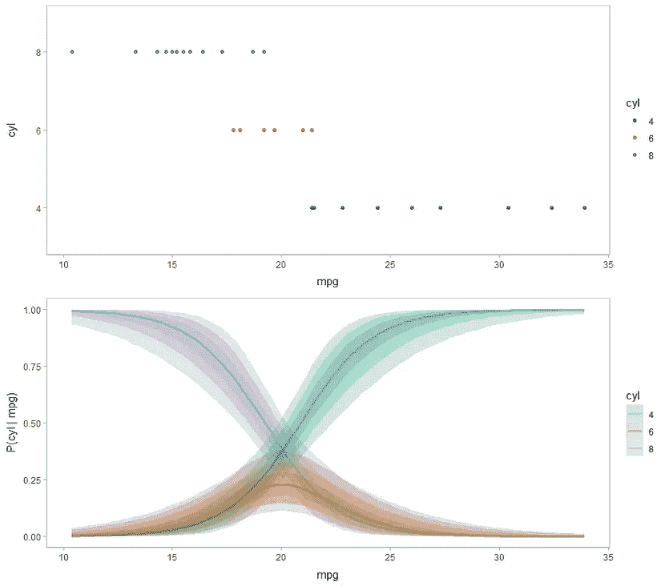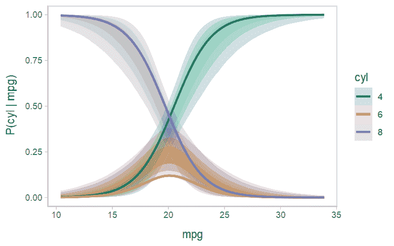

Toe the left the observed and predicted values, the probability plot showcasing the ordinal structure used. There is a clear sigmoid relationship for cylinder four and eight, but a normal one for six. At least, in the dataset that seams to be the case. To the right, the animation showing the left plot. Here you can see how the posterior draws making up the confidence bands portraid. THIS is why only using Bayesian analysis you can say that the value has a 95% or 88% or whatever XX% of popping up.

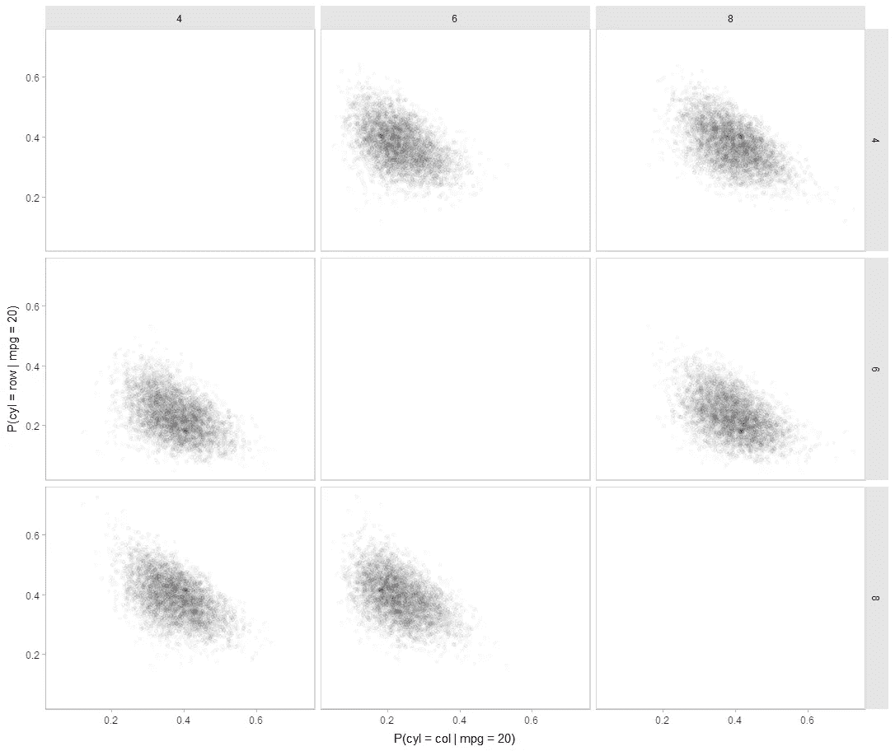

And perhaps the strangest plot of all. This is the posterior correlation plot between the cycles for mpg = 20\. Well, it actually is not that strange, since the family used is the cumulative family which means that the levels of the response variable are entwined. Can’t say the plot is helping me, a lot, but at least it showcases what you can do with all the posterior draws. That, and much more.

好了，这篇文章到此结束。下面的代码，如果有什么东西丢失，不清楚，或者完全错误，请给我发消息！

 [## Mlearning.ai 提交建议

### 如何成为 Mlearning.ai 上的作家

medium.com](/mlearning-ai/mlearning-ai-submission-suggestions-b51e2b130bfb)