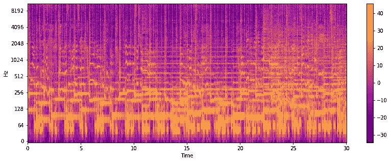
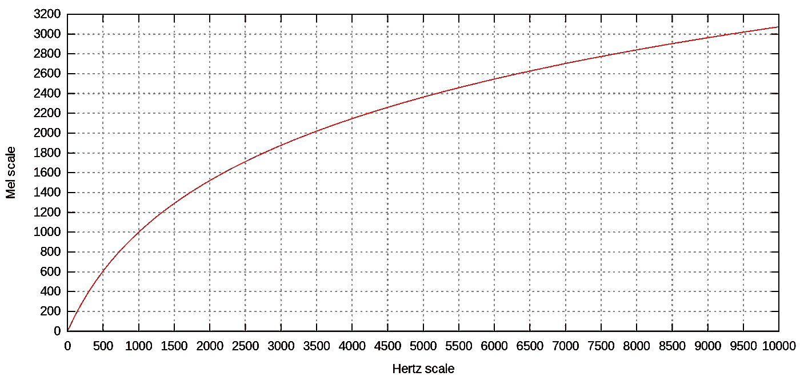
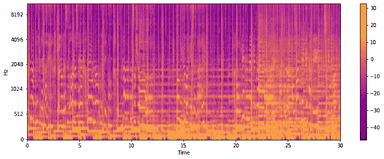
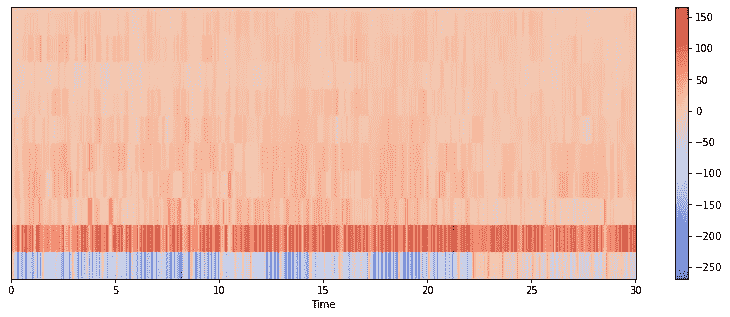

# 使用 CNN 的音乐流派分类:第 1 部分-特征提取

> 原文：<https://medium.com/mlearning-ai/music-genre-classification-using-cnn-part-1-feature-extraction-b417547b8981?source=collection_archive---------1----------------------->

了解如何从音频中提取特征，并使用卷积神经网络将音乐分类为不同的流派。

Photo by [Marius Masalar](https://unsplash.com/@marius?utm_source=unsplash&utm_medium=referral&utm_content=creditCopyText) on [Unsplash](https://unsplash.com/?utm_source=unsplash&utm_medium=referral&utm_content=creditCopyText)

# 介绍

我们每天都听音乐，不管是在家里，在车里，还是在任何地方。音乐分为不同的流派，如流行、摇滚、金属、爵士、蓝调等。每天大约有 24，000 首歌曲被发布。每天发布的歌曲如此之多，以至于无法对它们进行手动分类。像 Shazam 和 Spotify 这样的应用程序可以播放数百万首歌曲，并使用音乐流派分类系统将它们归类。为此，我们使用机器学习算法来自动化这项工作。音乐平台使用音乐流派分类将音乐分为不同的类别，以实现定制的 UX(用户体验)。Spotify 将其音乐分为 5071 种类型。他们使用音乐分类向客户提供个性化的推荐。

为了分类的目的，我们从音频文件中提取时域和频域特征。这些特征是光谱图、梅尔光谱图、MFCC、光谱质心、色谱图、能量、光谱衰减、光谱通量、光谱熵、过零率和间距。音乐流派分类处理的一个主要问题是一些流派可能被错误地分类为彼此，例如乡村和摇滚、流行和迪斯科、爵士和雷鬼等。很少有类是高度相似的，并且彼此有显著的重叠。

# **数据集描述**

我们使用了 [GTZAN](https://www.tensorflow.org/datasets/catalog/gtzan) 数据集。GTZAN 数据集包含 1000 个音频文件和每组 100 个音频(10 组)。它包含以下类别:摇滚、流行、爵士、蓝调、乡村、金属、迪斯科、雷鬼、嘻哈和古典。读取音频文件时，发现了 56 个损坏的文件。因此，对 944 个文件进行了特征提取和分类。

从时域提取时间特征，从频域提取频谱特征。然而，像光谱图、MFCCs 等特征。包含时间和频率信息。

# 时频域特征

我们在分类任务中使用了以下功能:

## **1。声谱图**

频谱图是信号强度随时间变化的直观表示，在每个时间步长都有不同的频率。就音频而言，它也被称为声谱图或声谱图。声谱图有三个维度，两个是频率(y 轴)和时间(x 轴)，第三个维度是振幅。

下图是一个声谱图，黄色代表高振幅，蓝色代表低振幅。

使用傅立叶变换从时域计算光谱图。当音频被采样时(在时域中)，它被分割成几个重叠的窗口。然后，使用短时傅立叶变换(STFT)来计算每个窗口的频谱，并且每个窗口表示图像中的一条垂直线。这些零件并排放在一起。这个过程被称为窗口。通过数字处理创建频谱图的过程实质上包括计算特定窗口宽度的信号 STFT 的平方幅度。音频文件的声谱图如图 1 所示。

Fig 1: Spectrogram of sample audio (Image by the Author)

## 2.**梅尔谱图**

Mel 标度(在单词 melody 之后)是一个感知标度，由听者判断彼此之间的距离相等。

与较高频率相比，人类可以很好地检测较低频率。例如，我们可以轻松区分 200 Hz 和 400 Hz 之间的差异，但我们无法区分 2000 Hz 和 2200 Hz 之间的差异，即使两对之间的差异为 200 Hz。原因是人类以非线性的方式感知声音。Mel-scale 正是这样做的。为了简化，我们可以说 mel 标度随着频率的增加指数地分组更高的频率。Mel 标度与 Hertz 标度的关系如图 2 所示。

Fig 2: Mel scale versus Hertz scale ([source](https://en.wikipedia.org/wiki/Mel_scale))

在 mel 频谱图中，使用 mel 滤波器组将频谱图转换为 Mel 标度。在计算谱图之后，我们将谱图的频率(y 轴)映射到 mel 标度以形成 Mel 谱图。音频文件的 Mel 谱图如图 3 所示。

Fig 3: Mel-Spectrogram of sample audio (Image by the Author)

## 3.MFCC

MFCC 是梅尔频率倒谱系数。它们是精确描述光谱包络完整形状的一小组特征。MFCC 使用 MEL 标度将频带划分为子带。然后，通过计算离散余弦变换(DCT)提取倒谱系数。在某种程度上，MFCCs 压缩了 Mel 谱图的数据。DCT 因易于图像压缩而流行。MFCC 代表声道的形状。音频文件的 MFCC 如图 5 所示。

Fig 5: MFCC of sample audio (Image by the Author)

# 履行

以下是提取不同类型特征的步骤:

1.  **导入库**

2.**保存音频路径和目标标签**

3.提取特征:现在，我们从音频中提取不同的特征。这里，我们提取了光谱图、梅尔光谱图、MFCC、过零率、光谱质心和色谱图。但是出于分类的目的，我们将只使用声谱图、梅尔声谱图和 MFCC。一些音频文件已损坏，因此我们找到了这些损坏的音频文件的索引，并将它们保存在一个列表中。

4.**删除损坏的文件:**删除损坏索引处的音频文件和标签。然后，要素被转换为 float32 数据类型以节省内存使用。之后，我们给标签分配数值，并将它们转换成分类数据。最后，我们将所有提取的特征及其标签保存到一个. npz 文件中。当我们开始分类任务时，我们可以直接加载。npz 文件来使用这些功能。

> 完整的代码可以在 GitHub [这里](https://github.com/namratadutt/Music-genre-classification-Feature-extraction)获得。

# 结论

在本文中，我们学习了如何从音频中提取不同的特征。在本文的下一部分，我们将学习如何分别使用这些特征和这些特征的组合来对音频进行分类。我们将探索音乐流派分类的深度 CNN。

> *感谢阅读！我希望这篇文章对你有所帮助。*
> 
> 加油鳄鱼队！🐊

# 参考

 [## 梅尔量表-维基百科

### mel 标度(单词后)是一个感知标度，由听众判断音高与一个…

en.wikipedia.org](https://en.wikipedia.org/wiki/Mel_scale)  [## 用 Python 进行音乐流派分类

### 音乐就像一面镜子，它告诉人们你是谁，你关心什么。你就是你所流的。

towardsdatascience.com](https://towardsdatascience.com/music-genre-classification-with-python-c714d032f0d8)  [## GTZAN 数据集-音乐流派分类

### 音频文件| Mel 光谱图|带提取特征的 CSV

www.kaggle.com](https://www.kaggle.com/datasets/andradaolteanu/gtzan-dataset-music-genre-classification)  [## gtzan | TensorFlow 数据集

### 数据集由 1000 个音轨组成，每个音轨长 30 秒。它包含 10 个流派，每个流派代表 100 首曲目…

www.tensorflow.org](https://www.tensorflow.org/datasets/catalog/gtzan)  [## 特征提取- librosa 0.9.1 文档

### 编辑描述

librosa.org](https://librosa.org/doc/main/feature.html)  [## 音频信号的音乐类型分类

### 音乐流派是人类创造的用来描述音乐作品的分类标签。音乐流派是…

ieeexplore.ieee.org](https://ieeexplore.ieee.org/document/1021072)  [## Mlearning.ai 提交建议

### 如何成为 Mlearning.ai 上的作家

medium.com](/mlearning-ai/mlearning-ai-submission-suggestions-b51e2b130bfb)