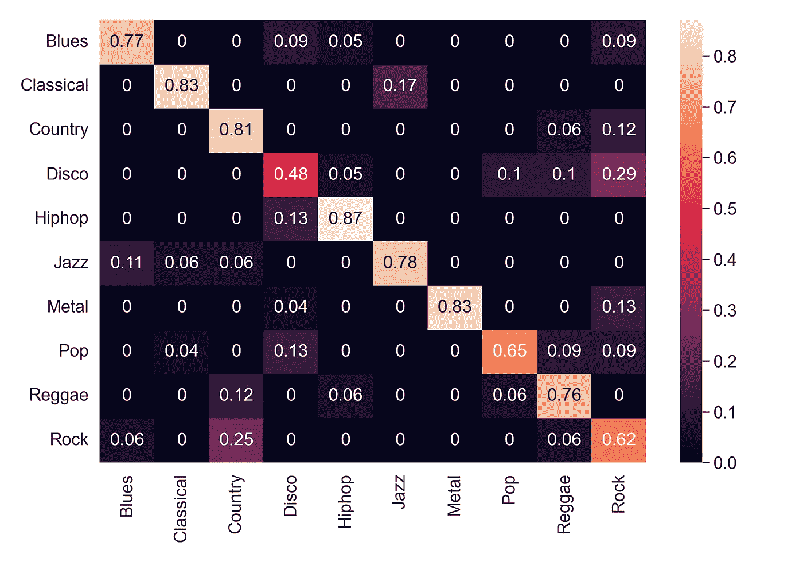
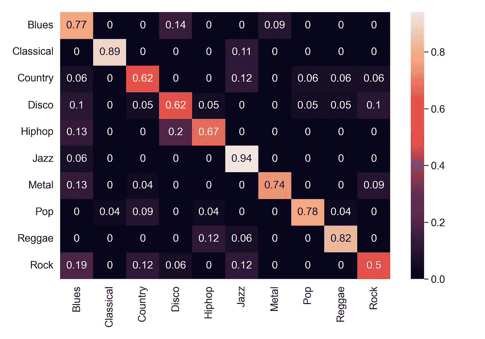
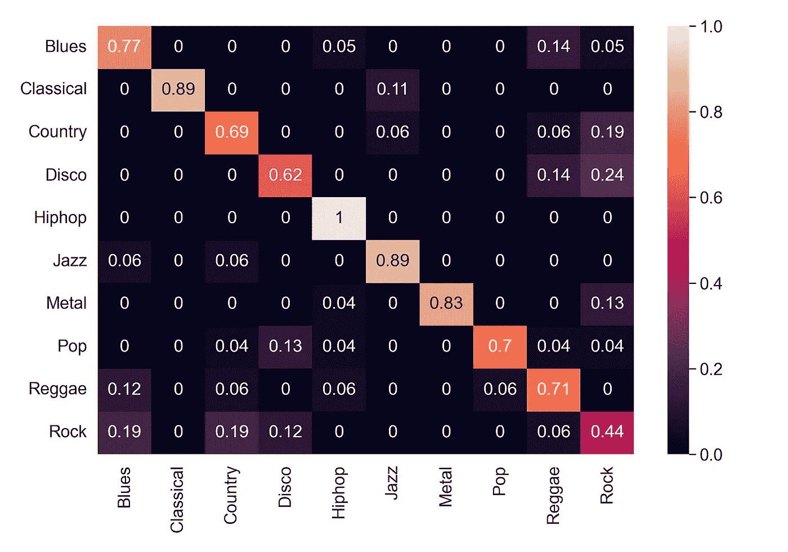

# 使用 CNN 的音乐类型分类:第 2 部分-分类

> 原文：<https://medium.com/mlearning-ai/music-genre-classification-using-cnn-part-2-classification-ee5400cfbc4f?source=collection_archive---------2----------------------->

了解如何使用 CNN 对音乐流派进行分类。

Photo by [Marius Masalar](https://unsplash.com/@marius?utm_source=unsplash&utm_medium=referral&utm_content=creditCopyText) on [Unsplash](https://unsplash.com/?utm_source=unsplash&utm_medium=referral&utm_content=creditCopyText)

在[前一部分](/mlearning-ai/music-genre-classification-using-cnn-part-1-feature-extraction-b417547b8981)中，我们学习了从音频样本中提取特征。现在，我们有了不同的特性，我们继续分类任务。首先，我们将分别使用特征对音频样本进行分类，然后我们将使用所有特征的集合进行分类。

## 步骤 1:导入库

## 步骤 2:导入 npz 文件，提取特征，分割训练测试数据

我们在[之前的文章](/mlearning-ai/music-genre-classification-using-cnn-part-1-feature-extraction-b417547b8981)中提取了这些特征，并保存在 npz 文件中。我们只是在这里加载文件。

## 步骤 3:调整数据的大小和形状

缩放操作仅适用于定型数据集。在测试期间，相同的最大值(来自训练数据)用于对测试数据执行缩放。

因此，我们找出 *S_train* 和*T7 的最大值，然后将 *S_train* 除以最大值。在测试过程中，我们也将 *S_test* 除以 *S_train* 的最大值。*

之后，我们将数据整形为(N，row，col，1)形式，因为 CNN 要求输入是这种形式。它表示图像中只有一个通道。谱图的原始形状是(944，1025，1295)。

MFCC 的最初形状是(944，10，1293)。我们首先将 MFCC 训练和测试数据的大小调整为(944，120，600)。之后，我们为 CNN 将数据整形为(N，row，col，1)。然后我们将数据标准化。

Mel 谱图的原始形状是(944，128，1293)。我们首先使用最大的训练数据来缩放训练和测试数据。然后，我们将 CNN 的数据整形为(N，row，col，1)。

## 步骤 4:在 npz 文件中保存培训和测试特征

对于所有模型，我们将纪元设置为 100，批量大小为 32，学习率为 0.001。

## 步骤 5:使用光谱图进行分类

我们将首先加载训练测试分割数据(。npz 文件)。然后我们定义一个 CNN 模型进行分类。除了最后一层我们使用了 softmax，我们已经使用 ReLU 作为层的激活函数。然后我们使用 Adam 优化器。我们在每 5 个时期后有一个检查点，如果在任何情况下我们的模型在训练期间被中断，我们可以使用它。之后，我们保存训练好的模型。

现在，我们可以对模型训练部分进行注释，并加载训练好的模型。我们计算训练数据的准确度，然后测试数据。然后，我们显示测试数据的混淆矩阵。我们在测试数据集上取得了 71.96%的准确率。

现在，在这个项目中，我们使用了两种光谱图模型。下面的代码是声谱图的第二个模型。我们在测试数据集上取得了 73.54%的准确率。我们将考虑这两种模式，同时采取合奏。

最佳谱图模型的混淆矩阵如下所示。

Confusion matrix for the best model of Spectrogram (Image by the Author)

## 第六步:使用 MFCC 分类

对于 MFCC，我们训练了三个模型，并使用这三个模型的集合来报告准确性。我们还使用了 k 倍交叉验证，k =10。我们在测试数据上取得了 74.07%的准确率。

我们再次加载 MFCC 的列车测试分割并定义模型。

现在，因为我们将采用三个 MFCC 模型的集合，我们定义一个函数来从三个模型中取多数票。然后我们训练所有三个模型。

在我们训练完模型之后，我们将加载模型并将 *y_pred* 发送到 *get_majority()* 函数中。

我们在测试数据上取得了 74.07%的准确率。MFCC 的混淆矩阵如下所示。

Confusion matrix for MFCC (Image by the Author)

## 步骤 7:使用 Mel 谱图进行分类

我们在测试数据上取得了 75.13%的准确率。Mel 谱图的混淆矩阵如下所示。

Confusion matrix for Mel-spectrogram (Image by the Author)

## 步骤 8:创建声谱图、梅尔声谱图和 MFCC CNN 的集合

现在，对于系综，我们将加载所有模型(使用新文件以避免任何混淆和错误)并计算 *y-pred* 。该集合包含 2 个声谱图模型、3 个 MFCC 模型和 1 个梅尔声谱图模型。之后，我们将把预测发送给 *get_majority* 函数，并报告集合的准确性。

使用集成获得的准确率为 79.36%。

系综的混淆矩阵如下所示。

Confusion matrix for the Ensemble (Image by the Author)

# 结论

我们已经学会了如何使用 CNN 进行音乐流派分类。测试数据被单独取出，以避免任何数据泄露。首先，分别训练特征进行分类。其次，创建不同特征的集合，并使用多数投票策略进行预测。我们使用了 2 个声谱图模型、3 个 MFCC 模型和 1 个梅尔声谱图模型。我们在集成上实现了 79.36%的准确率，这明显优于单一特征模型。这显示了使用集合模型的稳健性和效率。在被错误分类的流派中，被错误分类最多的流派是“摇滚”。它大多被错误地归类为“金属”、“迪斯科”、“布鲁斯”和“乡村音乐”。第二大被错误分类的流派是“乡村”，它被错误地分类为“摇滚”、“雷鬼”和“布鲁斯”。

> 完整代码可在 [Github](https://github.com/namratadutt/Music-genre-classification-part-2/tree/main) 上获得。
> 
> 感谢阅读！我希望这篇文章对你有所帮助。
> 
> 加油鳄鱼队！🐊

 [## Mlearning.ai 提交建议

### 如何成为 Mlearning.ai 上的作家

medium.com](/mlearning-ai/mlearning-ai-submission-suggestions-b51e2b130bfb)