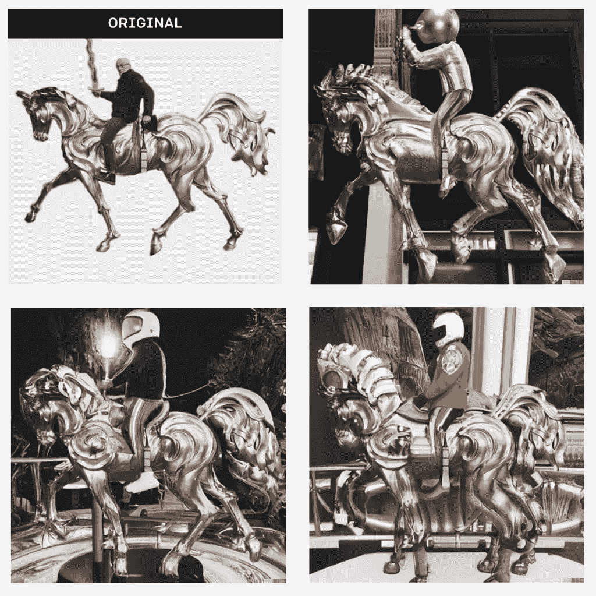

# 我爸的云端 AI 工作室

> 原文：<https://medium.com/mlearning-ai/my-dads-ai-studio-in-the-cloud-c203288bd942?source=collection_archive---------4----------------------->

## [机器学习艺术](https://mlearning.substack.com/p/-8-ai-art-tools-worth-learning-about?s=w)

## 由 DALL E 2 设计

Original by [Siegfried Gross](https://www.instagram.com/gross_bildhauer/) — Variations “an astronaut riding a horse” [DALL·E, an AI system](https://evartology.substack.com/)

每天，越来越多的人工智能工具可供艺术家使用。2022 年 6 月， [Eva Rtology](https://medium.com/u/c53baddd7eb7?source=post_page-----c203288bd942--------------------------------) 推出 [**最佳榜单。立即可用**](https://evartology.substack.com/p/all-of-the-greatest-ai-powered-art?r=9hp4d&s=w&utm_campaign=post&utm_medium=web) 并且没有限制。达尔仍然是国王。已经是 [myFatherintheCloud.ai](/mlearning-ai/how-i-use-gpt3-in-my-art-61e0a2d07f2) 项目的一部分两个月了。我开始用 DALL E 2 制作雕塑。在我爸爸的人工智能工作室里…