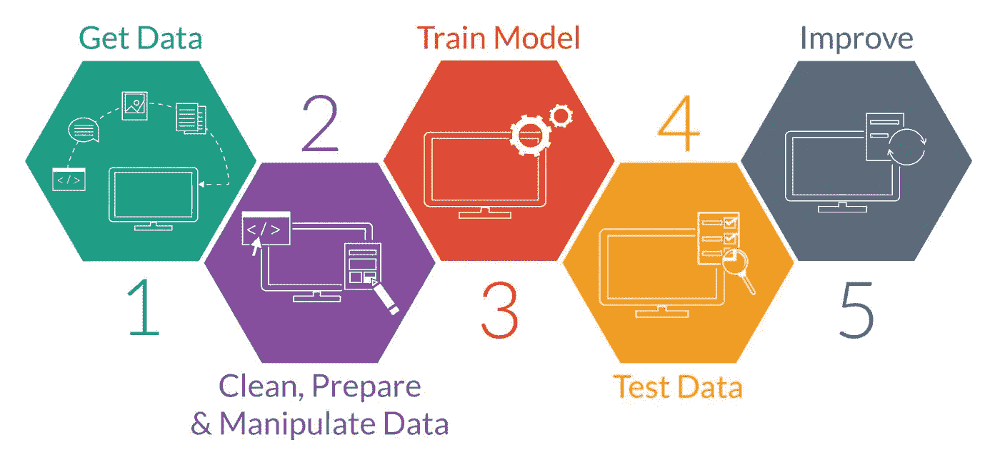
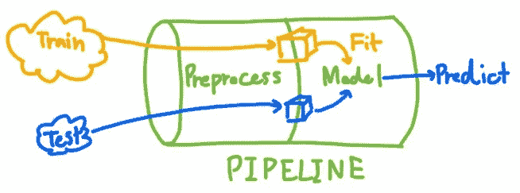
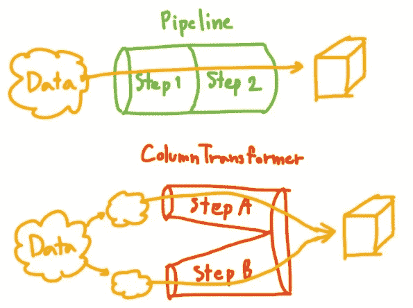
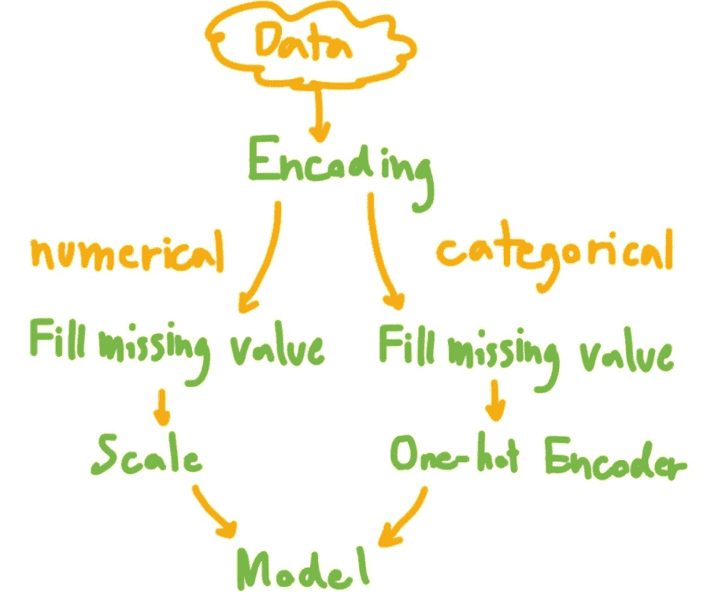
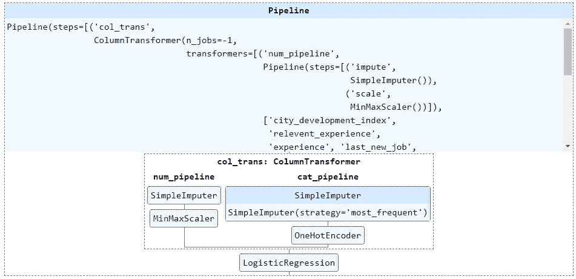

# 使用管道和 ColumnTransformer 进行整洁的数据预处理

> 原文：<https://medium.com/mlearning-ai/neat-data-preprocessing-with-pipeline-and-columntransformer-2a0468865b6b?source=collection_archive---------0----------------------->


# ❓为什么要用管道和柱形变压器？

在进行机器学习项目时，最繁琐的步骤通常是数据清理和预处理步骤。主要是当你在 Jupyter Notebook 中工作时，在许多单元格中运行代码可能会令人困惑。



Source: [https://therbootcamp.github.io/](https://therbootcamp.github.io/)

在训练模型之前，应该将数据分成训练集和测试集。在进入机器学习模型之前，每个数据集都将通过数据清洗和预处理步骤。为训练集和测试集编写重复的代码是没有效率的。这就是管道发挥作用的时候。

> 管道和列转换器是创建数据预处理工作流的好方法



首先，假设您只能创建一个管道，您可以在其中输入任何数据，这些数据将在模型训练或预测之前转换为适当的格式。它会缩短你的代码，使代码更容易阅读和调整。

开始编码吧！！

# 💽资料组

我使用的数据来自

[](https://www.kaggle.com/datasets/arashnic/hr-analytics-job-change-of-data-scientists?datasetId=1019790&sortBy=voteCount&select=aug_train.csv) [## 人力资源分析:数据科学家的工作变化

### 预测谁将跳槽到新的工作岗位

www.kaggle.com](https://www.kaggle.com/datasets/arashnic/hr-analytics-job-change-of-data-scientists?datasetId=1019790&sortBy=voteCount&select=aug_train.csv) 

您可以在下面的链接中找到我关于这个数据集的数据探索的文章。

[](https://yannawut.medium.com/data-analysis-job-change-of-data-scientist-685f3de0a983) [## 数据分析——数据科学家的工作变化

### 哪些因素导致一个人离开现在的工作？让我们用 Power BI 来探索数据。

yannawut.medium.com](https://yannawut.medium.com/data-analysis-job-change-of-data-scientist-685f3de0a983) 

简而言之，这个数据集包含了求职者的信息以及他们是否要换工作的决定。

**目标:**根据应聘者的信息预测其是否会跳槽(分类任务)。

# 🛣️管道和柱形变压器

您必须理解 Pipeline 和 ColumnTransformer 之间的巨大差异。



**管道:**用于相同列的多次转换。

**ColumnTransformer:** 用于不同地转换每个列集合。

⚠️:列变换器不是一步一步地变换，而是每一步都单独变换，然后再混合。

# 🗺️数据预处理计划



请注意，为了本文的简单，我跳过了分类特征编码。

## 步骤 1:指定定义要以不同方式转换的列集

数值和分类应该以不同的方式进行转换，所以我为数值列(number)定义了 num_col，为分类列定义了 cat_cols。

```
num_cols = ['city_development_index','relevent_experience', 'experience','last_new_job', 'training_hours']cat_cols = ['gender', 'enrolled_university', 'education_level', 'major_discipline', 'company_size', 'company_type']
```

## 步骤 2:将数据拆分为训练集和测试集

将 20%的数据分割成一个测试集。

```
from sklearn.model_selection import train_test_splitX = df[num_cols+cat_cols]
y = df['target']# train test split
X_train, X_test, y_train, y_test = train_test_split(X, y, test_size=0.2, stratify=y)
```

我将为训练集安装管道，并将安装的管道用于测试集，以防止数据从测试集泄漏到模型。

## 步骤 3:为数字和分类特征创建管道

管道的语法是

> 管道(步骤= [('步骤名'，转换函数)，…])

对于数字特征，我执行
1。用该列的平均值填充缺失值。
2。MinMaxScaler 将值缩放到范围 0 到 1(这将影响回归性能)。

对于分类特征，我执行
1。SimpleImputer 用该列中出现频率最高的值来填充缺失值。
2。OneHotEncoder 吐槽到很多数值列进行模型训练。(指定 handle_unknown='ignore '是为了防止在测试集中发现看不见的类别时出错)

```
from sklearn.impute import SimpleImputer
from sklearn.preprocessing import OneHotEncoder, MinMaxScaler
from sklearn.pipeline import Pipelinenum_pipeline = Pipeline(steps=[
    ('impute', SimpleImputer(strategy='mean')),
    ('scale',MinMaxScaler())
])cat_pipeline = Pipeline(steps=[
    ('impute', SimpleImputer(strategy='most_frequent')),
    ('one-hot',OneHotEncoder(handle_unknown='ignore', sparse=False))
])
```

## 步骤 4:创建 ColumnTransformer，为每个列集应用管道

列转换器的语法是

> column transformer(transformers =[(' step name '，transform function，cols)，…])

通过数值管道传递数值列，通过步骤 3 中创建的分类管道传递分类列。

指定 remainder='drop '以忽略 dataframe 中的其他列。

n_job = -1 表示使用所有处理器并行运行。

```
from sklearn.compose import ColumnTransformercol_trans = ColumnTransformer(transformers=[
    ('num_pipeline',num_pipeline,num_cols),
    ('cat_pipeline',cat_pipeline,cat_cols)
    ],
    remainder='drop',
    n_jobs=-1)
```

## 步骤 5:向最终管道添加模型

在这个例子中，我使用了逻辑回归模型。

创建一个新管道，将步骤 4 中的 ColumnTransformer 与逻辑回归模型混合。在这种情况下，我使用管道，因为整个数据帧必须分别通过 ColumnTransformer 步骤和建模步骤。

```
from sklearn.linear_model import LogisticRegressionclf = LogisticRegression(random_state=0)clf_pipeline = Pipeline(steps=[
    ('col_trans', col_trans),
    ('model', clf)
])
```

## **第六步:显示流水线**

> 显示(管道名称)

```
from sklearn import set_config
set_config(display='diagram')display(clf_pipeline)
```


Displayed pipeline

您可以单击显示的图像来查看每个步骤的详细信息。多方便啊！！



Expanded displayed pipeline

## 步骤 7:通过管道传递数据

fit:通过管道传递数据。也符合模型。

pipeline.predict:使用 pipeline.fit 时训练的模型来预测新数据

pipeline.score:获得管道中模型的分数(在这个例子中是逻辑回归的精确度)

```
clf_pipeline.fit(X_train, y_train)
# preds = clf_pipeline.predict(X_test)
score = clf_pipeline.score(X_test, y_test)
print(f"Model score: {score}") # accuracy
```


## (可选)步骤 8:保存管道

使用 joblib 库保存管道供以后使用，这样就不需要再次创建和安装管道。当您想要使用保存的管道时，只需使用 joblib.load 加载文件。

```
import joblib# Save pipeline to file "pipe.joblib"
joblib.dump(clf_pipeline,"pipe.joblib")# Load pipeline when you want to use
same_pipe = joblib.load("pipe.joblib")
```

# 结论

您可以实现从数据清理到数据建模步骤的管道，使您的代码更加整洁。通过显示管线，您可以轻松直观地了解如何构建模型。

欢迎任何反馈！！

[](/mlearning-ai/mlearning-ai-submission-suggestions-b51e2b130bfb) [## Mlearning.ai 提交建议

### 如何成为 Mlearning.ai 上的作家

medium.com](/mlearning-ai/mlearning-ai-submission-suggestions-b51e2b130bfb)