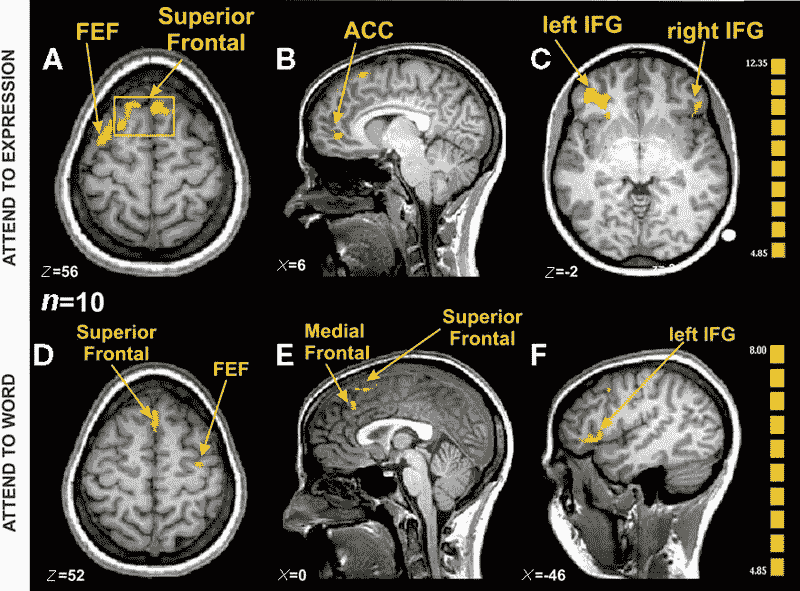

# 神经科学:思想传输研究实验室| MLearning.ai |作者 TROIC

> 原文：<https://medium.com/mlearning-ai/neuroscience-thoughts-transport-research-lab-mlearning-ai-by-troic-5ab5467b0e64?source=collection_archive---------4----------------------->

fMRI via [Ovaysikia et al](https://www.frontiersin.org/articles/10.3389/fnhum.2010.00234/full)

思想去了哪里？它在大脑中的运输方式是什么？思想是什么，它遵循什么规则？

关于思想从哪里来有不同的答案，这很重要，是的，但没有它们去哪里做它们要做的事情重要。

有多学科实验室，其工作包括思想、思维和认知。但根据搜索结果，世界上任何地方都没有思想规则或思想传输研究实验室。

无论我们对思想了解多少，改变未来的是它们的运输方式。它们的路径是必不可少的，因为它负责激活大脑回路。

这表明思想的去向在接近精神和身体状况方面是有用的，以及数据如何模拟思想以赋予人工智能情感。

荷尔蒙可以负责一种感觉，比如饥饿或睡眠。在那种状态下，思想可能会转移到感到恼怒或不适的地方。

吃能消除饥饿，而思考也能消除烦恼。一个是贱感。另一个是感觉效应。

有些情况会直接从外部情况产生感觉效果，很少或没有基本感觉，进而产生恐惧、危险、失落、愤怒的感觉。

对感觉效应会有反应，比如逃跑、尖叫、颤抖等等。反应可以平行或垂直于感觉效果。

如果信息显示威胁已经消失，思想就会离开那个情感影响的地方。尽管记忆会获得经验，并可能在下一次提醒注意，或者当涉及的某些事情后来被感知或触发时造成创伤。

[思想运输](/mlearning-ai/brain-robotics-neurons-thoughts-e62dc05931dd)，但它的起源是什么？

在神经生物学中已经确立了多种感觉的整合，或者说感觉在被使用之前就被整合了。

这意味着嗅觉、视觉、味觉、触觉和听觉在被使用之前就已经转化成了某种东西。

可以假设它们被整合到思想或思想的一种形式中。或者说任何可以被思考的东西都首先被转化为[思想](/mlearning-ai/ml-neuroscience-genetic-memory-thoughts-active-passive-5f0c55d08e62)。它是任何外在事物的思想版本，进入记忆，并负责到达感觉效果的目的地。

钢笔、水桶、拖拉机、草地、小山、道路、书等等都在物理或外部。他们中的每一个都有一个思想版本:笔在物质中，笔在思想中。

在大脑中，丘脑被认为是所有感觉的中继中心，除了嗅觉。感觉从那里传到大脑皮层被认知和感受。还有其他中继或整合点，如角回和网状结构。气味在嗅球处传递。

现在从理论上来说，在思想被转换后，它们会进入记忆进行存储和分组。每个商店都有一个默认的组，但也有一个它曾经所在的组。因此，一支笔可能会让人想起书写，但有时也会让人想起上次使用它的地方，或者当时发生了什么，或者给它的人，或者它的品牌名称，或者一种颜色。它总是会想起一件重要的事情，但这是可以改变的，或者有时会想起其他人，但通常只有一件。

记忆中存储的分组和重组过程可以说是神经可塑性。

记忆只储存思想或思想的一种形式。没有任何内在或外在的体验是记忆所不知道的。它知道不是因为它自己经历了它们，而是它们在一个港口被转化为思想，进入了记忆。

正是这种思想版本让记忆知道什么是正常的，有新的思想进来，确认，没有什么去感觉效果，但随着变化，特别是坏的，感觉效果去别处，带来注意。

概括地说，头脑的象限是思想的运输:思想{转换的/内部的}，记忆{存储/组}，感觉{基础/效果}，反应{平行/垂直}

这种思维运输模式有望成为对未解答的精神问题的一次重大尝试。

用[数学和计算](https://writer.zoho.com/writer/open/dpbiea67ec9ee78fe4654b2649387ec49c7ca)来表达这一点，然后与精神健康、老年状况以及如何赋予人工智能情感联系起来，这使得它成为一个专门研究实验室的优秀项目，该实验室可以远程启动，取决于合作者。

最初的职责是一个扩展的理论架构。

 [## Mlearning.ai 提交建议

### 如何成为 Mlearning.ai 上的作家

medium.com](/mlearning-ai/mlearning-ai-submission-suggestions-b51e2b130bfb)