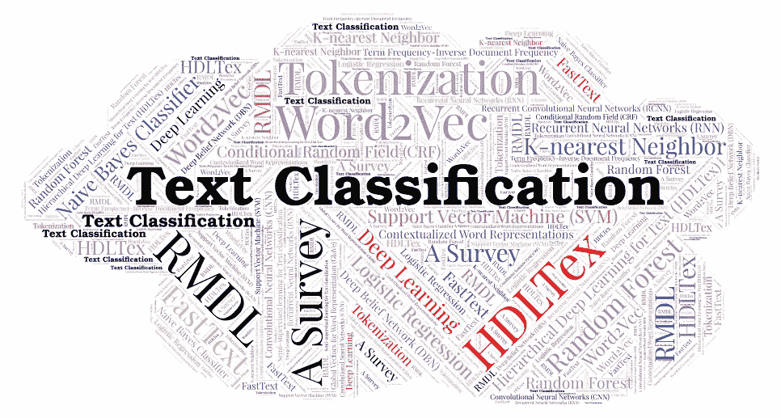
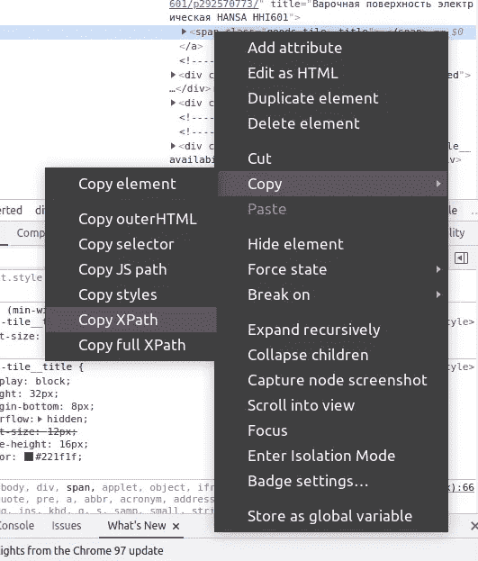
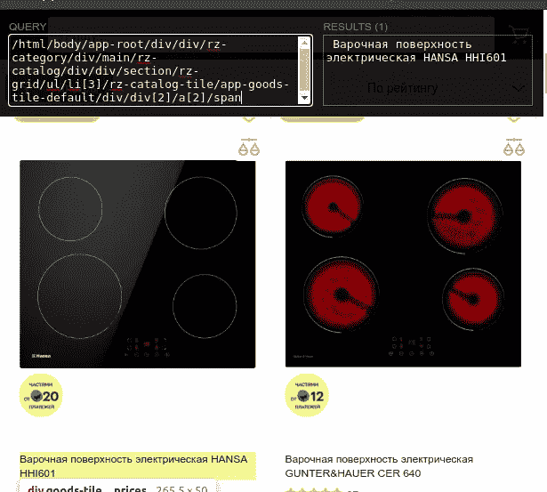
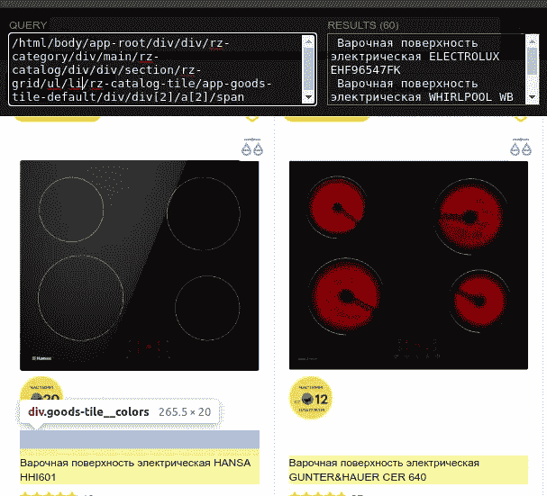
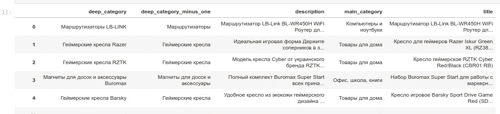
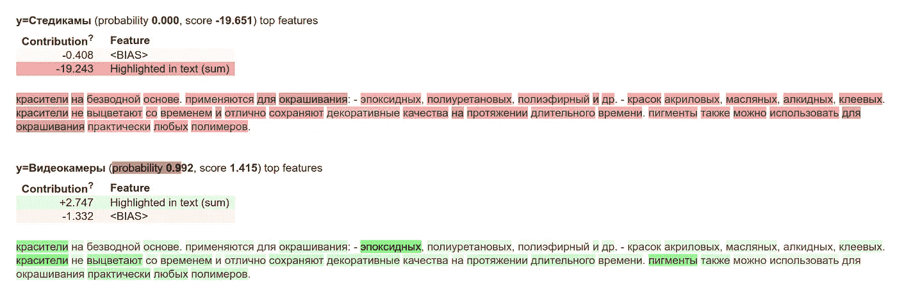
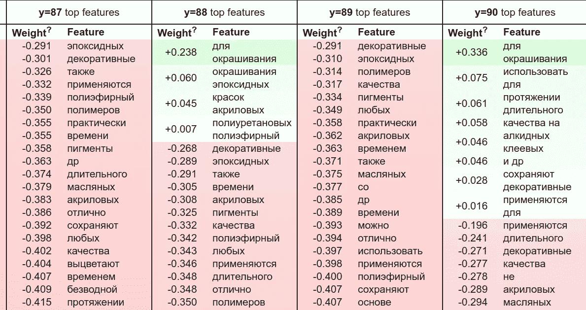
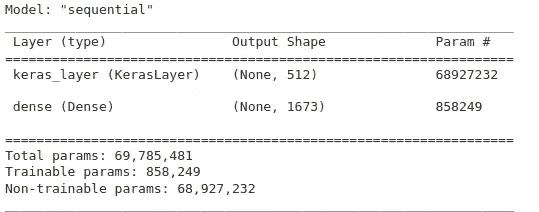
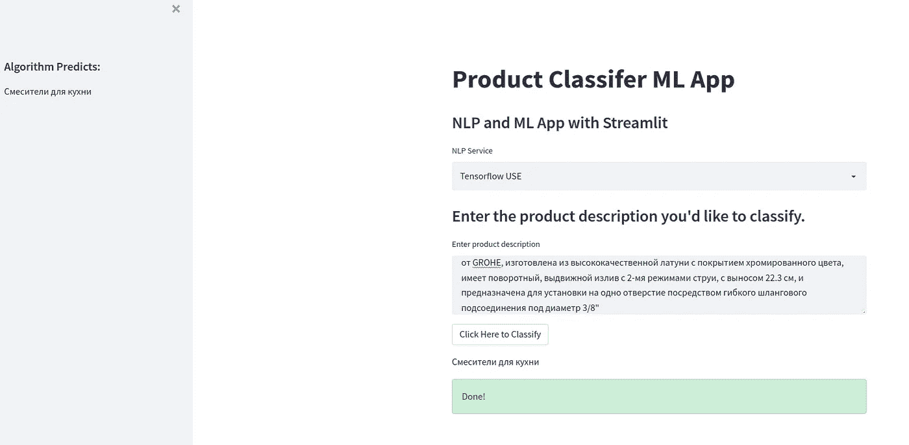
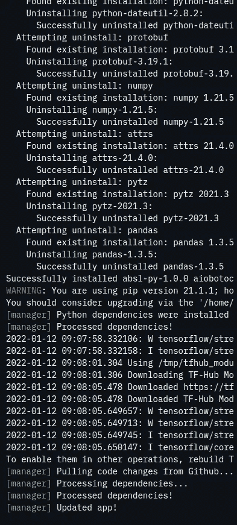

# 自然语言处理文本分类:从数据收集到模型推理

> 原文：<https://medium.com/mlearning-ai/nlp-text-classification-from-data-collection-to-model-inference-a475119cd894?source=collection_archive---------0----------------------->



我与几个电子商务平台合作，这些平台从不同的商店收集数据，并为他们的产品做广告。在从合作伙伴导入产品的过程中，一个常见的问题是将合作伙伴产品类别与平台本身的类别进行匹配，或者如果根本没有类别，则进行产品分类。我们有两种常见的产品分类方法:使用图片或描述。

在过去的几个月里，我参加了一门经典的 ML 课程，并选择了产品分类作为我的课程项目。现在我想和你们分享我所取得的成就。

# 数据准备

作为数据来源，我选择了乌克兰一个受欢迎的市场。我需要的数据是标题，描述和类别树。树中有 3 到 5 个类别级别，所以我决定保存主要类别，最深刻的类别和它之前的类别。

获取数据有不同的方法:API、数据导出和报废。我用最后一个来做，但我总是建议使用其他的，如果可能的话。报废会破坏站点，所以最好不要使用或者在非采摘时间进行。

我使用了 Scrappy 库。使用它编写网络蜘蛛非常简单，因为已经提供了一个模板。要启动新项目:

它将自动为您创建项目结构。

下一步是获取所需数据的正确 XPath。XPath 是 XML 文档中所需节点的路径。我使用“XPath 助手”扩展来获得正确的值。要获取 XPath，右击带有数据的元素，选择“复制”->“复制 XPath”。



你会得到这样的结果:

```
/html/body/app-root/div/div/rz-category/div/main/rz-catalog/div/div/section/rz-grid/ul/li[3]/rz-catalog-tile/app-goods-tile-default/div/div[2]/a[2]/span
```

然后将这个值粘贴到“XPath 帮助器”中。您需要检查 XPath 是否正确，并选择所有需要的元素。



如您所见，它只选择了页面上的一个元素。如果您将其更改为选择所有需要的元素，将会有所帮助。在我们的例子中，问题是它指定了列表中的某些元素(“li[3]”)。我们需要移除该部分，它将选择所有需要的元素:

```
/html/body/app-root/div/div/rz-category/div/main/rz-catalog/div/div/section/rz-grid/ul/li/rz-catalog-tile/app-goods-tile-default/div/div[2]/a[2]/span
```



找到所有需要的 XPaths 后，就可以开始爬行了。从包含所有类别的主页来看，该过程如下所示:

1.  查找所有类别
2.  对于每个类别，抓住所有的子类别。
3.  对于每个子类别，从所有页面收集所有产品。
4.  对于每个产品，获取标题、描述和所有类别。

你可以在那里找到我的实现。

## 探索性数据分析

让我们来看看我们的数据。



首先要注意的是，我们的数据是俄语的。所以，如果我们使用一些文本处理库或进行迁移学习，它应该支持这种语言。

我们应该检查我们有多少空白字段，并用标题值填充空白描述。此外，让我们检查一下我们有多少个类别，以及有多少个最深刻的类别名称包含了之前的类别标题

我们有 80047 个最深奥的类别，780，000 个产品中有 682，000 个在最深奥的标题中有先前的类别标题。主要区别——最深刻的品牌名称。因此，考虑到每个最深层类别的少量产品，我们将预测它的前一个类别。

这里有完整的笔记本。

## 数据分割

我们需要两列:目标类别和描述。为了使我们的实验更加灵活，我编写了一个脚本，它可以将参数作为我们的目标列和样本大小。我们还剔除了产品数量少于 50 种的所有类别。

此外，我使用了按目标列的分层拆分，因此如果有足够多的产品，所有类别都会被同等地显示。

你可以在这里查看[的完整剧本](https://github.com/varrek/prjct_ml/blob/main/project/preprocess.py)。

# 实验

对于我们的任务，建立单词嵌入是必不可少的，因为机器学习模型不接受原始文本作为输入数据。我们需要将描述转换成数字向量。单词嵌入是一种单词表征，它允许具有相似意思的单词具有相似的表征。

通用句子编码器(USE) —将句子编码到嵌入向量中的模型系列，专门用于将学习转移到其他 NLP 任务。我们将尝试使用基线学习和迁移学习。它返回一个 512 固定大小的文本向量。


Image source: [https://amitness.com/2020/02/tensorflow-hub-for-transfer-learning/](https://amitness.com/2020/02/tensorflow-hub-for-transfer-learning/)

## 韵律学

我们将使用两个指标来确定我们的模型性能:F1 得分和稀疏分类准确性。

根据[文档](https://scikit-learn.org/stable/modules/generated/sklearn.metrics.f1_score.html)，F1 分数可以解释为精确度和召回率的调和平均值，其中 F1 分数在 1 时达到最佳值，在 0 时达到最差分数。精确度和召回率对 F1 分数的相对贡献是相等的。F1 分数的公式为:

```
F1 = 2 * (precision * recall) / (precision + recall)
```

F1 分数对于不平衡的数据集是好的，这是我们的情况。

稀疏分类准确性计算预测匹配整数标注的频率，它检查最大真值是否等于最大预测值的索引。

## 基线

我们将使用 USE 作为基线，将所有的目标类别和描述转换为它们的嵌入。如前所述，使用了多语言模型。

然后，我们计算每个描述和目标类别之间的余弦相似度。余弦相似性度量内积空间的两个非零向量之间的相似性。它给出了两个文档在主题方面有多相似的有价值的度量。所以，我们的预测有一个余弦相似性的最大值。

我们将预测存储在一个单独的列“预测”中。现在是测量误差的时候了。让我们来计算我们的 F1 分数:

结果是 0.10，这不是最优的，但我们可以把它作为一个基线。

我们将类别名称作为我们的目标嵌入。如果我们有类别描述，它会表现得更好，因为它有更多关于类别是什么的信息。

这里的完全实现[。](https://github.com/varrek/prjct_ml/blob/main/project/use_without_training.ipynb)

## 逻辑回归

除了使用之外，还有不同的方法将文本转换成数字向量:单词包、n-Grams 包 Tf-Idf 矢量器。我把最后一个用在了我的模型上。

TF-IDF 代表“术语频率—逆文档频率”。这是一种量化一组文档中的单词的技术。我们通常为每个单词计算一个分数，以表示它在文档和语料库中的重要性。我推荐阅读[这篇文章](https://towardsdatascience.com/tf-idf-for-document-ranking-from-scratch-in-python-on-real-world-dataset-796d339a4089)，深入了解它是如何工作的。

要配置 TF-IDF，我们需要指定停用词。停用词是那些在文档中经常出现的词，因此失去了它们的代表性。我们将使用 NLTK 库来获取停用词。

另外，我在“token_pattern”中使用了 regexp 来清除文本中所有非俄语的符号和数字。

您可以使用“max_df”和“min_df”参数来控制词汇大小。“max_df”用于移除出现过于频繁的术语，也称为“特定于语料库的停用词”。“min_df”用于消除出现频率太低的术语。

经过训练后，模型 F1 在测试数据上的得分为 0.67。比基线好多了，对吧？尽管如此，在检查了每个类别的实际得分后，大多数类别的得分都超过了 0.71，但有些类别的结果是 0。重要的是检查它的原因是什么。有些类别的产品太少，但要找出其他类别的情况，我们可以使用 ELI5 库和 TextExplainer。

ELI5 是一个 Python 包，有助于调试机器学习分类器并解释它们的预测。eli5.lime.TextExplainer 帮助调试预测——检查文档中什么是做出这个决定的重要因素。

有两种主要方式来看待分类模型:

1.  检查模型参数，并尝试弄清楚模型如何全局工作；
2.  检查一个模型的单个预测，试着找出为什么模型会做出这样的决定。

为了检验模型的单个预测，ELI5 提供了`[**eli5.show_prediction()**](https://eli5.readthedocs.io/en/latest/autodocs/eli5.html#eli5.show_weights)`功能:

结果如下所示:



对于模型参数检查 ELI5 提供了`[**eli5.explain_weights()**](https://eli5.readthedocs.io/en/latest/autodocs/eli5.html#eli5.show_weights)`功能:



这些函数可以帮助理解为什么准确的预测会被混淆。

**我们怎样才能改善逻辑回归结果？**

我们可以对我们的数据使用文本词汇化和词干化。

词干算法的工作原理是，考虑到在屈折词中可以找到的常见前缀和后缀的列表，切断单词的结尾或开头。另一方面，词汇化考虑了单词的形态分析。有必要拥有详细的字典，算法可以通过这些字典将表单链接回它的引理。

您可以找到不同语言的词干和旅鼠算法。但是，请考虑处理大型数据集可能需要很长时间。在我的例子中，训练数据集的词汇化花了 12 个小时。

另一个可以尝试的选择——用字谜嵌入字符，而不是我使用的单词。字符嵌入的构造类似于单词嵌入的构造。然而，向量不是在单词级别嵌入，而是代表语言中的每个字符(或几个字符)。

字符级嵌入比单词级嵌入有一些优势，例如:

*   能够处理新的俚语和拼写错误
*   所需的嵌入矩阵比单词级嵌入所需的矩阵小得多。

我认为最后一个可以提高性能的方法是文本清除。例如，使用 Spacy Python 库，我们可以清除只有名词、代词和形容词的文本。

[在这里](https://github.com/varrek/prjct_ml/blob/main/project/logreg_train.ipynb)你可以找到逻辑回归的笔记本。

## 通用句子编码器迁移学习

我们将多语言使用作为该模型的一个层，添加一个具有我们的类的形状的输出层，并训练结果模型。

模型摘要:



因此，我们有一个模型，它获取文本数据，将其投影到 512 维嵌入中，并通过 softmax 激活的前馈神经网络来给出类别概率。

该模型在 25 个时期的验证精度为 0.77。

查看完整笔记本[这里](https://github.com/varrek/prjct_ml/blob/main/project/keras_plus_usem.ipynb)。

## 零射击分类

您可以在零触发分类中定义标注，然后运行分类器为每个标注分配一个概率。有一个选项来做多类分类，在这种情况下，分数将是独立的，每个将落在 0 和 1 之间。您可以使用预先训练的模型对模型未训练过的数据进行分类。

拥抱脸有自己的[ZeroShotClassificationPipeline](https://huggingface.co/docs/transformers/master/en/main_classes/pipelines#transformers.ZeroShotClassificationPipeline)——总部位于 NLI 的零镜头分类管道，使用一个在 NLI(自然语言推理)任务上训练的序列分类模型。

我用多语种的罗伯塔模型与此管道，代码可用[在这里](https://github.com/varrek/prjct_ml/blob/main/project/zero_shot.ipynb)。

如果你有很多内存来做很多类的零投分类，那是最好的。在我的例子中，即使使用 GPU Colab 实例和 18 GB 内存，我也得到了 OOM。所以对于这个例子，我只预测了主类别，它只有 16 个类。总的来说，它显示了相当好的结果，但是我无法在整个测试数据集上测量性能。

# 模型推理

有不同的方法在你的模型上构建 UI:你可以使用 API 并将其与你的前端集成，创建聊天机器人或使用互联网上的各种工具。我选择 [Streamlit](https://streamlit.io/) 来构建模型推理的 UI。

Streamlit 是一个用于机器学习的开源应用框架。对我来说最大的好处是——所有的 UI 都是用 Python 描述的。没有 HTML、CSS 调优—讨厌这部分:)

对我来说，一个难题是如何上传我的模型。选项是将它存储在 AWS S3，下载，并存储在 Github 或谷歌磁盘。我的模型相当大——400 MB，1.2 GB，我选择使用 Git LFS 并将模型和源代码存储在一起。

构建 Streamlit 应用程序非常简单:安装 Streamlit，创建一个入口点，使用文档或各种示例，并制作 UI。您可以在本地运行该应用程序，也可以在 Streamlit 网站上提供(免费！).

我构建了一个非常简单的 UI，您可以在其中选择模型进行推理，并将文本进行分类。



查看源代码[这里](https://github.com/varrek/prjct_ml/blob/main/project/streamlit_app.py)。

将应用程序部署到 Streamlit 服务器的一些技巧:

1.  创建一个包含所有依赖项的 requirements.txt 文件。
2.  不要立即加载所有的模型，以免出现内存不足的错误
3.  如果你使用任何秘密，不要忘记指定秘密

如果在部署或使用应用程序的过程中出现任何错误，控制台会提供所有可用的日志。



# 摘要

尝试不同的文本分类方法令人兴奋。基于变压器的模型显示出比逻辑回归等经典模型更好的结果。虽然没有达到生产就绪的结果，但对于多语言模型来说，准确性是相当不错的。当然，总有改进和微调的地方！

你可以在这里查看所有源代码[。](https://github.com/varrek/prjct_ml/tree/main/project)

我希望这篇文章对你有所帮助。关注我，阅读更多关于大数据、机器学习和云计算的内容！

[](/mlearning-ai/mlearning-ai-submission-suggestions-b51e2b130bfb) [## Mlearning.ai 提交建议

### 如何成为 Mlearning.ai 上的作家

medium.com](/mlearning-ai/mlearning-ai-submission-suggestions-b51e2b130bfb)