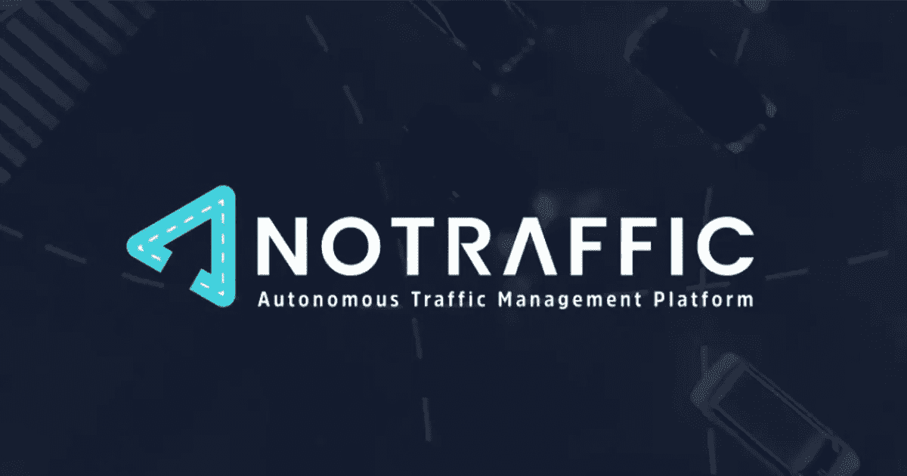
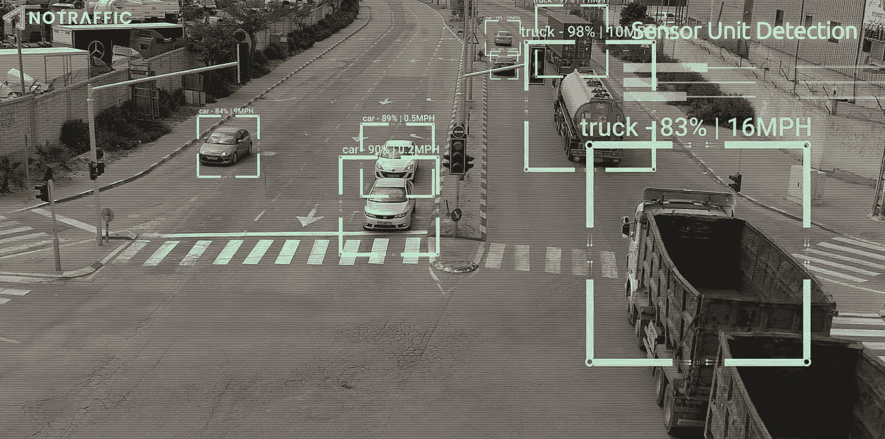
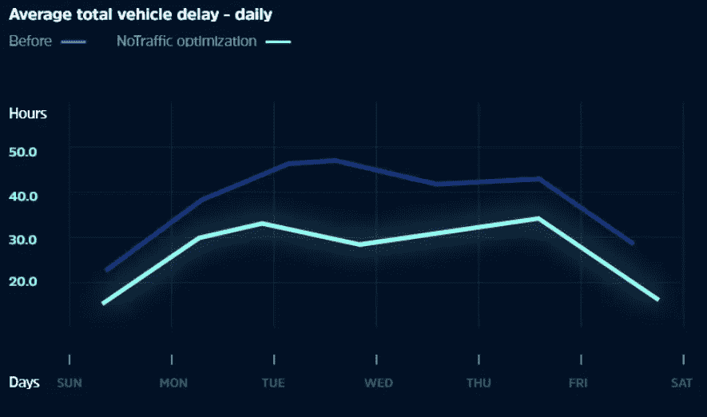

# 不再有拥挤的交通

> 原文：<https://medium.com/mlearning-ai/no-more-heavy-traffic-with-notraffic-abc66e9eaf7b?source=collection_archive---------7----------------------->

你有没有遇到过红灯，周围没有车，而且似乎要花很长时间才能变绿，所以你开始认真考虑闯红灯？NoTraffic 公司希望通过人工智能让这种情况几乎不存在。我知道已经有技术可以解决上述问题。然而，典型的解决方案是在灯上安装一个传感器——无论是摄像头还是运动设备——并根据传感器检测到的汽车来控制交通灯。虽然有效，但是这种方法缺乏所提出的无流量技术的鲁棒性。

NoTraffic 将他们的主要产品描述为“一个交通管理平台，它基于智能传感器实时优化交通灯的定时。“他们使用图像检测和图像分类模型来优化交通灯的变化。

他们所有的传感器都互相通信。交叉点 1 处的传感器与交叉点 2 处的传感器通信，交叉点 2 也与交叉点 3 处的传感器通信。结果是一个传感器网络，它决定了清理街道交通的最佳方式，如果你来自一个大城市，你可能会喜欢这个。事实上，如果你住在加州雷德兰兹，你可能已经受益于 NoTraffic 的技术。在仅有 2%的城市信号实施后，交通延误显著减少。

在加利福尼亚州和菲尼克斯的其他地区进行的单独试验中，亚利桑那州的等待时间减少了 50%。

NoTraffic 还想减少交叉路口事故的数量。他们试图解决这个问题的一种方法是，如果他们发现一辆汽车很可能闯红灯，就通知迎面而来的司机。其次，如果行人正在接近十字路口，而他们似乎没有注意路况，他们也会通知司机。

现实一点，这项技术是几十年来基础设施领域最具创新性的发展，但一切都伴随着风险。我相信让一个相互连接的摄像机系统不断收集公众的视频片段的想法对许多人来说已经足够可怕了。不难想象这样一种场景:政府利用摄像头追踪他们喜欢的任何人，尤其是因为这种摄像头已经配备了复杂的图像分类功能。然而，我认为重要的是要注意承认我们目前所面对的一些现实。首先，闯红灯摄像头和测速摄像头目前分别出现在 22 个和 16 个州。这意味着如果你住在人口稠密的城市，你可能已经遇到了交通摄像头。其次，美国大约有 5000 万到 7000 万个监控摄像头。大多数人都没有意识到这一点，但美国在每平方公里相机数量上排名第八。最后，即使有大量的录像，芝加哥仍然很难抓住罪犯。因此，虽然这是一个合理的担忧，但我不确定它是否会被如此恶意地有效利用。

不过，我绝不打算淡化这种担忧。我们的情报机构已经明确表示，他们不介意为了获取信息而侵犯我们的隐私。不可否认，他们有可能利用 NoTraffic 的技术进行操作。事实上，我们只需要看看中国，就知道这个摄像系统是如何出问题的。在中国，他们有超过 2 亿个摄像头，他们都使用面部识别和其他先进的模式。一旦他们将你标记为潜在威胁，你将在不到 10 分钟内被发现，正如一位访问过中国贵阳的 BBC 员工所展示的那样。不能保证我们的情报机构不会因为这个原因而秘密使用这项技术，所以我认为怀疑是有根据的。

总而言之，NoTraffic 的摄像头可以使用人工智能显著减少交通流量，他们也在试图减少十字路口事故。然而，这可能带来便于大规模监控的缺点。根据目前已经出现的监控录像的数量，我看不出改变游戏的缺点。更少的交通意味着更少的汽油消耗，汽油成本的降低，以及更少的交通堵塞。老实说，我认为投资这项技术没有什么相对风险，我认为我们应该尽快投资这项技术。我承认，随着未来的揭露，我的想法可能会改变。

 [## Mlearning.ai 提交建议

### 如何成为 Mlearning.ai 上的作家

medium.com](/mlearning-ai/mlearning-ai-submission-suggestions-b51e2b130bfb)