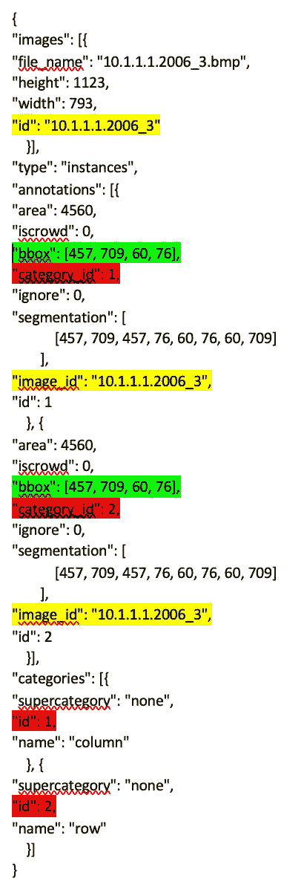
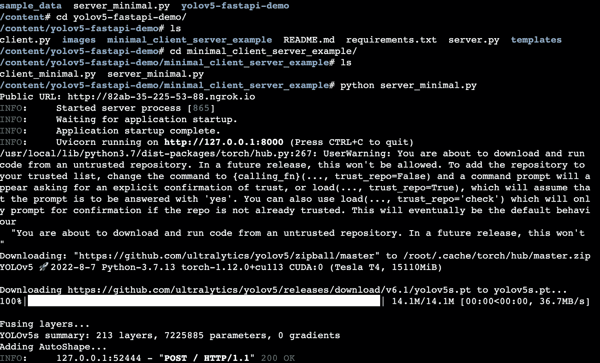
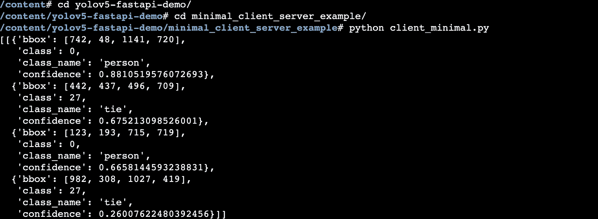
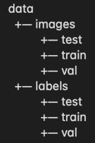
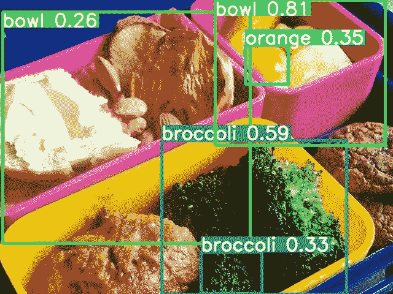

# 使用 YOLO 和 FastAPI 的对象检测服务

> 原文：<https://medium.com/mlearning-ai/object-detection-service-with-yolo-and-fastapi-af1318ee73ed?source=collection_archive---------2----------------------->

## 部署经过定制培训的机器学习模型，检测图像中的对象

在我之前的机器学习文章 [1](/mlearning-ai/image-classification-with-transfer-learning-on-tensorflow-68b6bc87ef4b) 、 [2](/mlearning-ai/image-classification-with-transfer-learning-on-pytorch-2d718c85b58f) 、 [3](/mlearning-ai/image-classification-with-transfer-learning-on-pytorch-lightning-6665ddb5b748) 中，我涵盖了计算机视觉中的一项重要任务，图像分类。图像分类是计算机视觉的一个应用。在本文中，我想探索“对象检测”任务，并使用 FastAPI 部署机器学习模型，以便它可以由 restful API 接口使用。

下面的文章很好地概述了对象检测。

[](https://viso.ai/deep-learning/object-detection/) [## 2022 年的物体探测:权威指南

### 这篇文章将提供一个对象检测的介绍，并提供一个最先进的计算机…

viso.ai](https://viso.ai/deep-learning/object-detection/) 

YOLO 是[一种](https://www.geeksforgeeks.org/difference-between-yolo-and-ssd/)类型的深度神经网络，常用于“物体检测”任务，速度非常快。YOLO 的最新版本是 [v7](/@armaan.sandhu.2002/training-yolov7-to-detect-vehicle-braking-e8e7e9db1b3b) 。我们将在本文中使用 YOLO。

# COCO 数据集格式

在“对象检测”领域，COCO(代表上下文中的公共对象)数据集是一种用于对象检测研究的数据集格式。在高层次上，它使用 JSON 来做图像标注，它需要指定图像位置和其他基本信息，最重要的是，它用相应的对象类别来标注每个图像中的包围盒(例如，图像中的哪个位置是苹果，哪个位置是香蕉，等等)。).以下是部分 COCO JSON 的样例，注意注释[]。image_id 指的是实际图像[]。id，注释[]。category_id 引用类别[]。id，这样您就知道哪个注释引用了哪个图像中的哪个边界框/位置以及边界框的类别。



更多信息，请参考以下关于 COCO 格式的文章。

[](https://haobin-tan.netlify.app/ai/computer-vision/object-detection/coco-dataset-format) [## 可可 JSON 格式的对象检测|郝斌谭

### COCO 数据集的格式是 JSON，它是“信息”、“许可证”、“图像”、“注释”、“类别”的集合…

郝斌-谭](https://haobin-tan.netlify.app/ai/computer-vision/object-detection/coco-dataset-format) [](/mlearning-ai/coco-dataset-what-is-it-and-how-can-we-use-it-e34a5b0c6ecd) [## Coco 数据集，是什么？我们如何使用它？

### COCO 格式是什么？

medium.com](/mlearning-ai/coco-dataset-what-is-it-and-how-can-we-use-it-e34a5b0c6ecd) [](https://towardsdatascience.com/coco-data-format-for-object-detection-a4c5eaf518c5) [## 对象检测的 COCO 数据格式

### 在本文中，我们将了解两种流行的数据格式:COCO 数据格式和 Pascal VOC 数据格式。这些数据…

towardsdatascience.com](https://towardsdatascience.com/coco-data-format-for-object-detection-a4c5eaf518c5) [](https://towardsdatascience.com/getting-started-with-coco-dataset-82def99fa0b8) [## COCO 数据集入门

### 理解计算机视觉常用数据集的格式

towardsdatascience.com](https://towardsdatascience.com/getting-started-with-coco-dataset-82def99fa0b8) 

使用[链接](https://gist.github.com/mkocabas/a6177fc00315403d31572e17700d7fd9)中的代码下载样本 COCO 数据集

你可以使用 [pycocotools](https://github.com/cocodataset/cocoapi/tree/master/PythonAPI) 来解析 Python 中的 COCO 数据集。下面是一些解析注释并显示为图片的示例，如[这篇文章](/mlearning-ai/coco-dataset-what-is-it-and-how-can-we-use-it-e34a5b0c6ecd)。

```
# instance with bounding boxes and category text
import pandas as pd 
import os
from pycocotools.coco import COCO
import skimage.io as io
import matplotlib.pyplot as plt
from pathlib import PathdataDir=Path('coco/images/val2017')
annFile = Path('coco/annotations/instances_val2017.json')
coco = COCO(annFile)
imgIds = coco.getImgIds()
imgs = coco.loadImgs(imgIds[-3:])_,axs = plt.subplots(len(imgs),2,figsize=(10,5 * len(imgs)))
for img, ax in zip(imgs, axs):
 I = io.imread(dataDir/img['file_name'])
 annIds = coco.getAnnIds(imgIds=[img['id']])
 anns = coco.loadAnns(annIds)
 ax[0].imshow(I)
 ax[1].imshow(I)
 plt.sca(ax[1])
 coco.showAnns(anns, draw_bbox=True)
 for i, ann in enumerate(anns):
 cat = coco.loadCats(anns[i]['category_id'])
 cat_name = cat[0]['name']
 ax[1].text(anns[i]['bbox'][0], anns[i]['bbox'][1], cat_name, style='italic', 
 bbox={'facecolor': 'white', 'alpha': 0.7, 'pad': 5})# person key points
dataDir=Path('coco/images/val2017')
annFile = Path('coco/annotations/person_keypoints_val2017.json')
coco = COCO(annFile)
imgIds = coco.getImgIds()
imgs = coco.loadImgs(imgIds[-1:])
_,axs = plt.subplots(len(imgs),2,figsize=(10,5 * len(imgs)))
for img, ax in zip(imgs, axs):
 I = io.imread(dataDir/img['file_name'])
 annIds = coco.getAnnIds(imgIds=[img['id']])
 anns = coco.loadAnns(annIds)
 ax[0].imshow(I)
 ax[1].imshow(I)
 plt.sca(ax[1])
 coco.showAnns(anns, draw_bbox=False)
```

# 基于 Google Colab 的 Yolov5 和 fastapi 模型推理

当您在 Google Colab 上运行 fastapi API 时，您希望将端点公开，以便您可以从 Internet 访问。之前你可以使用 [ngrok](http://ngrok.com) 如本文[文章](https://medium.datadriveninvestor.com/flask-on-colab-825d2099d9d8)所述，以及[本 colab 笔记本](https://colab.research.google.com/github/gstaff/flask-ngrok/blob/master/examples/flask_ngrok_example.ipynb)。然而，似乎不是 ngrok 要求你在使用它之前先注册帐户。也试过[这个 colab 笔记本](https://colab.research.google.com/drive/1QZywh4xiiR8BX14dThVVRaJ3c7hgJcyU#scrollTo=NyJSh3xaZUCB)，但是 python minimal_server.py 就是挂。终于找到了 [colab-xterm](https://blog.infuseai.io/run-a-full-tty-terminal-in-google-colab-without-colab-pro-2759b9f8a74a) ，解决了问题，并且可以并行运行多个 xterm(例如服务器和客户端)，启用第三方 cookies 后。

```
!pip install colab-xterm
%load_ext colabxterm
```

那就跑

```
%xterm
```

我在下面跟踪了 repo

[](https://github.com/WelkinU/yolov5-fastapi-demo) [## GitHub-WelkinU/yolov 5-fastapi-demo:yolov 5 的 FastAPI 包装器

### 这是一个演示 FastAPI 应用程序，允许用户上传图像，使用预先训练的 YOLOv5 模型进行推理…

github.com](https://github.com/WelkinU/yolov5-fastapi-demo) 

快速回顾一下 [FastAPI 服务器代码](https://github.com/WelkinU/yolov5-fastapi-demo/blob/main/minimal_client_server_example/server_minimal.py)，它是一个基于 Python 的快速(高性能)web 框架，用于构建 API。

典型的当你每次点击托管机器学习模型的 FastAPI 端点时，会发生以下情况:

1.  根据您的路由设置，您的请求将由 FastAPI 路由到由 route 注释的函数中
2.  然后您的代码使用该模型(该模型通常是全局加载的，以避免每次请求时都加载它)
3.  使用模型预测功能或向前传递模型以获得预测结果
4.  将结果转换成 JSON

主 uvicorn 服务器代码，告诉服务器监听 localhost:8000 并运行 app 实例，这是 FastAPI 实例。

```
from fastapi import FastAPI
app = FastAPI()# Python main entrypointif __name__ == '__main__':
    import uvicorn # [APP/app_str](https://www.uvicorn.org/settings/) - The ASGI application to run, in the format "<module>:<attribute>" app_str = 'server_minimal:app'
    uvicorn.run(app_str, host='localhost', port=8000, reload=True, workers=1)
```

主对象检测 API 端点。FastAPI 用 decorator 告诉“/”，HTTP post 组合要路由到 process_home_form 函数，函数可以取传入的 filestream 和模型名并得到预测结果，然后转换成默认要求的 JSON 格式，并发回。

```
[@app](http://twitter.com/app).post("/")
async def process_home_form(file: UploadFile = File(...), 
              model_name: str = Form(...)):

    '''
    Requires an image file upload, model name (ex. yolov5s).
    Returns: json response with list of list of dicts.
      Each dict contains class, class_name, confidence, normalized_bbox
    Note: Because this is an async method, the YOLO inference is a blocking
    operation.
    '''model = torch.hub.load('ultralytics/yolov5', model_name, pretrained=True, force_reload = False)#This is how you decode + process image with PIL
    results = model(Image.open(BytesIO(await file.read()))) json_results = results_to_json(results,model)
    return json_results
```

如果您查看[客户端代码](https://github.com/WelkinU/yolov5-fastapi-demo/blob/main/minimal_client_server_example/client_minimal.py)，您会看到它正在向 http://localhost:8000 发送，传递模型名称和图像文件流。

```
import requests as r
import json
from pprint import pprintdef send_request(image = '../images/zidane.jpg', model_name = 'yolov5s'):
    res = r.post("[http://localhost:8000](http://localhost:8000)", 
                    data={'model_name': model_name}, 
                    files = {'file': open(image , "rb")} #pass the files here
                    )pprint(json.loads(res.text))if __name__ == '__main__':
    send_request()
```

YOLOv5 对象检测 restful API 服务器。



对象检测 api 客户端



在现实世界中，你将构建一个具有必要依赖关系的容器镜像(例如 Python 运行时，fastapi(例如 FastAPI，uvicorn)和 YOLO(例如 pytorch)需要的 Python 包，机器学习模型)。下面是一个示例 Dockerfile 文件

[](https://github.com/DanielChuDC/yolov5-fastapi/blob/main/Dockerfile) [## yolov 5-fastapi/docker file at main Daniel chudc/yolov 5-fastapi

### 此文件包含双向 Unicode 文本，其解释或编译可能与下面显示的不同…

github.com](https://github.com/DanielChuDC/yolov5-fastapi/blob/main/Dockerfile) 

# YOLO 转移学习/定制培训

您还希望根据自己的数据训练自己的模型，并从预先训练好的 YOLO 模型开始。 [YOLO5 回购](https://github.com/ultralytics/yolov5)提供教程。要使用它，您需要以下列格式提供数据。

[](https://kikaben.com/yolov5-transfer-learning-dogs-cats/) [## YOLOv5 在简单的步骤中转移学习，而不会失去你的头脑- KiKaBeN

### YOLOv5 迁移学习很好地集成到 Ultralytics 的实现中。我们将对…进行迁移学习

kikaben.com](https://kikaben.com/yolov5-transfer-learning-dogs-cats/) 

*   图像和标签文件夹



*   对于相应的图像，它需要有。标签文件夹中具有相同名称的 txt，例如 data/images/train/00000000009 . jpg 需要包含注释的 data/labels/train/00000000009 . txt
*   标签文件格式:每行有五个数字，第一个是类别 id，其他表示边界框，每个文件可以有多行用于多个注释

```
0 0.35750000000000004 0.53875 0.463334 0.39499999999999996
```

*   为数据和标签提供信息的训练配置文件，例如，在下面，您有数据集的路径、训练数据集的相对路径、验证和测试数据集，以及名称中的类列表

```
path: ../datasets/coco128  # dataset root dir
train: images/train2017  # train images (relative to 'path') 128 images
val:  # val images (relative to 'path') 128 images
test:  # test images (optional)# Classes
names:
  0: person
  1: bicycle
  2: car
  3: motorcycle
  4: airplane
```

YOLOv5 还将主干(提取图像特征)与头层分开。通常，在迁移学习过程中，您希望保持这些层的权重不变。有一个“冻结”参数来保持主干层冻结。训练自定义数据集的基本命令是

```
python train.py --img <image size> --batch <batch size> --epochs <epoch> --data <training config file/coco128.yaml> --weights <pretrained model> --freeze <number of layers to freeze>
```

使用定制的模型

```
python detect.py --weights runs/train/exp2/weights/best.pt --img 640 --conf 0.25 --source data/images
```



而对于一个快速启动的项目，FastAPI 是可以部署机器学习模型的。在大规模生产工作负载中，需要一个成熟的模型服务框架。这将在另一篇文章中。

# 附录

## 用于 COCO 格式的工具

[](/codable/convert-any-dataset-to-coco-object-detection-format-with-sahi-95349e1fe2b7) [## 使用 SAHI 将任何数据集转换为 COCO 对象检测格式

### 读完这篇文章后，你将能够轻松地将任何数据集转换成 COCO 对象检测格式🚀

medium.com](/codable/convert-any-dataset-to-coco-object-detection-format-with-sahi-95349e1fe2b7) 

sahi Python 包可以生成 COCO 格式(其实是一个轻量级的视觉库，用于物体检测)

[](https://towardsdatascience.com/how-to-work-with-object-detection-datasets-in-coco-format-9bf4fb5848a4) [## 如何使用 COCO 格式的对象检测数据集

### 一个全面的指南，以定义，加载，探索和评估对象检测数据集在 COCO 格式使用…

towardsdatascience.com](https://towardsdatascience.com/how-to-work-with-object-detection-datasets-in-coco-format-9bf4fb5848a4) [](https://medium.datadriveninvestor.com/how-to-create-custom-coco-data-set-for-object-detection-96ec91958f36) [## 如何创建用于对象检测的自定义 COCO 数据集

### 之前，我们已经用 Pascal VOC 数据格式的自定义注释数据集训练了一个 mmdetection 模型。你没有…

medium.datadriveninvestor.com](https://medium.datadriveninvestor.com/how-to-create-custom-coco-data-set-for-object-detection-96ec91958f36) 

## YOLO

[](https://blog.roboflow.com/guide-to-yolo-models/) [## 你对 YOLO 模型家族的全面指导

### YOLO(你只看一次)是一个计算机视觉模型家族，自从约瑟夫…

blog.roboflow.com](https://blog.roboflow.com/guide-to-yolo-models/) 

YOLO 的历史:旧版本的 YOLO 基于 Darknet，但是从 v5 开始，大多数实现都基于 PyTorch。

[](https://github.com/meituan/yolov6) [## GitHub - meituan/YOLOv6: YOLOv6:一个单级对象检测框架，专用于工业…

### 论文的实现- YOLOv6:一个工业应用的单阶段目标检测框架 YOLOv6 是一个…

github.com](https://github.com/meituan/yolov6) [](https://towardsdatascience.com/yolov6-next-generation-object-detection-review-and-comparison-c02e515dc45f) [## YOLOv6:下一代物体探测—回顾与比较

### 下一代目标探测的回顾与比较

towardsdatascience.com](https://towardsdatascience.com/yolov6-next-generation-object-detection-review-and-comparison-c02e515dc45f) [](https://machinelearningknowledge.ai/yolov6-explained-with-tutorial-and-example/) [## YOLOv6 用教程和例子讲解——MLK——机器学习知识

### 在本文中，我们将介绍新的对象检测模型 YOLOv6，它已经在计算机中引起了轰动…

machinelearningknowledge.ai](https://machinelearningknowledge.ai/yolov6-explained-with-tutorial-and-example/) [](https://viso.ai/deep-learning/yolov7-guide/) [## YOLOv7:最强大的对象检测算法(2022 指南)- viso.ai

### YOLOv7 算法正在计算机视觉和机器学习社区掀起轩然大波。最新的 YOLO…

viso.ai](https://viso.ai/deep-learning/yolov7-guide/) [](/augmented-startups/top-yolo-variants-of-2021-19dddc23043c) [## 2021 年 YOLO 的顶级变体

### 目标检测的目的是用包围盒标记图像中包含目标的区域，并对它们进行分类。这个…

medium.com](/augmented-startups/top-yolo-variants-of-2021-19dddc23043c) [](https://docs.nvidia.com/metropolis/TLT/tlt-user-guide/text/object_detection/yolo_v4.html) [## YOLOv4 -迁移学习工具包 3.0 文档

### YOLOv4 是迁移学习工具包中包含的一个对象检测模型。YOLOv4 支持以下功能…

docs.nvidia.com](https://docs.nvidia.com/metropolis/TLT/tlt-user-guide/text/object_detection/yolo_v4.html) [](/augmented-startups/train-yolov8-on-custom-data-6d28cd348262) [## 用自定义数据训练 YOLOv8？

### YOLOv8🔥在平均精度(MAP)方面创下新高，得分为 53.7。

medium.com](/augmented-startups/train-yolov8-on-custom-data-6d28cd348262) 

## 使用 FastAPI 部署机器学习模型

[](https://towardsdatascience.com/how-you-can-quickly-deploy-your-ml-models-with-fastapi-9428085a87bf) [## 如何使用 FastAPI 快速部署 ML 模型

### 如何使用这个 API 构建工具快速部署您的 ML 模型？

towardsdatascience.com](https://towardsdatascience.com/how-you-can-quickly-deploy-your-ml-models-with-fastapi-9428085a87bf) [](/@mingc.me/deploying-pytorch-model-to-production-with-fastapi-in-cuda-supported-docker-c161cca68bb8) [## 在支持 CUDA 的 Docker 中使用 FastAPI 将 PyTorch 模型部署到生产环境中

### 介绍

medium.com](/@mingc.me/deploying-pytorch-model-to-production-with-fastapi-in-cuda-supported-docker-c161cca68bb8) [](https://betterprogramming.pub/fastapi-best-practices-1f0deeba4fce) [## FastAPI 最佳实践

### 我们在初创公司生产 1.5 年后开发的最佳实践和惯例的自以为是的列表。

better 编程. pub](https://betterprogramming.pub/fastapi-best-practices-1f0deeba4fce) 

## 使用 Python 以外的语言进行对象检测

[](https://docs.microsoft.com/en-us/dotnet/machine-learning/tutorials/object-detection-onnx) [## 教程:使用 ONNX 深度学习模型检测对象。网

### 了解如何使用 model 预先训练的 ONNX 模型来检测图像中的对象。训练对象检测模型…

docs.microsoft.com](https://docs.microsoft.com/en-us/dotnet/machine-learning/tutorials/object-detection-onnx) 

## YOLO 迁移学习

[](/@Smartcow_ai/nvidia-transfer-learning-toolkit-a-comprehensive-guide-75148d1ac1b) [## Nvidia 迁移学习工具包—全面指南

### 在当今世界，大多数高度优化的深度神经网络架构已经可供使用，什么…

medium.com](/@Smartcow_ai/nvidia-transfer-learning-toolkit-a-comprehensive-guide-75148d1ac1b) [](https://docs.nvidia.com/metropolis/TLT/tlt-user-guide/) [## 迁移学习工具包-迁移学习工具包 3.0 文档

### 创建实验规范文件-分类规范文件

docs.nvidia.com](https://docs.nvidia.com/metropolis/TLT/tlt-user-guide/) [](https://mingzhi2.medium.com/yolov4-transfer-learning-for-scanned-document-structure-recognition-dc3fc8bfe426) [## 用于扫描文档结构识别的 YOLOv4 迁移学习

### 当你第一次听到“YOLO”时，你可能会直觉地想到“你只能活一次”。但它也是…

mingzhi2.medium.com](https://mingzhi2.medium.com/yolov4-transfer-learning-for-scanned-document-structure-recognition-dc3fc8bfe426) [](/analytics-vidhya/train-a-custom-yolov4-object-detector-using-google-colab-61a659d4868) [## 训练一个自定义的 YOLOv4 对象检测器(使用 Google Colab)

### (初学者教程)

medium.com](/analytics-vidhya/train-a-custom-yolov4-object-detector-using-google-colab-61a659d4868) [](/analytics-vidhya/train-a-custom-yolov4-tiny-object-detector-using-google-colab-b58be08c9593) [## 训练一个定制的 yolov 4-微小物体探测器(使用 Google Colab)

### 训练用于掩模检测的定制 YOLO 检测器

medium.com](/analytics-vidhya/train-a-custom-yolov4-tiny-object-detector-using-google-colab-b58be08c9593) [](https://github.com/edgeimpulse/yolov5) [## GitHub-Edge Impulse/yolo V5:yolo V5 边缘脉冲迁移学习模型

### 这个库是一个如何将你自己的模型引入 Edge Impulse 的例子。这个库使用 YOLOv5(一个…

github.com](https://github.com/edgeimpulse/yolov5) [](https://github.com/Danielskauge/yolo_transfer_learning) [## GitHub-Danielskauge/yolo _ transfer _ Learning:学习如何在 yolo 上用…

### 此时您不能执行该操作。您已使用另一个标签页或窗口登录。您已在另一个选项卡中注销，或者…

github.com](https://github.com/Danielskauge/yolo_transfer_learning) [](https://blog.ovhcloud.com/object-detection-train-yolov5-on-a-custom-dataset/) [## 对象检测:在自定义数据集上训练 yolov 5-ovh cloud 博客

### 在数据集上训练 YOLO 对象检测算法的指南。它基于 YOLOv5 开源库，由…

blog.ovhcloud.com](https://blog.ovhcloud.com/object-detection-train-yolov5-on-a-custom-dataset/) [](https://forums.pytorchlightning.ai/t/object-detection/405) [## 目标检测

### 有没有使用 PtTorch Lightening 实现物体检测的教程/示例，是用 Faster_rcnn 还是…

forums.pytorchlightning.ai](https://forums.pytorchlightning.ai/t/object-detection/405) 

PyTorch 闪电 YOLO 可能还不成熟。只找到一些相关的帖子。

[](https://github.com/Lightning-AI/lightning-bolts/issues/22) [## 添加 yolo v3/4 第 22 期闪电-AI/闪电-螺栓

### 此时您不能执行该操作。您已使用另一个标签页或窗口登录。您已在另一个选项卡中注销，或者…

github.com](https://github.com/Lightning-AI/lightning-bolts/issues/22) [](/mlearning-ai/mlearning-ai-submission-suggestions-b51e2b130bfb) [## Mlearning.ai 提交建议

### 如何成为 Mlearning.ai 上的作家

medium.com](/mlearning-ai/mlearning-ai-submission-suggestions-b51e2b130bfb)