# 杂食动物:多种视觉形态的单一模型|论文摘要|

> 原文：<https://medium.com/mlearning-ai/omnivore-a-single-model-for-many-visual-modalities-paper-summary-cf45a90bfc75?source=collection_archive---------4----------------------->

> 这是一个伟大和令人钦佩的尝试，开发一个单一的模型，能够像人类视觉一样处理多项任务。很高兴看到计算机视觉的更多进步。

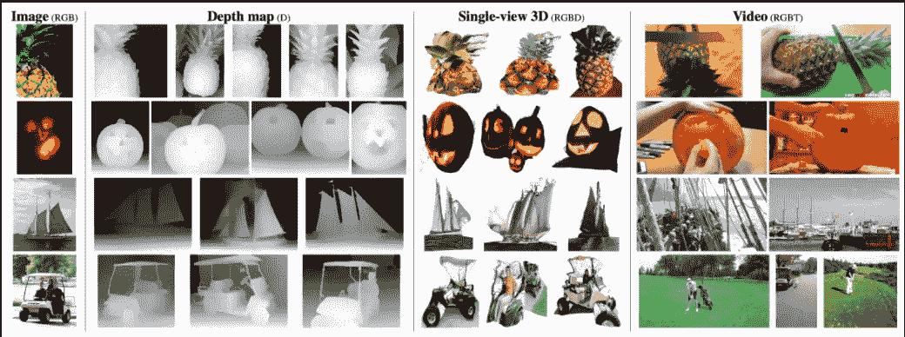

在这项研究中，研究人员提出了一个单一的模型来完成各种任务(对图像、视频和 3D 数据进行分类)，而不是为特定的任务(识别图像、视频和 3D 数据)单独开发模型架构。这个模型被命名为“*”它利用了基于 ***变压器*** 设计的灵活性。令人惊讶的是，该模型很容易使用 [*现成的标准数据集*](https://appen.com/off-the-shelf-datasets/) 进行训练，并且与同等规模的同行相比效果相当或更好。成绩尚可:在 [ImageNet](https://www.image-net.org/) 上 86.0%，在 [Kinetics](https://deepmind.com/research/open-source/kinetics) 上 84.1%，在 [SUN RGB-D](https://rgbd.cs.princeton.edu/) 上 67.1%。最后，该模型允许跨模态识别，而无需访问模态之间的对应关系。*

*对人工智能有很多怀疑(消极的或积极的)，倡导者一直支持人工智能像人类一样存在、思考和行动(特别是在同时做几项任务时)。特定研究的特定模型确实表现出色；然而，这些模型架构并不具备比人类视觉更好甚至相似的能力。这个“ ***杂食者*** ”就是试图完成这样一个愿景。*

*作者主张实现前面提到的目标；我们必须构建跨模态整体执行的模型，而不是针对每种方式进行过度优化。*

*除了灵活性之外，对于特定任务，这些传统模型还有一些优势:*

*   *能够执行*跨模态概括**
*   *能够节省专门为特定任务优化模型的研究和工程工作*
*   *这个模型自然是多模型，当新的视觉传感器可用时*可以利用**

> **跨通道概括可以定义为将一个习得的模型从一个通道转移到另一个通道，而无需在后一个“交叉”通道中进行直接指导**

**在本文中，我将说明提出的“**杂食模式的好处:****

***出乎意料的是，研究人员已经看到**杂食**指示可以很好地跨视觉模态推广，尽管该模型没有被训练成跨模态模型对应。 **OMNIVORE** 是许多不同视觉形态的单一模型。让我们以一个南瓜的例子来看看这三种数据:***

***原始图像可以在这里看到:***

******

***Fig. 1\. The original **image** (RGB) (ImageNet-1K validation dataset) ([source](https://arxiv.org/pdf/2201.08377))***

***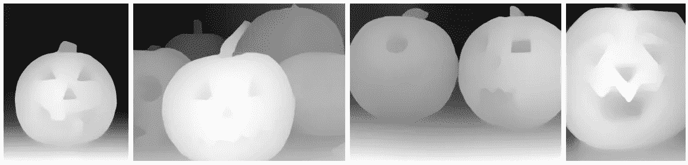***

***Fig. 2\. **Depth map** (D) (ImageNet-1K training set) ([source](https://arxiv.org/pdf/2201.08377))***

***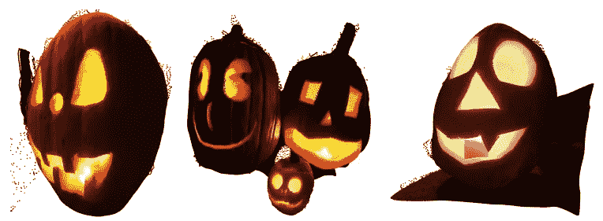***

***Fig. 3\. **Single-view 3D** (RGBD) (ImageNet-1K training set) ([source](https://arxiv.org/pdf/2201.08377))***

***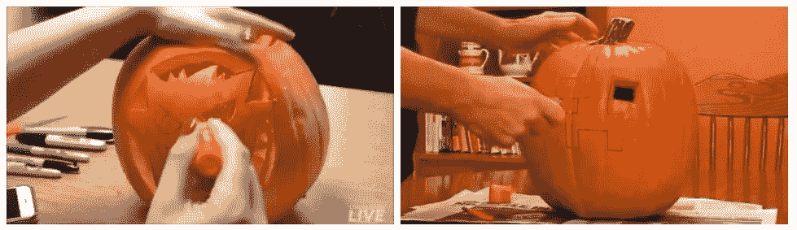***

***Fig. 4\. **Video** (RGBT) (Kinetics-400 validation set) ([source](https://arxiv.org/pdf/2201.08377))***

***记住 **OMNIVORE** 不为特定的模态使用特定的架构是有好处的；事实上，所有三种不同的形态(图像、视频和单视图 3D)都采用相同的架构。为了清楚起见，模型( **OMNIVORE** )将每个输入模态转换成时空补片的嵌入，这些补片由同一转换器处理以生成输入的指示。那么你觉得模特是怎么训练的呢？🤔***

***回答🤞:该模型在一组标准的现成分类数据集上进行训练，包括各种类型的输入。(虽然答案最初是在文章的开头提到的😅)***

# ***杂食动物模型***

***所有的数据类型都被转换成一种通常的格式，并用嵌入来表示。然后，模型(**杂食者**)利用一系列*时空注意*操作来建立所有模态的综合指示。***

## **输入补丁**

**这三种数据被转换成 ***4D 张量*** ( *时间维度，两个空间维度和，通道维度*)。然后，输入数据被分离成一个面片集合，最后被表示为嵌入。该过程如下图所示:**

**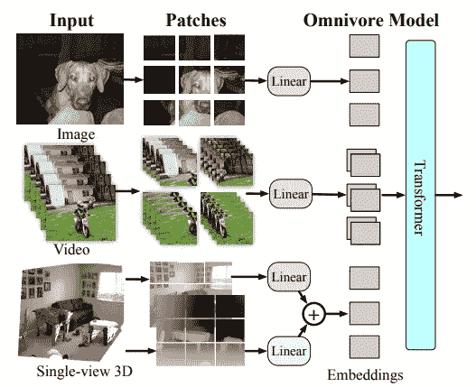**

**Fig. 5\. **Multiple visual modalities in the OMNIVORE model** ([source](https://arxiv.org/pdf/2201.08377))**

## **模型架构**

**该模型的设计方式是允许跨视觉模态的最大参数共享。输入层将所有面片 x 分开操作，然后将它们投影到嵌入 e 中(使用线性层( [LayerNorm](https://www.cs.utoronto.ca/~hinton/absps/LayerNormalization.pdf) ))**

*   **LayerNorm 是一种减少训练时间消耗的技术，可以使神经元的活动正常化。**

**在**杂食**中，研究人员利用一个单独的线性 LN 层来嵌入深度通道补丁，并将其输出添加到相应的 RGB 补丁的嵌入中。**

**在 **OMNIVORE** 上的基础模型是 [***Swin Transformer 架构***](https://openaccess.thecvf.com/content/ICCV2021/papers/Liu_Swin_Transformer_Hierarchical_Vision_Transformer_Using_Shifted_Windows_ICCV_2021_paper.pdf) ，这赋予了 **OMNIVORE** 强大的处理图像和视频的能力。而且，对于跨面片嵌入的时空建模，**杂食**依赖于 [***自我关注***](http://papers.neurips.cc/paper/7181-attention-is-all-you-need.pdf) 。最后，两套 [***相对位置编码***](https://arxiv.org/pdf/1803.02155v2)*(对于空间维度和时间维度)用于**杂食**的构造。***

*   *****Swin(*S****hifted****win****dows***)Transformer**是*微软*于 2021 年开发的一款层级 Transformer，用于解决视觉与语言之间的**差异**。swin Transformer**将**自关注计算限制在非重叠的局部窗口，而允许跨窗口连接。***
*   ****自关注**是描述单个序列的不同位置的机制，以便计算相同序列的指示；换句话说，它是一个 **seq-2-seq 操作**。**
*   ****相对位置编码**是一种位置嵌入，用于变压器产生成对的相对位置信息。我们没有将语义嵌入和绝对位置嵌入结合起来，而是将相对位置信息添加到键和值中。**

# **杂食评估**

**数据集的各种分支，包括图像、视频和单视图 3D，用于评估**杂食动物**。数据的汇总可以在表 1 中看到，其中#cls 是类的数量，#train 和#test 分别是训练和测试样本的数量。蓝色数据集与图像相关，紫色数据集与视频相关，绿色数据集代表单视图 3D 模式。**

**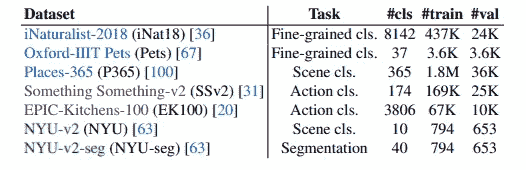**

**Table 1. **Transfer datasets** ([source](https://arxiv.org/pdf/2201.08377))**

**然后将 **OMNIVORE** 与其他特定模式车型进行比较:**

**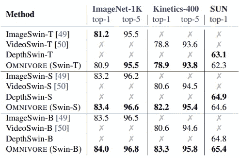**

**Table 2\. **OMNIVORE** vs. **modality-specific models** ([source](https://arxiv.org/pdf/2201.08377))**

**表二。是对相关数据集上的**杂食**和特定模态模型的比较。很明显**杂食**呈现出与其他车型相同甚至更好的性能。**

**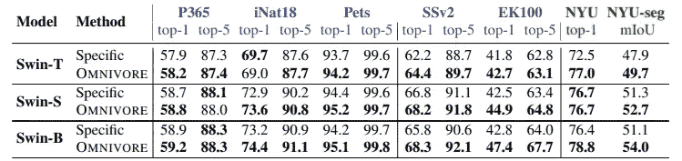**

**Table 3\. **OMNIVORE** vs **modality-specific models** ([source](https://arxiv.org/pdf/2201.08377))**

**表 3。通过对各种下游任务进行微调，提供了对**杂食**和特定模态模型的比较结果。同样， **OMNIVORE** 呈现出比其他车型更好的性能。**

**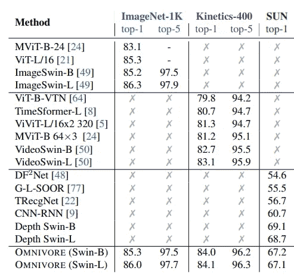**

**Table 4\. **Comparing OMNIVORE** with **state-of-the-art models** ([source](https://arxiv.org/pdf/2201.08377))**

**表 4。展示了 **OMNIVORE** 与高级模型在所有三种数据类型上的比较(**image**(*ImageNet-1K*)、**video**(*Kinetics-400*)、**单视角 3D** ( *SUN* )。同样， **OMNIVORE** 表现出与高级车型不相上下或更好的性能(这是尖端和特殊的模式🙂).**

**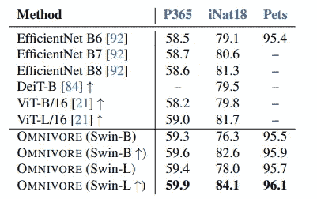**

**Table 5\. **OMNIVORE** vs **state-of-the-art models** in ***image*** classification ([source](https://arxiv.org/pdf/2201.08377))**

**表 5。提供了在三个数据集上的**图像**分类微调实验中**杂食者**与高级模型的比较。此次比较的结果与之前的比较相同。同样，表 6 和表 7 分别提供了**杂食**与高级车型在**视频**分类和 **RGBD** 微调实验中的比较结果。**

**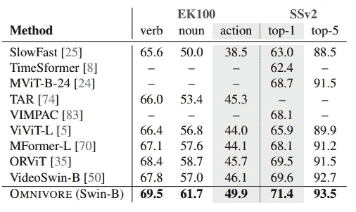**

**Table 6\. **OMNIVORE** vs **state-of-the-art models** in ***image*** classification ([source](https://arxiv.org/pdf/2201.08377))**

**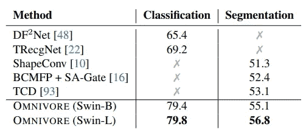**

**Table 7\. **OMNIVORE** vs **state-of-the-art models** in **RGBD finetuning** ([source](https://arxiv.org/pdf/2201.08377))**

*   **RGB 是计算机图形的基本颜色模型，因为彩色显示器使用红色、绿色和蓝色来创建想要的颜色。因此，RGB 颜色空间的选择简化了系统的架构和设计。([来源](http://sun.aei.polsl.pl/~mkawulok/stud/graph/instr.pdf))**

**看到这样一个优于各种模式的模型被开发出来，真的非常令人着迷。对了，周围还有一些**限制**:**

*   ****杂食者只需**对**单视角 3D 图像**进行操作；因此，**不会**推广到其他 3D 授权，如*体素、点云等*。**
*   *****深度输入*** 是**而不是*固定比例*** (为了减少这种约束，使用了 ***归一化*** )**
*   ****杂食者仅**对**视觉数据**执行(不像***同现形态**)***
*   *****OMNIVORE** 仅使用***分类*** 和 ***结构化预测任务*** 进行预处理。***

> **请注意，本研究的**源代码**可在[**这里**](https://facebookresearch.github.io/omnivore) **查阅。****

***参考:***

1.  **Girdhar，r .，等， *Omnivore:多视觉模态的单一模型。* arXiv 预印本 arXiv:2201.08377，2022。[源](https://arxiv.org/pdf/2201.08377)**

> ****请注意，本帖是为我日后或然的研究作出的回顾和复习有关此专题的材料而不完全阅读** [**论文**](https://arxiv.org/pdf/2201.08377) **。本文所用图片来源均为** [**原纸**](https://arxiv.org/pdf/2201.08377) **。****
> 
> **如发现**错误**，请及时与我联系。同时，你可以在 **Twitter** 这里[这里](https://twitter.com/reza__yazdanfar)或者 **LinkedIn** 这里[这里](http://www.linkedin.com/in/rezayazdanfar)联系我。最后，如果你有什么想法，我在**开**商量，你唯一需要的就是在 [**LinkedIn** 或](http://www.linkedin.com/in/rezayazdanfar)或[T57Twitter](https://twitter.com/reza__yazdanfar)上给我留言。🙂**

** [## Mlearning.ai 提交建议

### 如何成为 Mlearning.ai 的作者

medium.com](/mlearning-ai/mlearning-ai-submission-suggestions-b51e2b130bfb)**