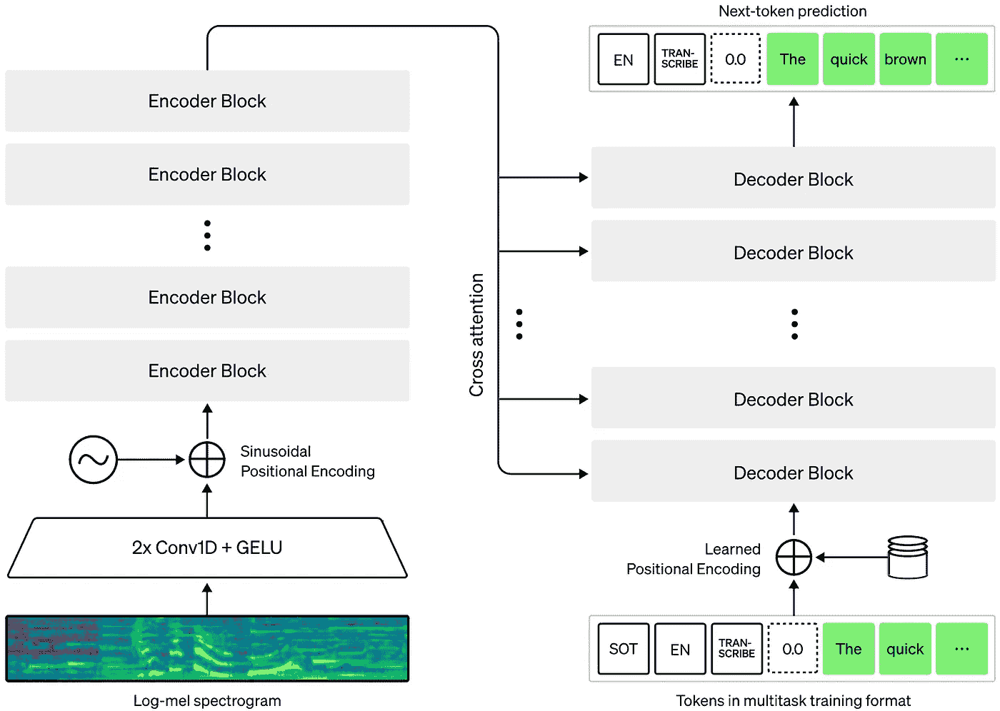

# OpenAI 的 Whisper 就是为了让语音识别变得简单

> 原文：<https://medium.com/mlearning-ai/openais-whisper-is-here-to-make-speech-recognition-easy-6cd09cf911e6?source=collection_archive---------0----------------------->

快速，简单和最准确的自动语音识别工具


Photo by [Birmingham Museums Trust](https://unsplash.com/@birminghammuseumstrust?utm_source=unsplash&utm_medium=referral&utm_content=creditCopyText) on [Unsplash](https://unsplash.com/s/photos/whisper?utm_source=unsplash&utm_medium=referral&utm_content=creditCopyText)

# 介绍

作为计算机程序员，我们大多数人可能都觉得有必要使用任何转录或翻译服务来开发任何类型的语言应用程序。大多数这些库都是开源的。在 python 中，一些常用的语音识别库有[apai](https://pypi.org/project/apiai/)、 [pocketsphinx](https://pypi.org/project/pocketsphinx/) 、[speecher recognition](https://pypi.org/project/SpeechRecognition/)等。

现在，我真的很感谢那些开发这些图书馆的人，这些年来他们帮助了我们所有人。但是有一个新的工具在执行 ASR 方面比 python 中一些已有的库要好得多。

是啊！！这叫耳语！！

# 关于耳语

Whisper 是由 OpenAI 的贡献者开发的，可以在 MIT 许可下使用。它是基于拉德福德等人 *的论文 [*大规模弱监督*](https://cdn.openai.com/papers/whisper.pdf) *鲁棒语音识别。艾尔*。Whisper 允许您将任何音频转录为文本，并将其翻译为多种语言。它已经在从互联网上收集的大量语音数据上进行了 68 万小时的训练。多样化的数据集使 Whisper 能够理解不同的口音，并过滤背景噪音。*



source: [https://openai.com/blog/whisper/](https://openai.com/blog/whisper/)

Whisper 是一个基于编码器-解码器转换器架构的多任务模型。在训练模型时，输入数据(即音频文件)被分割成 30 秒的部分，并被转换成 Log-mel 频谱图，该频谱图被馈送到编码器，解码器负责预测相应的文本，并将其翻译成多种语言。

大约三分之一的音频数据是非英语的。保持数据集的多样性有助于团队获得比其他受监督的最先进模型更好的性能。

# 使用 Whisper 实施 ASR

通过这些简单的步骤，您可以使用 Whisper 实现语音识别。

1.  安装耳语

```
!pip install git+https://github.com/openai/whisper.git
```

2.导入包

```
import whisper
import numpy as np
```

3.加载模型并定义音频文件路径

```
model = whisper.load_model("medium")file_path = '/content/drive/MyDrive/obama_speech_sample.wav'
```

4.转录

```
transcription = model.transcribe(file_path)["text"]
```

5.翻译成其他语言

我已经将翻译语言设置为法语。您可以在此从支持的语言列表[中选择您想要的语言。](https://github.com/openai/whisper#available-models-and-languages)

```
translation = model.transcribe(file_path, language='fr')["text"]
```

点击查看我从[选择的音频文件。](https://drive.google.com/file/d/1S5FnoMUK0wCfuJLfCdN4wFlAIYGz9cxq/view?usp=sharing)

**转录输出-**

转录输出的前几行。全文文件是[这里是](https://drive.google.com/drive/folders/1-UnoWRnOwDE0Rc5mrCTxX8xpOPFI6RDC?usp=sharing)。

```
Secretary Gates, Admiral Mullen and members of the Armed Forces, fellow Americans, family and friends of those that we lost this day, Michelle and I are deeply humbled to be with you. Eight Septembers have come and gone. Nearly 3,000 days have passed, almost one for each of those taken from us. But no turning of the seasons can diminish the pain and the loss of that day. No passage of time and no dark skies can ever dull the meaning of this moment. 
```

**翻译输出-**

翻译输出的前几行。全文文件是[这里是](https://drive.google.com/drive/folders/1-UnoWRnOwDE0Rc5mrCTxX8xpOPFI6RDC?usp=sharing)。

```
Secrétaire Gates, Admirable Mullen et membres de l'armée, les Américains, la famille et les amis de ceux que nous avons perdus ce jour. Michelle et moi sommes très fiers d'être avec vous. Les 8 septembre sont venus et sont partis.
```

# 结论

使用 Whisper 在移动中应用转录和翻译音频文件是如此简单和准确，我要感谢 Whisper 的创造者创造了这个神奇的工具。这肯定会对我们有很大帮助，并使在它的基础上开发应用程序变得非常容易。

希望你喜欢这篇文章，请鼓掌并关注我的页面，看更多类似的精彩文章。

[](/mlearning-ai/mlearning-ai-submission-suggestions-b51e2b130bfb) [## Mlearning.ai 提交建议

### 如何成为 Mlearning.ai 上的作家

medium.com](/mlearning-ai/mlearning-ai-submission-suggestions-b51e2b130bfb)