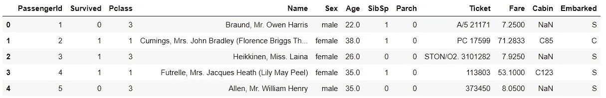
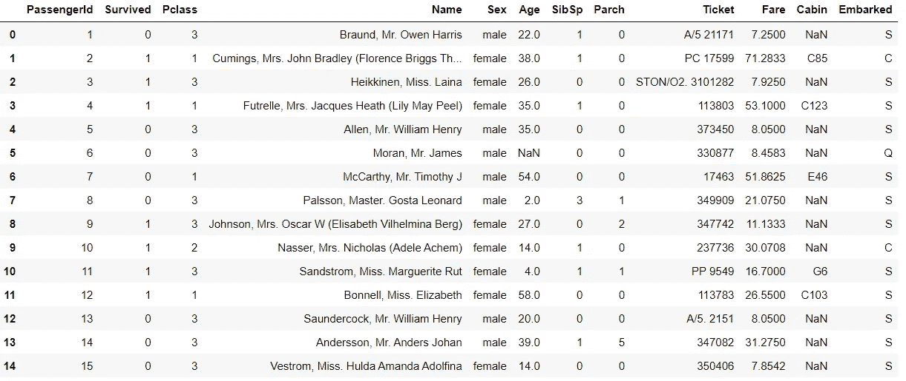
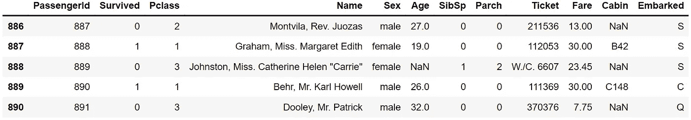
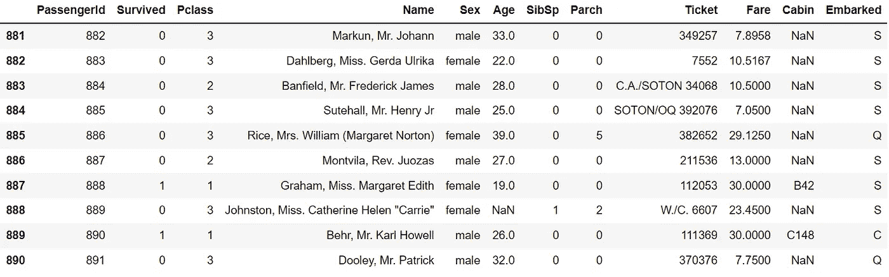
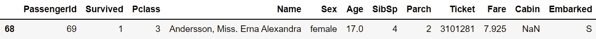
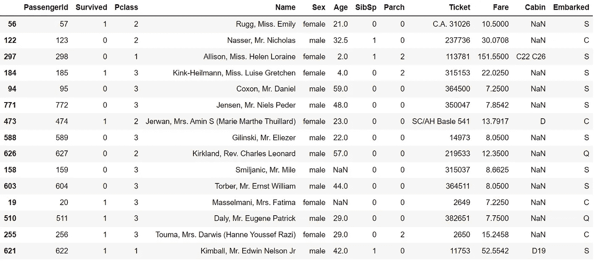
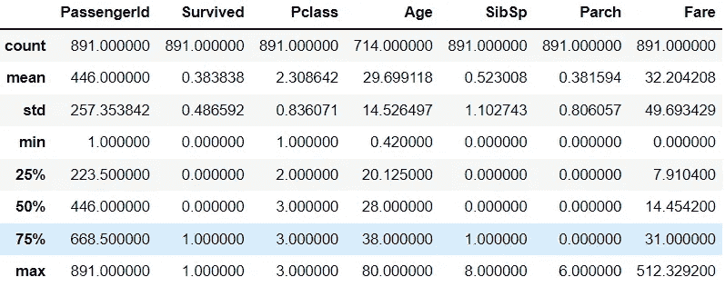
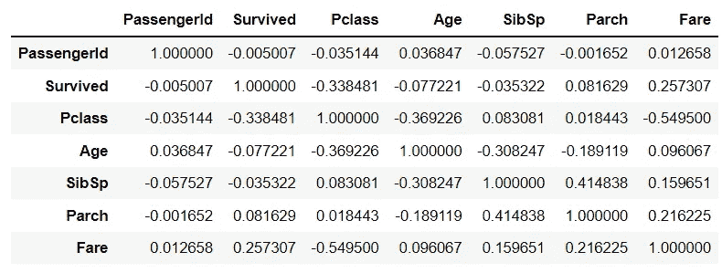
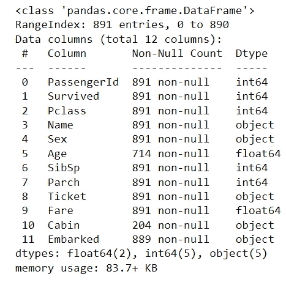
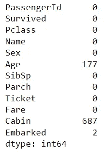

# 我们的新朋友是“EDA”

> 原文：<https://medium.com/mlearning-ai/our-new-friend-is-eda-ad8acb779432?source=collection_archive---------9----------------------->


This photo was designed by “Midjourney”

有了这篇文章，你将会有一个新朋友，他的名字是“ **EDA** ”。让我们见见 **EDA** 。我的读者 **EDA** 是探索性数据分析，是数据科学家最好的朋友。 **EDA** 这是我的读者，他想成为一名优秀的数据科学家😁。


Photo by [Natalya Khartukova](https://unsplash.com/@nataxart?utm_source=medium&utm_medium=referral) on [Unsplash](https://unsplash.com?utm_source=medium&utm_medium=referral)

> 为什么“EDA”对我们很重要？

在阅读数据之后，如果我们不从数据中推断出来，我们就什么也做不了。因此，我们需要 **EDA** 来看数据、理解数据、搞清楚数据。

> **让我们来看看什么是 EDA！**

我们正在使用大量的功能。我会用“泰坦尼克号数据”。你可以在 [GitHub](https://github.com/ahmettalhabektas/Medium/blob/main/Titanic%20EDA.ipynb) 找到我关于这个故事的笔记本。我们开始吧！


Photo by [Nicolas Hoizey](https://unsplash.com/@nhoizey?utm_source=medium&utm_medium=referral) on [Unsplash](https://unsplash.com?utm_source=medium&utm_medium=referral)

# ***。*头()**

**head()** 功能显示前 5 行数据；但是，如果您在括号内写一个数字，您会看到从 0 到这个数字的数据行。像**。**head(15)给你前 15 行数据。

如果你不知道如何阅读数据，你应该阅读本 [***条***](/@ahmettalhabektas/first-step-in-data-world-d2eef7c53e53) 。

## **举个例子吧！**

```
import pandas as pd df=pd.read_csv("titanic.csv")
df.head()
```

输出:



```
df.head(15)
```

输出:



# ***。*尾()**

**tail()** 函数与 head()函数非常相似，但它显示最后一行的行。

## 让我们举个例子！

```
df.tail()
```

输出:



```
df.tail(10)
```

输出:



# **。样品()**

**sample()** 函数给你一个随机的数据行。但是如果你在括号内写一个数字，它会返回和你输入的数字一样多的行。

## 让我们举个例子！

```
df.sample()
```

输出:



```
df.sample(15)
```

输出:



# **。描述()**

**description()**函数计算统计量(如最小值、最大值、平均值……)，然后给出这些量。

## 让我们举个例子！

```
df.describe()
```

输出:



# 。corr()

一切都有相互的关系。 **corr()** 函数计算列之间的相关性，并给出结果。

## 让我们举个例子！

```
df.corr()
```

输出:



# 。信息()

**info()** 功能为我们提供关于数据的一般信息。数据类型是什么？对象、整数还是浮点数？有多少行是非空的？
**info()** 函数为我们提供了这些问题的答案。

## 让我们举个例子！

```
df.info()
```

输出:



# 。isnull()。总和()

**isnull()。sum()** 实际上是两个函数: **isnull()** 和 **sum()** 。
**isnull()** 函数对每一行返回*真*或*假*，如果是 nan 值，则返回*真*，否则返回*假*。
**sum()** 函数给出这些列的真值的总和，这样我们就可以很容易地看到每一列的 nan 值。

## 我们来做个例子吧！

```
df.isnull().sum()
```

输出:



# 。形状

**形状**函数给出了我们有多少行和列的数据。

## 我们来做个例子吧！

```
df.shape
```

输出:


它显示数据中有 891 行和 12 列。


Photo by [david Griffiths](https://unsplash.com/@itscakefortea?utm_source=medium&utm_medium=referral) on [Unsplash](https://unsplash.com?utm_source=medium&utm_medium=referral)

现在你可以通过***【EDA】***获得更多可以理解的数据。

但是如果我们不想看到所有的列，而只想看到数据的特定部分，我们该怎么做呢？

想学这些，就要看 [***我可以拿个“过滤数据”吗？*T32**](/@ahmettalhabektas/may-i-take-a-filtering-data-cdea0d49a99d)

## **作者:**

# 艾哈迈德·塔尔哈·贝克塔什

如果你想问我什么，你可以很容易地联系我！

> 📧[我的邮件](mailto:atalhabektas@gmail.com)
> 
> 🔗[我的 LinkedIn](https://www.linkedin.com/in/ahmet-talha-bekta%C5%9F-056844216)
> 
> 💻[我的 GitHub](https://github.com/ahmettalhabektas)
> 
> 👨‍💻[我的卡格尔](https://www.kaggle.com/ahmettalhabektas)
> 
> 📋[我的培养基](/@ahmettalhabektas)