# 论文综述:“OTA:目标探测的最优运输分配”

> 原文：<https://medium.com/mlearning-ai/paper-review-ota-optimal-transport-assignment-for-object-detection-f13b75794e47?source=collection_archive---------5----------------------->

## 在本文中，我将回顾 OTA，它是一种用于从全局角度进行目标检测的高级标签分配，并将分配过程公式化为一个最优运输问题。

原文：<https://arxiv.org/pdf/2103.14259.pdf>

# **1。标签分配**

基于 CNN 的对象检测器，如 YOLO、RetinaNet、FCOS、CenterNet……通过预测分类标签和回归一组预定义锚的偏移来检测对象(对于像 FCOS 这样的无锚检测器，特征点可以被视为收缩的锚框。作者将锚盒和锚点称为“锚”)。因此，为了训练检测器，为每个锚点定义 cls 和 reg 目标是一个必要的步骤，这在对象检测中称为*标签分配*。

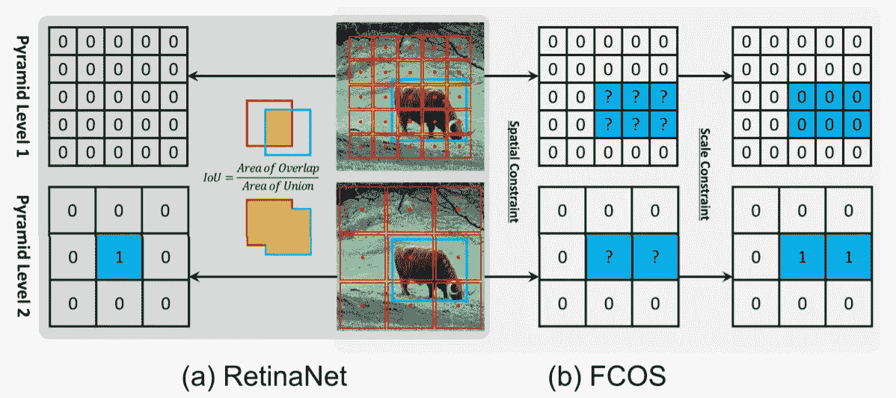

**Fig. 1:** Label assignment strategies of RetinaNet and FCOS ([1])

不同的模型具有不同的策略来匹配每个锚点的地面真实(gt)对象或背景。如图 1(a)所示，RetinaNet 使用 IoU 将不同金字塔等级的锚盒分为正面和负面。首先，它将每个对象的最佳锚盒和 IoU > θ_p 的锚盒标记为阳性，然后将 IoU < θ_n as negatives, finally other anchor boxes are ignored during training. For the FCOS model, it divides the anchor points from various pyramid levels using spatial and scale constraint. It examines the ground-truth box anchor points as candidate positive samples, then picks the final positive samples from candidates depending on the scale range provided for each pyramid level, and lastly considers the unselected anchor points as negative samples.

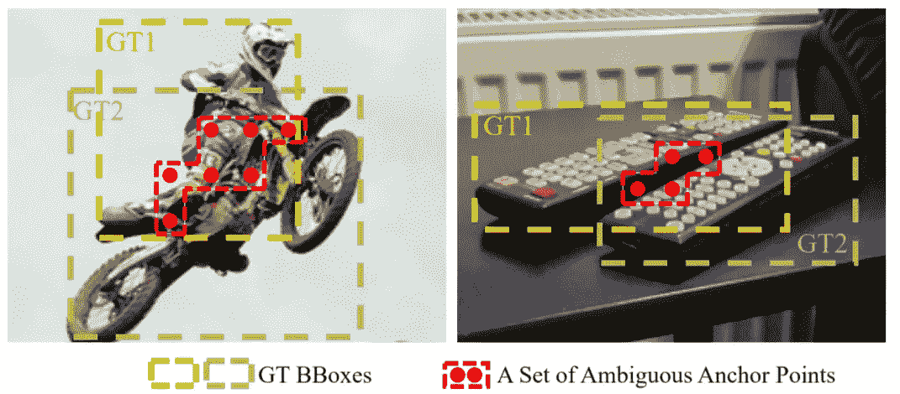

**Fig. 2:** An illustration of ambiguous anchor points in object detection ([2])

However, above methods only focus on individual *gt* 对象的锚盒视为阳性，而没有从全局角度考虑上下文信息。在图 2 中的例子中，上述方法难以处理不明确的锚(同时作为多个 *gt* 的阳性样本的锚)。给任何 gt(或背景)分配不明确的锚会在训练和推断过程中引起问题。

> 因此，更好的分配策略应该摆脱独立地为每个 gt 追求最优分配的惯例，而转向全局最优的思想，换句话说，为图像中的所有 gt 寻找全局高置信度分配。([2])

为了解决这个问题，作者提出将标签分配公式化为最优运输(OT)问题——优化理论中线性规划(LP)的一种特殊形式。

# 2.方法

# **2.1 最优运输问题**

最优运输(OT)问题描述如下:假设在某一地区有 *m* 个供应商和 *n* 个需求者。第 *i* 供方持有 *s_i* 单位货物，而第 *j* 需方需要 *d_j* 单位货物。每单位货物从供方 *i* 到需方 *j* 的运输成本用 *c_{ij}* 表示。OT 问题的目标是寻找一个运输计划π*={ *π_{i，j}* | *i* =1，2，… *m* ， *j* = 1，2，…， *n* }，根据该运输计划，供应商的所有货物都可以以最小的运输成本运输到需求方:

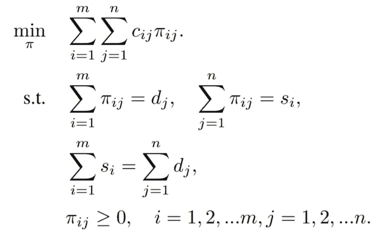

这是一个具有多项式时间解的线性程序。我们使用一种叫做 Sinkhorn-Knopp 的快速迭代方法来解决这个问题(详见[2])。

# 2.2 标签分配加班

假设一个图像输入 *I.* 有 *m* *gt* 个目标和 *n* 个锚点，我们将每个 *gt* 视为拥有 *k* 个正标签单位的供应者(即 *s_i = k* )，每个锚点视为需要一个标签单位的需求者(即 *d_j = 1 【T43 从 *gt_{i}* 到锚 *a_j* 运输一个单位正标签的成本 *c^{fg}* 定义为它们的 *cls* 和 *reg* 损耗的加权总和；*

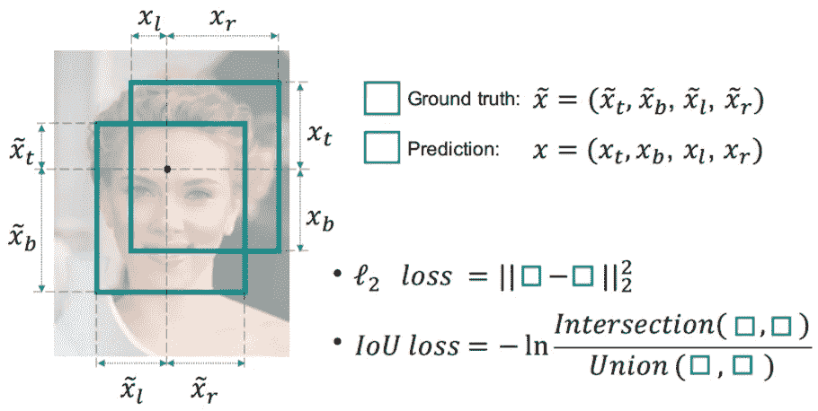

**Fig. 3:** An iIlustration of IoU loss ([3])

除此之外，大量的主播在训练时被当作负样本。作者介绍另一家供应商——*背景*，只提供负面标签。*后台*可提供的底片数量为*n m×k*从*后台*运送一张底片到 *a_j* 的费用定义为:

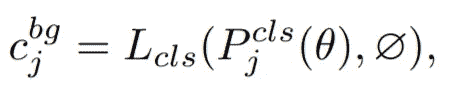

其中∅指的是*背景*阶层。供应向量 *s* 应相应更新为:

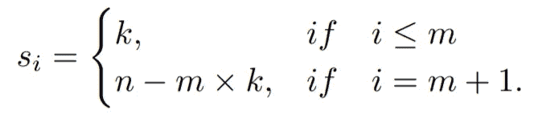

由于我们已经有了成本矩阵，供应向量 *s* 和需求向量 *d，*最优运输计划π*可以通过现成的 Sinkhorn-Knopp 迭代来求解这个 OT 问题。**注意到 OTA 仅增加了不到 20%的总训练时间，并且在测试阶段完全免费。**

# 2.3 高级设计

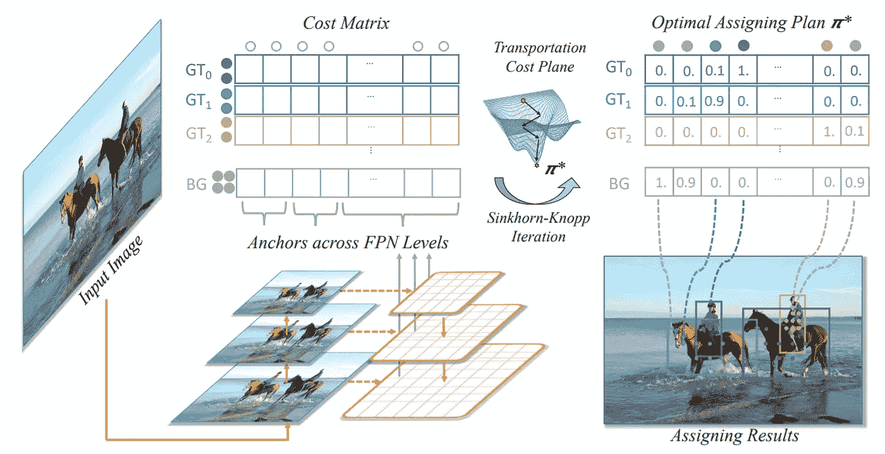

**Fig. 4:** An iIlustration of Optimal Transport Assignment. ([2])

以前的方法只从有限面积的对象的中心区域选择正锚点，称为**中心先验。**对于 COCO 这样的一般检测数据集，作者发现中心先验仍然有利于 OTA 的训练。因此，他们在成本矩阵之前强加了一个中心。对于每个 *gt* ，他们根据锚与*gt 的中心距离，从每个 FPN 等级中选择 *r^2* 最近的锚。*对于不在 *r^2* 最接近列表中的锚，它们在成本矩阵 *c* 中的对应条目将服从额外的恒定成本，以降低它们在训练阶段被分配为正样本的可能性。

**动态 *k* 估算。**通常情况下，每个 *gt* 的合适正锚数量应该是不同的，并基于许多因素，如对象的大小、比例和遮挡条件等。作者提出了一种简单而有效的方法，根据 IoU 粗略估计每个 gt 的正确锚定数量。

> 具体来说，对于每个 *gt* ，我们根据 IoU 值选择前 q 个预测。这些 IoU 值加起来代表这个 *gt* 估计的正面锚数量。我们将这种方法称为动态 k 估计。这种估计方法基于以下直觉:对于某个 *gt* 的合适的正锚的数量应该与很好地回归该 *gt 的锚的数量正相关。*(【2】)

结论，最优交通分配算法如图 5 所示(包括中心先验和动态 k 估计)。

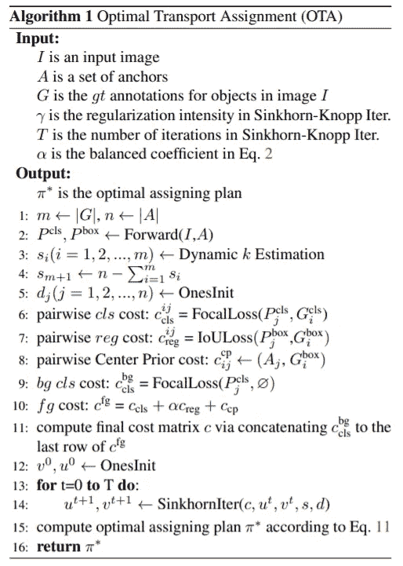

**Fig. 5:** Optimal Transport Assignment algorithm. ([2])

# 3.实验和结果

# 3.1 FCOS

在实验中，作者使用了 FCOS——一种简单的无锚探测器。通过消除预定义的锚盒集，FCOS 避免了与锚盒相关的计算，例如在训练期间计算重叠。它还避免了与锚盒相关的所有超参数，这些超参数通常对最终检测性能非常敏感。我们在 MS COCO 2017 上进行了大量实验，该实验分别包含大约 118k、5k 和 20k 的训练、val 和测试开发集图像。

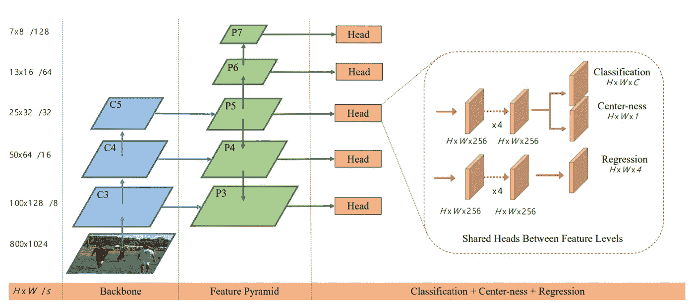

**Fig. 6:** The network architecture of FCOS. ([4])

# 3.1 结果

下面的图片是得到的一些对比结果(细节在原文中)。

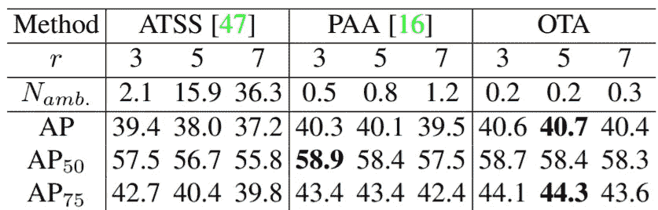

**Fig. 7:** Performances of different label assigning strategies([2])

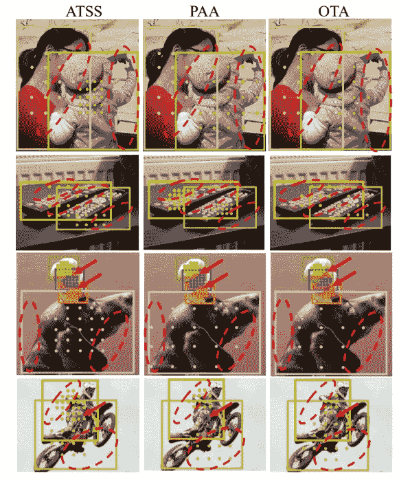

**Fig. 7:** Visualizations of assigning results ([2])

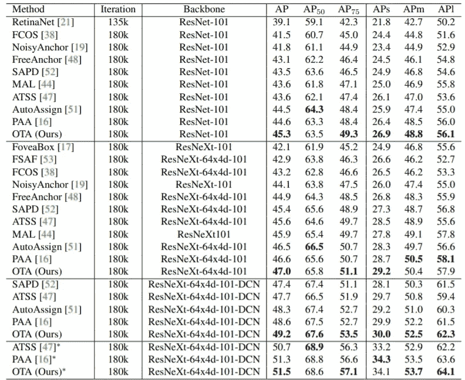

**Fig. 8:** Performance comparison with state-of-the-art one-stage detectors on MS COCO 2017 ([2])

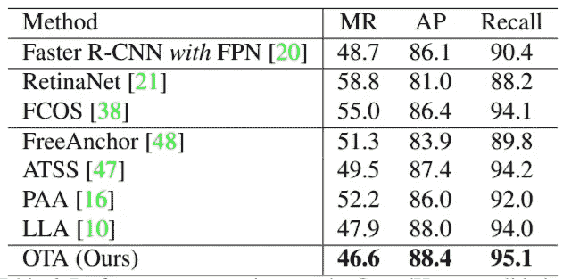

**Fig. 9:** Performance comparison on the CrowdHuman validation
set. ([2])

# 结论

OTA 将物体检测中的标记过程转化为最优运输问题，目标是以最少的成本将标签从真实物体和背景传送到锚点。但 OTA 使用 Sinkhorn-Knopp 迭代算法，带来 20%的额外训练时间，训练成本相当高。

您可以在以下网址找到论文的官方源代码:

 [## GitHub -旷视科技-基础检测/OTA:正式实施我们的 CVPR2021 论文“OTA:最佳…

### 这个项目为我们的 CVPR2021 论文“OTA:对象的最优运输分配”提供了一个实现

github.com](https://github.com/Megvii-BaseDetection/OTA) 

***如有任何问题，请在下方评论或通过***[***LinkedIn***](https://www.linkedin.com/in/tuan-nguyen85/)***或***[***github***](https://github.com/anhtuan85)联系我

如果你喜欢这个，请考虑支持我。

# 资源:

[1]自适应训练样本选择:[https://arxiv.org/pdf/1912.02424.pdf](https://arxiv.org/pdf/1912.02424.pdf)

[2]太田:[https://arxiv.org/pdf/2103.14259.pdf](https://arxiv.org/pdf/2103.14259.pdf)

[3]UnitBox:[https://arxiv.org/pdf/1608.01471.pdf](https://arxiv.org/pdf/1608.01471.pdf)

[4]https://arxiv.org/pdf/1904.01355.pdf[FCOS](https://arxiv.org/pdf/1904.01355.pdf)

【5】约洛夫 4:[https://arxiv.org/pdf/2004.10934.pdf](https://arxiv.org/pdf/2004.10934.pdf)

 [## Mlearning.ai 提交建议

### 如何成为 Mlearning.ai 上的作家

medium.com](/mlearning-ai/mlearning-ai-submission-suggestions-b51e2b130bfb) 

🔵 [**成为作家**](/mlearning-ai/mlearning-ai-submission-suggestions-b51e2b130bfb)