# 论文摘要[注意力增强卷积网络]

> 原文：<https://medium.com/mlearning-ai/paper-summary-attention-augmented-convolutional-network-ca6e8ee50469?source=collection_archive---------2----------------------->

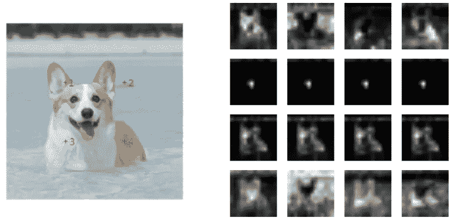

These figures are used for Attention visualizations in the paper

> ***请注意，这篇帖子是为了我将来很可能的研究在没有完全阅读*** [***论文***](https://arxiv.org/pdf/1904.09925) ***的情况下回过头来复习关于这个题目的材料。***

注意力和卷积架构在各种应用中都令人惊叹，当谈到混合这两者时，听起来很有趣。在这篇[论文](https://arxiv.org/pdf/1904.09925)中提出的一个网络(注意力增强卷积网络)是卷积和自我注意力的混合，用于骨干训练。这个网络架构是由[谷歌大脑团队](https://research.google/teams/brain/)在 2019 年开发的，是 AI 领域最可靠的来源之一。在这篇文章中，我将用一种简单的方式总结上述科学论文。希望你喜欢它。

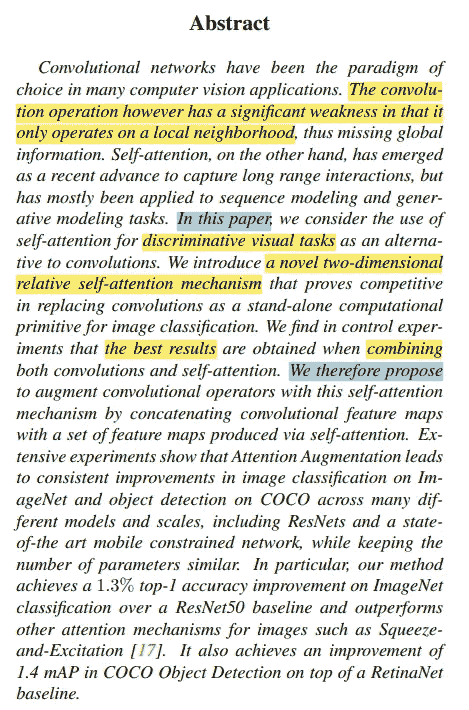

在摘要中，作者说由于卷积计算的局部性(RNNs 也是如此)带来了一些缺陷。另一方面，殷勤没有这种约束；因此，在顺序数据的长期依赖关系上表现良好。这鼓励团队在本研究中发展增强卷积算子和自我注意机制，换句话说，一种新的二维相对自我注意机制。

因此，结果提供了这样的事实，即所提出的 AANet 模型使图像分类和检测的改进永久化。

在**简介**中，提到了卷积层的两个特性:

1.  局部执行(通过有界感受野)
2.  翻译等方差(按权重)

自我关注并不是什么新鲜事(例如，Bahdanau 2014)，但它在 2017 年的论文“[关注是你所需要的全部](http://papers.nips.cc/paper/7181-attention-is-all-you-%0Aneed.pdf)”中得到了极大的关注。自我关注对于序列建模应用(例如 NLP、时间序列等)是最可靠的。).与汇集或卷积运算符不同，加权平均运算中使用的权重是由隐藏单元中的函数动态生成的。因此，当涉及到输入信号之间的相互作用时，它归结于信号本身而不是其他局部项目。这使得捕获长期依赖关系变得可行。

本研究的自我注意公式能够完全取代常规卷积；此外，人们认识到这种组合的性能要好得多(因此卷积的思想没有被抛弃)。因此，通过绑定和连接卷积特征图(实施局部性)到自我关注特征图(为长期依赖性建模)。从下图可以看出:

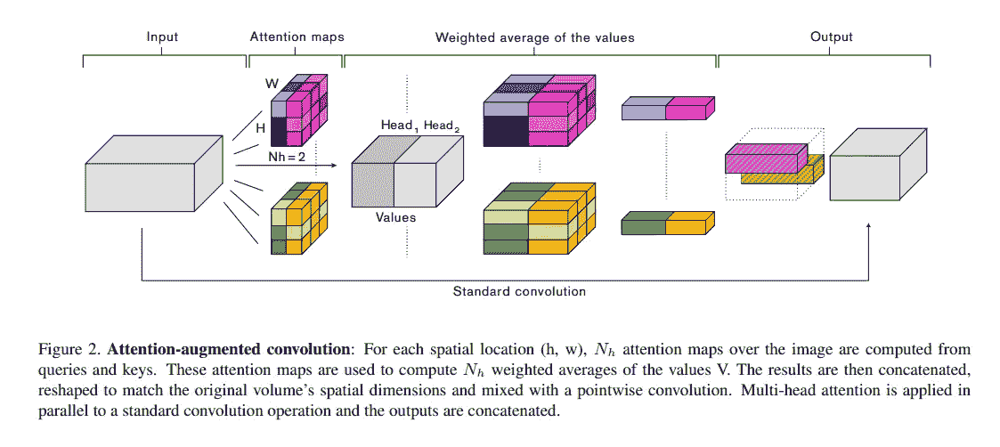

在本研究的所有实验中，AANet 在计算量增加不多的情况下，系统地提高了压缩和激发通道注意的性能。特别是，可以看到如下表现:

*   基于 ResNet50 基准的 1.3%顶级精度 ImageNet
*   1.4 在 RetinaNet 基线之上的 COCO 对象检测的地图增加

有趣的是，AANet(注意力和回旋的混合)比完全自我注意力模型表现得更好。因此，AANet 在这种情况下更有效。

## 注意力增强卷积

人们已经得出结论，卷积正遭受局限于他们的局部性和缺乏实现全球背景。注意重新校准卷积特征映射以执行长相关性。

在这篇论文中，作者提到他们:

1.  使用一个基于注意力的可以参与*到空间和特征子空间的联合*
2.  引入额外的功能地图

## 连接卷积和注意力特征图；

相应的 AANet 写为

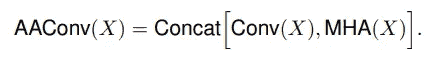

其中，MHA(X)可以计算如下:

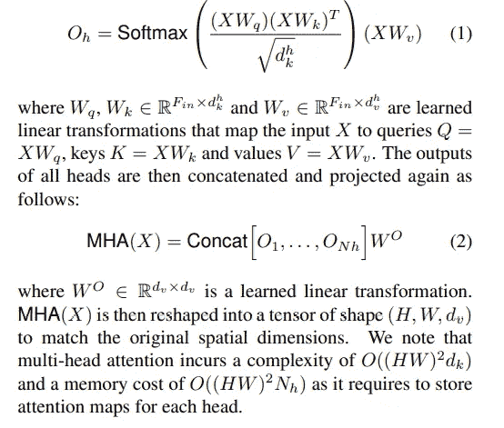

同样，当涉及到二维位置衰退时:(没有关于位置的明确信息，自我注意是置换等价的)

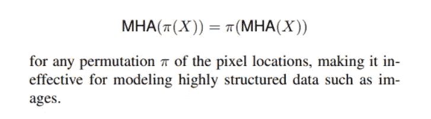

当谈到相对位置嵌入时:

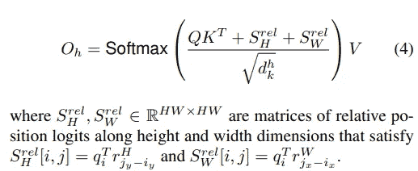

本次研究中模型的 ***架构*** 描述如下:

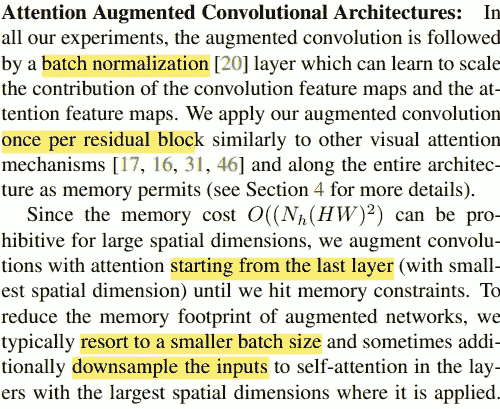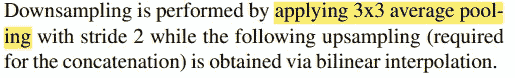

本节中有趣的一点是，为了对抗内存开销的影响，AANet 从空间维度最小的最后一层开始。此外，他们采用更小的批量和缩减输入采样来减少模型的内存占用。

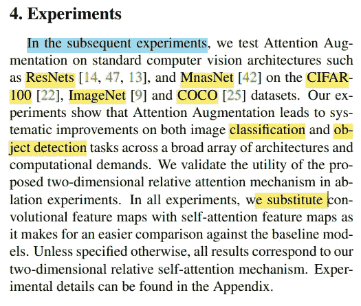

在“**实验**”部分，据说该模型在用于图像分类和对象检测的流行数据集上进行测试，并且表现良好。(本文中没有提到这些实现和结果)

此外，自我关注特征图被用来代替卷积特征图，这将是一个更简单的比较。

最后一部分是关于“T10”的讨论和未来的工作“T11”，我认为这对于机器学习领域的发展非常重要。

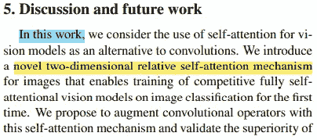

作者表示，有一些差距值得关注:

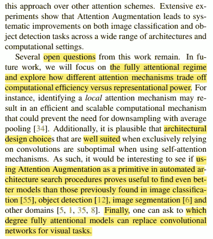

1.  关注充分注意机制交换效率 VS 权力
2.  在各种架构搜索中使用 ANets 作为主要工具，以找到更好的模型
3.  发现这种替代将保持到什么程度

> 如果发现任何错误，请发电子邮件到 rezayazdanfar1111@gmail.com 找我。同时，在我的 Twitter [*这里*](https://twitter.com/reza__yazdanfar) *关注我，在我的 LinkedIn* [这里](https://www.linkedin.com/in/reza-yazdanfar-b69055156/) *访问我。最后，如果你发现它有用，并想在以后的文章中继续，请在* [媒体中关注我。](https://rezayazdanfar.medium.com/)最后，如果你有任何想法或建议，我是开放的，你只需要在 linkedIn 给我发消息。🙂

 [## Mlearning.ai 提交建议

### 如何成为 Mlearning.ai 上的作家

medium.com](/mlearning-ai/mlearning-ai-submission-suggestions-b51e2b130bfb)