# 论文摘要[Axial-DeepLab:独立 Axial-全景分割注意]

> 原文：<https://medium.com/mlearning-ai/paper-summary-axial-deeplab-stand-alone-axial-attention-for-panoptic-segmentation-bae2d8f35015?source=collection_archive---------0----------------------->

> ***请注意，这篇帖子是为了我将来很可能的研究在没有完全阅读*** [***论文***](https://arxiv.org/pdf/2003.07853) ***的情况下回过头来复习关于这个题目的材料。***

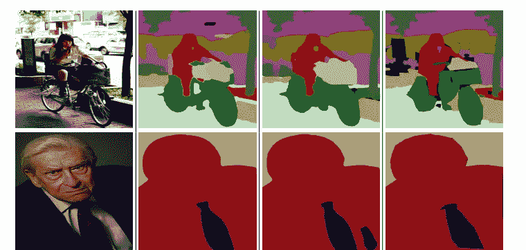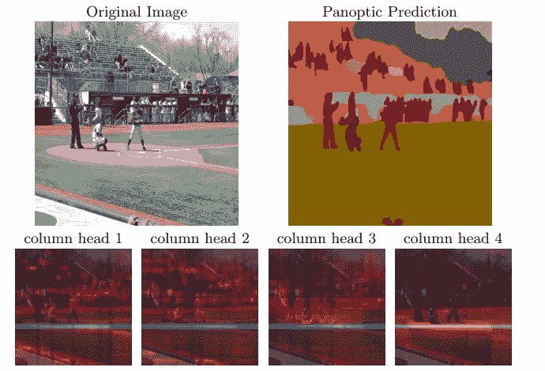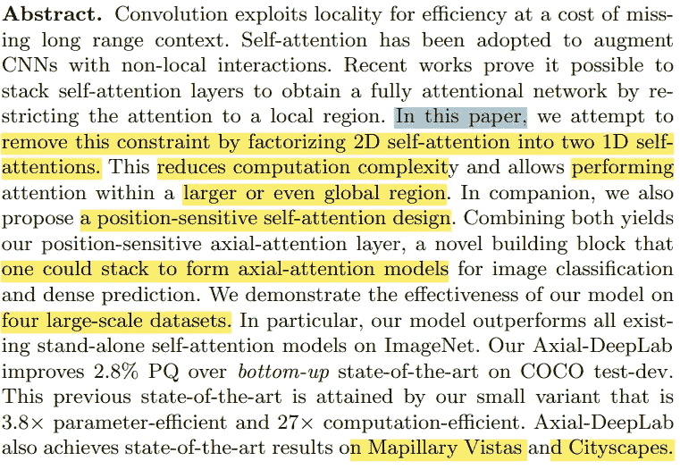

在摘要中，作者提到卷积运算符使用局部性来提高效率，使用代价来获得长程相关性。还提到，通过最近的研究，认识到通过限制到局部来堆叠自我注意层以采取完全注意网络是可能的。

在本文中，作者试图消除这一限制(如何？)，通过把 2D 的注意力转移到 1D 身上。因此，结果是，计算复杂度降低，并且使网络在更大的区域中工作。此外，本研究提出了一种位置敏感的自我注意结构，并将其应用于 4 个大型数据集进行分类、全景分割、实例分割和语义分割。

# *简介*

卷积被认为是计算机视觉中的核心模块。因为两个特征:平移等方差性(等同于成像的性质，因此，将模型推广到各种位置)和局部性(减少参数计数和 M-加法)。然而，这使得长期依赖变得困难。

注意力为诸如语言建模、语音识别和神经字幕等各种工作中的长期依赖提供了建模能力。而且在计算机视觉(图像分类、物体检测、语义分割、视频分类、对抗性防御)方面潜力巨大。

虽然堆叠注意层已经显示出有希望的结果，但是它们的简单架构在计算上是昂贵的。在另一项研究中，应用了局部限制，结果降低了成本，尽管这限制了模型。

在这项研究中，提出了轴向注意，它允许有效的计算和恢复注意模型中的大感受野。主要思想是沿高度轴和宽度轴依次分解 2D 到 1D 的注意力。此外，位置术语是根据上下文添加的，这导致注意力对位置敏感(成本很低)。

# 方法

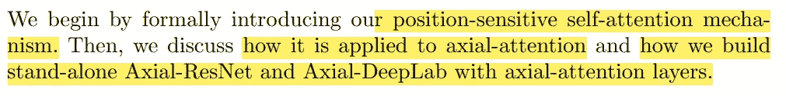

## 位置敏感自我注意

位置 *o = (i，j)* 处的输出可以通过合并预计输入来计算，如下所示:

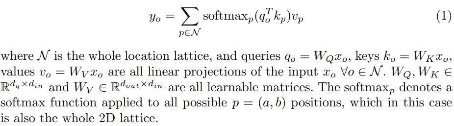

机制池值让我们在整个特征图中捕获相关但非局部的上下文( *NB。*卷积算子只是捕捉局部关系)。

缺点有两个:1。自我关注是非常昂贵的，仅限于高级别的 CNN(例如，下采样特征图)或小图像。2.全局池不提取位置信息(这在计算机视觉中至关重要)。通过为自我关注添加局部约束和位置编码，这两个问题得到了缓解。

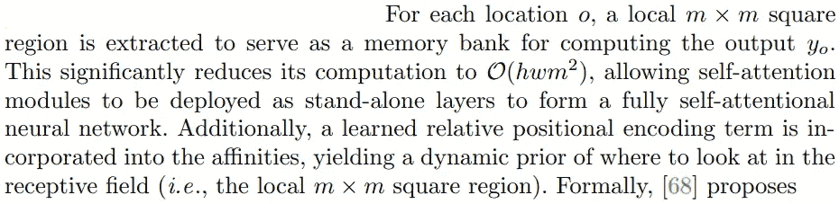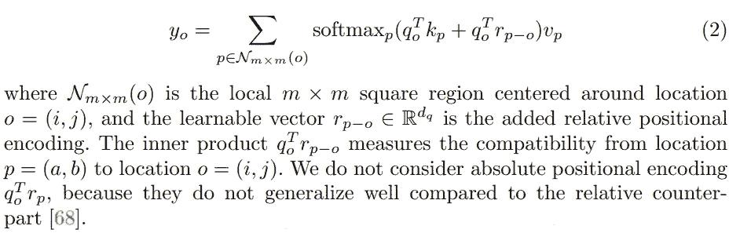

## 位置敏感性

注意，先前的位置偏差与查询像素 Xo 高度相关，而与关键像素(Xp)无关。但是，关键像素可以具有关于要连接的位置的信息。因此，除了依赖于查询的偏差之外，还增加了依赖于键的位置偏差。

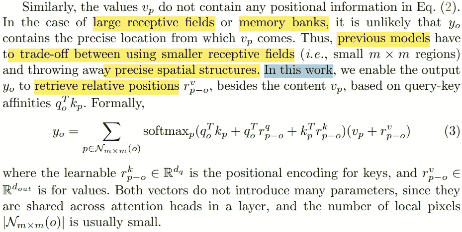

这种设计可以被称为*位置敏感*自我注意，用精确的位置信息捕捉长依赖。

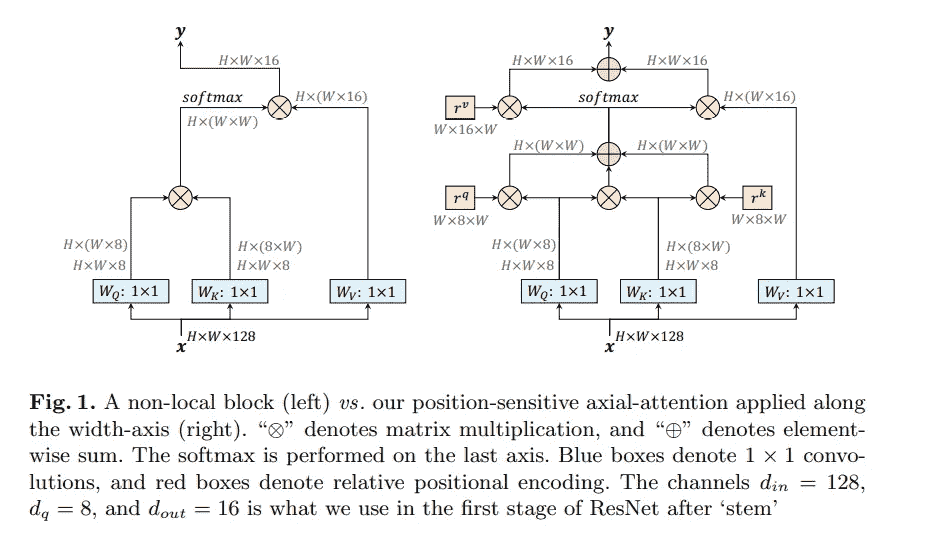

## axia-注意

局部约束大大降低了计算成本，并提供了一个完全自注意模型的建设。在局部正方形区域中操作的局部自注意仍然具有与区域长度成平方的复杂度，这引入了另一个在性能和计算复杂度之间进行折衷的超参数。

本文提出了独立自注意中的轴向注意，以保证全局连接和高效计算。其层描述如下:

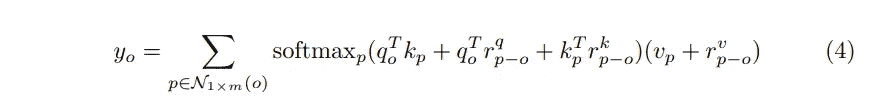

## 残差神经网络

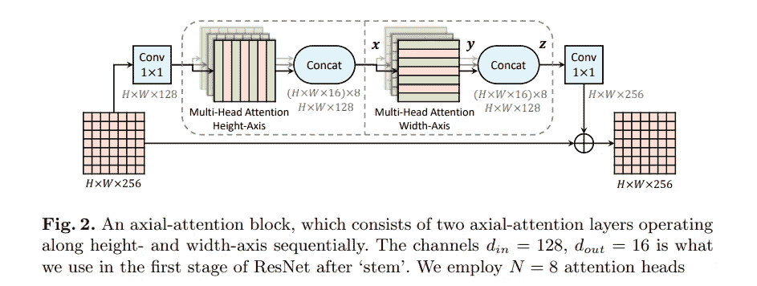

剩余瓶颈块中的 3×3 卷积由两个多头轴向注意层代替，以便将 ResNet 转换为轴向 ResNet。为了混洗特征，保持两个 1×1 卷积。这样，在图 2(上图)中可以看到轴向注意阻断。

## 轴向深度实验室

对于分段任务，实施了更多的更改以将 Axial-ResNet 转换为 Axial-DeepLab，如下所述:

1.  DeepLab 改变了 ResNet 最后一两个阶段的步幅和节奏。同样，最后一个阶段的步幅被移除，但“atrous”注意力模块没有实现。
2.  不采用 atrous 空间金字塔池模块(ASPP)。结果表明，无论有无 ASPP，Axial-DeepLab 都能正常工作。
3.  在接下来的 panopic-deep lab 中采用了相同的三卷积、双解码器和预测头。

在此之后，作者们带来了他们在这里没有提到的各种数据集上的结果。

# 结论和讨论

这篇科学论文可以被认为是已经做出的完全摆脱卷积并部署单独注意力模型的尝试之一。然而，轴向注意模型保持 M-Adds，它比卷积花费更多的时间，主要原因可以认为是目前在各种加速器上缺乏专门的内核。

> 如果发现任何错误，请发电子邮件到 rezayazdanfar1111@gmail.com 找我。与此同时，在我的 Twitter 上关注我[这里](https://twitter.com/reza__yazdanfar)，在 LinkedIn 上访问我的[这里](https://www.linkedin.com/in/reza-yazdanfar-b69055156/)。最后，如果你发现它有用，并想继续写文章，请在[媒体中关注我。](https://rezayazdanfar.medium.com/)最后，如果你有任何想法或建议，我很乐意接受，你只需要在 LinkedIn 上给我发消息。🙂

 [## Mlearning.ai 提交建议

### 如何成为 Mlearning.ai 上的作家

medium.com](/mlearning-ai/mlearning-ai-submission-suggestions-b51e2b130bfb)